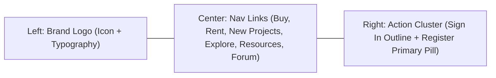
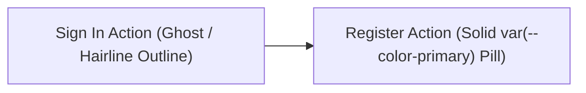

# Header, Navigation & Menu Interaction Specification

> **/goal** Define the structural, stylistic, and interactive standards for the sticky top navigation header, menu items, hover accents, and icon micro-transitions.
> **/learn** Master the 3-column navigation layout, CSS3 underline and accent transition mechanics, and icon hover transformation contracts.

## 🎯 Actionable CI/CD & AI Agent Checklist

- [ ] `/goal` Verify header layout adheres to a fixed 70px height with sticky positioning (`top: 0`, `z-index: 100`).
- [ ] `/learn` Verify menu item hover states use CSS3 `transform: scaleX()` or vertical shifts rather than layout-triggering properties.
- [ ] `/goal` Confirm header icon micro-interactions include scale (1.08x), color shift to `--color-primary`, and ambient background wash.
- [ ] `/learn` Ensure navigation actions balance a ghost/outline "Sign In" with a solid `--color-primary` "Register" button.

---

## 1. Header Layout & Geometry

The navigation header spans 100% of the viewport width with a constrained 1280px inner container. It remains sticky at the top during scrolling with a translucent frosted-glass backdrop.



### Layout Specifications

| Attribute | Specification Value | Rationale |
|:---|:---|:---|
| **Height** | `70px` (or `4.375rem`) | Ergonomic touch/click target; vertical breathing room |
| **Positioning** | `sticky; top: 0; z-index: 100;` | Always accessible without covering hero content |
| **Background** | `var(--color-surface-translucent)` (`rgba(255, 255, 255, 0.85)`) | Seamless blend with page while maintaining contrast |
| **Backdrop Filter** | `blur(12px) saturate(180%)` | Soft optical separation from scrolling content |
| **Border Bottom** | `1px solid var(--color-border)` | Crisp hairline boundary without visual heaviness |
| **Horizontal Padding** | `clamp(1rem, 4vw, 2.5rem)` | Fluid adaptation across standard laptops and ultrawides |

---

## 2. Navigation Menu Items & Hover Accent Mechanics

The central menu houses atomic links: `Buy`, `Rent`, `New Projects`, `Explore`, `Resources`, and `Forum`.

### Link Architecture & Spacing

- **Inter-Item Gap:** `28px` (`1.75rem`) desktop, scaling down to `16px` on compact screens.
- **Typography:** `var(--font-heading)`, size `15px`, weight `500`, color `var(--color-text-secondary)`.
- **Active / Hover Color:** Transitions to `var(--color-text-primary)` (or `var(--color-primary)` for designated highlight tabs).

### CSS3 Animated Underline Accent

Rather than static browser underlines, menu links feature a centered, expanding indicator line:

```css
.nav-link {
  position: relative;
  display: inline-flex;
  align-items: center;
  padding: 8px 4px;
  color: var(--color-text-secondary);
  font-family: var(--font-heading);
  font-size: 15px;
  font-weight: 500;
  text-decoration: none;
  transition: color 200ms cubic-bezier(0.16, 1, 0.3, 1);
}

/* Pseudo-element Animated Underline */
.nav-link::after {
  content: "";
  position: absolute;
  bottom: 0;
  left: 0;
  width: 100%;
  height: 2px;
  border-radius: 1px;
  background-color: var(--color-primary);
  transform: scaleX(0);
  transform-origin: center;
  transition: transform 240ms cubic-bezier(0.16, 1, 0.3, 1),
              background-color 200ms ease;
}

.nav-link:hover {
  color: var(--color-text-primary);
}

.nav-link:hover::after,
.nav-link.is-active::after {
  transform: scaleX(1);
}
```

---

## 3. Header Icon Micro-Interactions

Icons in the header (such as the notification bell, user avatar trigger, or brand mark glyph) implement a unified 3-phase micro-interaction on hover:

1. **Physical Scale Lift:** `transform: scale(1.08) translateY(-1px)`
2. **Color Shift:** SVG stroke or fill shifts from `var(--color-text-secondary)` to `var(--color-primary)`.
3. **Background Tint Wash:** A circular ambient halo expands from the center (`background: var(--color-primary-light)`).

```css
.header-icon-btn {
  display: inline-flex;
  align-items: center;
  justify-content: center;
  width: 40px;
  height: 40px;
  border-radius: 50%;
  border: 1px solid transparent;
  background-color: transparent;
  color: var(--color-text-secondary);
  cursor: pointer;
  transition: transform 200ms cubic-bezier(0.16, 1, 0.3, 1),
              color 200ms ease,
              background-color 200ms ease,
              border-color 200ms ease;
}

.header-icon-btn:hover {
  color: var(--color-primary);
  background-color: var(--color-primary-light);
  border-color: rgba(255, 45, 111, 0.15);
  transform: scale(1.08) translateY(-1px);
}

.header-icon-btn:active {
  transform: scale(0.96) translateY(0);
}
```

---

## 4. Right Action Cluster: Sign In & Register

The right end of the navigation balances a subtle exploratory action against a high-contrast conversion CTA:



### 1. "Sign In" Button (Ghost / Outline)
- **Shape:** Rounded soft rectangle (`border-radius: 8px`).
- **Border:** `1px solid var(--color-border)`.
- **Background:** `transparent`.
- **Text:** `var(--color-text-primary)`, weight `600`, size `14px`.
- **Hover State:** Border shifts to `var(--color-text-secondary)`, subtle background tint (`#F3F4F6`).

### 2. "Register" Button (Primary CTA)
- **Shape:** Full pill shape (`border-radius: 9999px`) or soft 10px rectangle.
- **Background:** `var(--color-primary)`.
- **Text:** `var(--color-text-inverse)` (`#FFFFFF`), weight `600`, size `14px`.
- **Shadow:** Soft ambient tint (`0 4px 14px var(--color-primary-glow)`).
- **Hover State:** Background shifts to `var(--color-primary-hover)`, vertical lift `translateY(-1px)`.
- **Active State:** Scale down `scale(0.98)` to provide tactile mechanical feedback.
