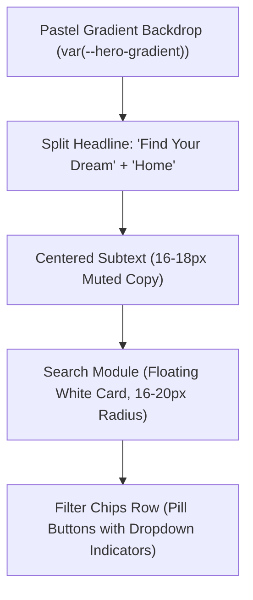
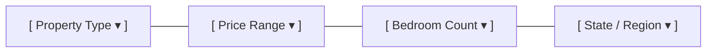

# Hero Section, Search Module & Dropdown Chips Specification

> **/goal** Define the layout, typography, interaction rules, and state transitions for the centered hero section, core search module, and pill-shaped filter chips.
> **/learn** Master the split headline styling, soft-shadow search card geometry, filter chip hover/active color changes, and dropdown chevron interactions.

## 🎯 Actionable CI/CD & AI Agent Checklist

- [ ] `/goal` Ensure hero headline enforces split styling: dark primary text (`#111827`) + brand accent (`var(--color-primary)`).
- [ ] `/learn` Verify search container uses 16–20px rounded corners and ambient soft shadow (`0 10px 30px rgba(0, 0, 0, 0.05)`).
- [ ] `/goal` Verify filter chips are pill-shaped (`border-radius: 9999px`) with hover shift to primary border and `--color-primary-light` background.
- [ ] `/learn` Confirm all focus states apply a 2px primary ring with subtle glow (`var(--color-primary-glow)`) without layout displacement.

---

## 1. Hero Container Layout & Rhythm

The hero section serves as the primary visual anchor of the landing page, characterized by generous vertical padding, centered alignment, and a low-contrast pastel gradient backdrop.



### Layout Geometry Tokens

| Property | Value | Rationale |
|:---|:---|:---|
| **Background** | `var(--hero-gradient)` | Soft pastel tone (`#F7DDE5` $\rightarrow$ `#EADFD8`), never harsh or overwhelming |
| **Min Height** | `clamp(520px, 75vh, 680px)` | Dominates the initial viewport without hiding below-the-fold content |
| **Vertical Padding** | `clamp(48px, 8vw, 96px)` | Generous vertical rhythm creating breathing room |
| **Max Content Width** | `880px` | Constrains headline and search module for optimal scanning ergonomics |
| **Alignment** | `center; text-align: center;` | Symmetrical visual balance |

---

## 2. Headline & Subtext Typography

### 1. Split Headline: "Find Your Dream Home"
The headline splits into two complementary visual weights:
- **Lead Text ("Find Your Dream"):** High-contrast neutral dark text (`var(--color-text-primary)` / `#111827`), weight `700`, size `clamp(2.75rem, 5vw, 4rem)`.
- **Accent Keyword ("Home"):** Brand accent color (`var(--color-primary)` / `#FF2D6F` in default theme, `#22C55E` in green theme), weight `800`.

```html
<h1 class="hero-headline">
  <span class="hero-headline-dark">Find Your Dream</span>
  <span class="hero-headline-accent">Home</span>
</h1>
```

```css
.hero-headline {
  font-family: var(--font-heading);
  font-size: var(--text-hero-title);
  font-weight: 700;
  line-height: 1.15;
  letter-spacing: -0.02em;
  margin: 0 auto 16px auto;
}

.hero-headline-dark {
  color: var(--color-text-primary);
}

.hero-headline-accent {
  color: var(--color-primary);
}
```

### 2. Centered Subtext
- **Typography:** `var(--font-body)`, size `clamp(1rem, 2vw, 1.125rem)`, weight `400`, line-height `1.6`.
- **Color:** `var(--color-text-secondary)` (`#6B7280`).
- **Max Width:** `580px`, centered with `margin: 0 auto 36px auto`.

---

## 3. Core Search Module

The search module is the primary functional interaction on the landing page. It sits directly beneath the subtext as a floating white card.

### Search Container Anatomy

```text
+-----------------------------------------------------------------------------------+
|  [🔍 Icon]   Search by location, neighborhood, or property ID...     [Search Button ➔] |
+-----------------------------------------------------------------------------------+
```

- **Container Radius:** `20px` (`border-radius: 20px`).
- **Background:** `var(--color-surface)` (`#FFFFFF`).
- **Border:** `1px solid var(--color-border)` (`#E5E7EB`).
- **Ambient Shadow:** `var(--shadow-card)` (`0 10px 30px rgba(0, 0, 0, 0.05)`).
- **Internal Padding:** `8px 12px 8px 20px`.
- **Layout:** Flexbox horizontal row, vertically aligned center.

### Search Input Field
- **Width:** `100%` flexible.
- **Border:** `none; outline: none; background: transparent;`.
- **Text:** `var(--color-text-primary)`, size `16px`, weight `400`.
- **Placeholder:** `var(--color-text-tertiary)` (`#9CA3AF`).
- **Left Icon:** $20\text{px}$ magnifying glass SVG, stroke `var(--color-text-tertiary)`. When input has focus, icon stroke transitions to `var(--color-primary)`.

### Search Action Button
- **Shape:** Pill (`border-radius: 9999px`) or soft $12\text{px}$ rectangle.
- **Background:** `var(--color-primary)`.
- **Color:** `var(--color-text-inverse)` (`#FFFFFF`).
- **Padding:** `12px 28px`.
- **Typography:** `var(--font-heading)`, weight `600`, size `15px`.
- **States:**
  - Hover: `background: var(--color-primary-hover); transform: translateY(-1px);`
  - Active: `transform: scale(0.98);`

---

## 4. Filter Chips & Dropdown Interaction

Directly below the search input, a horizontal cluster of pill-shaped filter chips allows users to refine criteria: **Property Type**, **Price**, **Bedroom**, and **State**.



### 1. Chip Styling Tokens
- **Shape:** Fully rounded pill (`border-radius: 9999px`).
- **Padding:** `8px 18px`.
- **Background (Resting):** `var(--color-surface)` (`#FFFFFF`).
- **Border (Resting):** `1px solid var(--color-border)` (`#E5E7EB`).
- **Text:** `var(--color-text-secondary)` (`#6B7280`), size `14px`, weight `500`.
- **Trailing Indicator:** Dropdown chevron arrow ($14\text{px}$ SVG), transitions rotation `transform: rotate(180deg)` when open.

### 2. Interaction & State Transformations

```css
.filter-chip {
  display: inline-flex;
  align-items: center;
  gap: 8px;
  padding: 8px 18px;
  border-radius: 9999px;
  border: 1px solid var(--color-border);
  background-color: var(--color-surface);
  color: var(--color-text-secondary);
  font-family: var(--font-body);
  font-size: 14px;
  font-weight: 500;
  cursor: pointer;
  box-shadow: var(--shadow-sm);
  transition: border-color 200ms ease,
              background-color 200ms ease,
              color 200ms ease,
              transform 150ms ease;
}

/* Hover State: Loved interaction pattern */
.filter-chip:hover {
  border-color: var(--color-primary);
  background-color: var(--color-primary-light);
  color: var(--color-primary);
  transform: translateY(-1px);
}

/* Active / Selected Filter State */
.filter-chip.is-active {
  border-color: var(--color-primary);
  background-color: var(--color-primary-light);
  color: var(--color-primary);
  font-weight: 600;
}

.filter-chip:active {
  transform: scale(0.97);
}

/* Dropdown Indicator Chevron Transition */
.filter-chip .chip-chevron {
  width: 14px;
  height: 14px;
  transition: transform 200ms cubic-bezier(0.16, 1, 0.3, 1);
}

.filter-chip.is-open .chip-chevron {
  transform: rotate(180deg);
}
```

---

## 5. Responsive Behavior

- **Desktop ($\ge 1024\text{px}$):** Search card and filter chips align on a single centered axis with $12\text{px}$ gap between chips.
- **Tablet ($768\text{px} \text{ to } 1023\text{px}$):** Search container spans $90\%$ viewport; filter chips wrap into two balanced lines.
- **Mobile ($< 768\text{px}$):**
  - Search input and button stack vertically.
  - Search button expands to full container width.
  - Filter chips scroll horizontally via a smooth touch-draggable scroll track (`overflow-x: auto; scrollbar-width: none;`).
