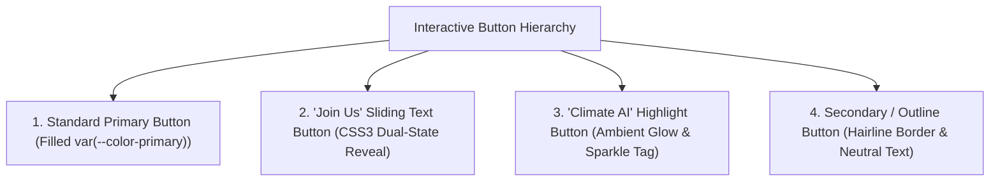

# Button System & CSS3 Sliding Text Interactions

> **/goal** Standardize all interactive button variants, replace the legacy "Join Us" hover effect with a CSS3 sliding text reveal animation, and document the "Climate AI" highlighted button pattern.
> **/learn** Master the dual-label sliding text keyframe mechanics, the "Climate AI" glowing pill architecture, and tactile active/focus state transforms.

## 🎯 Actionable CI/CD & AI Agent Checklist

- [ ] `/goal` Verify that the "Join Us" button hover is replaced with a CSS3 text slide-in animation rather than static color/opacity changes.
- [ ] `/learn` Ensure the sliding text uses `overflow: hidden` on the container and animates strictly using `transform: translateY()` for 60 FPS performance.
- [ ] `/goal` Confirm the "Climate AI" highlight button features an ambient glow, subtle sparkle indicator, and distinct optical hierarchy from standard primary buttons.
- [ ] `/learn` Verify all buttons include active mechanical feedback (`transform: scale(0.98)`) and accessible focus rings.

---

## 1. Global Button Architecture & Taxonomy

The button hierarchy provides clear optical guidance across high-intent, secondary, and flagship actions:



---

## 2. Standard Primary Button

- **Shape:** Soft rectangle (`border-radius: 8px`) or Pill (`border-radius: 9999px`).
- **Padding:** `12px 24px` (standard), `8px 16px` (compact).
- **Background:** `var(--color-primary)`.
- **Text:** `var(--color-text-inverse)` (`#FFFFFF`), `var(--font-heading)`, weight `600`, size `15px`.
- **Shadow:** `0 4px 14px var(--color-primary-glow)`.

### State Behavioral Rules

```css
.btn-primary {
  display: inline-flex;
  align-items: center;
  justify-content: center;
  gap: 8px;
  padding: 12px 24px;
  border-radius: 9999px;
  border: 1px solid transparent;
  background-color: var(--color-primary);
  color: var(--color-text-inverse);
  font-family: var(--font-heading);
  font-size: 15px;
  font-weight: 600;
  cursor: pointer;
  box-shadow: 0 4px 14px var(--color-primary-glow);
  transition: background-color 200ms ease,
              transform 150ms cubic-bezier(0.16, 1, 0.3, 1),
              box-shadow 200ms ease;
}

/* Hover: Darken primary by 10% and apply slight physical lift */
.btn-primary:hover {
  background-color: var(--color-primary-hover);
  box-shadow: 0 6px 20px var(--color-primary-glow);
  transform: translateY(-1px);
}

/* Active: Tactile pressed sensation */
.btn-primary:active {
  transform: scale(0.98) translateY(0);
}

/* Focus: Accessible 2px ring with subtle ambient tint */
.btn-primary:focus-visible {
  outline: none;
  box-shadow: 0 0 0 3px var(--color-surface),
              0 0 0 5px var(--color-primary);
}
```

---

## 3. "Join Us" Refined Button: CSS3 Sliding Text Reveal

### Rationale
The previous hover effect on the "Join Us" button (simple opacity fade or static color darken) felt dated and static. The design system replaces it with a **dynamic CSS3 text-sliding animation**.

On hover, the initial text ("Join Us") smoothly slides vertically out of view, while alternate high-intent text (such as "Explore Community →" or "Get Started Free →") slides into view from below.

### Mechanical Structure

```text
Resting State:                 Hover Transition:              Hovered State:
+------------------------+     +------------------------+     +------------------------+
|       [Join Us]        | --> |   ^ [Join Us] (slides) | --> | [Explore Community ➔]  |
|                        |     |   ^ [Explore Community]|     |                        |
+------------------------+     +------------------------+     +------------------------+
```

### Markup Contract

```html
<button class="btn-slide-reveal" aria-label="Join our community">
  <span class="btn-slide-track">
    <span class="btn-slide-label btn-slide-label-primary">Join Us</span>
    <span class="btn-slide-label btn-slide-label-hover">Explore Community →</span>
  </span>
</button>
```

### CSS3 Implementation Rules

```css
.btn-slide-reveal {
  position: relative;
  display: inline-flex;
  align-items: center;
  justify-content: center;
  height: 48px;
  padding: 0 28px;
  overflow: hidden; /* Clips labels during vertical translation */
  border-radius: 9999px;
  border: 1px solid transparent;
  background-color: var(--color-primary);
  color: var(--color-text-inverse);
  font-family: var(--font-heading);
  font-size: 15px;
  font-weight: 600;
  cursor: pointer;
  box-shadow: 0 4px 16px var(--color-primary-glow);
  transition: background-color 240ms ease,
              transform 150ms cubic-bezier(0.16, 1, 0.3, 1),
              box-shadow 240ms ease;
}

/* Sliding Track: Houses both labels stacked vertically */
.btn-slide-track {
  display: flex;
  flex-direction: column;
  height: 100%;
  transition: transform 300ms cubic-bezier(0.16, 1, 0.3, 1);
}

.btn-slide-label {
  display: flex;
  align-items: center;
  justify-content: center;
  height: 48px;
  white-space: nowrap;
}

/* Primary text is visible by default */
.btn-slide-label-primary {
  transform: translateY(0);
}

/* Hover text sits primed directly underneath the button boundary */
.btn-slide-label-hover {
  transform: translateY(0);
}

/* Hover Trigger: Slides track up by 48px */
.btn-slide-reveal:hover {
  background-color: var(--color-primary-hover);
  box-shadow: 0 8px 24px var(--color-primary-glow);
  transform: translateY(-1px);
}

.btn-slide-reveal:hover .btn-slide-track {
  transform: translateY(-48px);
}

/* Active Press */
.btn-slide-reveal:active {
  transform: scale(0.98) translateY(0);
}
```

---

## 4. "Climate AI" Highlighted Button Pattern

### Architectural Role
The "Climate AI" button is an elite showcase button designed to draw eye focus to flagship features, AI assistants, or seasonal campaigns. It departs from the standard flat button by incorporating:
1. **Bicolor Radial Glow:** A soft breathing halo (`--color-primary-glow` or emerald tint).
2. **Pill Silhouette with Leading Badge:** A distinct micro-indicator or icon chip.
3. **Refined Border Sheen:** A subtle 1px semi-translucent gradient border.

### Visual Architecture

```html
<button class="btn-highlight-climate">
  <span class="climate-badge">NEW</span>
  <span class="climate-text">Climate AI</span>
  <svg class="climate-sparkle" viewBox="0 0 16 16" width="14" height="14" fill="currentColor">
    <path d="M8 0L9.5 6.5L16 8L9.5 9.5L8 16L6.5 9.5L0 8L6.5 6.5L8 0Z"/>
  </svg>
</button>
```

```css
.btn-highlight-climate {
  display: inline-flex;
  align-items: center;
  gap: 10px;
  height: 42px;
  padding: 0 18px 0 10px;
  border-radius: 9999px;
  border: 1px solid rgba(255, 45, 111, 0.30);
  background: linear-gradient(135deg, rgba(255, 255, 255, 0.95), rgba(255, 228, 236, 0.80));
  backdrop-filter: blur(8px);
  color: var(--color-text-primary);
  font-family: var(--font-heading);
  font-size: 14px;
  font-weight: 600;
  cursor: pointer;
  box-shadow: 0 4px 16px rgba(255, 45, 111, 0.12);
  transition: all 250ms cubic-bezier(0.16, 1, 0.3, 1);
}

.climate-badge {
  display: inline-flex;
  align-items: center;
  padding: 4px 8px;
  border-radius: 9999px;
  background-color: var(--color-primary);
  color: #FFFFFF;
  font-size: 10px;
  font-weight: 800;
  letter-spacing: 0.05em;
}

.climate-sparkle {
  color: var(--color-primary);
  animation: pulse-glow 2.5s ease-in-out infinite;
}

.btn-highlight-climate:hover {
  border-color: var(--color-primary);
  background: #FFFFFF;
  transform: translateY(-2px);
  box-shadow: 0 8px 24px rgba(255, 45, 111, 0.22);
}

.btn-highlight-climate:active {
  transform: scale(0.97);
}

@keyframes pulse-glow {
  0%, 100% { opacity: 0.6; transform: scale(0.95); }
  50% { opacity: 1; transform: scale(1.15); }
}
```

---

## 5. Summary Matrix of Button Behaviors

| Button Type | Shape | Resting Background | Hover Animation / Behavior | Use Case |
|:---|:---|:---|:---|:---|
| **Primary** | Pill or 8px Soft Rect | `var(--color-primary)` | Darken 10% + $1\text{px}$ lift | Standard CTAs, form submissions |
| **"Join Us" Slide** | Pill (`9999px`) | `var(--color-primary)` | $48\text{px}$ vertical CSS3 text slide | Flagship onboarding & community membership |
| **"Climate AI" Highlight**| Pill with Badge | Glassmorphic primary tint | Ambient pulse, sparkle glow, $2\text{px}$ lift | Featured AI modules, new capabilities |
| **Ghost / Outline** | Soft Rect (`8px`) | Transparent | Hairline border shifts to dark; subtle tint | "Sign In", secondary actions |
