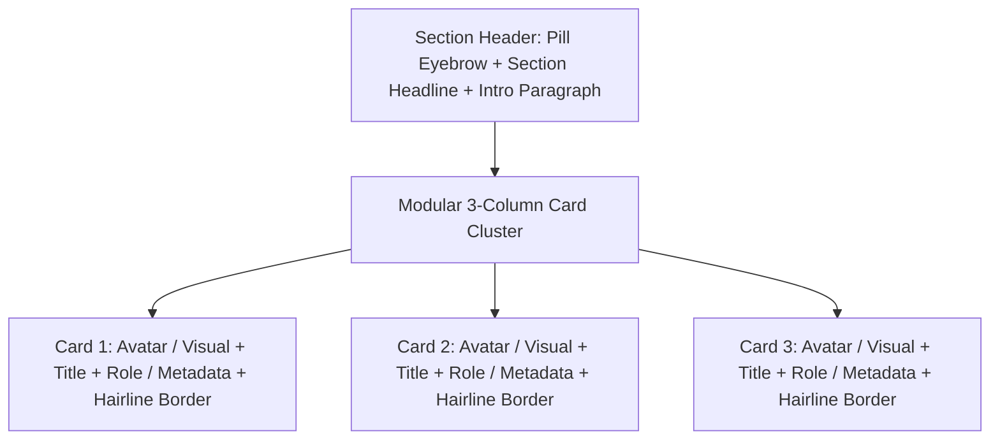
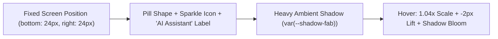

# Motion Principles, "Team Greenhouse" Section & Floating AI Assistant

> **/goal** Standardize hardware-accelerated CSS3 motion principles, define the "Team Greenhouse" section layout DNA as a reusable pattern, and specify the floating AI assistant button.
> **/learn** Master the deceleration timing curves, card hover elevation mathematics, "Team Greenhouse" modular card grouping, and fixed FAB positioning.

## 🎯 Actionable CI/CD & AI Agent Checklist

- [ ] `/goal` Verify all transitions exclusively animate `transform`, `opacity`, or CSS custom properties to maintain 60 FPS performance.
- [ ] `/learn` Ensure the "Team Greenhouse" section DNA enforces 16–20px rounded cards with 1px hairline borders and subtle hover elevation.
- [ ] `/goal` Confirm the Floating AI Assistant Button is pinned to the bottom-right corner with enhanced ambient shadow.
- [ ] `/learn` Verify mandatory `prefers-reduced-motion: reduce` media query suppresses translations and slides for accessibility compliance.

---

## 1. CSS3 Motion & Animation Principles

Motion within this design system serves to provide **tactile physical feedback** and establish spatial orientation, never for decorative distraction.

### Core Easing Curves & Timing Tokens

```css
:root {
  /* Deceleration curve for all interactive elements entering or reacting */
  --ease-emphasized: cubic-bezier(0.16, 1, 0.3, 1);
  /* Standard curve for general exits */
  --ease-standard: cubic-bezier(0.4, 0, 0.2, 1);

  /* Duration Tokens */
  --duration-micro: 120ms;   /* Checkbox, radio, toggle feedback */
  --duration-fast: 200ms;    /* Button hover, link color shift, chip state */
  --duration-normal: 300ms;  /* Card lift, menu slide, modal fade */
  --duration-slow: 450ms;    /* Drawer expansion, accordion open */
}
```

### Motion Invariants
1. **Never Animate Layout Geometry:** Animate `transform` (translations, scales) and `opacity`. NEVER animate `width`, `height`, `margin`, `padding`, or `top/left/bottom/right` during routine hover states.
2. **Restraint Rule:** An interface should feel calm. When cards elevate, the lift is strictly $3\text{--}4\text{px}$. When buttons press, the compression is strictly `scale(0.98)`.
3. **Accessibility Contract:**
```css
@media (prefers-reduced-motion: reduce) {
  *, *::before, *::after {
    animation-duration: 0.01ms !important;
    animation-iteration-count: 1 !important;
    transition-duration: 0.01ms !important;
    scroll-behavior: auto !important;
  }
}
```

---

## 2. "Team Greenhouse" Reusable Section Pattern

### Pattern Concept & Role
The "Team Greenhouse" section serves as the **gold-standard archetype** for structured content showcase sections across the application (e.g. team directories, feature suites, curriculum pillars, or project highlights).



### Visual Characteristics
- **Section Backdrop:** Soft page baseline (`var(--color-bg-base)` / `#F7F4F3`) or clean surface white.
- **Vertical Spacing:** `clamp(64px, 8vw, 104px)` top and bottom padding.
- **Eyebrow Pill Badge:** A pill badge (`border-radius: 9999px`) above the headline with `var(--color-primary)` text and `var(--color-primary-light)` background.
- **Section Heading:** Size $32\text{--}40\text{px}$, weight `700`, centered with tight vertical rhythm.

### Card Anatomy & Hover Elevation

```html
<section class="section-greenhouse">
  <div class="section-container">
    <div class="section-header">
      <span class="eyebrow-badge">OUR EXPERTS</span>
      <h2 class="section-title">Team Greenhouse</h2>
      <p class="section-desc">Pioneering sustainable architectures and autonomous real estate systems.</p>
    </div>

    <div class="card-grid-3">
      <!-- Card Instance -->
      <article class="greenhouse-card">
        <div class="card-media-wrapper">
          <div class="card-avatar-placeholder"></div>
        </div>
        <div class="card-content">
          <h3 class="card-title">Dr. Elena Rostova</h3>
          <span class="card-role">Chief Climate Architect</span>
          <p class="card-bio">Leading zero-emission urban development models and ecological data grids.</p>
        </div>
      </article>
      <!-- Additional cards follow identical structure -->
    </div>
  </div>
</section>
```

```css
.section-greenhouse {
  padding: clamp(64px, 8vw, 104px) 20px;
  background-color: var(--color-bg-base);
}

.section-container {
  max-width: 1200px;
  margin: 0 auto;
}

.section-header {
  text-align: center;
  max-width: 640px;
  margin: 0 auto 56px auto;
}

.eyebrow-badge {
  display: inline-block;
  padding: 6px 14px;
  border-radius: 9999px;
  background-color: var(--color-primary-light);
  color: var(--color-primary);
  font-family: var(--font-heading);
  font-size: 12px;
  font-weight: 700;
  letter-spacing: 0.05em;
  text-transform: uppercase;
  margin-bottom: 14px;
}

.section-title {
  font-family: var(--font-heading);
  font-size: var(--text-section-title);
  color: var(--color-text-primary);
  font-weight: 700;
  margin-bottom: 12px;
}

.section-desc {
  font-family: var(--font-body);
  font-size: var(--text-body);
  color: var(--color-text-secondary);
  line-height: 1.6;
}

/* 3-Column Grid */
.card-grid-3 {
  display: grid;
  grid-template-columns: repeat(auto-fit, minmax(300px, 1fr));
  gap: 28px;
}

/* Reusable Greenhouse Card */
.greenhouse-card {
  border-radius: 18px;
  border: 1px solid var(--color-border);
  background-color: var(--color-surface);
  padding: 24px;
  box-shadow: var(--shadow-card);
  transition: transform 250ms var(--ease-emphasized),
              box-shadow 250ms var(--ease-emphasized),
              border-color 250ms ease;
}

.greenhouse-card:hover {
  transform: translateY(-4px);
  box-shadow: var(--shadow-card-hover);
  border-color: rgba(255, 45, 111, 0.25);
}
```

---

## 3. Floating AI Assistant Button (FAB)

### Behavioral Specifications
The Floating AI Assistant Button resides fixed in the bottom-right corner of every screen, providing instant conversational support.



### Visual & Interactive CSS

```html
<button class="fab-ai-assistant" aria-label="Open AI Assistant Chat">
  <svg class="fab-icon" viewBox="0 0 20 20" width="18" height="18" fill="currentColor">
    <path d="M10 2a8 8 0 100 16 8 8 0 000-16zm1 11H9v-2h2v2zm0-4H9V5h2v4z"/>
  </svg>
  <span class="fab-label">AI Assistant</span>
</button>
```

```css
.fab-ai-assistant {
  position: fixed;
  bottom: 24px;
  right: 24px;
  z-index: 999;
  display: inline-flex;
  align-items: center;
  gap: 8px;
  height: 48px;
  padding: 0 22px;
  border-radius: 9999px;
  border: 1px solid transparent;
  background-color: var(--color-primary);
  color: var(--color-text-inverse);
  font-family: var(--font-heading);
  font-size: 14px;
  font-weight: 700;
  cursor: pointer;
  box-shadow: var(--shadow-fab);
  transition: transform 200ms var(--ease-emphasized),
              background-color 200ms ease,
              box-shadow 200ms var(--ease-emphasized);
}

.fab-ai-assistant:hover {
  background-color: var(--color-primary-hover);
  transform: scale(1.04) translateY(-2px);
  box-shadow: var(--shadow-fab-hover);
}

.fab-ai-assistant:active {
  transform: scale(0.96) translateY(0);
}
```
