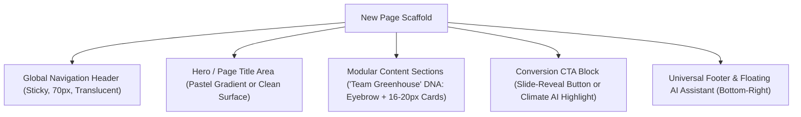

# Page Expansion Rules, WordPress Migration & Modular React Architecture

> **/goal** Define rules for expanding the design system into new pages, specify WordPress Gutenberg `theme.json` migration paths, and provide modular React micro-component implementations (functions <= 8–15 lines, files <= 100 lines).
> **/learn** Master new page layout inheritance, WordPress block and token mapping, and micro-component React architecture.

## 🎯 Actionable CI/CD & AI Agent Checklist

- [ ] `/goal` Verify new page templates maintain consistent 70px header, section vertical rhythm (64–104px), and 16–20px card radii.
- [ ] `/learn` Ensure design tokens cleanly map to WordPress `theme.json` palette and custom properties for zero-friction CMS migration.
- [ ] `/goal` Confirm all React components enforce micro-functions (<= 8–15 lines) and small files (<= 100 lines).
- [ ] `/learn` Enforce positive boolean state names (`isHovered`, `isOpen`, `isActive`) without explicit `true` checks.

---

## 1. Future Page Expansion Rules

Any new page created under this design system (e.g., About Us, Property Listings, Case Studies, Pricing, Contact) MUST inherit the following architectural rules:



### Visual Expansion Checklist
1. **Never Introduce New Raw Colors:** Pull all visual styling strictly from Tier 1 and Tier 2 tokens (`var(--color-primary)`, `var(--color-bg-base)`, etc.).
2. **Consistent Card Geometry:** All content blocks and interactive cards must use `border-radius: 16px` to `20px` with a `1px solid var(--color-border)` perimeter.
3. **Harmonious Section Rhythm:** Alternate background surfaces between `var(--color-bg-base)` (`#F7F4F3`) and pure white (`#FFFFFF`) to create organic visual grouping without heavy separators.

---

## 2. WordPress Migration Compatibility

The design system is structured to allow seamless migration into modern **WordPress Full-Site Editing (FSE)** and Gutenberg block themes:

### 1. Gutenberg `theme.json` Token Mapping

```json
{
  "$schema": "https://schemas.wp.org/trunk/theme.json",
  "version": 2,
  "settings": {
    "color": {
      "palette": [
        { "name": "Primary", "slug": "primary", "color": "var(--color-primary, #FF2D6F)" },
        { "name": "Primary Hover", "slug": "primary-hover", "color": "var(--color-primary-hover, #E02663)" },
        { "name": "Primary Light", "slug": "primary-light", "color": "var(--color-primary-light, #FFE4EC)" },
        { "name": "Background Base", "slug": "bg-base", "color": "var(--color-bg-base, #F7F4F3)" },
        { "name": "Surface", "slug": "surface", "color": "#FFFFFF" },
        { "name": "Text Primary", "slug": "text-primary", "color": "#111827" },
        { "name": "Text Secondary", "slug": "text-secondary", "color": "#6B7280" },
        { "name": "Border", "slug": "border", "color": "#E5E7EB" }
      ]
    },
    "custom": {
      "radius": {
        "card": "18px",
        "pill": "9999px",
        "sm": "8px"
      },
      "shadow": {
        "card": "0 10px 30px rgba(0, 0, 0, 0.05)"
      }
    }
  }
}
```

### 2. Admin-Configurable Theming
By exposing Tier 1 tokens (`--color-primary`, `--gradient-start`, `--gradient-end`) through WordPress Customizer or Site Editor settings, non-technical administrators can retheme the entire site (e.g. Pink $\rightarrow$ Green) directly from the admin dashboard with zero template rewrites.

---

## 3. Modular React Reference Implementations (Small Functions & Small Files)

The following production-ready micro-components exemplify the **small function ($\le 8\text{--}15$ lines)** and **small file ($\le 100$ lines)** mandate.

### 1. `SlideButton.tsx` (Refined "Join Us" Sliding Text Button)

```tsx
import React, { useState } from "react";

interface SlideButtonProps {
  primaryText: string;
  hoverText: string;
  onClick?: () => void;
}

export const SlideButton: React.FC<SlideButtonProps> = ({
  primaryText,
  hoverText,
  onClick,
}) => {
  const [isHovered, setIsHovered] = useState(false);

  const handleMouseEnter = () => setIsHovered(true);
  const handleMouseLeave = () => setIsHovered(false);

  return (
    <button
      type="button"
      onClick={onClick}
      onMouseEnter={handleMouseEnter}
      onMouseLeave={handleMouseLeave}
      className="btn-slide-reveal"
    >
      <span
        className="btn-slide-track"
        style={{ transform: isHovered ? "translateY(-48px)" : "translateY(0)" }}
      >
        <span className="btn-slide-label btn-slide-label-primary">{primaryText}</span>
        <span className="btn-slide-label btn-slide-label-hover">{hoverText}</span>
      </span>
    </button>
  );
};
```

### 2. `FilterChip.tsx` (Pill-Shaped Filter Chip with Chevron)

```tsx
import React from "react";

interface FilterChipProps {
  label: string;
  isOpen: boolean;
  isActive: boolean;
  onToggle: () => void;
}

export const FilterChip: React.FC<FilterChipProps> = ({
  label,
  isOpen,
  isActive,
  onToggle,
}) => {
  const chipClass = `filter-chip ${isActive ? "is-active" : ""} ${isOpen ? "is-open" : ""}`;

  return (
    <button type="button" onClick={onToggle} className={chipClass}>
      <span>{label}</span>
      <svg
        className="chip-chevron"
        viewBox="0 0 16 16"
        fill="none"
        stroke="currentColor"
        strokeWidth="2"
      >
        <path d="M4 6l4 4 4-4" strokeLinecap="round" strokeLinejoin="round" />
      </svg>
    </button>
  );
};
```

### 3. `FloatingAiButton.tsx` (Fixed Bottom-Right Assistant FAB)

```tsx
import React from "react";

interface FloatingAiButtonProps {
  onClick: () => void;
}

export const FloatingAiButton: React.FC<FloatingAiButtonProps> = ({ onClick }) => {
  return (
    <button
      type="button"
      onClick={onClick}
      className="fab-ai-assistant"
      aria-label="Open AI Assistant"
    >
      <svg viewBox="0 0 20 20" width="18" height="18" fill="currentColor">
        <path d="M10 2a8 8 0 100 16 8 8 0 000-16zm1 11H9v-2h2v2zm0-4H9V5h2v4z" />
      </svg>
      <span>AI Assistant</span>
    </button>
  );
};
```

### 4. `HeroHeadline.tsx` (Split Typography Headline)

```tsx
import React from "react";

interface HeroHeadlineProps {
  leadText: string;
  accentText: string;
}

export const HeroHeadline: React.FC<HeroHeadlineProps> = ({
  leadText,
  accentText,
}) => {
  return (
    <h1 className="hero-headline">
      <span className="hero-headline-dark">{leadText} </span>
      <span className="hero-headline-accent">{accentText}</span>
    </h1>
  );
};
```
