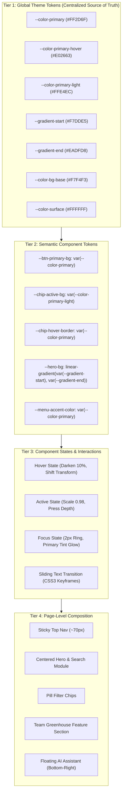

# AI-Adaptable Design System: Master Index & Architectural Guide

> **/goal** Master and enforce the architectural standards, specifications, and CI/CD validation rules for the AI-Adaptable Design System.
> **/learn** Read the sequentially ordered specification files in this directory, follow the actionable CI/CD checklist, and apply mandatory rules before generating code.

## 🎯 Actionable AI Agent Reading & Learning Checklist

Before authoring components or generating code, AI agents MUST read and master the specifications in this directory in the following sequence:

- [ ] `/learn` **Phase 1: Color Tokens & Variable Architecture**
  - Read [`01-colors-themes/01-color-and-theme-system.md`](01-colors-themes/01-color-and-theme-system.md) — Single source of truth for color tokens, Pink/Red default (`#FF2D6F`), Green swap (`#22C55E`), surface, border, and state tokens.
- [ ] `/learn` **Phase 2: Header, Menu & Icon Transitions**
  - Read [`02-menu/01-navigation-and-menu.md`](02-menu/01-navigation-and-menu.md) — Sticky ~70px header, border styling, hover underline/accent transitions, and micro-interaction icon state shifts.
- [ ] `/learn` **Phase 3: Hero Section, Search Module & Filter Chips**
  - Read [`03-hero-section/01-hero-and-search.md`](03-hero-section/01-hero-and-search.md) — Centered hero, split headline ("Find Your Dream" / "Home"), soft-shadow 16–20px search card, full-width input, and pill-shaped filter chips with dropdown indicators.
- [ ] `/learn` **Phase 4: Button System & Sliding Text Animations**
  - Read [`04-buttons/01-button-system.md`](04-buttons/01-button-system.md) — Primary button, "Join Us" CSS3 sliding text reveal animation, "Climate AI" highlight button styling, active press (scale 0.98), and focus glows.
- [ ] `/learn` **Phase 5: CSS3 Motion & Reusable Section Patterns**
  - Read [`05-motion-and-sections/01-motion-and-sections.md`](05-motion-and-sections/01-motion-and-sections.md) — Hardware-accelerated motion rules, deceleration curves, "Team Greenhouse" reference section layout DNA, and bottom-right floating AI assistant button.
- [ ] `/learn` **Phase 6: Page Expansion Rules & WordPress Migration**
  - Read [`06-expansion-and-wordpress/01-page-expansion-and-wordpress.md`](06-expansion-and-wordpress/01-page-expansion-and-wordpress.md) — Consistent new page assembly, Gutenberg block & `theme.json` mapping, and small-function React reference implementations (functions <= 8–15 lines, files <= 100 lines).

---

## Visual Philosophy & Personality

This design system establishes a **Modern SaaS Landing Interface** with a soft, inviting tone:

1. **Depth Without Heaviness:** Depth is created through soft pastel gradients and multi-layered ambient shadows (`0 10px 30px rgba(0, 0, 0, 0.05)`) rather than stark heavy drops or thick borders.
2. **Curved Geometry:** Consistent 16–20px radii for primary modules, pill shapes for interactive chips and buttons, and soft 8px radii for nested controls.
3. **Restrained Color Hierarchy:** 60% neutral surface background (`#F7F4F3` / `#FFFFFF`), 30% structural hierarchy (`#111827` titles, `#6B7280` body, `#E5E7EB` hairlines), and 10% high-energy brand accent (`#FF2D6F`).
4. **Hardware-Accelerated Interaction:** Micro-interactions (hover, active press, focus glow, text sliding) execute strictly via CSS3 transforms and opacity.

---

## Token Dependency & Inheritance Architecture

The system enforces a 4-tier token flow so components never rely on hardcoded color literals:

---

## Directory Contents

| Directory / File | Title | Scope & Role |
|:---|:---|:---|
| [`01-colors-themes/`](01-colors-themes/01-color-and-theme-system.md) | Color & Theme Architecture | Variables, Pink/Green presets, dark/light variants |
| [`02-menu/`](02-menu/01-navigation-and-menu.md) | Header & Menu System | Sticky nav, item spacing, hover accents, icon shifts |
| [`03-hero-section/`](03-hero-section/01-hero-and-search.md) | Hero & Search Module | Split headline, soft-shadow card, filter chips |
| [`04-buttons/`](04-buttons/01-button-system.md) | Button System | "Join Us" CSS3 text slide, "Climate AI" highlight |
| [`05-motion-and-sections/`](05-motion-and-sections/01-motion-and-sections.md) | Motion & Section Patterns | CSS3 animations, "Team Greenhouse" DNA, AI FAB |
| [`06-expansion-and-wordpress/`](06-expansion-and-wordpress/01-page-expansion-and-wordpress.md) | Expansion & WordPress | New page rules, Gutenberg mapping, React micro-code |

---

## Ambiguities and Clarifications

1. **Preset Breadth:** While the default is the Pink/Red theme with an explicit Green conversion guide, the token structure supports any brand color palette by overriding Tier 1 variables.
2. **WordPress Implementation:** Specification structures tokens and markup to map cleanly to WordPress Full-Site Editing (`theme.json`) and block templates without binding to specific third-party page builders.
3. **Reference Patterns:** Specific patterns like "Team Greenhouse" and "Climate AI" are abstracted into clean, reusable section and highlight button archetypes.
