# Sweet Digs Design System: Master Index & Token Flow

> **/goal** Master, enforce, and verify the architectural standards, token flow, and CSS3 interaction models for the Sweet Digs Design System.
> **/learn** Master the HSL variable architecture, the 75% expanding underline navigation interaction, the zoom-free button animation suite, the "Team Greenhouse" section layout DNA, and the live interactive theme tester.

---

## 1. Executive Architecture & Visual Personality

The **Sweet Digs Design System** establishes a clean, modern, and inviting interface combining organic curves, soft ambient elevation, and hardware-accelerated CSS3 transitions:

- **Organic & Modern Geometry:** Generous 16–20px radii on primary cards, full pill geometry on filter chips and action buttons, and 8–12px on micro-controls.
- **Pure HSL Variable Architecture:** Single source of truth across light and dark modes with support for alpha compositing (`hsl(var(--primary) / 0.4)`).
- **Zoom-Free Button Interactions:** Complete elimination of `scale(1.05)` zoom-in distortion in favor of fluid water/color-switching animation, soft ambient shadows, and "Join Us" CSS3 sliding text reveals.
- **Expanding Underline Navigation:** Symmetrical 300ms center expansion of a 2px primary underline from 0 to 75% button width on hover.
- **Thematic Section Layout DNA:** Two-tone split headlines, centered framing, and compound card hover lifts with subtle primary-tinted glow.

---

## 2. Token Flow & Architectural Pipeline

The system enforces a 4-tier token propagation hierarchy:

```mermaid
flowchart TD
    subgraph Tier1["Tier 1: Root HSL Brand Tokens"]
        T1_P["--primary: 142 71% 45%"]
        T1_PF["--primary-foreground: 0 0% 100%"]
        T1_S["--secondary: 142 60% 93%"]
        T1_SF["--secondary-foreground: 142 71% 30%"]
        T1_B["--background: 140 20% 97%"]
        T1_F["--foreground: 160 20% 10%"]
        T1_C["--card: 0 0% 100%"]
        T1_M["--muted: 150 14% 96%"]
        T1_R["--radius: 0.75rem"]
    end

    subgraph Tier2["Tier 2: Semantic Design Tokens"]
        T2_Btn["--btn-bg: hsl(var(--primary))"]
        T2_NavHover["--nav-hover-bg: hsl(var(--secondary))"]
        T2_Underline["--nav-underline: hsl(var(--primary))"]
        T2_CardBorder["--card-border-hover: hsl(var(--primary) / 0.4)"]
        T2_Glow["--glow-shadow: hsl(var(--primary) / 0.35)"]
    end

    subgraph Tier3["Tier 3: Hardware-Accelerated Kinetic States"]
        T3_Menu["Menu: Underline width 0 -> 75% (300ms ease)"]
        T3_Water["Button: Fluid Gradient Sweep (No Zoom-in)"]
        T3_Slide["Join Us: translateY(-100%) Slide Reveal (350ms)"]
        T3_Card["Card: translateY(-6px) Lift + Soft Tint Bloom"]
        T3_FAB["Climate AI: Infinite Pulse-Glow Halo (2.5s)"]
    end

    subgraph Tier4["Tier 4: Live Component Composition"]
        T4_Header["Sticky Header (~70px)"]
        T4_Hero["Split Headline Hero + Search Card"]
        T4_Chips["Pill Filter Chips with Border Shifts"]
        T4_Section["Team Greenhouse Atmospheric Gas Grid"]
        T4_Assistant["Bottom-Right Glowing Climate AI FAB"]
    end

    Tier1 --> Tier2
    Tier2 --> Tier3
    Tier3 --> Tier4
```

---

## 3. Specification Directory Map

The Sweet Digs specification suite is organized into modular documents:

| Specification Document | Focus Area | Key Architectural Deliverables |
|:---|:---|:---|
| [`01-colors-and-themes.md`](01-colors-and-themes.md) | Colors & Multi-Theme Engine | HSL tokens, 5 runtime themes (Emerald Green, Pink/Red, Obsidian Navy, Sunset Amber, Cyber Indigo), dark mode overrides |
| [`02-menu-and-navigation.md`](02-menu-and-navigation.md) | Navigation & Sticky Header | Sticky ~70px header, simultaneous 300ms hover transitions (text color, background, 75% expanding underline), chevron rotation |
| [`03-button-and-animation-system.md`](03-button-and-animation-system.md) | Buttons & CSS3 Animation | Ban on zoom-in, soft shadow elevation, CSS3 fluid water/color-switching animation, "Join Us" text slide, "Climate AI" glowing FAB |
| [`04-cards-and-sections.md`](04-cards-and-sections.md) | Cards & Section Layout DNA | "Team Greenhouse" section layout DNA, Gas Card patterns, 16–20px rounded cards, ambient elevation, staggered entry animations |

---

## 4. Live Interactive Theme Tester

To verify and experience the Sweet Digs Design System in real-time, launch the standalone interactive test application:

- **Interactive Test Application:** [`theme-tester/index.html`](../../../theme-tester/index.html)
- **Features Verified in Demo:**
  1. **Live 5-Theme Switcher:** Instant runtime switching between Emerald Green, Pink/Red, Obsidian Navy, Sunset Amber, and Cyber Indigo.
  2. **Live Split Hero:** Rendered with two-tone typography and responsive spacing.
  3. **Live Search Module:** 16–20px rounded card with search input, green focus ring, and pill search button with soft ambient shadow.
  4. **Live Filter Chips:** Dynamic pill filters with hover background/border shifts and dropdown indicators.
  5. **Live Navigation Menu:** Full 75% expanding underline animation on link hover with simultaneous text and background shifts.
  6. **Interactive Button Gallery:**
     - Standard primary button with fluid water/color-switching gradient animation (strictly NO zoom-in).
     - "Join Us" button with CSS3 sliding text reveal animation.
     - "Climate AI" glowing floating action button pinned to bottom-right with continuous pulse-glow.
  7. **Thematic Feature Cards:** "Team Greenhouse" atmospheric gas cards with compound hover lifts and icon rotations.

---

## 5. Architectural Quality Standards

1. **Strictly Lowercase File Naming:** All system files, assets, and documentation adhere to lowercase names with hyphens.
2. **Strict Relative Git Paths:** No absolute paths or file URIs exist in repository documentation or specifications.
3. **Implicit Positive Booleans:** Logic tracking active states or theme flags uses positive prefixes (`isThemeLoaded`, `hasActiveUnderline`) without explicit equality comparisons against true.
4. **Zero Layout Thrashing:** All hover and entrance animations execute via `transform`, `opacity`, and CSS custom property transitions to ensure consistent 60 FPS performance.
