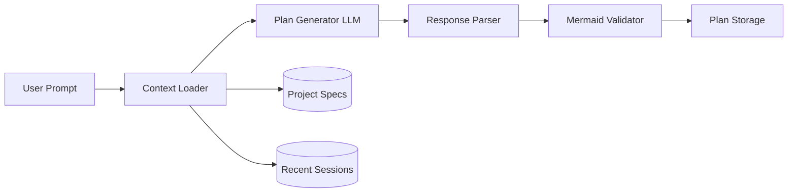

# Phase 3.1: Plan Generation Service

**Version:** 2.0.0  
**Status:** Draft  
**Updated:** 2026-03-09
**Parent:** [30-plan-mode.md](./30-plan-mode.md)

---

## Overview

AI-powered plan generation service that analyzes user requests and creates structured, executable plans with Mermaid workflow diagrams.

---

## Architecture



---

## Plan Generation Request

```go
// internal/ai/planner/types.go

package planner

type GeneratePlanRequest struct {
	UserPrompt    string            `json:"user_prompt"`
	ProjectId     string            `json:"project_id"`
	SessionId     string            `json:"session_id"`
	Context       PlanContext       `json:",omitempty"`
	Options       PlanOptions       `json:",omitempty"`
}

type PlanContext struct {
	ProjectSpecs    []SpecReference   `json:"project_specs,omitempty"`
	RecentChanges   []ChangeReference `json:"recent_changes,omitempty"`
	RelatedPlans    []string          `json:"related_plans,omitempty"`
	UserPreferences map[string]string `json:"user_preferences,omitempty"`
}

type SpecReference struct {
	Path    string
	Title   string
	Summary string
}

type ChangeReference struct {
	Timestamp time.Time
	FilePath  string    `json:"file_path"`
	Summary   string
}

type PlanOptions struct {
	MaxSteps         int    `json:"max_steps,omitempty"`
	DetailLevel      string `json:"detail_level,omitempty"`
	IncludeDiagram   bool   `json:"include_diagram,omitempty"`
	IncludeEstimates bool   `json:"include_estimates,omitempty"`
}
```

---

## Plan Generator Service

```go
// internal/ai/planner/service.go

package planner

import (
	"context"
	"encoding/json"
	"fmt"
	"strings"
	
	"specmgmt/internal/ai/llm"
	"specmgmt/internal/storage"
)

type Service struct {
	llm      *llm.Client
	specs    *storage.SpecStore
	plans    *storage.PlanStore
}

func NewService(llmClient *llm.Client, specs *storage.SpecStore, plans *storage.PlanStore) *Service {
	return &Service{
		llm:   llmClient,
		specs: specs,
		plans: plans,
	}
}

const planSystemPrompt = `You are an expert software architect and execution planner.
Your role is to analyze user requests and create detailed, actionable execution plans.

## Requirements

1. **Atomic Steps**: Each step must be independently verifiable
2. **Clear Dependencies**: Define which steps depend on others
3. **Time Estimates**: Provide realistic duration estimates
4. **Mermaid Diagram**: Generate a flowchart showing the workflow
5. **Executable by AI**: Steps must be actionable by an AI coding agent

## Step Types

- analyze: Read and understand existing code/specs
- generate: Create new files or content
- modify: Update existing files
- validate: Run tests or consistency checks
- review: AI self-review of changes
- diagram: Generate architectural diagrams
- execute: Run shell commands (brun)
- wait: Pause for user input
- conditional: Branch based on previous outputs

## Output Format

Return a JSON object with this exact structure:
{
  "Summary": "Brief overview of the plan (1-2 sentences)",
  "EstimatedTotalDuration": "~15 min",
  "Steps": [
    {
      "Id": "step_1",
      "Index": 0,
      "Title": "Short descriptive title",
      "Description": "Detailed description of what this step accomplishes",
      "Type": "analyze|generate|modify|validate|review|diagram|execute|wait|conditional",
      "Dependencies": [],
      "EstimatedDuration": "~2 min",
      "Inputs": { "Key": "value" },
      "Outputs": { "ExpectedKey": "description" }
    }
  ],
  "MermaidDiagram": "flowchart TD\n    A[Step 1] --> B[Step 2]\n    B --> C{Decision}\n    C -->|Yes| D[Step 3a]\n    C -->|No| E[Step 3b]"
}

## Mermaid Diagram Guidelines

1. Use flowchart TD (top-down) or LR (left-right)
2. Use descriptive node labels matching step titles
3. Show conditional branches with decision diamonds
4. Group parallel steps visually
5. Mark critical path with bold arrows (==>)
6. Keep diagram readable (max 15 nodes)

## Best Practices

- Start with analysis before generation
- Include validation after major changes
- Add review steps for complex modifications
- Keep steps focused (5-15 steps typical)
- Consider rollback scenarios for risky operations`

func (s *Service) GeneratePlan(context stdctx.Context, req GeneratePlanRequest) appfault.Result[ExecutionPlan] {
	// Build context from project specs
	contextResult := s.buildContextString(context, req)
	if contextResult.HasError() {
		return appfault.Fail[ExecutionPlan](contextResult.Error())
	}

	contextStr := contextResult.Value()
	
	// Build user message
	userMessage := fmt.Sprintf(`## Project Context

%s

## User Request

%s

## Instructions

Generate a detailed execution plan for this request. Include a Mermaid flowchart diagram.`,
		contextStr,
		req.UserPrompt,
	)
	
	// Add options constraints
	if req.Options.MaxSteps > 0 {
		userMessage += fmt.Sprintf("\n\nLimit the plan to maximum %d steps.", req.Options.MaxSteps)
	}
	
	// Call LLM with thinking model for better planning
	response, err := s.llm.Complete(context, llm.CompletionRequest{
		Model: "llama-3", // Use thinking/reasoning model
		Messages: []llm.Message{
			{Role: "system", Content: planSystemPrompt},
			{Role: "user", Content: userMessage},
		},
		Temperature:    0.3, // Lower for consistent plans
		MaxTokens:      4096,
		ResponseFormat: &llm.JSONResponseFormat{},
	})
	
	if err != nil {
		return appfault.FailWrap[ExecutionPlan](
			err,
			"E7800",
			"LLM completion failed",
		)
	}
	
	// Parse response
	var planResponse struct {
		Summary               string
		EstimatedTotalDuration string
		Steps                 []PlanStep
		MermaidDiagram        string
	}
	
	if err := json.Unmarshal([]byte(response.Content), &planResponse); err != nil {
		return appfault.FailWrap[ExecutionPlan](
			err,
			"E7801",
			"failed to parse plan response",
		)
	}
	
	// Validate Mermaid diagram
	if err := s.validateMermaid(planResponse.MermaidDiagram); err != nil {
		// Log warning but don't fail - diagram is optional
		log.Printf("Warning: invalid Mermaid diagram: %v", err)
		planResponse.MermaidDiagram = s.generateFallbackDiagram(planResponse.Steps)
	}
	
	// Resolve step dependencies
	steps := s.resolveDependencies(planResponse.Steps)
	
	// Create plan
	plan := &ExecutionPlan{
		Id:                    generateId(),
		ProjectId:             req.ProjectId,
		SessionId:             req.SessionId,
		UserPrompt:            req.UserPrompt,
		Summary:               planResponse.Summary,
		EstimatedTotalDuration: planResponse.EstimatedTotalDuration,
		Status:                "draft",
		Steps:                 steps,
		MermaidDiagram:        planResponse.MermaidDiagram,
		CurrentStepIndex:      0,
		CreatedAt:             time.Now(),
	}
	
	// Persist plan
	if err := s.plans.Create(context, plan); err != nil {
		return appfault.FailWrap[ExecutionPlan](
			err,
			"E7802",
			"failed to store plan",
		)
	}
	
	return appfault.Ok(*plan)
}

func (s *Service) buildContextString(context stdctx.Context, req GeneratePlanRequest) appfault.Result[string] {
	var builder strings.Builder
	
	// Add project specs summaries
	if len(req.Context.ProjectSpecs) > 0 {
		builder.WriteString("### Relevant Specifications\n\n")
		for _, spec := range req.Context.ProjectSpecs {
			builder.WriteString(fmt.Sprintf("- **%s** (`%s`): %s\n", spec.Title, spec.Path, spec.Summary))
		}

		builder.WriteString("\n")
	}
	
	// Add recent changes
	if len(req.Context.RecentChanges) > 0 {
		builder.WriteString("### Recent Changes\n\n")
		for _, change := range req.Context.RecentChanges {
			builder.WriteString(fmt.Sprintf("- %s: %s\n", change.FilePath, change.Summary))
		}

		builder.WriteString("\n")
	}
	
	// Load full spec content for key files (if needed)
	// This can be expanded based on the user prompt analysis
	
	return appfault.Ok(builder.String())
}

func (s *Service) validateMermaid(diagram string) *appfault.AppError {
	if diagram == "" {
		return appfault.New(
			ErrEmptyDiagram,
			"empty diagram",
		)
	}
	
	// Basic syntax validation
	if stringutil.IsMissingPrefix(strings.TrimSpace(diagram), "flowchart") &&
	   stringutil.IsMissingPrefix(strings.TrimSpace(diagram), "graph") {
		return appfault.New(
			ErrInvalidDiagramSyntax,
			"diagram must start with 'flowchart' or 'graph'",
		)
	}
	
	// Check for balanced brackets
	if strings.Count(diagram, "[") != strings.Count(diagram, "]") {
		return appfault.New(
			ErrUnbalancedBrackets,
			"unbalanced brackets",
		)
	}
	
	if strings.Count(diagram, "{") != strings.Count(diagram, "}") {
		return appfault.New(
			ErrUnbalancedBrackets,
			"unbalanced braces",
		)
	}
	
	return nil
}

func (s *Service) generateFallbackDiagram(steps []PlanStep) string {
	var builder strings.Builder
	builder.WriteString("flowchart TD\n")
	
	for i, step := range steps {
		nodeId := fmt.Sprintf("S%d", i)
		builder.WriteString(fmt.Sprintf("    %s[%s]\n", nodeId, step.Title))
		
		if i > 0 {
			prevId := fmt.Sprintf("S%d", i-1)
			builder.WriteString(fmt.Sprintf("    %s --> %s\n", prevId, nodeId))
		}
	}
	
	return builder.String()
}

func (s *Service) resolveDependencies(steps []PlanStep) []PlanStep {
	// Mark initial steps as ready
	for i := range steps {
		if len(steps[i].Dependencies) == 0 {
			steps[i].Status = "ready"
		} else {
			steps[i].Status = "blocked"
		}
	}
	return steps
}
```

---

## Context Loader

```go
// internal/ai/planner/context.go

package planner

import (
	stdctx "context"
	"sort"
	
	"specmgmt/internal/storage"
)

type ContextLoader struct {
	specs    *storage.SpecStore
	sessions *storage.SessionStore
}

func NewContextLoader(specs *storage.SpecStore, sessions *storage.SessionStore) *ContextLoader {
	return &ContextLoader{
		specs:    specs,
		sessions: sessions,
	}
}

// LoadProjectContext loads relevant context for plan generation
func (c *ContextLoader) LoadProjectContext(context stdctx.Context, projectId string, prompt string) appfault.Result[PlanContext] {
	planCtx := PlanContext{
		UserPreferences: make(map[string]string),
	}
	
	// Load project specs (summarized)
	specs, err := c.specs.ListByProject(context, projectId)
	if err != nil {
		return appfault.FailWrap[PlanContext](
			err,
			"E7810",
			"failed to list project specs",
		)
	}
	
	// Select most relevant specs based on prompt keywords
	relevantSpecs := c.selectRelevantSpecs(specs, prompt, 5)
	for _, spec := range relevantSpecs {
		planCtx.ProjectSpecs = append(planCtx.ProjectSpecs, SpecReference{
			Path:    spec.Path,
			Title:   spec.Title,
			Summary: spec.Summary,
		})
	}
	
	// Load recent session changes
	recentSessions, err := c.sessions.ListRecent(context, projectId, 5)
	if err != nil {
		return appfault.FailWrap[PlanContext](
			err,
			"E7811",
			"failed to list recent sessions",
		)
	}
	
	for _, session := range recentSessions {
		for _, change := range session.Changes {
			planCtx.RecentChanges = append(planCtx.RecentChanges, ChangeReference{
				Timestamp: change.Timestamp,
				FilePath:  change.FilePath,
				Summary:   change.Summary,
			})
		}
	}
	
	return appfault.Ok(planCtx)
}

func (c *ContextLoader) selectRelevantSpecs(specs []storage.Spec, prompt string, maxCount int) []storage.Spec {
	// Simple keyword matching - can be enhanced with embedding similarity
	type scored struct {
		spec  storage.Spec
		score float64
	}
	
	var scoredSpecs []scored
	promptWords := strings.Fields(strings.ToLower(prompt))
	
	for _, spec := range specs {
		score := 0.0
		specText := strings.ToLower(spec.Title + " " + spec.Summary + " " + spec.Path)
		
		for _, word := range promptWords {
			if strings.Contains(specText, word) {
				score += 1.0
			}
		}
		
		if score > 0 {
			scoredSpecs = append(scoredSpecs, scored{spec, score})
		}
	}
	
	// Sort by score descending
	sort.Slice(scoredSpecs, func(i, j int) bool {
		return scoredSpecs[i].score > scoredSpecs[j].score
	})
	
	// Take top N
	result := make([]storage.Spec, 0, maxCount)
	for i := 0; i < len(scoredSpecs) && i < maxCount; i++ {
		result = append(result, scoredSpecs[i].spec)
	}
	
	return result
}
```

---

## API Handler

```go
// internal/api/handlers/plans.go

package handlers

import (
	"encoding/json"
	"net/http"
	
	"specmgmt/internal/ai/planner"
)

type PlanHandler struct {
	planService   *planner.Service
	contextLoader *planner.ContextLoader
}

func NewPlanHandler(svc *planner.Service, loader *planner.ContextLoader) *PlanHandler {
	return &PlanHandler{
		planService:   svc,
		contextLoader: loader,
	}
}

func (h *PlanHandler) GeneratePlan(w http.ResponseWriter, r *http.Request) {
	var req struct {
		UserPrompt string                 `json:"user_prompt"`
		ProjectId  string                 `json:"project_id"`
		SessionId  string                 `json:"session_id"`
		Options    planner.PlanOptions    `json:"options,omitempty"`
	}
	
	if err := json.NewDecoder(r.Body).Decode(&req); err != nil {
		http.Error(w, "invalid request body", http.StatusBadRequest)
		return
	}
	
	// Validate required fields
	if req.UserPrompt == "" || req.ProjectId == "" {
		http.Error(w, "user_prompt and project_id required", http.StatusBadRequest)
		return
	}
	
	// Load project context
	ctx := r.Context()
	planContext, err := h.contextLoader.LoadProjectContext(ctx, req.ProjectId, req.UserPrompt)
	if err != nil {
		http.Error(w, "failed to load context", http.StatusInternalServerError)
		return
	}
	
	// Generate plan
	plan, err := h.planService.GeneratePlan(ctx, planner.GeneratePlanRequest{
		UserPrompt: req.UserPrompt,
		ProjectId:  req.ProjectId,
		SessionId:  req.SessionId,
		Context:    *planContext,
		Options:    req.Options,
	})
	
	if err != nil {
		http.Error(w, err.Error(), http.StatusInternalServerError)
		return
	}
	
	w.Header().Set("Content-Type", "application/json")
	json.NewEncoder(w).Encode(plan)
}
```

---

## Frontend Service

```typescript
// services/planService.ts

import { ExecutionPlan, PlanOptions } from '@/types/plan';

const API_BASE = '/api/v1';

interface GeneratePlanParams {
  userPrompt: string;
  projectId: string;
  sessionId: string;
  options?: PlanOptions;
}

export async function generatePlan(params: GeneratePlanParams): Promise<ExecutionPlan> {
  const response = await fetch(`${API_BASE}/plans/generate`, {
    method: HttpMethod.Post,
    headers: { 'Content-Type': 'application/json' },
    body: JSON.stringify({
      user_prompt: params.userPrompt,
      project_id: params.projectId,
      session_id: params.sessionId,
      options: params.options,
    }),
  });
  
  if (!response.ok) {
    const error = await response.text();
    throw new Error(error || 'Failed to generate plan');
  }
  
  return response.json();
}

export async function getPlan(planId: string): Promise<ExecutionPlan> {
  const response = await fetch(`${API_BASE}/plans/${planId}`);
  
  if (!response.ok) {
    throw new Error('Failed to fetch plan');
  }
  
  return response.json();
}
```

---

## Testing

| Test Case | Description | Expected Result |
|-----------|-------------|-----------------|
| Basic plan generation | Simple prompt generates valid plan | Plan with steps and diagram |
| Context loading | Project specs included in prompt | Relevant specs in context |
| Mermaid validation | Invalid diagram syntax | Fallback diagram generated |
| Empty prompt | No user prompt provided | 400 Bad Request |
| Max steps limit | Options.maxSteps = 5 | Plan has ≤5 steps |
| Step dependencies | Complex request with dependencies | Proper dependency graph |
| Parallel steps | Independent operations | Steps marked as parallelizable |

---

## Related Specs

- [30-plan-mode.md](./30-plan-mode.md) - Parent spec
- [32-plan-execution.md](./32-plan-execution.md) - Step execution
- [34-mermaid-integration.md](./34-mermaid-integration.md) - Diagram generation
