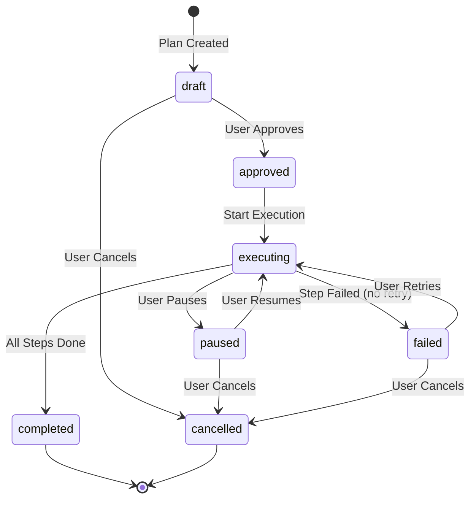
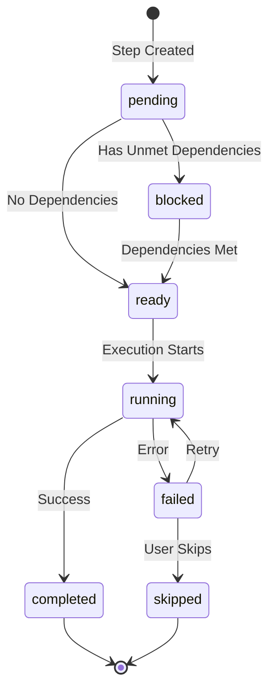

# Phase 3.2: Plan Execution Engine

**Version:** 2.0.0  
**Status:** Draft  
**Updated:** 2026-03-09
**Parent:** [30-plan-mode.md](./30-plan-mode.md)

---

## Overview

Step execution engine with state machine, dependency resolution, retry logic, and real-time progress streaming.

---

## State Machine



### Step State Machine



---

## Execution Engine

```go
// internal/ai/planner/executor.go

package planner

import (
	stdctx "context"
	"fmt"
	"sync"
	"time"
	
	"specmgmt/internal/ai/llm"
	"specmgmt/internal/storage"
)

type ExecutionEngine struct {
	llm          *llm.Client
	plans        *storage.PlanStore
	stepHandlers map[string]StepHandler
	
	mu          sync.Mutex
	activePlans map[string]*executionState
}

type executionState struct {
	plan      *ExecutionPlan
	cancel    stdctx.CancelFunc
	pauseCh   chan struct{}
	resumeCh  chan struct{}
	isPaused  bool
}

type StepHandler interface {
	Execute(context stdctx.Context, step *PlanStep, plan *ExecutionPlan) apperror.Result[StepResult]
	CanRetry(err error) bool
}

// StepOutputData holds typed output fields from step execution.
type StepOutputData struct {
    Analysis     string `json:",omitempty"`
    Content      string `json:",omitempty"`
    Path         string `json:",omitempty"`
    Stdout       string `json:",omitempty"`
    Stderr       string `json:",omitempty"`
    ExitCode     int    `json:",omitempty"`
    Response     string `json:",omitempty"`
    Code         string `json:",omitempty"`
    FullResponse string `json:",omitempty"`
    Language     string `json:",omitempty"`
}

type StepResult struct {
    Success   bool
    Outputs   StepOutputData `json:",omitempty"`
    Message   string         `json:",omitempty"`
    Artifacts []Artifact     `json:",omitempty"`
}

type Artifact struct {
	Type     string          // "file", "diagram", "code"
	Path     string
	Content  string `json:",omitempty"`
	MimeType string `json:",omitempty"`
}

func NewExecutionEngine(llm *llm.Client, plans *storage.PlanStore) *ExecutionEngine {
	engine := &ExecutionEngine{
		llm:          llm,
		plans:        plans,
		stepHandlers: make(map[string]StepHandler),
		activePlans:  make(map[string]*executionState),
	}
	
	// Register default handlers
	engine.RegisterHandler("analyze", &AnalyzeHandler{llm: llm})
	engine.RegisterHandler("generate", &GenerateHandler{llm: llm})
	engine.RegisterHandler("modify", &ModifyHandler{llm: llm})
	engine.RegisterHandler("validate", &ValidateHandler{})
	engine.RegisterHandler("diagram", &DiagramHandler{llm: llm})
	engine.RegisterHandler("execute", &ExecuteHandler{})
	engine.RegisterHandler("wait", &WaitHandler{})
	engine.RegisterHandler("conditional", &ConditionalHandler{llm: llm})
	
	return engine
}

func (e *ExecutionEngine) RegisterHandler(stepType string, handler StepHandler) {
	e.stepHandlers[stepType] = handler
}

// ExecuteStep runs a single step
func (e *ExecutionEngine) ExecuteStep(context stdctx.Context, planId string, stepIndex int) apperror.Result[StepResult] {
	plan, err := e.plans.Get(context, planId)
	if err != nil {
		return apperror.FailWrap[StepResult](
			err,
			"E7700",
			"plan not found",
		)
	}
	
	if stepIndex < 0 || stepIndex >= len(plan.Steps) {
		return apperror.FailNew[StepResult](
			"E7700",
			fmt.Sprintf("invalid step index: %d", stepIndex),
		)
	}
	
	step := &plan.Steps[stepIndex]
	
	// Check dependencies
	if err := e.checkDependencies(plan, step); err != nil {
		return apperror.FailWrap[StepResult](
			err,
			"E7701",
			"dependency check failed",
		)
	}
	
	// Get handler
	handler, ok := e.stepHandlers[step.Type]
	if !ok {
		return apperror.FailNew[StepResult](
			"E7702",
			fmt.Sprintf("unknown step type: %s", step.Type),
		)
	}
	
	// Update step status
	step.Status = "running"
	step.StartedAt = timePtr(time.Now())
	plan.Status = "executing"
	plan.CurrentStepIndex = stepIndex
	
	if err := e.plans.Update(context, plan); err != nil {
		return apperror.FailWrap[StepResult](
			err,
			"E7703",
			"failed to update plan",
		)
	}
	
	// Execute with retry logic
	var result StepResult
	var execErr error
	maxRetries := step.MaxRetries
	if maxRetries == 0 {
		maxRetries = 3 // Default
	}
	
	for attempt := 0; attempt <= maxRetries; attempt++ {
		step.RetryCount = attempt
		
		stepResult := handler.Execute(context, step, plan)
		
		if stepResult.IsSuccess() {
			result = stepResult.Value()
			execErr = nil
			break
		}
		
		execErr = stepResult.Error()
		
		if handler.IsTerminalError(execErr) || attempt == maxRetries {
			// Final failure
			step.Status = "failed"
			step.Error = execErr.Error()
			plan.Status = "failed"
			e.plans.Update(context, plan)
			
			// Record in history
			e.recordStepHistory(context, plan.Id, step, "failed", StepOutputData{}, execErr.Error())
			
			return apperror.FailWrap[StepResult](
				execErr,
				"E7704",
				"step execution failed",
			)
		}
		
		// Exponential backoff
		backoff := time.Duration(1<<attempt) * time.Second
		select {
		case <-context.Done():
			return apperror.FailWrap[StepResult](
				context.Err(),
				"E7705",
				"execution cancelled",
			)
		case <-time.After(backoff):
			// Continue to retry
		}
	}
	
	// Success
	step.Status = "completed"
	step.CompletedAt = timePtr(time.Now())
	step.Outputs = result.Outputs
	
	// Check if all steps complete
	allComplete := true
	for _, s := range plan.Steps {
		if s.Status != "completed" && s.Status != "skipped" {
			allComplete = false
			break
		}
	}
	
	if allComplete {
		plan.Status = "completed"
		plan.CompletedAt = timePtr(time.Now())
	} else {
		// Update ready steps
		e.updateReadySteps(plan)
	}
	
	if err := e.plans.Update(context, plan); err != nil {
		return apperror.FailWrap[StepResult](
			err,
			"E7703",
			"failed to update plan",
		)
	}
	
	// Record in history
	e.recordStepHistory(context, plan.Id, step, "completed", result.Outputs, "")
	
	return apperror.Ok(result)
}

// ExecuteAll runs all remaining steps
func (e *ExecutionEngine) ExecuteAll(context stdctx.Context, planId string) error {
	e.mu.Lock()
	
	// Create cancellable context
	execContext, cancel := stdctx.WithCancel(context)
	state := &executionState{
		cancel:   cancel,
		pauseCh:  make(chan struct{}),
		resumeCh: make(chan struct{}),
	}

	e.activePlans[planId] = state
	e.mu.Unlock()
	
	defer func() {
		e.mu.Lock()
		delete(e.activePlans, planId)
		e.mu.Unlock()
	}()
	
	plan, err := e.plans.Get(context, planId)
	if err != nil {
		return err
	}

	state.plan = plan
	
	// Execute steps in order
	for i := plan.CurrentStepIndex; i < len(plan.Steps); i++ {
		// Check for pause
		select {
		case <-state.pauseCh:
			state.isPaused = true
			plan.Status = "paused"
			e.plans.Update(context, plan)
			
			// Wait for resume
			select {
			case <-state.resumeCh:
				state.isPaused = false
				plan.Status = "executing"
				e.plans.Update(context, plan)
			case <-execContext.Done():
				return execContext.Err()
			}
		default:
		}
		
		// Check for cancellation
		select {
		case <-execContext.Done():
			plan.Status = "cancelled"
			plan.CancelledAt = timePtr(time.Now())
			e.plans.Update(context, plan)
			return execContext.Err()
		default:
		}
		
		// Skip completed/skipped steps
		if plan.Steps[i].Status == "completed" || plan.Steps[i].Status == "skipped" {
			continue
		}
		
		_, err := e.ExecuteStep(execContext, planId, i)
		if err != nil {
			return err
		}
		
		// Reload plan to get updated state
		plan, _ = e.plans.Get(context, planId)
		state.plan = plan
	}
	
	return nil
}

// Pause pauses execution
func (e *ExecutionEngine) Pause(planId string) error {
	e.mu.Lock()
	defer e.mu.Unlock()
	
	state, ok := e.activePlans[planId]
	if !ok {
		return apperror.New(
			ErrPlanNotExecuting,
			"plan not executing",
		)
	}
	
	if !state.isPaused {
		state.pauseCh <- struct{}{}
	}
	
	return nil
}

// Resume resumes execution
func (e *ExecutionEngine) Resume(planId string) error {
	e.mu.Lock()
	defer e.mu.Unlock()
	
	state, ok := e.activePlans[planId]
	if !ok {
		return apperror.New(
			ErrPlanNotExecuting,
			"plan not executing",
		)
	}
	
	if state.isPaused {
		state.resumeCh <- struct{}{}
	}
	
	return nil
}

// Cancel cancels execution
func (e *ExecutionEngine) Cancel(planId string) error {
	e.mu.Lock()
	defer e.mu.Unlock()
	
	state, ok := e.activePlans[planId]
	if ok {
		state.cancel()
		return nil
	}
	
	// Plan not actively executing, just update status
	context := stdctx.Background()
	plan, err := e.plans.Get(context, planId)
	if err != nil {
		return err
	}
	
	plan.Status = "cancelled"
	plan.CancelledAt = timePtr(time.Now())
	return e.plans.Update(context, plan)
}

func (e *ExecutionEngine) checkDependencies(plan *ExecutionPlan, step *PlanStep) error {
	for _, depId := range step.Dependencies {
		for _, s := range plan.Steps {
			if s.Id == depId && s.Status != "completed" {
				return apperror.New(
					ErrDependencyNotCompleted,
					"dependency "+depId+" not completed",
				)
			}
		}
	}

	return nil
}

func (e *ExecutionEngine) updateReadySteps(plan *ExecutionPlan) {
	for i := range plan.Steps {
		step := &plan.Steps[i]
		if step.Status != "pending" && step.Status != "blocked" {
			continue
		}
		
		// Check if all dependencies are met
		allDepsComplete := true
		for _, depId := range step.Dependencies {
			for _, s := range plan.Steps {
				if s.Id == depId && s.Status != "completed" {
					allDepsComplete = false
					break
				}
			}
			if !allDepsComplete {
				break
			}
		}
		
		if allDepsComplete {
			step.Status = "ready"
		} else {
			step.Status = "blocked"
		}
	}
}

func (e *ExecutionEngine) recordStepHistory(context stdctx.Context, planId string, step *PlanStep, status string, outputs StepOutputData, errorMsg string) {
	history := &StepHistory{
		Id:          generateId(),
		PlanId:      planId,
		StepId:      step.Id,
		StepIndex:   step.Index,
		Status:      status,
		StartedAt:   step.StartedAt,
		CompletedAt: step.CompletedAt,
		Outputs:     outputs,
		Error:       errorMsg,
		RetryCount:  step.RetryCount,
	}
	
	e.plans.RecordHistory(context, history)
}

func timePtr(t time.Time) *time.Time {
	return &t
}
```

---

## Step Handlers

### Analyze Handler

```go
// internal/ai/planner/handlers/analyze.go

package handlers

// AnalyzeStepInputs holds typed inputs for analyze steps
type AnalyzeStepInputs struct {
	Files []string
}

type AnalyzeHandler struct {
	llm *llm.Client
}

func (h *AnalyzeHandler) Execute(context stdctx.Context, step *PlanStep, plan *ExecutionPlan) apperror.Result[StepResult] {
	// Get typed inputs
	inputs := step.GetAnalyzeInputs()
	
	// Build analysis prompt
	prompt := fmt.Sprintf(`Analyze the following files and provide insights:

Request: %s

Files:
%s

Provide:
1. Summary of each file's purpose
2. Key patterns and structures
3. Potential issues or improvements
4. Relevance to the current task`, 
		step.Description,
		strings.Join(inputs.Files, "\n"),
	)
	
	response, err := h.llm.Complete(context, llm.CompletionRequest{
		Model: "llama-3",
		Messages: []llm.Message{
			{Role: "system", Content: "You are a code analysis expert."},
			{Role: "user", Content: prompt},
		},
	})
	
	if err != nil {
		return apperror.FailWrap[StepResult](
			err,
			"E7710",
			"LLM analysis failed",
		)
	}
	
	return apperror.Ok(StepResult{
		Success: true,
		Message: "Analysis complete",
		Outputs: StepOutputData{
			Analysis: response.Content,
		},
	})
}

func (h *AnalyzeHandler) CanRetry(err error) bool {
	return isRetryableError(err)
}
```

### Generate Handler

```go
// internal/ai/planner/handlers/generate.go

// GenerateStepInputs holds typed inputs for generate steps
type GenerateStepInputs struct {
	TargetPath string
	Template   string
}

type GenerateHandler struct {
	llm *llm.Client
}

func (h *GenerateHandler) Execute(context stdctx.Context, step *PlanStep, plan *ExecutionPlan) apperror.Result[StepResult] {
	inputs := step.GetGenerateInputs()
	
	prompt := fmt.Sprintf(`Generate content for: %s

Target file: %s
Template: %s

Requirements from the plan:
%s`,
		step.Title,
		inputs.TargetPath,
		inputs.Template,
		step.Description,
	)
	
	response, err := h.llm.Complete(context, llm.CompletionRequest{
		Model: "mistral", // Use coding model
		Messages: []llm.Message{
			{Role: "system", Content: "You are an expert developer. Generate clean, well-documented code."},
			{Role: "user", Content: prompt},
		},
	})
	
	if err != nil {
		return apperror.FailWrap[StepResult](
			err,
			"E7711",
			"LLM generation failed",
		)
	}
	
	// Parse and save generated content
	content := extractCodeBlock(response.Content)
	
	return apperror.Ok(StepResult{
		Success: true,
		Message: fmt.Sprintf("Generated %s", inputs.TargetPath),
		Outputs: StepOutputData{
			Content: content,
			Path:    inputs.TargetPath,
		},
		Artifacts: []Artifact{
			{Type: "file", Path: inputs.TargetPath, Content: content},
		},
	})
}

func (h *GenerateHandler) CanRetry(err error) bool {
	return isRetryableError(err)
}
```

### Execute Handler (brun)

```go
// internal/ai/planner/handlers/execute.go

// ExecuteStepInputs holds typed inputs for execute steps
type ExecuteStepInputs struct {
	Command string
	Args    []string
	WorkDir string
}

type ExecuteHandler struct{}

func (h *ExecuteHandler) Execute(context stdctx.Context, step *PlanStep, plan *ExecutionPlan) apperror.Result[StepResult] {
	inputs := step.GetExecuteInputs()
	
	// Build command
	cmd := exec.CommandContext(context, inputs.Command, inputs.Args...)
	if inputs.WorkDir != "" {
		cmd.Dir = inputs.WorkDir
	}
	
	// Capture output
	var stdout, stderr bytes.Buffer
	cmd.Stdout = &stdout
	cmd.Stderr = &stderr
	
	err := cmd.Run()
	
	if err != nil {
		return apperror.Ok(StepResult{
			Success: false,
			Message: err.Error(),
			Outputs: StepOutputData{
				Stdout:   stdout.String(),
				Stderr:   stderr.String(),
				ExitCode: cmd.ProcessState.ExitCode(),
			},
		})
	}
	
	return apperror.Ok(StepResult{
		Success: true,
		Message: "Command executed successfully",
		Outputs: StepOutputData{
			Stdout:   stdout.String(),
			Stderr:   stderr.String(),
			ExitCode: 0,
		},
	})
}

func (h *ExecuteHandler) CanRetry(err error) bool {
	// Don't retry command execution failures
	return false
}
```

---

## Progress Streaming

```go
// internal/ai/planner/streamer.go

package planner

import (
	"encoding/json"
	"net/http"
	"sync"
)

type ProgressStreamer struct {
	mu        sync.RWMutex
	listeners map[string][]chan ProgressEvent
}

// ProgressEventData holds typed metadata for progress events.
type ProgressEventData struct {
    StepTitle string `json:",omitempty"`
    Error     string `json:",omitempty"`
}

type ProgressEvent struct {
    PlanId    string            `json:"plan_id"`
    StepIndex int               `json:"step_index"`
    Status    string
    Message   string            `json:",omitempty"`
    Progress  float64           `json:",omitempty"` // 0-100
    Data      ProgressEventData `json:",omitempty"`
}

func NewProgressStreamer() *ProgressStreamer {
	return &ProgressStreamer{
		listeners: make(map[string][]chan ProgressEvent),
	}
}

func (s *ProgressStreamer) Subscribe(planId string) <-chan ProgressEvent {
	s.mu.Lock()
	defer s.mu.Unlock()
	
	ch := make(chan ProgressEvent, 100)
	s.listeners[planId] = append(s.listeners[planId], ch)
	return ch
}

func (s *ProgressStreamer) Unsubscribe(planId string, ch <-chan ProgressEvent) {
	s.mu.Lock()
	defer s.mu.Unlock()
	
	listeners := s.listeners[planId]
	for i, listener := range listeners {
		if listener == ch {
			s.listeners[planId] = append(listeners[:i], listeners[i+1:]...)
			close(listener)
			break
		}
	}
}

func (s *ProgressStreamer) Emit(event ProgressEvent) {
	s.mu.RLock()
	defer s.mu.RUnlock()
	
	for _, ch := range s.listeners[event.PlanId] {
		select {
		case ch <- event:
		default:
			// Drop if channel full
		}
	}
}

// HTTP SSE handler
func (s *ProgressStreamer) HandleSSE(w http.ResponseWriter, r *http.Request) {
	planId := r.URL.Query().Get("plan_id")
	if planId == "" {
		http.Error(w, "plan_id required", http.StatusBadRequest)
		return
	}
	
	w.Header().Set("Content-Type", "text/event-stream")
	w.Header().Set("Cache-Control", "no-cache")
	w.Header().Set("Connection", "keep-alive")
	
	flusher, ok := w.(http.Flusher)
	if !ok {
		http.Error(w, "streaming not supported", http.StatusInternalServerError)
		return
	}
	
	events := s.Subscribe(planId)
	defer s.Unsubscribe(planId, events)
	
	for {
		select {
		case event, ok := <-events:
			if !ok {
				return
			}
			
			data, _ := json.Marshal(event)
			fmt.Fprintf(w, "data: %s\n\n", data)
			flusher.Flush()
			
		case <-r.Context().Done():
			return
		}
	}
}
```

---

## Frontend Hook

```typescript
// hooks/usePlanExecution.ts

import { useState, useCallback, useEffect } from 'react';
import { ExecutionPlan, PlanStep, StepStatus } from '@/types/plan';

interface ProgressEvent {
  plan_id: string;
  step_index: number;
  status: string;
  message?: string;
  progress?: number;
  data?: Record<string, unknown>;
}

export function usePlanExecution(planId: string | null) {
  const [plan, setPlan] = useState<ExecutionPlan | null>(null);
  const [isExecuting, setIsExecuting] = useState(false);
  const [currentProgress, setCurrentProgress] = useState<ProgressEvent | null>(null);
  
  // Subscribe to SSE progress
  useEffect(() => {
    if (!planId || !isExecuting) return;
    
    const eventSource = new EventSource(`/api/v1/plans/${planId}/progress`);
    
    eventSource.onmessage = (event) => {
      const progress: ProgressEvent = JSON.parse(event.data);
      setCurrentProgress(progress);
      
      // Update plan state based on progress
      setPlan(prev => {
        if (!prev) return prev;
        
        const steps = [...prev.steps];
        if (progress.step_index >= 0 && progress.step_index < steps.length) {
          steps[progress.step_index] = {
            ...steps[progress.step_index],
            status: progress.status as StepStatus,
          };
        }
        
        return { ...prev, steps };
      });
    };
    
    eventSource.onerror = () => {
      eventSource.close();
    };
    
    return () => eventSource.close();
  }, [planId, isExecuting]);
  
  const executeStep = useCallback(async (stepIndex: number) => {
    if (!planId) return;
    
    setIsExecuting(true);
    
    try {
      const response = await fetch(`/api/v1/plans/${planId}/steps/${stepIndex}/execute`, {
        method: HttpMethod.Post,
      });
      
      if (!response.ok) {
        throw new Error('Step execution failed');
      }
      
      const result = await response.json();
      return result;
    } finally {
      setIsExecuting(false);
    }
  }, [planId]);
  
  const executeAll = useCallback(async () => {
    if (!planId) return;
    
    setIsExecuting(true);
    
    try {
      const response = await fetch(`/api/v1/plans/${planId}/execute-all`, {
        method: HttpMethod.Post,
      });
      
      if (!response.ok) {
        throw new Error('Execution failed');
      }
    } finally {
      setIsExecuting(false);
    }
  }, [planId]);
  
  const pause = useCallback(async () => {
    if (!planId) return;
    await fetch(`/api/v1/plans/${planId}/pause`, { method: HttpMethod.Post });
  }, [planId]);
  
  const resume = useCallback(async () => {
    if (!planId) return;
    setIsExecuting(true);
    await fetch(`/api/v1/plans/${planId}/resume`, { method: HttpMethod.Post });
  }, [planId]);
  
  const cancel = useCallback(async () => {
    if (!planId) return;
    await fetch(`/api/v1/plans/${planId}/cancel`, { method: HttpMethod.Post });
    setIsExecuting(false);
  }, [planId]);
  
  return {
    plan,
    isExecuting,
    currentProgress,
    executeStep,
    executeAll,
    pause,
    resume,
    cancel,
  };
}
```

---

## Testing

| Test Case | Description | Expected Result |
|-----------|-------------|-----------------|
| Execute single step | Run one step | Step completes with outputs |
| Execute all steps | Run all steps sequentially | All steps complete |
| Dependency blocking | Step with unmet deps | Returns dependency error |
| Retry on failure | Retryable error occurs | Retries up to maxRetries |
| Non-retryable failure | Command execution fails | Fails immediately |
| Pause execution | Pause during executeAll | Plan status becomes paused |
| Resume execution | Resume after pause | Continues from current step |
| Cancel execution | Cancel during execution | Plan status becomes cancelled |
| Progress streaming | Subscribe to SSE | Receives progress events |

---

## Related Specs

- [30-plan-mode.md](./30-plan-mode.md) - Parent spec
- [31-plan-generation.md](./31-plan-generation.md) - Plan generation
- [33-approval-workflow.md](./33-approval-workflow.md) - Approval UI
