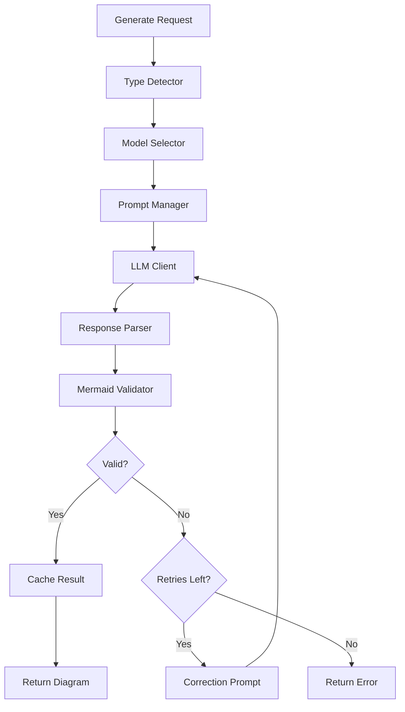

# Phase 4.3: Diagram Generation Service

**Version:** 2.0.0  
**Status:** Draft  
**Updated:** 2026-03-09
**Parent:** [40-mermaid-diagrams.md](./40-mermaid-diagrams.md)

---

## Overview

Backend service for AI-powered diagram generation with validation, caching, retry logic, and syntax correction.

---

## Service Architecture



---

## Core Service

```go
// internal/ai/diagram/service.go

package diagram

import (
	stdctx "context"
	"crypto/sha256"
	"encoding/hex"
	"fmt"
	"time"
	
	"specmgmt/internal/ai/diagram/prompts"
	"specmgmt/internal/ai/llm"
	"specmgmt/internal/storage"
)

type Service struct {
	llm           *llm.Client
	modelSelector *ModelSelector
	promptManager *prompts.PromptManager
	typeDetector  *TypeDetector
	validator     *MermaidValidator
	cache         *storage.DiagramCache
	store         *storage.DiagramStore
}

type GenerateRequest struct {
	Type        DiagramType       `json:",omitempty"`
	Description string
	Context     map[string]string `json:",omitempty"`
	ProjectId   string            `json:"project_id"` // EXEMPTED: API contract
	Direction   string            `json:",omitempty"`  // TD, LR, etc.
	Level       string            `json:",omitempty"`  // For C4: context, container, component
	MaxRetries  int               `json:"max_retries,omitempty"` // EXEMPTED: API contract
}

type GenerateResponse struct {
	Id          string
	Type        DiagramType
	Title       string
	MermaidCode string `json:"mermaid_code"` // EXEMPTED: API contract
	ModelUsed   string `json:"model_used"`   // EXEMPTED: API contract
	FromCache   bool   `json:"from_cache"`   // EXEMPTED: API contract
	GenerationMs int64 `json:"generation_ms"` // EXEMPTED: API contract
}

func NewService(
	llmClient *llm.Client,
	modelSelector *ModelSelector,
	promptManager *prompts.PromptManager,
	typeDetector *TypeDetector,
	cache *storage.DiagramCache,
	store *storage.DiagramStore,
) *Service {
	return &Service{
		llm:           llmClient,
		modelSelector: modelSelector,
		promptManager: promptManager,
		typeDetector:  typeDetector,
		validator:     NewMermaidValidator(),
		cache:         cache,
		store:         store,
	}
}

func (s *Service) Generate(context stdctx.Context, req GenerateRequest) appfault.Result[GenerateResponse] {
	startTime := time.Now()
	
	// Check cache first
	cacheKey := s.generateCacheKey(req)
	if cached, err := s.cache.Get(context, cacheKey); err == nil {
		return appfault.Ok(GenerateResponse{
			ID:          cached.ID,
			Type:        DiagramType(cached.Type),
			Title:       cached.Title,
			MermaidCode: cached.MermaidCode,
			ModelUsed:   cached.ModelUsed,
			FromCache:   true,
		})
	}
	
	// Auto-detect type if not specified
	diagramType := req.Type
	if diagramType == "" {
		diagramType = s.typeDetector.Detect(req.Description)
	}
	
	// Select best model
	model, err := s.modelSelector.SelectModel(context, diagramType, nil)
	if err != nil {
		return appfault.FailWrap[GenerateResponse](
			err,
			"E9400",
			"model selection failed",
		)
	}
	
	// Build prompt
	promptData := prompts.PromptData{
		Description: req.Description,
		Direction:   req.Direction,
		Level:       req.Level,
		Context:     req.Context,
	}
	
	if promptData.Direction == "" {
		promptData.Direction = "TD"
	}
	
	userPrompt, err := s.promptManager.BuildUserPrompt(diagramType, promptData)
	if err != nil {
		return appfault.FailWrap[GenerateResponse](
			err,
			"E9401",
			"prompt building failed",
		)
	}
	
	// Build messages with few-shot examples
	messages := s.promptManager.BuildFewShotMessages(diagramType, userPrompt)
	
	// Generate with retries
	maxRetries := req.MaxRetries
	if maxRetries == 0 {
		maxRetries = 3
	}
	
	var mermaidCode, title string
	var lastError error
	
	for attempt := 0; attempt <= maxRetries; attempt++ {
		// Call LLM
		response, err := s.llm.Complete(context, llm.CompletionRequest{
			Model:       model.ID,
			Messages:    convertMessages(messages),
			Temperature: model.Parameters.Temperature,
			MaxTokens:   model.Parameters.MaxTokens,
		})
		
		if err != nil {
			lastError = err
			continue
		}
		
		// Parse response
		mermaidCode = extractMermaidCode(response.Content)
		title = extractTitle(response.Content)
		
		// Validate
		validationResult := s.validator.Validate(mermaidCode)
		if validationResult.Valid {
			break
		}
		
		lastError = appfault.New(
			ErrValidationFailed,
			fmt.Sprintf("validation failed: %v", validationResult.Errors),
		)
		
		// Build correction prompt for next attempt
		if attempt < maxRetries {
			messages = s.buildCorrectionMessages(messages, mermaidCode, validationResult)
		}
	}
	
	if mermaidCode == "" || !s.validator.Validate(mermaidCode).Valid {
		return appfault.FailWrap[GenerateResponse](
			lastError,
			"E9402",
			fmt.Sprintf("diagram generation failed after %d attempts", maxRetries+1),
		)
	}
	
	// Store result
	diagram := &storage.Diagram{
		Id:             generateId(),
		ProjectId:      req.ProjectId,
		Type:           string(diagramType),
		Title:          title,
		MermaidCode:    mermaidCode,
		SourcePrompt:   req.Description,
		SourceContext:  req.Context,
		ModelUsed:      model.Id,
		GenerationTime: time.Since(startTime).Milliseconds(),
	}
	
	if err := s.store.Create(context, diagram); err != nil {
		// Log but don't fail
		fmt.Printf("Failed to store diagram: %v\n", err)
	}
	
	// Cache result
	s.cache.Set(context, cacheKey, diagram, 24*time.Hour)
	
	return appfault.Ok(GenerateResponse{
		ID:           diagram.ID,
		Type:         diagramType,
		Title:        title,
		MermaidCode:  mermaidCode,
		ModelUsed:    model.ID,
		FromCache:    false,
		GenerationMs: diagram.GenerationTime,
	})
}

func (s *Service) buildCorrectionMessages(original []prompts.Message, invalidCode string, result *ValidationResult) []prompts.Message {
	correctionPrompt := fmt.Sprintf(`The generated Mermaid diagram has syntax errors:

Errors:
%s

Invalid code:
` + "```" + `
%s
` + "```" + `

Please fix the syntax errors and regenerate a valid Mermaid diagram.`,
		formatErrors(result.Errors),
		invalidCode,
	)
	
	return append(original, prompts.Message{
		Role:    "user",
		Content: correctionPrompt,
	})
}

func (s *Service) generateCacheKey(req GenerateRequest) string {
	data := fmt.Sprintf("%s:%s:%s:%v", req.Type, req.Description, req.Direction, req.Context)
	hash := sha256.Sum256([]byte(data))
	return hex.EncodeToString(hash[:])[:16]
}

func formatErrors(errors []string) string {
	result := ""
	for _, e := range errors {
		result += "- " + e + "\n"
	}
	return result
}

func convertMessages(msgs []prompts.Message) []llm.Message {
	result := make([]llm.Message, len(msgs))
	for i, m := range msgs {
		result[i] = llm.Message{Role: m.Role, Content: m.Content}
	}
	return result
}
```

---

## Mermaid Validator

```go
// internal/ai/diagram/validator.go

package diagram

import (
	"fmt"
	"regexp"
	"strings"
)

type MermaidValidator struct {
	typePatterns    map[string]*regexp.Regexp
	syntaxCheckers  map[string]SyntaxChecker
	maxNodes        int
	maxEdges        int
}

type ValidationResult struct {
	Valid    bool
	Type     string        `json:",omitempty"`
	Errors   []string      `json:",omitempty"`
	Warnings []string      `json:",omitempty"`
	Stats    *DiagramStats `json:",omitempty"`
}

type DiagramStats struct {
	NodeCount int `json:"node_count"` // EXEMPTED: API contract
	EdgeCount int `json:"edge_count"` // EXEMPTED: API contract
	Depth     int
}

type SyntaxChecker func(code string) []string

func NewMermaidValidator() *MermaidValidator {
	v := &MermaidValidator{
		typePatterns: make(map[string]*regexp.Regexp),
		syntaxCheckers: make(map[string]SyntaxChecker),
		maxNodes: 50,
		maxEdges: 100,
	}
	
	// Type detection patterns
	v.typePatterns["flowchart"] = regexp.MustCompile(`^(flowchart|graph)\s+(TD|TB|LR|RL|BT)`)
	v.typePatterns["sequence"] = regexp.MustCompile(`^sequenceDiagram`)
	v.typePatterns["class"] = regexp.MustCompile(`^classDiagram`)
	v.typePatterns["er"] = regexp.MustCompile(`^erDiagram`)
	v.typePatterns["state"] = regexp.MustCompile(`^stateDiagram(-v2)?`)
	v.typePatterns["gantt"] = regexp.MustCompile(`^gantt`)
	v.typePatterns["pie"] = regexp.MustCompile(`^pie`)
	v.typePatterns["journey"] = regexp.MustCompile(`^journey`)
	v.typePatterns["c4"] = regexp.MustCompile(`^C4(Context|Container|Component|Dynamic)`)
	v.typePatterns["mindmap"] = regexp.MustCompile(`^mindmap`)
	v.typePatterns["git"] = regexp.MustCompile(`^gitGraph`)
	
	// Type-specific syntax checkers
	v.syntaxCheckers["flowchart"] = v.checkFlowchartSyntax
	v.syntaxCheckers["sequence"] = v.checkSequenceSyntax
	v.syntaxCheckers["er"] = v.checkERSyntax
	
	return v
}

func (v *MermaidValidator) Validate(code string) *ValidationResult {
	result := &ValidationResult{Valid: true}
	code = strings.TrimSpace(code)
	
	// Check empty
	if code == "" {
		result.Valid = false
		result.Errors = append(result.Errors, "Empty diagram code")
		return result
	}
	
	// Detect type
	diagramType := v.detectType(code)
	if diagramType == "" {
		result.Valid = false
		result.Errors = append(result.Errors, "Unknown diagram type")
		return result
	}
	result.Type = diagramType
	
	// Check balanced brackets
	if err := v.checkBalancedBrackets(code); err != nil {
		result.Valid = false
		result.Errors = append(result.Errors, err.Error())
	}
	
	// Check for common syntax errors
	commonErrors := v.checkCommonSyntax(code)
	if len(commonErrors) > 0 {
		result.Valid = false
		result.Errors = append(result.Errors, commonErrors...)
	}
	
	// Run type-specific checker
	if checker, ok := v.syntaxCheckers[diagramType]; ok {
		typeErrors := checker(code)
		if len(typeErrors) > 0 {
			result.Valid = false
			result.Errors = append(result.Errors, typeErrors...)
		}
	}
	
	// Calculate stats
	stats := v.calculateStats(code)
	result.Stats = stats
	
	// Add warnings for large diagrams
	if stats.NodeCount > v.maxNodes {
		result.Warnings = append(result.Warnings, 
			fmt.Sprintf("Diagram has %d nodes (recommended max: %d)", stats.NodeCount, v.maxNodes))
	}
	
	if stats.EdgeCount > v.maxEdges {
		result.Warnings = append(result.Warnings,
			fmt.Sprintf("Diagram has %d edges (recommended max: %d)", stats.EdgeCount, v.maxEdges))
	}
	
	return result
}

func (v *MermaidValidator) detectType(code string) string {
	for typeName, pattern := range v.typePatterns {
		if pattern.MatchString(code) {
			return typeName
		}
	}
	return ""
}

func (v *MermaidValidator) checkBalancedBrackets(code string) error {
	brackets := map[rune]rune{'[': ']', '{': '}', '(': ')'}
	stack := []rune{}
	inString := false
	prevChar := rune(0)
	
	for _, ch := range code {
		// Track string state
		if ch == '"' && prevChar != '\\' {
			inString = !inString
		}
		prevChar = ch
		
		if inString {
			continue
		}
		
		if _, isOpen := brackets[ch]; isOpen {
			stack = append(stack, ch)
		}
		
		for open, close := range brackets {
			if ch == close {
				if len(stack) == 0 || stack[len(stack)-1] != open {
					return appfault.New(
						ErrUnbalancedBrackets,
						fmt.Sprintf("unbalanced bracket: %c", ch),
					)
				}
				stack = stack[:len(stack)-1]
			}
		}
	}
	
	if len(stack) > 0 {
		return appfault.New(
			ErrUnclosedBracket,
			fmt.Sprintf("unclosed bracket: %c", stack[len(stack)-1]),
		)
	}
	
	return nil
}

func (v *MermaidValidator) checkCommonSyntax(code string) []string {
	var errors []string
	
	// Check for invalid arrow syntax
	if matched, _ := regexp.MatchString(`[<>]-{4,}[<>]`, code); matched {
		errors = append(errors, "Invalid arrow: too many dashes")
	}
	
	// Check for unclosed labels
	lines := strings.Split(code, "\n")
	for i, line := range lines {
		// Skip comment lines
		if strings.HasPrefix(strings.TrimSpace(line), "%%") {
			continue
		}
		
		// Check for unclosed brackets on single line
		if strings.Count(line, "[") != strings.Count(line, "]") {
			// Could be multi-line, check if it's a problem
			if stringutil.IsMissingSubstring(line, "```") {
				errors = append(errors, fmt.Sprintf("Line %d: possibly unclosed bracket", i+1))
			}
		}
	}
	
	// Check for reserved words misuse
	reservedPattern := regexp.MustCompile(`\b(end|class|state)\s*\[`)
	if reservedPattern.MatchString(code) {
		errors = append(errors, "Reserved word used as node ID - prefix with underscore")
	}
	
	return errors
}

func (v *MermaidValidator) checkFlowchartSyntax(code string) []string {
	var errors []string
	
	// Check for valid direction
	if !regexp.MustCompile(`^(flowchart|graph)\s+(TD|TB|LR|RL|BT)\s*$`).MatchString(strings.Split(code, "\n")[0]) {
		// Direction might be on same line with content, which is ok
	}
	
	// Check arrow syntax
	arrowPattern := regexp.MustCompile(`(-->|-.->|==>|--[^>]+-+>)`)
	if !arrowPattern.MatchString(code) && strings.Count(code, "\n") > 2 {
		errors = append(errors, "No valid arrows found in flowchart")
	}
	
	return errors
}

func (v *MermaidValidator) checkSequenceSyntax(code string) []string {
	var errors []string
	
	// Check for participants or actors
	if stringutil.IsMissingSubstring(code, "participant") && stringutil.IsMissingSubstring(code, "actor") {
		// Check for implicit participants
		arrowPattern := regexp.MustCompile(`\w+\s*->>?\s*\w+`)
		if !arrowPattern.MatchString(code) {
			errors = append(errors, "No participants or messages found in sequence diagram")
		}
	}
	
	// Check message syntax
	if strings.Contains(code, "->") && stringutil.IsMissingSubstring(code, "->>") && stringutil.IsMissingSubstring(code, "-->") {
		errors = append(errors, "Invalid arrow syntax: use ->> for sync, -->> for async")
	}
	
	return errors
}

func (v *MermaidValidator) checkERSyntax(code string) []string {
	var errors []string
	
	// Check for entities
	entityPattern := regexp.MustCompile(`\b[A-Z][A-Z_]+\s*\{`)
	if !entityPattern.MatchString(code) {
		errors = append(errors, "No entities found - use UPPERCASE entity names")
	}
	
	// Check relationship syntax
	relPattern := regexp.MustCompile(`\|\|--|[|}]o--|[|}]\|--`)
	if !relPattern.MatchString(code) && strings.Count(code, "\n") > 3 {
		errors = append(errors, "No relationships found - use ||--o{ syntax")
	}
	
	return errors
}

func (v *MermaidValidator) calculateStats(code string) *DiagramStats {
	stats := &DiagramStats{}
	
	// Count nodes (simplified)
	nodePattern := regexp.MustCompile(`[A-Za-z_][A-Za-z0-9_]*[\[\{\(\<]`)
	nodes := make(map[string]bool)
	for _, match := range nodePattern.FindAllString(code, -1) {
		nodeId := match[:len(match)-1]
		nodes[nodeId] = true
	}
	stats.NodeCount = len(nodes)
	
	// Count edges
	edgePattern := regexp.MustCompile(`[-=.]+>`)
	stats.EdgeCount = len(edgePattern.FindAllString(code, -1))
	
	// Estimate depth (subgraph nesting)
	maxDepth := 0
	currentDepth := 0
	for _, line := range strings.Split(code, "\n") {
		line = strings.TrimSpace(line)
		if strings.HasPrefix(line, "subgraph") || strings.HasPrefix(line, "state ") && strings.Contains(line, "{") {
			currentDepth++
			if currentDepth > maxDepth {
				maxDepth = currentDepth
			}
		}
		if line == "end" || strings.HasSuffix(line, "}") {
			currentDepth--
		}
	}
	stats.Depth = maxDepth
	
	return stats
}
```

---

## Response Parser

```go
// internal/ai/diagram/parser.go

package diagram

import (
	"regexp"
	"strings"
)

// extractMermaidCode extracts Mermaid code from LLM response
func extractMermaidCode(content string) string {
	// Try to find mermaid code block
	mermaidPattern := regexp.MustCompile("(?s)```mermaid\\s*\\n(.+?)\\n```")
	if matches := mermaidPattern.FindStringSubmatch(content); len(matches) > 1 {
		return strings.TrimSpace(matches[1])
	}
	
	// Try generic code block
	codePattern := regexp.MustCompile("(?s)```\\s*\\n(.+?)\\n```")
	if matches := codePattern.FindStringSubmatch(content); len(matches) > 1 {
		code := strings.TrimSpace(matches[1])
		// Verify it looks like mermaid
		if isMermaidCode(code) {
			return code
		}
	}
	
	// Try to find raw mermaid code
	lines := strings.Split(content, "\n")
	inDiagram := false
	var diagramLines []string
	
	for _, line := range lines {
		trimmed := strings.TrimSpace(line)
		
		// Check for diagram start
		if !inDiagram && isMermaidStart(trimmed) {
			inDiagram = true
		}
		
		if inDiagram {
			diagramLines = append(diagramLines, line)
			
			// Check for diagram end (heuristic)
			if len(diagramLines) > 3 && (trimmed == "" || strings.HasPrefix(trimmed, "#")) {
				break
			}
		}
	}
	
	if len(diagramLines) > 0 {
		return strings.TrimSpace(strings.Join(diagramLines, "\n"))
	}
	
	return ""
}

// extractTitle extracts title from LLM response
func extractTitle(content string) string {
	lines := strings.Split(content, "\n")
	
	for _, line := range lines {
		line = strings.TrimSpace(line)
		
		// Check for markdown header
		if strings.HasPrefix(line, "# ") {
			return strings.TrimPrefix(line, "# ")
		}
		
		// Check for title prefix
		if strings.HasPrefix(line, "Title:") {
			return strings.TrimSpace(strings.TrimPrefix(line, "Title:"))
		}
		
		// Check for bold title
		if strings.HasPrefix(line, "**") && strings.HasSuffix(line, "**") {
			return strings.Trim(line, "*")
		}
	}
	
	return "Untitled Diagram"
}

func isMermaidCode(code string) bool {
	starts := []string{
		"flowchart", "graph", "sequenceDiagram", "classDiagram",
		"erDiagram", "stateDiagram", "gantt", "pie", "journey",
		"C4Context", "C4Container", "C4Component", "mindmap", "gitGraph",
	}
	
	for _, start := range starts {
		if strings.HasPrefix(code, start) {
			return true
		}
	}
	return false
}

func isMermaidStart(line string) bool {
	return isMermaidCode(line)
}
```

---

## API Handlers

```go
// internal/api/handlers/diagrams.go

package handlers

import (
	"encoding/json"
	"net/http"
	
	"specmgmt/internal/ai/diagram"
)

type DiagramHandler struct {
	service       *diagram.Service
	modelSelector *diagram.ModelSelector
}

func NewDiagramHandler(svc *diagram.Service, selector *diagram.ModelSelector) *DiagramHandler {
	return &DiagramHandler{
		service:       svc,
		modelSelector: selector,
	}
}

func (h *DiagramHandler) Generate(w http.ResponseWriter, r *http.Request) {
	var req diagram.GenerateRequest
	if err := json.NewDecoder(r.Body).Decode(&req); err != nil {
		http.Error(w, "Invalid request", http.StatusBadRequest)
		return
	}
	
	if req.Description == "" {
		http.Error(w, "Description required", http.StatusBadRequest)
		return
	}
	
	result, err := h.service.Generate(r.Context(), req)
	if err != nil {
		http.Error(w, err.Error(), http.StatusInternalServerError)
		return
	}
	
	w.Header().Set("Content-Type", "application/json")
	json.NewEncoder(w).Encode(result)
}

func (h *DiagramHandler) Validate(w http.ResponseWriter, r *http.Request) {
	var req struct {
		Code string
	}
	
	if err := json.NewDecoder(r.Body).Decode(&req); err != nil {
		http.Error(w, "Invalid request", http.StatusBadRequest)
		return
	}
	
	validator := diagram.NewMermaidValidator()
	result := validator.Validate(req.Code)
	
	w.Header().Set("Content-Type", "application/json")
	json.NewEncoder(w).Encode(result)
}

func (h *DiagramHandler) DetectType(w http.ResponseWriter, r *http.Request) {
	var req struct {
		Description string
	}
	
	if err := json.NewDecoder(r.Body).Decode(&req); err != nil {
		http.Error(w, "Invalid request", http.StatusBadRequest)
		return
	}
	
	detector := diagram.NewTypeDetector()
	diagramType, confidence := detector.DetectWithConfidence(req.Description)
	
	// DiagramDetectionResult is the typed response for diagram type detection.
	type DiagramDetectionResult struct {
		Type       string
		Confidence float64
	}

	w.Header().Set("Content-Type", "application/json")
	json.NewEncoder(w).Encode(DiagramDetectionResult{
		Type:       diagramType,
		Confidence: confidence,
	})
}

func (h *DiagramHandler) ListModels(w http.ResponseWriter, r *http.Request) {
	models := h.modelSelector.ListModels(r.Context())
	
	w.Header().Set("Content-Type", "application/json")
	json.NewEncoder(w).Encode(models)
}
```

---

## Testing

| Test Case | Description | Expected Result |
|-----------|-------------|-----------------|
| Valid flowchart | Generate from description | Valid mermaid code |
| Invalid syntax | Missing bracket | Validation errors |
| Auto-retry | First attempt invalid | Corrects and succeeds |
| Cache hit | Same request twice | Second from cache |
| Type detection | "database schema" | Returns ER type |
| Model fallback | Primary offline | Uses fallback model |
| Stats calculation | Complex diagram | Accurate node/edge count |
| Parse code block | Response with markdown | Extracts mermaid |

---

## Related Specs

- [40-mermaid-diagrams.md](./40-mermaid-diagrams.md) - Parent spec
- [41-model-categorization.md](./41-model-categorization.md) - Model selection
- [42-diagram-prompts.md](./42-diagram-prompts.md) - Prompt templates
- [44-diagram-ui.md](./44-diagram-ui.md) - Frontend components
