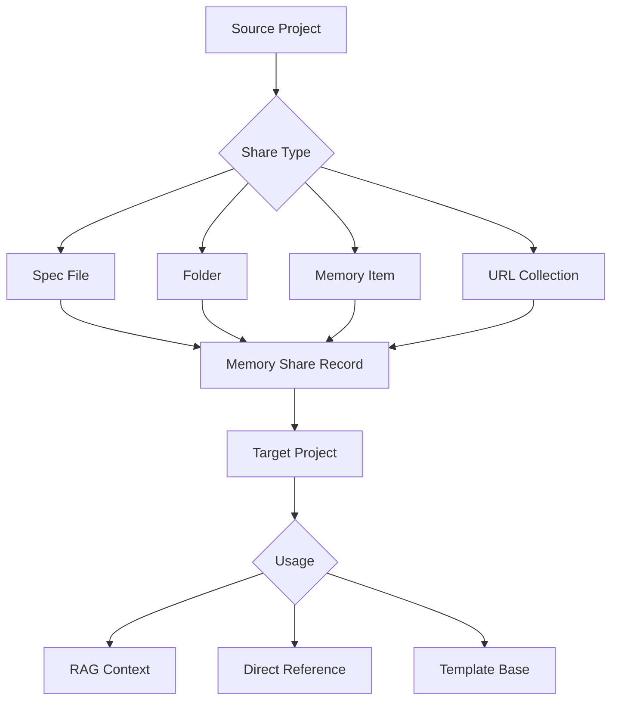

# Phase 6: Cross-Project Memory

**Version:** 2.0.0  
**Status:** Draft  
**Updated:** 2026-03-09

---

## Overview

Memory sharing system allowing specs, folders, and knowledge to be shared across projects. Enables using one project's specifications as a base reference for another with RAG-powered context integration.

**Cross-References:**
- [Knowledge Memory](../09-knowledge-memory/00-overview.md)
- [Chat UI Redesign](./50-chat-ui-redesign.md)
- [Project Management](../03-project-management/00-overview.md)

---

## Sub-Specifications

| Spec | Description |
|------|-------------|
| [61-sharing-architecture.md](./61-sharing-architecture.md) | Data models, permissions, access levels, backend services |
| [62-sync-mechanism.md](./62-sync-mechanism.md) | Bi-directional sync, conflict detection and resolution |
| [63-rag-integration.md](./63-rag-integration.md) | Vector embeddings, semantic search, context assembly |
| [64-sharing-ui.md](./64-sharing-ui.md) | Share dialogs, memory browser, chat integration |

---

## Architecture Summary

```
┌─────────────────────────────────────────────────────────────────────────────┐
│                    CROSS-PROJECT MEMORY ARCHITECTURE                        │
├─────────────────────────────────────────────────────────────────────────────┤
│                                                                             │
│  ┌─────────────┐         SHARE           ┌─────────────┐                   │
│  │  PROJECT A  │  ─────────────────────▶ │  PROJECT B  │                   │
│  │             │                          │             │                   │
│  │  Specs      │   Permissions:           │  References │                   │
│  │  Folders    │   • Read                 │  RAG Context│                   │
│  │  Memories   │   • Copy                 │             │                   │
│  │             │   • Sync (bi-dir)        │             │                   │
│  └─────────────┘   • Edit                 └─────────────┘                   │
│        │                                         │                          │
│        │                                         │                          │
│        ▼                                         ▼                          │
│  ┌─────────────────────────────────────────────────────────────────────┐   │
│  │                      EMBEDDING SERVICE                               │   │
│  │  • Chunk content into 512-token segments                            │   │
│  │  • Generate vector embeddings via OpenAI                            │   │
│  │  • Store in SQLite with JSON embedding column                       │   │
│  └─────────────────────────────────────────────────────────────────────┘   │
│        │                                         │                          │
│        ▼                                         ▼                          │
│  ┌─────────────────────────────────────────────────────────────────────┐   │
│  │                      CONTEXT ASSEMBLY                                │   │
│  │  • Semantic search across local + shared content                    │   │
│  │  • Score by cosine similarity                                        │   │
│  │  • Apply source weighting (local > shared > memory)                 │   │
│  │  • Trim to token budget                                              │   │
│  │  • Include source attribution                                        │   │
│  └─────────────────────────────────────────────────────────────────────┘   │
│                                                                             │
└─────────────────────────────────────────────────────────────────────────────┘
```

---

## Key Features

### Sharing
- Share specs, folders, files, URLs, and memories between projects
- Permission levels: Read, Copy, Sync, Edit
- Access levels: Private, Project, Workspace, Public
- Expiration support for time-limited shares

### Sync
- Bi-directional sync for "sync" permission shares
- Conflict detection via content hash comparison
- Resolution strategies: source-wins, target-wins, last-write-wins, manual merge
- Background sync worker with configurable interval

### RAG Integration
- Vector embeddings for semantic search
- Cross-project content included in AI context
- Source attribution in assembled context
- Configurable relevance scoring and token budgets

---

## 6.1 Sharing Architecture



---

## 6.2 Data Models

### TypeScript Types

```typescript
// types/memory-share.ts

export interface MemoryShare {
  id: string;
  sourceProjectId: string;
  targetProjectId: string;
  memoryType: MemoryType;
  memoryPath: string;
  memoryName: string;
  sharedBy: string; // User ID
  sharedAt: Date;
  permissions: SharePermission;
  syncStatus: SyncStatus;
  lastSyncedAt?: Date;
}

export type MemoryType = 
  | 'spec'      // Single spec file
  | 'folder'    // Entire folder with contents
  | 'file'      // Non-spec file
  | 'url'       // URL reference
  | 'memory'    // Knowledge memory item

export type SharePermission = 
  | 'read'      // Can reference in prompts
  | 'copy'      // Can copy to local project
  | 'sync';     // Auto-sync changes

export type SyncStatus = 
  | 'active'    // Sharing active
  | 'paused'    // Temporarily disabled
  | 'revoked';  // Sharing ended

export interface ProjectMemory {
  projectId: string;
  ownMemories: MemoryItem[];
  sharedMemories: MemoryShare[];
  sharedToOthers: MemoryShare[];
}

export interface MemoryItem {
  id: string;
  projectId: string;
  type: MemoryType;
  path: string;
  name: string;
  content?: string;
  embedding?: number[];
  createdAt: Date;
  updatedAt: Date;
}
```

### Database Schema

```sql
-- Memory shares table
CREATE TABLE IF NOT EXISTS memory_shares (
  id TEXT PRIMARY KEY,
  source_project_id TEXT NOT NULL,
  target_project_id TEXT NOT NULL,
  memory_type TEXT NOT NULL CHECK (memory_type IN ('spec', 'folder', 'file', 'url', 'memory')),
  memory_path TEXT NOT NULL,
  memory_name TEXT NOT NULL,
  shared_by TEXT NOT NULL,
  permissions TEXT DEFAULT 'read' CHECK (permissions IN ('read', 'copy', 'sync')),
  sync_status TEXT DEFAULT 'active' CHECK (sync_status IN ('active', 'paused', 'revoked')),
  shared_at DATETIME DEFAULT CURRENT_TIMESTAMP,
  last_synced_at DATETIME,
  FOREIGN KEY (source_project_id) REFERENCES projects(id),
  FOREIGN KEY (target_project_id) REFERENCES projects(id),
  UNIQUE(source_project_id, target_project_id, memory_path)
);

CREATE INDEX IdxSharesSource ON memory_shares(source_project_id);
CREATE INDEX IdxSharesTarget ON memory_shares(target_project_id);
CREATE INDEX IdxSharesStatus ON memory_shares(sync_status);

-- Cached memory content for offline access
CREATE TABLE IF NOT EXISTS memory_cache (
  share_id TEXT PRIMARY KEY,
  content TEXT NOT NULL,
  content_hash TEXT NOT NULL,
  cached_at DATETIME DEFAULT CURRENT_TIMESTAMP,
  FOREIGN KEY (share_id) REFERENCES memory_shares(id)
);
```

---

## 6.3 Backend API

### Share Service

```go
// internal/memory/share_service.go

package memory

import (
	"context"
	"crypto/sha256"
	"encoding/hex"
	"fmt"
	"time"
	
	"specmgmt/internal/db"
	"specmgmt/internal/files"
)

type ShareService struct {
	db    *db.DB
	files *files.Service
}

func NewShareService(db *db.DB, files *files.Service) *ShareService {
	return &ShareService{db: db, files: files}
}

type ShareRequest struct {
	SourceProjectId string `json:"source_project_id"`
	TargetProjectId string `json:"target_project_id"`
	MemoryType      string `json:"memory_type"`
	MemoryPath      string `json:"memory_path"`
	MemoryName      string `json:"memory_name"`
	Permissions     string
	SharedBy        string `json:"shared_by"`
}

type MemoryShare struct {
	Id              string
	SourceProjectId string    `json:"source_project_id"`
	TargetProjectId string    `json:"target_project_id"`
	MemoryType      string    `json:"memory_type"`
	MemoryPath      string    `json:"memory_path"`
	MemoryName      string    `json:"memory_name"`
	Permissions     string
	SyncStatus      string    `json:"sync_status"`
	SharedBy        string    `json:"shared_by"`
	SharedAt        time.Time `json:"shared_at"`
	LastSyncedAt    *time.Time `json:"last_synced_at,omitempty"`
}

// Share creates a new memory share between projects
func (s *ShareService) Share(context stdctx.Context, req ShareRequest) appfault.Result[MemoryShare] {
	// Validate source exists
	exists, err := s.files.Exists(context, req.SourceProjectId, req.MemoryPath)
	if err != nil || !exists {
		return appfault.FailNew[MemoryShare](
			"E9200",
			fmt.Sprintf("source path does not exist: %s", req.MemoryPath),
		)
	}
	
	// Check for existing share
	existing, _ := s.getExistingShare(context, req.SourceProjectId, req.TargetProjectId, req.MemoryPath)
	if existing != nil {
		return appfault.FailNew[MemoryShare](
			"E9200",
			"share already exists",
		)
	}
	
	share := &MemoryShare{
		Id:              generateId(),
		SourceProjectId: req.SourceProjectId,
		TargetProjectId: req.TargetProjectId,
		MemoryType:      req.MemoryType,
		MemoryPath:      req.MemoryPath,
		MemoryName:      req.MemoryName,
		Permissions:     req.Permissions,
		SyncStatus:      "active",
		SharedBy:        req.SharedBy,
		SharedAt:        time.Now(),
	}
	
	// Insert share
	_, err = s.db.ExecContext(context, `
		INSERT INTO memory_shares 
		(id, source_project_id, target_project_id, memory_type, memory_path, memory_name, permissions, sync_status, shared_by, shared_at)
		VALUES (?, ?, ?, ?, ?, ?, ?, ?, ?, ?)
	`, share.Id, share.SourceProjectId, share.TargetProjectId, share.MemoryType, 
	   share.MemoryPath, share.MemoryName, share.Permissions, share.SyncStatus, 
	   share.SharedBy, share.SharedAt)
	
	if err != nil {
		return appfault.FailWrap[MemoryShare](
			err,
			"E9201",
			"failed to create share",
		)
	}
	
	// Cache content for sync shares
	if req.Permissions == "sync" {
		if err := s.cacheContent(context, share); err != nil {
			// Log but don't fail
			fmt.Printf("Warning: failed to cache content: %v\n", err)
		}
	}
	
	return appfault.Ok(*share)
}

// GetSharedMemories returns all memories shared TO a project
func (s *ShareService) GetSharedMemories(context stdctx.Context, projectId string) appfault.Result[[]MemoryShare] {
	rows, err := s.db.QueryContext(context, `
		SELECT id, source_project_id, target_project_id, memory_type, memory_path, 
		       memory_name, permissions, sync_status, shared_by, shared_at, last_synced_at
		FROM memory_shares 
		WHERE target_project_id = ? AND sync_status = 'active'
		ORDER BY shared_at DESC
	`, projectId)
	
	if err != nil {
		return appfault.FailWrap[[]MemoryShare](
			err,
			"E9202",
			"failed to query shared memories",
		)
	}
	defer rows.Close()
	
	var shares []MemoryShare
	for rows.Next() {
		var share MemoryShare
		err := rows.Scan(
			&share.Id, &share.SourceProjectId, &share.TargetProjectId,
			&share.MemoryType, &share.MemoryPath, &share.MemoryName,
			&share.Permissions, &share.SyncStatus, &share.SharedBy,
			&share.SharedAt, &share.LastSyncedAt,
		)
		if err != nil {
			continue
		}

		shares = append(shares, share)
	}
	
	return appfault.Ok(shares)
}

// GetSharedContent retrieves the actual content of a shared memory
func (s *ShareService) GetSharedContent(context stdctx.Context, shareId string) appfault.Result[string] {
	// First try cache
	var content string
	err := s.db.QueryRowContext(context, `
		SELECT content FROM memory_cache WHERE share_id = ?
	`, shareId).Scan(&content)
	
	if err == nil {
		return appfault.Ok(content)
	}
	
	// Get share details
	var share MemoryShare
	err = s.db.QueryRowContext(context, `
		SELECT source_project_id, memory_path, memory_type 
		FROM memory_shares WHERE id = ?
	`, shareId).Scan(&share.SourceProjectId, &share.MemoryPath, &share.MemoryType)
	
	if err != nil {
		return appfault.FailNew[string](
			"E9203",
			"share not found",
		)
	}
	
	// Fetch from source
	if share.MemoryType == "folder" {
		folderContent, err := s.files.GetFolderContents(context, share.SourceProjectId, share.MemoryPath)
		if err != nil {
			return appfault.FailWrap[string](
				err,
				"E9203",
				"failed to get folder contents",
			)
		}

		return appfault.Ok(folderContent)
	}

	fileContent, err := s.files.GetFileContent(context, share.SourceProjectId, share.MemoryPath)
	if err != nil {
		return appfault.FailWrap[string](
			err,
			"E9203",
			"failed to get file content",
		)
	}

	return appfault.Ok(fileContent)
}

// Revoke removes a memory share
func (s *ShareService) Revoke(context stdctx.Context, shareId, userId string) error {
	_, err := s.db.ExecContext(context, `
		UPDATE memory_shares 
		SET sync_status = 'revoked' 
		WHERE id = ? AND shared_by = ?
	`, shareId, userId)
	return err
}

// SyncAll updates all active sync shares for a project
func (s *ShareService) SyncAll(context stdctx.Context, sourceProjectId string) error {
	shares, err := s.getActiveShares(context, sourceProjectId)
	if err != nil {
		return err
	}
	
	for _, share := range shares {
		if share.Permissions == "sync" {
			if err := s.cacheContent(context, &share); err != nil {
				fmt.Printf("Failed to sync share %s: %v\n", share.Id, err)
			}
		}
	}
	
	return nil
}

func (s *ShareService) cacheContent(context stdctx.Context, share *MemoryShare) error {
	content, err := s.GetSharedContent(context, share.Id)
	if err != nil {
		return err
	}
	
	hash := sha256.Sum256([]byte(content))
	hashStr := hex.EncodeToString(hash[:])
	
	_, err = s.db.ExecContext(context, `
		INSERT OR REPLACE INTO memory_cache (share_id, content, content_hash, cached_at)
		VALUES (?, ?, ?, ?)
	`, share.Id, content, hashStr, time.Now())
	
	if err == nil {
		s.db.ExecContext(context, `
			UPDATE memory_shares SET last_synced_at = ? WHERE id = ?
		`, time.Now(), share.Id)
	}
	
	return err
}
```

### HTTP Handlers

```go
// internal/api/handlers/memory.go

package handlers

import (
	"encoding/json"
	"net/http"
	
	"github.com/go-chi/chi/v5"
	"specmgmt/internal/memory"
)

type MemoryHandler struct {
	service *memory.ShareService
}

func NewMemoryHandler(s *memory.ShareService) *MemoryHandler {
	return &MemoryHandler{service: s}
}

// POST /api/v1/memory/share
func (h *MemoryHandler) Share(w http.ResponseWriter, r *http.Request) {
	var req memory.ShareRequest
	if err := json.NewDecoder(r.Body).Decode(&req); err != nil {
		http.Error(w, "Invalid request", http.StatusBadRequest)
		return
	}
	
	// Get user from context
	userId := ctxutil.GetUserId(r.Context())
	req.SharedBy = userId
	
	share, err := h.service.Share(r.Context(), req)
	if err != nil {
		http.Error(w, err.Error(), http.StatusBadRequest)
		return
	}
	
	w.Header().Set("Content-Type", "application/json")
	json.NewEncoder(w).Encode(share)
}

// GET /api/v1/projects/{projectId}/shared-memories
func (h *MemoryHandler) GetShared(w http.ResponseWriter, r *http.Request) {
	projectId := chi.URLParam(r, "projectId")
	
	shares, err := h.service.GetSharedMemories(r.Context(), projectId)
	if err != nil {
		http.Error(w, err.Error(), http.StatusInternalServerError)
		return
	}
	
	w.Header().Set("Content-Type", "application/json")
	json.NewEncoder(w).Encode(shares)
}

// GET /api/v1/memory/shares/{shareId}/content
func (h *MemoryHandler) GetContent(w http.ResponseWriter, r *http.Request) {
	shareId := chi.URLParam(r, "shareId")
	
	content, err := h.service.GetSharedContent(r.Context(), shareId)
	if err != nil {
		http.Error(w, err.Error(), http.StatusNotFound)
		return
	}
	
	w.Header().Set("Content-Type", "text/plain")
	w.Write([]byte(content))
}

// DELETE /api/v1/memory/shares/{shareId}
func (h *MemoryHandler) Revoke(w http.ResponseWriter, r *http.Request) {
	shareId := chi.URLParam(r, "shareId")
	userId := ctxutil.GetUserId(r.Context())
	
	if err := h.service.Revoke(r.Context(), shareId, userId); err != nil {
		http.Error(w, err.Error(), http.StatusInternalServerError)
		return
	}
	
	w.WriteHeader(http.StatusNoContent)
}

// Routes
func (h *MemoryHandler) Routes() chi.Router {
	r := chi.NewRouter()
	r.Post("/share", h.Share)
	r.Get("/shares/{shareId}/content", h.GetContent)
	r.Delete("/shares/{shareId}", h.Revoke)
	return r
}
```

---

## 6.4 Frontend Components

### Share Memory Dialog

```typescript
// components/memory/ShareMemoryDialog.tsx

import { useState } from 'react';
import { useQuery, useMutation } from '@tanstack/react-query';
import { Share2, FolderOpen, FileText, Link, Brain } from 'lucide-react';
import {
  Dialog,
  DialogContent,
  DialogHeader,
  DialogTitle,
  DialogDescription,
} from '@/components/ui/dialog';
import {
  Select,
  SelectContent,
  SelectItem,
  SelectTrigger,
  SelectValue,
} from '@/components/ui/select';
import { Button } from '@/components/ui/button';
import { RadioGroup, RadioGroupItem } from '@/components/ui/radio-group';
import { Label } from '@/components/ui/label';
import { useToast } from '@/hooks/use-toast';
import { MemoryType, SharePermission } from '@/types/memory-share';

interface ShareMemoryDialogProps {
  open: boolean;
  onOpenChange: (open: boolean) => void;
  sourceProjectId: string;
  memoryPath: string;
  memoryName: string;
  memoryType: MemoryType;
}

export function ShareMemoryDialog({
  open,
  onOpenChange,
  sourceProjectId,
  memoryPath,
  memoryName,
  memoryType,
}: ShareMemoryDialogProps) {
  const [targetProjectId, setTargetProjectId] = useState<string>('');
  const [permissions, setPermissions] = useState<SharePermission>('read');
  const { toast } = useToast();
  
  // Fetch available projects
  const { data: projects = [] } = useQuery({
    queryKey: ['projects'],
    queryFn: async () => {
      const response = await fetch('/api/v1/projects');
      return response.json();
    },
  });
  
  // Filter out source project
  const targetProjects = projects.filter((p: { id: string }) => p.id !== sourceProjectId);
  
  // Share mutation
  const shareMutation = useMutation({
    mutationFn: async () => {
      const response = await fetch('/api/v1/memory/share', {
        method: HttpMethod.Post,
        headers: { 'Content-Type': 'application/json' },
        body: JSON.stringify({
          source_project_id: sourceProjectId,
          target_project_id: targetProjectId,
          memory_type: memoryType,
          memory_path: memoryPath,
          memory_name: memoryName,
          permissions,
        }),
      });
      
      if (!response.ok) throw new Error('Share failed');
      return response.json();
    },
    onSuccess: () => {
      toast({ title: 'Memory shared successfully' });
      onOpenChange(false);
    },
    onError: () => {
      toast({ variant: 'destructive', title: 'Failed to share memory' });
    },
  });
  
  const getTypeIcon = () => {
    switch (memoryType) {
      case 'spec': return <FileText className="h-5 w-5" />;
      case 'folder': return <FolderOpen className="h-5 w-5" />;
      case 'url': return <Link className="h-5 w-5" />;
      case 'memory': return <Brain className="h-5 w-5" />;
      default: return <FileText className="h-5 w-5" />;
    }
  };
  
  return (
    <Dialog open={open} onOpenChange={onOpenChange}>
      <DialogContent>
        <DialogHeader>
          <DialogTitle className="flex items-center gap-2">
            <Share2 className="h-5 w-5" />
            Share Memory
          </DialogTitle>
          <DialogDescription>
            Share this {memoryType} with another project as a reference.
          </DialogDescription>
        </DialogHeader>
        
        <div className="space-y-6 py-4">
          {/* Source info */}
          <div className="flex items-center gap-3 p-3 rounded-lg bg-muted">
            {getTypeIcon()}
            <div>
              <p className="font-medium">{memoryName}</p>
              <p className="text-sm text-muted-foreground">{memoryPath}</p>
            </div>
          </div>
          
          {/* Target project */}
          <div className="space-y-2">
            <Label>Share with project</Label>
            <Select value={targetProjectId} onValueChange={setTargetProjectId}>
              <SelectTrigger>
                <SelectValue placeholder="Select a project" />
              </SelectTrigger>
              <SelectContent>
                {targetProjects.map((project: { id: string; name: string }) => (
                  <SelectItem key={project.id} value={project.id}>
                    {project.name}
                  </SelectItem>
                ))}
              </SelectContent>
            </Select>
          </div>
          
          {/* Permissions */}
          <div className="space-y-2">
            <Label>Permissions</Label>
            <RadioGroup value={permissions} onValueChange={(v) => setPermissions(v as SharePermission)}>
              <div className="flex items-center space-x-2">
                <RadioGroupItem value="read" id="read" />
                <Label htmlFor="read" className="font-normal">
                  <span className="font-medium">Read</span>
                  <span className="text-muted-foreground ml-2">Can reference in AI prompts</span>
                </Label>
              </div>
              <div className="flex items-center space-x-2">
                <RadioGroupItem value="copy" id="copy" />
                <Label htmlFor="copy" className="font-normal">
                  <span className="font-medium">Copy</span>
                  <span className="text-muted-foreground ml-2">Can copy to their project</span>
                </Label>
              </div>
              <div className="flex items-center space-x-2">
                <RadioGroupItem value="sync" id="sync" />
                <Label htmlFor="sync" className="font-normal">
                  <span className="font-medium">Sync</span>
                  <span className="text-muted-foreground ml-2">Auto-sync when source changes</span>
                </Label>
              </div>
            </RadioGroup>
          </div>
        </div>
        
        <div className="flex justify-end gap-2">
          <Button variant="outline" onClick={() => onOpenChange(false)}>
            Cancel
          </Button>
          <Button 
            onClick={() => shareMutation.mutate()} 
            disabled={!targetProjectId || shareMutation.isPending}
          >
            Share
          </Button>
        </div>
      </DialogContent>
    </Dialog>
  );
}
```

### Shared Memories List

```typescript
// components/memory/SharedMemoriesList.tsx

import { useQuery, useMutation, useQueryClient } from '@tanstack/react-query';
import { FolderOpen, FileText, Link, Brain, ExternalLink, Trash2 } from 'lucide-react';
import { Card, CardContent, CardHeader, CardTitle } from '@/components/ui/card';
import { Button } from '@/components/ui/button';
import { Badge } from '@/components/ui/badge';
import { MemoryShare } from '@/types/memory-share';
import { formatDistanceToNow } from 'date-fns';

interface SharedMemoriesListProps {
  projectId: string;
  onSelectShare: (share: MemoryShare) => void;
}

export function SharedMemoriesList({ projectId, onSelectShare }: SharedMemoriesListProps) {
  const queryClient = useQueryClient();
  
  // Fetch shared memories
  const { data: shares = [], isLoading } = useQuery({
    queryKey: ['shared-memories', projectId],
    queryFn: async () => {
      const response = await fetch(`/api/v1/projects/${projectId}/shared-memories`);
      return response.json() as Promise<MemoryShare[]>;
    },
  });
  
  // Revoke mutation
  const revokeMutation = useMutation({
    mutationFn: async (shareId: string) => {
      const response = await fetch(`/api/v1/memory/shares/${shareId}`, {
        method: HttpMethod.Delete,
      });
      if (!response.ok) throw new Error('Failed to revoke');
    },
    onSuccess: () => {
      queryClient.invalidateQueries({ queryKey: ['shared-memories', projectId] });
    },
  });
  
  const getTypeIcon = (type: string) => {
    switch (type) {
      case 'spec': return <FileText className="h-4 w-4" />;
      case 'folder': return <FolderOpen className="h-4 w-4" />;
      case 'url': return <Link className="h-4 w-4" />;
      case 'memory': return <Brain className="h-4 w-4" />;
      default: return <FileText className="h-4 w-4" />;
    }
  };
  
  const getPermissionBadge = (permission: string) => {
    const variants: Record<string, 'default' | 'secondary' | 'outline'> = {
      read: 'outline',
      copy: 'secondary',
      sync: 'default',
    };
    return <Badge variant={variants[permission] || 'outline'}>{permission}</Badge>;
  };
  
  if (isLoading) {
    return <div className="p-4 text-center text-muted-foreground">Loading...</div>;
  }
  
  if (shares.length === 0) {
    return (
      <div className="p-8 text-center text-muted-foreground">
        <Brain className="h-12 w-12 mx-auto mb-4 opacity-50" />
        <p>No shared memories yet</p>
        <p className="text-sm mt-1">Share specs from other projects to use as references</p>
      </div>
    );
  }
  
  return (
    <div className="space-y-3 p-4">
      {shares.map(share => (
        <Card key={share.id} className="hover:bg-muted/50 transition-colors">
          <CardContent className="p-4">
            <div className="flex items-start justify-between">
              <div 
                className="flex items-center gap-3 flex-1 cursor-pointer"
                onClick={() => onSelectShare(share)}
              >
                {getTypeIcon(share.memoryType)}
                <div className="min-w-0">
                  <p className="font-medium truncate">{share.memoryName}</p>
                  <p className="text-sm text-muted-foreground truncate">{share.memoryPath}</p>
                  <p className="text-xs text-muted-foreground mt-1">
                    Shared {formatDistanceToNow(new Date(share.sharedAt))} ago
                  </p>
                </div>
              </div>
              
              <div className="flex items-center gap-2">
                {getPermissionBadge(share.permissions)}
                <Button
                  variant="ghost"
                  size="icon"
                  onClick={() => onSelectShare(share)}
                >
                  <ExternalLink className="h-4 w-4" />
                </Button>
                <Button
                  variant="ghost"
                  size="icon"
                  onClick={() => revokeMutation.mutate(share.id)}
                >
                  <Trash2 className="h-4 w-4 text-destructive" />
                </Button>
              </div>
            </div>
          </CardContent>
        </Card>
      ))}
    </div>
  );
}
```

---

## 6.5 RAG Integration

### Context Assembly with Shared Memories

```typescript
// lib/ai/context-assembler.ts

import { MemoryShare } from '@/types/memory-share';

interface ContextItem {
  source: 'local' | 'shared';
  type: string;
  path: string;
  content: string;
  relevanceScore: number;
  shareInfo?: {
    sourceProjectId: string;
    sourceProjectName: string;
  };
}

export async function assembleContext(
  projectId: string,
  query: string,
  maxTokens: number = 4000
): Promise<ContextItem[]> {
  // Get local memories
  const localItems = await fetchLocalMemories(projectId, query);
  
  // Get shared memories
  const sharedMemories = await fetchSharedMemories(projectId);
  const sharedItems = await Promise.all(
    sharedMemories.map(async (share) => {
      const content = await fetchShareContent(share.id);
      const relevance = await calculateRelevance(query, content);
      
      return {
        source: 'shared' as const,
        type: share.memoryType,
        path: share.memoryPath,
        content,
        relevanceScore: relevance,
        shareInfo: {
          sourceProjectId: share.sourceProjectId,
          sourceProjectName: share.memoryName,
        },
      };
    })
  );
  
  // Combine and sort by relevance
  const allItems = [...localItems, ...sharedItems]
    .sort((a, b) => b.relevanceScore - a.relevanceScore);
  
  // Trim to fit token budget
  return trimToTokenBudget(allItems, maxTokens);
}

async function fetchShareContent(shareId: string): Promise<string> {
  const response = await fetch(`/api/v1/memory/shares/${shareId}/content`);
  return response.text();
}

async function calculateRelevance(query: string, content: string): Promise<number> {
  // Use embedding similarity or keyword matching
  // Implementation depends on vector search setup
  return 0.5; // Placeholder
}

function trimToTokenBudget(items: ContextItem[], maxTokens: number): ContextItem[] {
  const result: ContextItem[] = [];
  let currentTokens = 0;
  
  for (const item of items) {
    const itemTokens = estimateTokens(item.content);
    if (currentTokens + itemTokens <= maxTokens) {
      result.push(item);
      currentTokens += itemTokens;
    }
  }
  
  return result;
}
```

---

## 6.6 File/Folder API for AI Context

### Folder Tree API

```go
// internal/api/handlers/folders.go

package handlers

import (
	"encoding/json"
	"net/http"
	
	"github.com/go-chi/chi/v5"
	"specmgmt/internal/files"
)

type FolderHandler struct {
	files *files.Service
}

type FolderNode struct {
	Name     string
	Path     string
	Type     string       // "file" or "folder"
	Children []FolderNode `json:",omitempty"`
}

// GET /api/v1/projects/{projectId}/folders
func (h *FolderHandler) GetFolderTree(w http.ResponseWriter, r *http.Request) {
	projectId := chi.URLParam(r, "projectId")
	basePath := r.URL.Query().Get("path")
	if basePath == "" {
		basePath = "/"
	}
	
	tree, err := h.files.GetFolderTree(r.Context(), projectId, basePath)
	if err != nil {
		http.Error(w, err.Error(), http.StatusInternalServerError)
		return
	}
	
	w.Header().Set("Content-Type", "application/json")
	json.NewEncoder(w).Encode(tree)
}

// GET /api/v1/projects/{projectId}/files
func (h *FolderHandler) GetAllFiles(w http.ResponseWriter, r *http.Request) {
	projectId := chi.URLParam(r, "projectId")
	
	// Return flat list of all files for AI context
	files, err := h.files.ListAllFiles(r.Context(), projectId)
	if err != nil {
		http.Error(w, err.Error(), http.StatusInternalServerError)
		return
	}
	
	w.Header().Set("Content-Type", "application/json")
	json.NewEncoder(w).Encode(files)
}
```

---

## 6.7 Testing Checklist

| Test | Description | Priority |
|------|-------------|----------|
| Share creation | Memory share record created | Critical |
| Content retrieval | Shared content accessible | Critical |
| Permission enforcement | Read/copy/sync respected | Critical |
| Revoke share | Share correctly disabled | High |
| Sync updates | Content syncs on source change | High |
| RAG integration | Shared memories in AI context | High |
| UI listing | Shares display correctly | Medium |

---

## Related Specs

- [Knowledge Memory](../09-knowledge-memory/00-overview.md)
- [Chat UI Redesign](./50-chat-ui-redesign.md)
- [Project Management](../03-project-management/00-overview.md)
