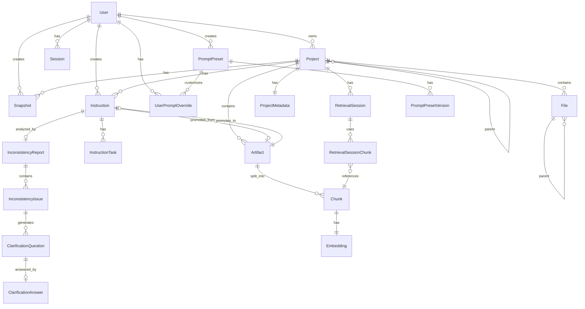
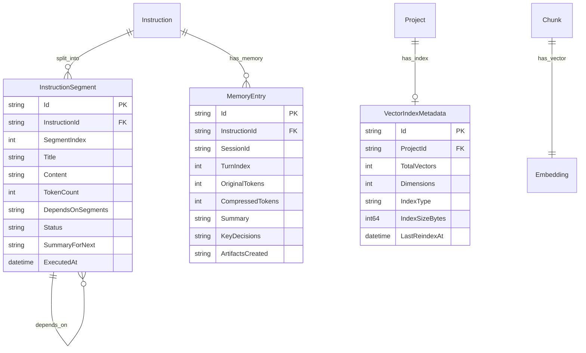

# Database Schema (ORM-Based)

**Version:** 2.0.0  
**Status:** Active  
**Updated:** 2026-03-09

---

## ORM-Only Policy

> **CRITICAL**: All database operations MUST use GORM ORM via the **DBOperation wrapper**. Raw SQL is forbidden.

This policy exists to:
- **Prevent SQL injection** vulnerabilities
- Ensure **consistent query patterns** across the codebase
- Enable **proper migration tracking** via AutoMigrate
- Maintain **type safety** through Go struct definitions
- **Automatic stack traces** on every error
- **Affected rows validation** for write operations

### Required ORM Features

| Feature | Implementation |
|---------|---------------|
| Parameterized Queries | GORM's built-in query builder |
| Migrations | `db.AutoMigrate()` |
| Transactional Writes | `db.Transaction()` |
| Relationship Mapping | GORM associations (HasMany, BelongsTo) |
| Query Building | GORM methods, never string concatenation |
| Soft Deletes | `gorm.DeletedAt` field |
| **Operation Wrapper** | `pkg/database.DBOperation` (MANDATORY) |

### DBOperation Wrapper (MANDATORY)

All database operations MUST go through the centralized wrapper. See: [pkg/database Operations](../13-shared-packages/08-pkg-database-operations.md)

### Only Exception: FTS5 Virtual Tables

Full-Text Search (FTS5) virtual tables require `db.Exec()` or `db.Raw()` as GORM doesn't natively support SQLite virtual tables. This is the ONLY acceptable use of raw SQL.

---

## Summary

SQLite database schema for the Spec Management Software using **GORM ORM models** in Go. All entities are defined as Go structs with GORM tags. The ORM handles table creation, migrations, indexes, and query building automatically.

---

## Entity Relationship Diagram



---

## Base Models

All entities inherit from common base models for consistent ID generation and timestamps.

```go
package models

import (
    "time"
    
    "github.com/google/uuid"
    "gorm.io/datatypes"
    "gorm.io/gorm"
)

// BaseModel provides common fields for all entities with soft delete
type BaseModel struct {
    Id        string         `gorm:"type:text;primaryKey"`
    CreatedAt time.Time      `gorm:"not null"`
    UpdatedAt time.Time      `gorm:"not null"`
    DeletedAt gorm.DeletedAt `gorm:"index" json:"-"`
}

// BeforeCreate generates UUID if not set
func (b *BaseModel) BeforeCreate(tx *gorm.DB) error {
    if b.Id == "" {
        b.Id = uuid.New().String()
    }
    return nil
}

// TimestampModel for entities that only need CreatedAt (no updates)
type TimestampModel struct {
    Id        string    `gorm:"type:text;primaryKey"`
    CreatedAt time.Time `gorm:"not null"`
}

func (t *TimestampModel) BeforeCreate(tx *gorm.DB) error {
    if t.Id == "" {
        t.Id = uuid.New().String()
    }
    return nil
}
```

---

## Core Tables

### User

```go
// User represents an authenticated user account
type User struct {
    BaseModel
    Username        string     `gorm:"type:text;not null;uniqueIndex:IdxUserUsername"`
    Email           string     `gorm:"type:text;not null;uniqueIndex:IdxUserEmail"`
    PasswordHash    string     `gorm:"type:text;not null" json:"-"`
    DisplayName     *string    `gorm:"type:text"`
    ThemePreference string     `gorm:"type:text;default:'light'"`
    LastLoginAt     *time.Time `gorm:"type:text"`
    
    // Relations
    Sessions        []Session           `gorm:"foreignKey:UserId;constraint:OnDelete:CASCADE" json:"-"`
    Projects        []Project           `gorm:"foreignKey:OwnerId;constraint:OnDelete:CASCADE" json:"-"`
    Snapshots       []Snapshot          `gorm:"foreignKey:CreatedById;constraint:OnDelete:SET NULL" json:"-"`
    Instructions    []Instruction       `gorm:"foreignKey:CreatedById;constraint:OnDelete:SET NULL" json:"-"`
    PromptPresets   []PromptPreset      `gorm:"foreignKey:CreatedById;constraint:OnDelete:SET NULL" json:"-"`
    PromptOverrides []UserPromptOverride `gorm:"foreignKey:UserId;constraint:OnDelete:CASCADE" json:"-"`
}

func (User) TableName() string { return "User" }
```

---

### Session

```go
// Session represents an active user session
type Session struct {
    TimestampModel
    UserId    string    `gorm:"type:text;not null;index:IdxSessionUserId"`
    Token     string    `gorm:"type:text;not null;uniqueIndex:IdxSessionToken" json:"-"`
    ExpiresAt time.Time `gorm:"type:text;not null;index:IdxSessionExpiresAt"`
    
    // Relations
    User User `gorm:"foreignKey:UserId;constraint:OnDelete:CASCADE" json:"-"`
}

func (Session) TableName() string { return "Session" }

func (s *Session) IsExpired() bool {
    return time.Now().After(s.ExpiresAt)
}
```

---

### Project

```go
// ProjectType: project_type.Variant (Category, Project)
// Visibility: visibility.Variant (User, Global)
// See: 05-enum-architecture.md

// Project represents a spec project or category
type Project struct {
    BaseModel
    ParentId    *string     `gorm:"type:text;index:IdxProjectParentId"`
    OwnerId     string      `gorm:"type:text;not null;index:IdxProjectOwnerId"`
    Name        string      `gorm:"type:text;not null"`
    Slug        string      `gorm:"type:text;not null;uniqueIndex:IdxProjectSlug"`
    Path        string      `gorm:"type:text;not null;uniqueIndex:IdxProjectPath"`
    Type        project_type.Variant `gorm:"type:text;not null;index:IdxProjectType"`
    Description *string              `gorm:"type:text"`
    SortOrder   int                  `gorm:"default:0"`
    
    // Visibility controls who can see this project
    // User = only owner, Global = all authenticated users
    Visibility  visibility.Variant   `gorm:"type:text;not null;default:'user';index:IdxProjectVisibility"`
    
    // Relations
    Parent       *Project         `gorm:"foreignKey:ParentId;constraint:OnDelete:CASCADE" json:"-"`
    Children     []Project        `gorm:"foreignKey:ParentId" json:",omitempty"`
    Owner        User             `gorm:"foreignKey:OwnerId;constraint:OnDelete:CASCADE" json:"-"`
    Files        []File           `gorm:"foreignKey:ProjectId;constraint:OnDelete:CASCADE" json:"-"`
    Snapshots    []Snapshot       `gorm:"foreignKey:ProjectId;constraint:OnDelete:CASCADE" json:"-"`
    Metadata     *ProjectMetadata `gorm:"foreignKey:ProjectId;constraint:OnDelete:CASCADE" json:",omitempty"`
    Instructions []Instruction    `gorm:"foreignKey:ProjectId;constraint:OnDelete:CASCADE" json:"-"`
}

func (Project) TableName() string { return "Project" }

// IsOwner checks if the given user owns this project
func (p *Project) IsOwner(userId string) bool {
    return p.OwnerId == userId
}

// CanView checks if the given user can view this project
func (p *Project) CanView(userId string) bool {
    return p.OwnerId == userId || p.Visibility == visibility.Global
}

// CanEdit checks if the given user can edit this project
func (p *Project) CanEdit(userId string) bool {
    // Only owner can edit, regardless of visibility
    return p.OwnerId == userId
}
```

---

### ProjectMetadata

```go
// ProjectMetadata stores extended project information
type ProjectMetadata struct {
    BaseModel
    ProjectId              string         `gorm:"type:text;not null;uniqueIndex:IdxProjectMetadataProjectId"`
    Version                string         `gorm:"type:text;default:'1.0.0'"`
    Summary                *string        `gorm:"type:text"`
    AuthorName             *string        `gorm:"type:text"`
    AuthorEmail            *string        `gorm:"type:text"`
    DesignerName           *string        `gorm:"type:text"`
    ResponsiblePersonName  *string        `gorm:"type:text"`
    ResponsiblePersonEmail *string        `gorm:"type:text"`
    Language               *string        `gorm:"type:text;index:IdxProjectMetadataLanguage"`
    Framework              *string        `gorm:"type:text;index:IdxProjectMetadataFramework"`
    Tags                   datatypes.JSON `gorm:"type:text"`
    GuidelineOverrides     datatypes.JSON `gorm:"type:text"`
    AiSettings             datatypes.JSON `gorm:"type:text"`
    CustomMetadata         datatypes.JSON `gorm:"type:text"`
    MetadataFileHash       *string        `gorm:"type:text"`
    LastSyncedAt           *time.Time     `gorm:"type:text"`
    
    // Relations
    Project Project `gorm:"foreignKey:ProjectId;constraint:OnDelete:CASCADE" json:"-"`
}

func (ProjectMetadata) TableName() string { return "ProjectMetadata" }
```

---

### File

```go
// FileType: file_type.Variant (Folder, File)
// See: 05-enum-architecture.md

// File represents a file or folder in a project
type File struct {
    BaseModel
    ProjectId   string   `gorm:"type:text;not null;index:IdxFileProjectId"`
    ParentId    *string  `gorm:"type:text;index:IdxFileParentId"`
    Name        string   `gorm:"type:text;not null"`
    Path        string   `gorm:"type:text;not null;uniqueIndex:IdxFilePath"`
    Type        file_type.Variant `gorm:"type:text;not null;index:IdxFileType"`
    ContentHash *string  `gorm:"type:text"`
    SortOrder   int      `gorm:"default:0"`
    
    // Relations
    Project  Project `gorm:"foreignKey:ProjectId;constraint:OnDelete:CASCADE" json:"-"`
    Parent   *File   `gorm:"foreignKey:ParentId;constraint:OnDelete:CASCADE" json:"-"`
    Children []File  `gorm:"foreignKey:ParentId" json:",omitempty"`
}

func (File) TableName() string { return "File" }
```

---

### Snapshot

```go
// Snapshot represents a version snapshot of a project
type Snapshot struct {
    TimestampModel
    ProjectId   string  `gorm:"type:text;not null;index:IdxSnapshotProjectId"`
    CreatedById string  `gorm:"type:text;not null;index:IdxSnapshotCreatedById"`
    Name        string  `gorm:"type:text;not null;uniqueIndex:IdxSnapshotName"`
    Description *string `gorm:"type:text"`
    FolderPath  string  `gorm:"type:text;not null"`
    
    // Relations
    Project   Project `gorm:"foreignKey:ProjectId;constraint:OnDelete:CASCADE" json:"-"`
    CreatedBy User    `gorm:"foreignKey:CreatedById;constraint:OnDelete:SET NULL" json:"-"`
}

func (Snapshot) TableName() string { return "Snapshot" }
```

---

## Configuration Tables

### Config

```go
// ConfigSource: config_source.Variant (Seed, User)
// See: 05-enum-architecture.md

// Config represents a configuration key-value pair
type Config struct {
    Key         string       `gorm:"type:text;primaryKey"`
    Value       string       `gorm:"type:text;not null"`
    Source      config_source.Variant `gorm:"type:text;not null"`
    Description *string      `gorm:"type:text"`
    UpdatedAt   time.Time    `gorm:"not null"`
}

func (Config) TableName() string { return "Config" }
```

---

### ConfigSeedEvent

```go
// SeedEventType: seed_event_type.Variant (Seed, Reseed, Reset, Update, PresetSeed)
// See: 05-enum-architecture.md

// ConfigSeedEvent records seeding and config change events
type ConfigSeedEvent struct {
    TimestampModel
    EventType    seed_event_type.Variant `gorm:"type:text;not null;index:IdxConfigSeedEventEventType"`
    IsFirstSeed  bool           `gorm:"default:false"`
    KeysSeeded   int            `gorm:"default:0"`
    KeysModified datatypes.JSON `gorm:"type:text"`
    SeedSource   *string        `gorm:"type:text"`
    UserId       *string        `gorm:"type:text"`
    EventData    datatypes.JSON `gorm:"type:text"`
    
    // Relations
    User *User `gorm:"foreignKey:UserId;constraint:OnDelete:SET NULL" json:"-"`
}

func (ConfigSeedEvent) TableName() string { return "ConfigSeedEvent" }
```

---

## LLM Model Tables

### ModelRegistry

```go
// ModelType: model_type.Variant (Reasoning, Voice)
// See: 05-enum-architecture.md

// ModelRegistry stores available AI models
type ModelRegistry struct {
    BaseModel
    DisplayName    string         `gorm:"type:text;not null"`
    FileName       string         `gorm:"type:text;not null;uniqueIndex:IdxModelRegistryFileName"`
    ModelType      model_type.Variant `gorm:"type:text;not null;index:IdxModelRegistryModelType"`
    ModelPath      string         `gorm:"type:text;not null"`
    FileSizeBytes  int64          `gorm:"not null"`
    Tags           datatypes.JSON `gorm:"type:text"`
    IsEnabled      bool           `gorm:"default:true;index:IdxModelRegistryIsEnabled"`
    ContextSize    *int           `gorm:"type:integer"`
    GpuLayers      *int           `gorm:"type:integer"`
    LastScannedAt  time.Time      `gorm:"not null"`
    
    // Relations
    ModelSlots   []ModelSlot   `gorm:"foreignKey:ModelId;constraint:OnDelete:SET NULL" json:"-"`
    Instructions []Instruction `gorm:"foreignKey:ReasoningModelId;constraint:OnDelete:SET NULL" json:"-"`
}

func (ModelRegistry) TableName() string { return "ModelRegistry" }
```

---

### ModelSlot

```go
// SlotStatus: slot_status.Variant (Idle, Loading, Active, Error, Unloading)
// See: 05-enum-architecture.md

// ModelSlot tracks active LLM model slots
type ModelSlot struct {
    BaseModel
    SlotIndex         int        `gorm:"not null;uniqueIndex:IdxModelSlotSlotIndex"`
    Port              int        `gorm:"not null;uniqueIndex:IdxModelSlotPort"`
    ModelId           *string    `gorm:"type:text;index:IdxModelSlotModelId"`
    Status            slot_status.Variant `gorm:"type:text;not null;index:IdxModelSlotStatus"`
    ProcessId         *int       `gorm:"type:integer"`
    StartedAt         *time.Time `gorm:"type:text"`
    LastAccessedAt    *time.Time `gorm:"type:text;index:IdxModelSlotLastAccessedAt"`
    LastHealthCheckAt *time.Time `gorm:"type:text"`
    ErrorMessage      *string    `gorm:"type:text"`
    
    // Relations
    Model *ModelRegistry `gorm:"foreignKey:ModelId;constraint:OnDelete:SET NULL" json:"-"`
}

func (ModelSlot) TableName() string { return "ModelSlot" }
```

---

## Prompt Preset Tables

### PromptPreset

```go
// ContentType: content_type.Variant (Idea, Feature, Task, CodingGuideline, Instruction)
// See: 05-enum-architecture.md

// PromptPreset stores base prompt templates
type PromptPreset struct {
    BaseModel
    Name           string      `gorm:"type:text;not null"`
    ContentType    content_type.Variant `gorm:"type:text;not null;index:IdxPromptPresetContentType"`
    PromptText     string      `gorm:"type:text;not null"`
    Description    *string     `gorm:"type:text"`
    SourceFilePath *string     `gorm:"type:text"`
    IsSystemPreset bool        `gorm:"default:false"`
    IsDefault      bool        `gorm:"default:false;index:IdxPromptPresetIsDefault"`
    CreatedById    *string     `gorm:"type:text"`
    
    // Relations
    CreatedBy *User                  `gorm:"foreignKey:CreatedById;constraint:OnDelete:SET NULL" json:"-"`
    Versions  []PromptPresetVersion  `gorm:"foreignKey:PresetId;constraint:OnDelete:CASCADE" json:"-"`
    Overrides []UserPromptOverride   `gorm:"foreignKey:PresetId;constraint:OnDelete:CASCADE" json:"-"`
}

func (PromptPreset) TableName() string { return "PromptPreset" }
```

---

### PromptPresetVersion

```go
// PromptPresetVersion tracks version history for presets
type PromptPresetVersion struct {
    TimestampModel
    PresetId      string  `gorm:"type:text;not null;index:IdxPromptPresetVersionPreset"`
    VersionNumber int     `gorm:"not null"`
    PromptText    string  `gorm:"type:text;not null"`
    ChangeNote    *string `gorm:"type:text"`
    CreatedById   *string `gorm:"type:text"`
    
    // Relations
    Preset    PromptPreset `gorm:"foreignKey:PresetId;constraint:OnDelete:CASCADE" json:"-"`
    CreatedBy *User        `gorm:"foreignKey:CreatedById;constraint:OnDelete:SET NULL" json:"-"`
}

func (PromptPresetVersion) TableName() string { return "PromptPresetVersion" }
```

---

### UserPromptOverride

```go
// OverrideMode: override_mode.Variant (Append, Replace)
// See: 05-enum-architecture.md

// UserPromptOverride stores user customizations on presets
type UserPromptOverride struct {
    BaseModel
    UserId           string       `gorm:"type:text;not null;index:IdxUserPromptOverrideUser"`
    PresetId         string       `gorm:"type:text;not null"`
    ProjectId        *string      `gorm:"type:text;index:IdxUserPromptOverrideProject"`
    OverrideMode     override_mode.Variant `gorm:"type:text;not null"`
    CustomPromptText string       `gorm:"type:text;not null"`
    IsActive         bool         `gorm:"default:true"`
    
    // Relations
    User    User          `gorm:"foreignKey:UserId;constraint:OnDelete:CASCADE" json:"-"`
    Preset  PromptPreset  `gorm:"foreignKey:PresetId;constraint:OnDelete:CASCADE" json:"-"`
    Project *Project      `gorm:"foreignKey:ProjectId;constraint:OnDelete:CASCADE" json:"-"`
}

func (UserPromptOverride) TableName() string { return "UserPromptOverride" }
```

---

## Instruction System Tables

### Instruction

```go
// InstructionStatus: instruction_status.Variant (Transcribed, Proofreading, Proofread, Planning, Planned, Reviewing, Ready, Executing, Completed, Failed, Cancelled)
// InstructionScope: instruction_scope.Variant (Global, Backend, Frontend, File)
// ExecutionMode: execution_mode.Variant (Automatic, Approval)
// InputType: input_type.Variant (Voice, Text)
// See: 05-enum-architecture.md

// Instruction stores voice/text instructions
type Instruction struct {
    BaseModel
    ProjectId          string            `gorm:"type:text;not null;index:IdxInstructionProjectId"`
    CreatedById        string            `gorm:"type:text;not null"`
    ContentType        *content_type.Variant        `gorm:"type:text;index:IdxInstructionContentType"`
    InputType          input_type.Variant           `gorm:"type:text;not null"`
    RawInput           string                       `gorm:"type:text;not null"`
    TranscribedText    *string                      `gorm:"type:text"`
    ProofreadText      *string                      `gorm:"type:text"`
    EnhancedText       *string                      `gorm:"type:text"`
    InstructionText    *string                      `gorm:"type:text"`
    Scope              instruction_scope.Variant    `gorm:"type:text;not null"`
    TargetFilePath     *string                      `gorm:"type:text"`
    Status             instruction_status.Variant   `gorm:"type:text;not null;index:IdxInstructionStatus"`
    ExecutionMode      execution_mode.Variant       `gorm:"type:text;not null"`
    PresetId           *string           `gorm:"type:text"`
    OverrideId         *string           `gorm:"type:text"`
    CustomPromptLayer  *string           `gorm:"type:text"`
    FinalPrompt        *string           `gorm:"type:text"`
    ApprovedAt         *time.Time        `gorm:"type:text"`
    ApprovedById       *string           `gorm:"type:text"`
    ReasoningModelId   *string           `gorm:"type:text"`
    PlanningTokensUsed *int              `gorm:"type:integer"`
    PlanningDurationMs *int              `gorm:"type:integer"`
    PlanMarkdown       *string           `gorm:"type:text"`
    PlanJson           datatypes.JSON    `gorm:"type:text"`
    CompletedAt        *time.Time        `gorm:"type:text"`
    ErrorMessage       *string           `gorm:"type:text"`
    RegeneratedFromId  *string           `gorm:"type:text"`
    
    // Relations
    Project           Project              `gorm:"foreignKey:ProjectId;constraint:OnDelete:CASCADE" json:"-"`
    CreatedBy         User                 `gorm:"foreignKey:CreatedById;constraint:OnDelete:SET NULL" json:"-"`
    ApprovedBy        *User                `gorm:"foreignKey:ApprovedById;constraint:OnDelete:SET NULL" json:"-"`
    ReasoningModel    *ModelRegistry       `gorm:"foreignKey:ReasoningModelId;constraint:OnDelete:SET NULL" json:"-"`
    Preset            *PromptPreset        `gorm:"foreignKey:PresetId;constraint:OnDelete:SET NULL" json:"-"`
    Override          *UserPromptOverride  `gorm:"foreignKey:OverrideId;constraint:OnDelete:SET NULL" json:"-"`
    RegeneratedFrom   *Instruction         `gorm:"foreignKey:RegeneratedFromId;constraint:OnDelete:SET NULL" json:"-"`
    Tasks             []InstructionTask    `gorm:"foreignKey:InstructionId;constraint:OnDelete:CASCADE" json:"-"`
    Report            *InconsistencyReport `gorm:"foreignKey:InstructionId;constraint:OnDelete:CASCADE" json:"-"`
}

func (Instruction) TableName() string { return "Instruction" }
```

---

### InstructionTask

```go
// TaskType: task_type.Variant (Create, Update, Delete, Refactor, Review, Verify)
// TaskStatus: task_status.Variant (Pending, InProgress, Completed, Failed, Skipped)
// See: 05-enum-architecture.md

// InstructionTask stores individual tasks from instruction planning
type InstructionTask struct {
    BaseModel
    InstructionId  string         `gorm:"type:text;not null;index:IdxInstructionTaskInstructionId"`
    ParentTaskId   *string        `gorm:"type:text;index:IdxInstructionTaskParentTaskId"`
    Title          string         `gorm:"type:text;not null"`
    Description    *string        `gorm:"type:text"`
    TaskType       task_type.Variant   `gorm:"type:text;not null"`
    TargetFilePath *string             `gorm:"type:text"`
    TargetSection  *string             `gorm:"type:text"`
    SortOrder      int                 `gorm:"default:0"`
    Status         task_status.Variant `gorm:"type:text;not null;index:IdxInstructionTaskStatus"`
    ResultMarkdown *string        `gorm:"type:text"`
    ResultJson     datatypes.JSON `gorm:"type:text"`
    ErrorMessage   *string        `gorm:"type:text"`
    StartedAt      *time.Time     `gorm:"type:text"`
    CompletedAt    *time.Time     `gorm:"type:text"`
    
    // Relations
    Instruction Instruction       `gorm:"foreignKey:InstructionId;constraint:OnDelete:CASCADE" json:"-"`
    ParentTask  *InstructionTask  `gorm:"foreignKey:ParentTaskId;constraint:OnDelete:CASCADE" json:"-"`
    SubTasks    []InstructionTask `gorm:"foreignKey:ParentTaskId" json:",omitempty"`
    FileChanges []FileChange      `gorm:"foreignKey:InstructionTaskId;constraint:OnDelete:CASCADE" json:"-"`
}

func (InstructionTask) TableName() string { return "InstructionTask" }
```

---

### FileChange

```go
// ChangeType: change_type.Variant (Created, Updated, Deleted, Renamed)
// See: 05-enum-architecture.md

// FileChange tracks individual file changes made by tasks
type FileChange struct {
    TimestampModel
    InstructionTaskId string     `gorm:"type:text;not null;index:IdxFileChangeInstructionTaskId"`
    FileId            *string    `gorm:"type:text;index:IdxFileChangeFileId"`
    FilePath          string     `gorm:"type:text;not null;index:IdxFileChangeFilePath"`
    ChangeType        change_type.Variant `gorm:"type:text;not null"`
    BeforeHash        *string    `gorm:"type:text"`
    AfterHash         *string    `gorm:"type:text"`
    DiffContent       *string    `gorm:"type:text"`
    BeforeSnapshot    *string    `gorm:"type:text"`
    AfterSnapshot     *string    `gorm:"type:text"`
    BytesBefore       int        `gorm:"default:0"`
    BytesAfter        int        `gorm:"default:0"`
    
    // Relations
    InstructionTask InstructionTask `gorm:"foreignKey:InstructionTaskId;constraint:OnDelete:CASCADE" json:"-"`
    File            *File           `gorm:"foreignKey:FileId;constraint:OnDelete:SET NULL" json:"-"`
}

func (FileChange) TableName() string { return "FileChange" }
```

---

## Inconsistency Detection Tables

### InconsistencyReport

```go
// ReportStatus: report_status.Variant (Pending, Open, Resolved, Ignored)
// See: 05-enum-architecture.md

// InconsistencyReport stores analysis results
type InconsistencyReport struct {
    BaseModel
    InstructionId   string         `gorm:"type:text;not null;uniqueIndex:IdxInconsistencyReportInstruction"`
    TotalIssues     int            `gorm:"default:0"`
    PhaseACritical  int            `gorm:"default:0"`
    PhaseBConflict  int            `gorm:"default:0"`
    PhaseCAmbiguous int            `gorm:"default:0"`
    PhaseDOptional  int            `gorm:"default:0"`
    AnalysisOutput  datatypes.JSON `gorm:"type:text"`
    Status          report_status.Variant `gorm:"type:text;not null;index:IdxInconsistencyReportStatus"`
    ResolvedAt      *time.Time     `gorm:"type:text"`
    
    // Relations
    Instruction Instruction           `gorm:"foreignKey:InstructionId;constraint:OnDelete:CASCADE" json:"-"`
    Issues      []InconsistencyIssue  `gorm:"foreignKey:ReportId;constraint:OnDelete:CASCADE" json:"-"`
}

func (InconsistencyReport) TableName() string { return "InconsistencyReport" }
```

---

### InconsistencyIssue

```go
// IssuePhase: issue_phase.Variant (A, B, C, D)
// IssueCategory: issue_category.Variant (MissingData, Conflict, Ambiguity, Enhancement)
// IssueSeverity: issue_severity.Variant (Critical, High, Medium, Low)
// IssueStatus: issue_status.Variant (Open, Resolved, Ignored)
// See: 05-enum-architecture.md

// InconsistencyIssue stores individual issues
type InconsistencyIssue struct {
    BaseModel
    ReportId    string        `gorm:"type:text;not null;index:IdxInconsistencyIssueReport"`
    Phase       issue_phase.Variant    `gorm:"type:text;not null;index:IdxInconsistencyIssuePhase"`
    Category    issue_category.Variant `gorm:"type:text;not null"`
    Title       string                 `gorm:"type:text;not null"`
    Description string                 `gorm:"type:text;not null"`
    Location    *string                `gorm:"type:text"`
    Severity    issue_severity.Variant `gorm:"type:text;not null"`
    Status      issue_status.Variant   `gorm:"type:text;not null;default:'open';index:IdxInconsistencyIssueStatus"`
    ResolvedAt  *time.Time    `gorm:"type:text"`
    
    // Relations
    Report    InconsistencyReport     `gorm:"foreignKey:ReportId;constraint:OnDelete:CASCADE" json:"-"`
    Questions []ClarificationQuestion `gorm:"foreignKey:IssueId;constraint:OnDelete:CASCADE" json:"-"`
}

func (InconsistencyIssue) TableName() string { return "InconsistencyIssue" }
```

---

### ClarificationQuestion

```go
// AnswerType: answer_type.Variant (Radio, Checkbox, Text, Dropdown, MultiSelect)
// See: 05-enum-architecture.md

// ClarificationQuestion stores questions generated from issues
type ClarificationQuestion struct {
    TimestampModel
    IssueId           string         `gorm:"type:text;not null;index:IdxClarificationQuestionIssue"`
    ReportId          string         `gorm:"type:text;not null;index:IdxClarificationQuestionReport"`
    Phase             issue_phase.Variant  `gorm:"type:text;not null"`
    QuestionText      string               `gorm:"type:text;not null"`
    WhyItMatters      string               `gorm:"type:text;not null"`
    RecommendedAnswer *string              `gorm:"type:text"`
    AnswerType        answer_type.Variant  `gorm:"type:text;not null"`
    AnswerOptions     datatypes.JSON `gorm:"type:text"`
    IsRequired        bool           `gorm:"default:true"`
    DisplayOrder      int            `gorm:"not null"`
    
    // Relations
    Issue  InconsistencyIssue     `gorm:"foreignKey:IssueId;constraint:OnDelete:CASCADE" json:"-"`
    Report InconsistencyReport    `gorm:"foreignKey:ReportId;constraint:OnDelete:CASCADE" json:"-"`
    Answer *ClarificationAnswer   `gorm:"foreignKey:QuestionId;constraint:OnDelete:CASCADE" json:",omitempty"`
}

func (ClarificationQuestion) TableName() string { return "ClarificationQuestion" }
```

---

### ClarificationAnswer

```go
// ClarificationAnswer stores user responses to questions
type ClarificationAnswer struct {
    TimestampModel
    QuestionId  string         `gorm:"type:text;not null;uniqueIndex:IdxClarificationAnswerQuestion"`
    UserId      string         `gorm:"type:text;not null;index:IdxClarificationAnswerUser"`
    AnswerValue datatypes.JSON `gorm:"type:text;not null"`
    AnswerText  *string        `gorm:"type:text"`
    WasSkipped  bool           `gorm:"default:false"`
    
    // Relations
    Question ClarificationQuestion `gorm:"foreignKey:QuestionId;constraint:OnDelete:CASCADE" json:"-"`
    User     User                  `gorm:"foreignKey:UserId;constraint:OnDelete:SET NULL" json:"-"`
}

func (ClarificationAnswer) TableName() string { return "ClarificationAnswer" }
```

---

### RegenerationEvent

```go
// TriggerType: trigger_type.Variant (Manual, Automatic)
// See: 05-enum-architecture.md

// RegenerationEvent tracks regeneration after answers
type RegenerationEvent struct {
    TimestampModel
    OriginalInstructionId string         `gorm:"type:text;not null;index:IdxRegenerationEventOriginal"`
    NewInstructionId      string         `gorm:"type:text;not null;index:IdxRegenerationEventNew"`
    ReportId              string         `gorm:"type:text;not null"`
    AnswerCount           int            `gorm:"not null"`
    TriggerType           trigger_type.Variant `gorm:"type:text;not null"`
    AdditionalContext     *string        `gorm:"type:text"`
    CreatedById           *string        `gorm:"type:text"`
    
    // Relations
    OriginalInstruction Instruction         `gorm:"foreignKey:OriginalInstructionId;constraint:OnDelete:CASCADE" json:"-"`
    NewInstruction      Instruction         `gorm:"foreignKey:NewInstructionId;constraint:OnDelete:CASCADE" json:"-"`
    Report              InconsistencyReport `gorm:"foreignKey:ReportId;constraint:OnDelete:CASCADE" json:"-"`
    CreatedBy           *User               `gorm:"foreignKey:CreatedById;constraint:OnDelete:SET NULL" json:"-"`
}

func (RegenerationEvent) TableName() string { return "RegenerationEvent" }
```

---

## RAG (Retrieval-Augmented Generation) Tables

### Artifact

```go
// ArtifactType: artifact_type.Variant (Idea, Instruction)
// ArtifactStatus: artifact_status.Variant (Draft, Active, Promoted, Archived)
// See: 05-enum-architecture.md

// Artifact represents an idea or instruction file in the RAG system
type Artifact struct {
    BaseModel
    ProjectId        string         `gorm:"type:text;not null;index:IdxArtifactProjectId"`
    ArtifactType     artifact_type.Variant   `gorm:"type:text;not null;index:IdxArtifactType"`
    Status           artifact_status.Variant `gorm:"type:text;not null;index:IdxArtifactStatus"`
    SequenceNumber   int            `gorm:"not null"`
    Slug             string         `gorm:"type:text;not null"`
    Title            string         `gorm:"type:text;not null"`
    RelativePath     string         `gorm:"type:text;not null;uniqueIndex:IdxArtifactPath"`
    ContentHash      string         `gorm:"type:text;not null"`
    WordCount        int            `gorm:"default:0"`
    ChunkCount       int            `gorm:"default:0"`
    IsPinned         bool           `gorm:"default:false;index:IdxArtifactIsPinned"`
    PinnedOrder      *int           `gorm:"type:integer"`
    SourceIdeaId     *string        `gorm:"type:text;index:IdxArtifactSourceIdea"`
    PromotedToId     *string        `gorm:"type:text;index:IdxArtifactPromotedTo"`
    InstructionId    *string        `gorm:"type:text;index:IdxArtifactInstruction"`
    LastIndexedAt    *time.Time     `gorm:"type:text"`
    IndexVersion     int            `gorm:"default:1"`
    
    // Relations
    Project     Project      `gorm:"foreignKey:ProjectId;constraint:OnDelete:CASCADE" json:"-"`
    SourceIdea  *Artifact    `gorm:"foreignKey:SourceIdeaId;constraint:OnDelete:SET NULL" json:"-"`
    PromotedTo  *Artifact    `gorm:"foreignKey:PromotedToId;constraint:OnDelete:SET NULL" json:"-"`
    Instruction *Instruction `gorm:"foreignKey:InstructionId;constraint:OnDelete:SET NULL" json:"-"`
    Chunks      []Chunk      `gorm:"foreignKey:ArtifactId;constraint:OnDelete:CASCADE" json:"-"`
}

func (Artifact) TableName() string { return "Artifact" }
```

---

### Chunk

```go
// ChunkType: chunk_type.Variant (Header, Paragraph, Code, List, Table)
// See: 05-enum-architecture.md

// Chunk represents a content segment from an artifact
type Chunk struct {
    BaseModel
    ArtifactId     string    `gorm:"type:text;not null;index:IdxChunkArtifactId"`
    ChunkIndex     int       `gorm:"not null"`
    StableId       string    `gorm:"type:text;not null;uniqueIndex:IdxChunkStableId"`
    ChunkType      chunk_type.Variant `gorm:"type:text;not null"`
    HeadingPath    *string   `gorm:"type:text"`
    HeadingLevel   *int      `gorm:"type:integer"`
    Content        string    `gorm:"type:text;not null"`
    ContentHash    string    `gorm:"type:text;not null"`
    TokenCount     int       `gorm:"default:0"`
    CharCount      int       `gorm:"default:0"`
    StartLine      int       `gorm:"not null"`
    EndLine        int       `gorm:"not null"`
    SectionAnchor  *string   `gorm:"type:text"`
    
    // Relations
    Artifact  Artifact   `gorm:"foreignKey:ArtifactId;constraint:OnDelete:CASCADE" json:"-"`
    Embedding *Embedding `gorm:"foreignKey:ChunkId;constraint:OnDelete:CASCADE" json:",omitempty"`
}

func (Chunk) TableName() string { return "Chunk" }
```

---

### Embedding

```go
// Embedding stores vector embeddings for chunks
type Embedding struct {
    TimestampModel
    ChunkId         string  `gorm:"type:text;not null;uniqueIndex:IdxEmbeddingChunkId"`
    ModelName       string  `gorm:"type:text;not null;index:IdxEmbeddingModel"`
    ModelVersion    string  `gorm:"type:text;not null"`
    Dimensions      int     `gorm:"not null"`
    EmbeddingVector []byte  `gorm:"type:blob;not null" json:"-"`
    Magnitude       float64 `gorm:"not null"`
    
    // Relations
    Chunk Chunk `gorm:"foreignKey:ChunkId;constraint:OnDelete:CASCADE" json:"-"`
}

func (Embedding) TableName() string { return "Embedding" }

// GetVector deserializes the embedding vector from bytes
func (e *Embedding) GetVector() appfault.Result[[]float32] {
    if len(e.EmbeddingVector) == 0 {
        return nil, nil
    }
    vector := make([]float32, e.Dimensions)
    buf := bytes.NewReader(e.EmbeddingVector)
    for i := range vector {
        if err := binary.Read(buf, binary.LittleEndian, &vector[i]); err != nil {
            return nil, err
        }
    }
    return vector, nil
}

// SetVector serializes the embedding vector to bytes
func (e *Embedding) SetVector(vector []float32) error {
    e.Dimensions = len(vector)
    buf := new(bytes.Buffer)
    for _, v := range vector {
        if err := binary.Write(buf, binary.LittleEndian, v); err != nil {
            return err
        }
    }
    e.EmbeddingVector = buf.Bytes()
    
    // Calculate magnitude for normalization
    var sum float64
    for _, v := range vector {
        sum += float64(v * v)
    }
    e.Magnitude = math.Sqrt(sum)
    return nil
}
```

---

### RetrievalSession

```go
// RetrievalSession tracks a RAG retrieval operation
type RetrievalSession struct {
    TimestampModel
    ProjectId        string         `gorm:"type:text;not null;index:IdxRetrievalSessionProject"`
    UserId           *string        `gorm:"type:text;index:IdxRetrievalSessionUser"`
    QueryText        string         `gorm:"type:text;not null"`
    QueryHash        string         `gorm:"type:text;not null;index:IdxRetrievalSessionQueryHash"`
    TopK             int            `gorm:"not null"`
    SemanticWeight   float64        `gorm:"default:0.7"`
    KeywordWeight    float64        `gorm:"default:0.3"`
    TotalChunksFound int            `gorm:"default:0"`
    PinnedIncluded   int            `gorm:"default:0"`
    DurationMs       int            `gorm:"default:0"`
    CacheHit         bool           `gorm:"default:false"`
    ResultContext    datatypes.JSON `gorm:"type:text"`
    
    // Relations
    Project       Project                  `gorm:"foreignKey:ProjectId;constraint:OnDelete:CASCADE" json:"-"`
    User          *User                    `gorm:"foreignKey:UserId;constraint:OnDelete:SET NULL" json:"-"`
    SessionChunks []RetrievalSessionChunk  `gorm:"foreignKey:SessionId;constraint:OnDelete:CASCADE" json:"-"`
}

func (RetrievalSession) TableName() string { return "RetrievalSession" }
```

---

### RetrievalSessionChunk

```go
// MatchSource: match_source.Variant (Semantic, Keyword, Pinned, Recent)
// See: 05-enum-architecture.md

// RetrievalSessionChunk links retrieved chunks to sessions
type RetrievalSessionChunk struct {
    TimestampModel
    SessionId       string      `gorm:"type:text;not null;index:IdxRetrievalSessionChunkSession"`
    ChunkId         string      `gorm:"type:text;not null;index:IdxRetrievalSessionChunkChunk"`
    Rank            int         `gorm:"not null"`
    SemanticScore   float64     `gorm:"default:0"`
    KeywordScore    float64     `gorm:"default:0"`
    CombinedScore   float64     `gorm:"default:0;index:IdxRetrievalSessionChunkScore"`
    MatchSource     match_source.Variant `gorm:"type:text;not null"`
    WasUsedInPrompt bool        `gorm:"default:false"`
    
    // Relations
    Session RetrievalSession `gorm:"foreignKey:SessionId;constraint:OnDelete:CASCADE" json:"-"`
    Chunk   Chunk            `gorm:"foreignKey:ChunkId;constraint:OnDelete:CASCADE" json:"-"`
}

func (RetrievalSessionChunk) TableName() string { return "RetrievalSessionChunk" }
```

---

### PromotionEvent

```go
// PromotionEventStatus: promotion_event_status.Variant (Pending, Completed, Failed)
// See: 05-enum-architecture.md

// PromotionEvent tracks idea-to-instruction promotions
type PromotionEvent struct {
    BaseModel
    ProjectId          string               `gorm:"type:text;not null;index:IdxPromotionEventProject"`
    SourceArtifactId   string               `gorm:"type:text;not null;index:IdxPromotionEventSource"`
    TargetArtifactId   *string              `gorm:"type:text;index:IdxPromotionEventTarget"`
    TargetInstructionId *string             `gorm:"type:text;index:IdxPromotionEventInstruction"`
    Status             promotion_event_status.Variant `gorm:"type:text;not null;default:'pending';index:IdxPromotionEventStatus"`
    PromotedById       *string              `gorm:"type:text;index:IdxPromotionEventUser"`
    SourcePath         string               `gorm:"type:text;not null"`
    TargetPath         *string              `gorm:"type:text"`
    PromotedAt         *time.Time           `gorm:"type:text"`
    ReindexTriggered   bool                 `gorm:"default:false"`
    ReindexCompletedAt *time.Time           `gorm:"type:text"`
    ErrorMessage       *string              `gorm:"type:text"`
    
    // Relations
    Project           Project      `gorm:"foreignKey:ProjectId;constraint:OnDelete:CASCADE" json:"-"`
    SourceArtifact    Artifact     `gorm:"foreignKey:SourceArtifactId;constraint:OnDelete:CASCADE" json:"-"`
    TargetArtifact    *Artifact    `gorm:"foreignKey:TargetArtifactId;constraint:OnDelete:SET NULL" json:"-"`
    TargetInstruction *Instruction `gorm:"foreignKey:TargetInstructionId;constraint:OnDelete:SET NULL" json:"-"`
    PromotedBy        *User        `gorm:"foreignKey:PromotedById;constraint:OnDelete:SET NULL" json:"-"`
}

func (PromotionEvent) TableName() string { return "PromotionEvent" }
```

---

## Consistency Checker Tables

### ConsistencyLoop

```go
// LoopStopReason: loop_stop_reason.Variant (TargetReached, MaxIterations, Stalled, ManualStop, Error)
// See: 05-enum-architecture.md

// ConsistencyLoop tracks iterative consistency check executions
type ConsistencyLoop struct {
    BaseModel
    ProjectId         string         `gorm:"type:text;not null;index:IdxConsistencyLoopProject"`
    InitialScore      int            `gorm:"not null"`
    TargetScore       int            `gorm:"not null;default:99"`
    FinalScore        int            `gorm:"default:0"`
    TargetReached     bool           `gorm:"default:false;index:IdxConsistencyLoopTargetReached"`
    TotalIterations   int            `gorm:"default:0"`
    TotalFixesApplied int            `gorm:"default:0"`
    StopReason        loop_stop_reason.Variant `gorm:"type:text"`
    Config            datatypes.JSON `gorm:"type:text"`
    StartedAt         time.Time      `gorm:"not null"`
    CompletedAt       *time.Time     `gorm:"type:text"`
    
    // Relations
    Project    Project                    `gorm:"foreignKey:ProjectId;constraint:OnDelete:CASCADE" json:"-"`
    Iterations []ConsistencyLoopIteration `gorm:"foreignKey:LoopId;constraint:OnDelete:CASCADE" json:"-"`
}

func (ConsistencyLoop) TableName() string { return "ConsistencyLoop" }
```

---

### ConsistencyLoopIteration

```go
// ConsistencyLoopIteration tracks each iteration in a loop
type ConsistencyLoopIteration struct {
    BaseModel
    LoopId         string         `gorm:"type:text;not null;index:IdxConsistencyLoopIterationLoop"`
    Iteration      int            `gorm:"not null"`
    Score          int            `gorm:"not null"`
    ScoreDelta     int            `gorm:"default:0"`
    FindingsCount  int            `gorm:"default:0"`
    FixesGenerated int            `gorm:"default:0"`
    FixesApplied   int            `gorm:"default:0"`
    DurationMs     int            `gorm:"default:0"`
    ReportJson     datatypes.JSON `gorm:"type:text"`
    
    // Relations
    Loop ConsistencyLoop `gorm:"foreignKey:LoopId;constraint:OnDelete:CASCADE" json:"-"`
}

func (ConsistencyLoopIteration) TableName() string { return "ConsistencyLoopIteration" }
```

---

## Database Initialization

### Auto-Migration

```go
package database

import (
    "gorm.io/driver/sqlite"
    "gorm.io/gorm"
    "gorm.io/gorm/logger"
)

// Migratable is implemented by all GORM model structs eligible for auto-migration.
type Migratable interface{}

// AllModels returns all models for auto-migration
func AllModels() []Migratable {
    return []Migratable{
        // Core
        &User{},
        &Session{},
        &Project{},
        &ProjectMetadata{},
        &File{},
        &Snapshot{},
        
        // Configuration
        &Config{},
        &ConfigSeedEvent{},
        
        // LLM Models
        &ModelRegistry{},
        &ModelSlot{},
        
        // Prompt Presets
        &PromptPreset{},
        &PromptPresetVersion{},
        &UserPromptOverride{},
        
        // Instructions
        &Instruction{},
        &InstructionTask{},
        &FileChange{},
        
        // Inconsistency Detection
        &InconsistencyReport{},
        &InconsistencyIssue{},
        &ClarificationQuestion{},
        &ClarificationAnswer{},
        &RegenerationEvent{},
        
        // RAG System
        &Artifact{},
        &Chunk{},
        &Embedding{},
        &RetrievalSession{},
        &RetrievalSessionChunk{},
        &PromotionEvent{},
        
        // Vector Search (Phase 1)
        &VectorIndexMetadata{},
        
        // Context Management (Phase 2-4)
        &InstructionSegment{},
        &MemoryEntry{},
        
        // Consistency Checker
        &ConsistencyLoop{},
        &ConsistencyLoopIteration{},
    }
}

// InitDatabase initializes the database with auto-migration
func InitDatabase(dbPath string) appfault.Result[*gorm.DB] {
    db, err := gorm.Open(sqlite.Open(dbPath), &gorm.Config{
        Logger: logger.Default.LogMode(logger.Info),
    })
    if err != nil {
        return nil, err
    }
    
    // Auto-migrate all models
    if err := db.AutoMigrate(AllModels()...); err != nil {
        return nil, err
    }
    
    return db, nil
}
```

---

## Query Patterns (GORM)

### Get Project Tree

```go
func (r *ProjectRepository) GetProjectTree(context stdctx.Context) appfault.Result[[]Project] {
    var projects []Project
    err := r.db.WithContext(context).
        Preload("Children").
        Where("parent_id IS NULL").
        Order("sort_order, name").
        Find(&projects).Error
    return projects, err
}
```

### Get File Tree for Project

```go
func (r *FileRepository) GetFileTree(context stdctx.Context, projectId string) appfault.Result[[]File] {
    var files []File
    err := r.db.WithContext(context).
        Preload("Children").
        Where("project_id = ? AND parent_id IS NULL", projectId).
        Order("type DESC, sort_order, name").
        Find(&files).Error
    return files, err
}
```

### Get Questions with Answers

```go
func (r *QuestionRepository) GetQuestionsWithAnswers(context stdctx.Context, reportId string) appfault.Result[[]ClarificationQuestion] {
    var questions []ClarificationQuestion
    err := r.db.WithContext(context).
        Preload("Answer").
        Where("report_id = ?", reportId).
        Order("phase, display_order").
        Find(&questions).Error
    return questions, err
}
```

---

### RAG Query Patterns

```go
// GetActiveArtifacts retrieves active artifacts for a project
func (r *ArtifactRepository) GetActiveArtifacts(context stdctx.Context, projectId string, artifactType artifact_type.Variant) appfault.Result[[]Artifact] {
    var artifacts []Artifact
    err := r.db.WithContext(context).
        Where("project_id = ? AND artifact_type = ? AND status = ?", projectId, artifactType, artifact_status.Active).
        Order("sequence_number DESC").
        Find(&artifacts).Error
    return artifacts, err
}

// GetPinnedArtifactsWithChunks retrieves pinned artifacts with their chunks for top-K memory
func (r *ArtifactRepository) GetPinnedArtifactsWithChunks(context stdctx.Context, projectId string, limit int) appfault.Result[[]Artifact] {
    var artifacts []Artifact
    err := r.db.WithContext(context).
        Preload("Chunks", func(db *gorm.DB) *gorm.DB {
            return db.Order("chunk_index ASC")
        }).
        Where("project_id = ? AND is_pinned = true AND status = ?", projectId, artifact_status.Active).
        Order("pinned_order ASC").
        Limit(limit).
        Find(&artifacts).Error
    return artifacts, err
}

// GetChunksWithEmbeddings retrieves chunks with their embeddings for similarity search
func (r *ChunkRepository) GetChunksWithEmbeddings(context stdctx.Context, artifactIds []string) appfault.Result[[]Chunk] {
    var chunks []Chunk
    err := r.db.WithContext(context).
        Preload("Embedding").
        Where("artifact_id IN ?", artifactIds).
        Order("artifact_id, chunk_index").
        Find(&chunks).Error
    return chunks, err
}

// FindSimilarChunks performs vector similarity search (requires application-level calculation)
func (r *ChunkRepository) FindSimilarChunks(context stdctx.Context, projectId string, limit int) appfault.Result[[]Chunk] {
    var chunks []Chunk
    err := r.db.WithContext(context).
        Preload("Embedding").
        Preload("Artifact").
        Joins("JOIN Artifact ON Artifact.id = Chunk.artifact_id").
        Where("Artifact.project_id = ? AND Artifact.status = ?", projectId, artifact_status.Active).
        Find(&chunks).Error
    // Note: Actual similarity calculation must be done in application code
    // as SQLite doesn't natively support vector operations
    return chunks, err
}

// GetRecentRetrievalSessions for cache checking
func (r *RetrievalSessionRepository) GetRecentByQueryHash(context stdctx.Context, projectId, queryHash string, maxAge time.Duration) appfault.Result[RetrievalSession] {
    var session RetrievalSession
    cutoff := time.Now().Add(-maxAge)
    err := r.db.WithContext(context).
        Preload("SessionChunks", func(db *gorm.DB) *gorm.DB {
            return db.Order("rank ASC")
        }).
        Where("project_id = ? AND query_hash = ? AND created_at > ?", projectId, queryHash, cutoff).
        Order("created_at DESC").
        First(&session).Error
    if err == gorm.ErrRecordNotFound {
        return nil, nil
    }
    return &session, err
}
```

---

## Vector Search Tables

### VectorIndexMetadata

```go
// VectorIndexMetadata tracks vector index state per project
type VectorIndexMetadata struct {
    Id             string     `gorm:"type:text;primaryKey"`
    ProjectId      string     `gorm:"type:text;not null;uniqueIndex:IdxVectorIndexMetadataProject"`
    TotalVectors   int        `gorm:"default:0"`
    Dimensions     int        `gorm:"not null"`
    IndexType      index_type.Variant `gorm:"type:text;not null"` // See: 05-enum-architecture.md
    IndexSizeBytes int64      `gorm:"default:0"`
    LastReindexAt  *time.Time `gorm:"type:text"`
    CreatedAt      time.Time  `gorm:"not null"`
    UpdatedAt      time.Time  `gorm:"not null"`
    
    // Relations
    Project Project `gorm:"foreignKey:ProjectId;constraint:OnDelete:CASCADE" json:"-"`
}

func (VectorIndexMetadata) TableName() string { return "VectorIndexMetadata" }
```

---

### InstructionSegment

```go
// SegmentStatus: segment_status.Variant (Pending, Executing, Completed, Failed, Skipped)
// See: 05-enum-architecture.md

// InstructionSegment stores a segment of a large instruction for multi-turn execution
type InstructionSegment struct {
    BaseModel
    InstructionId     string        `gorm:"type:text;not null;index:IdxInstructionSegmentInstruction"`
    SegmentIndex      int           `gorm:"not null"`
    Title             string        `gorm:"type:text;not null"`
    Content           string        `gorm:"type:text;not null"`
    TokenCount        int           `gorm:"not null"`
    DependsOnSegments string        `gorm:"type:text"` // JSON array of segment IDs
    Status            segment_status.Variant `gorm:"type:text;not null;default:'pending';index:IdxInstructionSegmentStatus"`
    SummaryForNext    *string       `gorm:"type:text"` // Compressed output for next segment
    ErrorMessage      *string       `gorm:"type:text"`
    ExecutedAt        *time.Time    `gorm:"type:text"`
    ExecutionDurationMs *int        `gorm:"type:integer"`
    
    // Relations
    Instruction Instruction `gorm:"foreignKey:InstructionId;constraint:OnDelete:CASCADE" json:"-"`
}

func (InstructionSegment) TableName() string { return "InstructionSegment" }

// GetDependencies parses the DependsOnSegments JSON array
func (s *InstructionSegment) GetDependencies() appfault.Result[[]string] {
    if s.DependsOnSegments == "" {
        return []string{}, nil
    }
    var deps []string
    err := json.Unmarshal([]byte(s.DependsOnSegments), &deps)
    return deps, err
}

// SetDependencies serializes dependencies to JSON
func (s *InstructionSegment) SetDependencies(deps []string) error {
    data, err := json.Marshal(deps)
    if err != nil {
        return err
    }
    s.DependsOnSegments = string(data)
    return nil
}
```

---

### MemoryEntry

```go
// MemoryEntry stores compressed context for multi-turn instruction execution
type MemoryEntry struct {
    BaseModel
    InstructionId    string `gorm:"type:text;not null;index:IdxMemoryEntryInstruction"`
    SessionId        string `gorm:"type:text;not null;index:IdxMemoryEntrySession"`
    TurnIndex        int    `gorm:"not null"`
    OriginalTokens   int    `gorm:"not null"`
    CompressedTokens int    `gorm:"not null"`
    Summary          string `gorm:"type:text;not null"`
    KeyDecisions     string `gorm:"type:text"`     // JSON array
    ArtifactsCreated string `gorm:"type:text"` // JSON array of file paths
    OpenQuestions    string `gorm:"type:text"`    // JSON array of pending questions
    
    // Relations
    Instruction Instruction `gorm:"foreignKey:InstructionId;constraint:OnDelete:CASCADE" json:"-"`
}

func (MemoryEntry) TableName() string { return "MemoryEntry" }

// GetKeyDecisions parses the KeyDecisions JSON array
func (m *MemoryEntry) GetKeyDecisions() appfault.Result[[]string] {
    if m.KeyDecisions == "" {
        return []string{}, nil
    }
    var decisions []string
    err := json.Unmarshal([]byte(m.KeyDecisions), &decisions)
    return decisions, err
}

// GetArtifactsCreated parses the ArtifactsCreated JSON array
func (m *MemoryEntry) GetArtifactsCreated() appfault.Result[[]string] {
    if m.ArtifactsCreated == "" {
        return []string{}, nil
    }
    var artifacts []string
    err := json.Unmarshal([]byte(m.ArtifactsCreated), &artifacts)
    return artifacts, err
}

// CompressionRatio returns the compression efficiency
func (m *MemoryEntry) CompressionRatio() float64 {
    if m.OriginalTokens == 0 {
        return 0
    }
    return 1.0 - (float64(m.CompressedTokens) / float64(m.OriginalTokens))
}
```

---

## Updated ER Diagram (Vector Search)



---

## Related Specs

### Database Design Documents
- [Overview](./00-overview.md) — Database design index
- [Migrations](./02-migrations.md) — Migration patterns
- [Relationships](./04-relationships.md) — FK constraints and indexes
- [Conventions](./06-conventions.md) — Naming standards
- [Enum Architecture](./07-enum-architecture.md) — Type-safe enum definitions
- [ERD](./08-diagrams/01-erd.md) — Entity relationship diagram

### Feature Specifications
- [AI Integration](../05-features/06-ai-integration/01-ai-integration.md) — LLM model management
- [Presets & Guidelines](../05-features/06-ai-integration/02-presets-guidelines.md) — Prompt preset system
- [Instruction System](../05-features/06-ai-integration/03-instruction-system.md) — Instruction pipeline
- [RAG System](../05-features/09-knowledge-memory/01-rag-system.md) — Retrieval-Augmented Generation
- [Vector Database Plan](../05-features/09-knowledge-memory/04-vector-database-plan.md) — Vector search architecture
- [Consistency Checker](../05-features/08-consistency-checker/00-overview.md) — Spec validation
