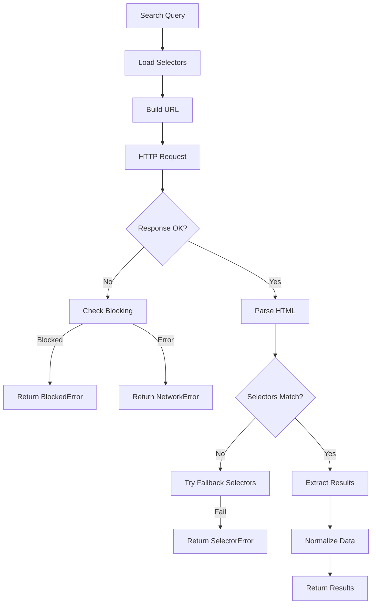

# Component: HTML Parser

**Parent:** [Golang Search CLI](./00-overview.md)  
**Version:** 2.0.0  
**Updated:** 2026-03-09  

---

## Acceptance Criteria

| ID | Criterion | Priority | Validation Method |
|----|-----------|----------|-------------------|
| AC-01 | Parser extracts title, link, and description from all supported engines | MUST | Unit test with fixtures |
| AC-02 | Parsing accuracy ≥95% for Google results | MUST | Integration test with live data |
| AC-03 | Parsing accuracy ≥90% for DuckDuckGo and Bing results | MUST | Integration test with live data |
| AC-04 | CAPTCHA/block detection returns appropriate error code | MUST | Unit test with blocked page fixtures |
| AC-05 | Fallback selectors activate when primary selectors fail | MUST | Unit test |
| AC-06 | Selector registry loads from external JSON file | MUST | Integration test |
| AC-07 | Embedded selectors used when external file missing | MUST | Unit test |
| AC-08 | Auto-reload detects file changes within configured interval | SHOULD | Integration test |
| AC-09 | Invalid CSS selector syntax rejected during validation | MUST | Unit test |
| AC-10 | CLI command `selectors validate` reports all errors | MUST | CLI test |
| AC-11 | CLI command `selectors show` displays current selectors | MUST | CLI test |
| AC-12 | Parsing completes within 500ms per page | SHOULD | Performance test |
| AC-13 | Memory usage ≤50MB for parsing 100 results | SHOULD | Load test |
| AC-14 | Description field handles comma-separated alternative selectors | MUST | Unit test |
| AC-15 | NoResults selector correctly identifies empty result pages | SHOULD | Unit test with empty fixtures |

---

## Summary

Direct HTTP-based web scraping using native Golang libraries for Google, DuckDuckGo, and Bing search result parsing. Includes externalized selector versioning system for maintainability when search engines change their DOM structure.

---

## Dependencies

- `net/http` — Native HTTP client
- `github.com/PuerkitoBio/goquery` — HTML parsing (jQuery-like)
- `golang.org/x/net/html` — Low-level HTML parsing

---

## Architecture



---

## Selector Versioning System

### Overview

Search engines frequently change their HTML structure. The selector versioning system externalizes CSS selectors to a JSON file, enabling updates without code changes.

### Selector Registry

```go
// pkg/selectors/registry.go

package selectors

import (
    "encoding/json"
    "os"
    "sync"
    "time"
    
    "github.com/rs/zerolog/log"
    "gsearch/pkg/appfault"
)

// SelectorRegistry manages versioned CSS selectors for search engines
type SelectorRegistry struct {
    Version     string
    UpdatedAt   time.Time
    Engines     map[string]EngineSelectors
    
    // Runtime state
    mu          sync.RWMutex
    filePath    string
    embedded    *SelectorRegistry  // Fallback embedded selectors
}

// EngineSelectors contains all selectors for a search engine
type EngineSelectors struct {
    Results     string            // Container selector for each result
    Title       string            // Title element within result
    Link        string            // Link element within result
    Description string            // Description element (can be comma-separated alternatives)
    NextPage    string            `json:",omitempty"` // Pagination link
    NoResults   string            `json:",omitempty"` // "No results" indicator
    Fallbacks   []EngineSelectors `json:",omitempty"` // Previous selector versions
}

// SelectorConfig configures the selector registry
type SelectorConfig struct {
    // Path to external selectors.json file
    Path string `mapstructure:"Path"`
    
    // Whether to auto-reload on file changes
    AutoReload bool `mapstructure:"AutoReload"`
    
    // Use embedded selectors if file is missing
    FallbackToEmbedded bool `mapstructure:"FallbackToEmbedded"`
    
    // Reload interval for auto-reload
    ReloadInterval time.Duration `mapstructure:"ReloadInterval"`
}

// DefaultSelectorConfig returns sensible defaults
func DefaultSelectorConfig() SelectorConfig {
    return SelectorConfig{
        Path:               "./configs/selectors.json",
        AutoReload:         false,
        FallbackToEmbedded: true,
        ReloadInterval:     5 * time.Minute,
    }
}

// NewSelectorRegistry creates a new selector registry
func NewSelectorRegistry(config SelectorConfig) appfault.Result[*SelectorRegistry] {
    registry := &SelectorRegistry{
        filePath: config.Path,
        embedded: embeddedSelectors(),
    }
    
    // Try to load from file
    if err := registry.loadFromFile(); err != nil {
        if config.FallbackToEmbedded {
            log.Warn().
                Err(err).
                Msg("Failed to load selectors file, using embedded fallback")
            registry.copyFromEmbedded()
        } else {
            return appfault.Fail[*SelectorRegistry](
                appfault.Wrap(
                    err,
                    "selector file missing: "+config.Path,
                ),
            )
        }
    }
    
    // Start auto-reload if enabled
    if config.AutoReload {
        go registry.watchFile(config.ReloadInterval)
    }
    
    return appfault.Ok(registry)
}

// loadFromFile loads selectors from the JSON file
func (r *SelectorRegistry) loadFromFile() *appfault.AppError {
    data, err := pathutil.ReadFile(r.filePath)
    if err != nil {
        return err
    }
    
    var loaded SelectorRegistry
    if err := json.Unmarshal(data, &loaded); err != nil {
        return errors.WrapError(errors.ErrSelectorFileInvalid, 
            "invalid JSON in selectors file", err)
    }
    
    r.mu.Lock()
    defer r.mu.Unlock()
    
    r.Version = loaded.Version
    r.UpdatedAt = loaded.UpdatedAt
    r.Engines = loaded.Engines
    
    log.Info().
        Str("version", r.Version).
        Time("updatedAt", r.UpdatedAt).
        Int("engines", len(r.Engines)).
        Msg("Loaded selectors from file")
    
    return nil
}

// copyFromEmbedded copies embedded selectors to registry
func (r *SelectorRegistry) copyFromEmbedded() {
    r.mu.Lock()
    defer r.mu.Unlock()
    
    r.Version = r.embedded.Version
    r.UpdatedAt = r.embedded.UpdatedAt
    r.Engines = r.embedded.Engines
}

// watchFile monitors the file for changes
func (r *SelectorRegistry) watchFile(interval time.Duration) {
    ticker := time.NewTicker(interval)
    defer ticker.Stop()
    
    var lastModTime time.Time
    
    for range ticker.C {
        info, err := pathutil.Stat(r.filePath)
        if err != nil {
            continue
        }
        
        if info.ModTime().After(lastModTime) {
            if err := r.loadFromFile(); err != nil {
                log.Error().Err(err).Msg("Failed to reload selectors")
            } else {
                lastModTime = info.ModTime()
            }
        }
    }
}

// GetSelectors returns selectors for an engine
func (r *SelectorRegistry) GetSelectors(engine string) appfault.Result[EngineSelectors] {
    r.mu.RLock()
    defer r.mu.RUnlock()
    
    selectors, ok := r.Engines[engine]
    if !ok {
        return appfault.Fail[EngineSelectors](
            appfault.New("no selectors for engine: " + engine),
        )
    }
    
    return appfault.Ok(selectors)
}

// GetVersion returns the current selector version
func (r *SelectorRegistry) GetVersion() string {
    r.mu.RLock()
    defer r.mu.RUnlock()
    return r.Version
}

// Reload forces a reload from file
func (r *SelectorRegistry) Reload() error {
    return r.loadFromFile()
}
```

### Embedded Selectors (Fallback)

```go
// pkg/selectors/embedded.go

package selectors

import "time"

// embeddedSelectors returns built-in selectors as fallback
func embeddedSelectors() *SelectorRegistry {
    return &SelectorRegistry{
        Version:   "2026-01-v1-embedded",
        UpdatedAt: time.Date(2026, 1, 28, 0, 0, 0, 0, time.UTC),
        Engines: map[string]EngineSelectors{
            "google": {
                Results:     "div.g",
                Title:       "h3",
                Link:        "a[href]",
                Description: "div.VwiC3b, span.aCOpRe, div[data-sncf]",
                NextPage:    "a#pnnext",
                NoResults:   "div.card-section p",
                Fallbacks: []EngineSelectors{
                    {
                        Results:     "div.g",
                        Title:       "h3.r a, h3 a",
                        Link:        "a[href]",
                        Description: "span.st, div.s",
                    },
                },
            },
            "duckduckgo": {
                Results:     "div.result, article[data-testid='result']",
                Title:       "a.result__a, h2 a",
                Link:        "a.result__a, h2 a",
                Description: "a.result__snippet, p[data-testid='result-snippet']",
                NextPage:    "a.result--more__btn",
                NoResults:   "div.no-results",
                Fallbacks: []EngineSelectors{
                    {
                        Results:     "div.results_links_deep",
                        Title:       "a.result__a",
                        Link:        "a.result__a",
                        Description: "a.result__snippet",
                    },
                },
            },
            "bing": {
                Results:     "li.b_algo",
                Title:       "h2 a",
                Link:        "h2 a",
                Description: "p, div.b_caption p",
                NextPage:    "a.sb_pagN",
                NoResults:   "li.b_no",
                Fallbacks: []EngineSelectors{
                    {
                        Results:     "ol#b_results li.b_algo",
                        Title:       "h2 a",
                        Link:        "h2 a",
                        Description: "p",
                    },
                },
            },
        },
    }
}
```

### External Selectors File

**File:** `configs/selectors.json`

```json
{
    "version": "2026-01-v3",
    "updatedAt": "2026-01-28T00:00:00Z",
    "engines": {
        "google": {
            "results": "div.g",
            "title": "h3",
            "link": "a[href]",
            "description": "div.VwiC3b, span.aCOpRe, div[data-sncf]",
            "nextPage": "a#pnnext",
            "noResults": "div.card-section p",
            "fallbacks": [
                {
                    "results": "div.g",
                    "title": "h3.r a, h3 a",
                    "link": "a[href]",
                    "description": "span.st, div.s"
                }
            ]
        },
        "duckduckgo": {
            "results": "div.result, article[data-testid='result']",
            "title": "a.result__a, h2 a",
            "link": "a.result__a, h2 a",
            "description": "a.result__snippet, p[data-testid='result-snippet']",
            "nextPage": "a.result--more__btn",
            "noResults": "div.no-results",
            "fallbacks": [
                {
                    "results": "div.results_links_deep",
                    "title": "a.result__a",
                    "link": "a.result__a",
                    "description": "a.result__snippet"
                }
            ]
        },
        "bing": {
            "results": "li.b_algo",
            "title": "h2 a",
            "link": "h2 a",
            "description": "p, div.b_caption p",
            "nextPage": "a.sb_pagN",
            "noResults": "li.b_no",
            "fallbacks": [
                {
                    "results": "ol#b_results li.b_algo",
                    "title": "h2 a",
                    "link": "h2 a",
                    "description": "p"
                }
            ]
        }
    }
}
```

### Selector Validation

```go
// pkg/selectors/validator.go

package selectors

import (
    "strings"
    "time"
    
    "github.com/PuerkitoBio/goquery"
    "gsearch/pkg/appfault"
)

// ValidationResult contains selector validation results
type ValidationResult struct {
    Engine      string
    Version     string
    Valid       bool
    Errors      []string  `json:",omitempty"`
    Warnings    []string  `json:",omitempty"`
    TestedAt    time.Time
}

// ValidateSelector validates CSS selector syntax
func ValidateSelector(selector string) *appfault.AppError {
    if selector == "" {
        return appfault.New("empty selector")
    }
    
    // Parse comma-separated alternatives
    alternatives := strings.Split(selector, ",")
    for _, alt := range alternatives {
        alt = strings.TrimSpace(alt)
        if alt == "" {
            continue
        }
        
        // Create a minimal document to test the selector
        doc, err := goquery.NewDocumentFromReader(strings.NewReader("<html><body></body></html>"))
        if err != nil {
            return appfault.Wrap(
                err,
                "failed to create test document",
            )
        }
        
        // Validate selector by attempting to use it
        if validateErr := validateSelectorSyntax(alt); validateErr != nil {
            return appfault.Wrap(
                validateErr,
                "invalid selector '"+alt+"'",
            )
        }
        
        _ = doc.Find(alt) // Use the document to avoid unused variable
    }
    
    return nil
}

// validateSelectorSyntax performs basic selector syntax validation
func validateSelectorSyntax(selector string) *appfault.AppError {
    // Check for common syntax errors
    if strings.Contains(selector, "[[") || strings.Contains(selector, "]]") {
        return appfault.New("malformed attribute selector")
    }
    if strings.HasPrefix(selector, ">") || strings.HasPrefix(selector, "+") || strings.HasPrefix(selector, "~") {
        return appfault.New("selector cannot start with combinator")
    }
    if strings.HasSuffix(strings.TrimSpace(selector), ">") || 
       strings.HasSuffix(strings.TrimSpace(selector), "+") ||
       strings.HasSuffix(strings.TrimSpace(selector), "~") {
        return appfault.New("selector cannot end with combinator")
    }
    return nil
}

// ValidateRegistry validates all selectors in the registry
func ValidateRegistry(registry *SelectorRegistry) []ValidationResult {
    var results []ValidationResult
    
    for engine, selectors := range registry.Engines {
        result := ValidationResult{
            Engine:   engine,
            Version:  registry.Version,
            Valid:    true,
            TestedAt: time.Now(),
        }
        
        // Validate each selector field
        fields := map[string]string{
            "results":     selectors.Results,
            "title":       selectors.Title,
            "link":        selectors.Link,
            "description": selectors.Description,
            "nextPage":    selectors.NextPage,
            "noResults":   selectors.NoResults,
        }
        
        for name, selector := range fields {
            if selector == "" && (name == "results" || name == "title" || name == "link") {
                result.Errors = append(result.Errors, 
                    fmt.Sprintf("required selector '%s' is empty", name))
                result.Valid = false
            } else if selector != "" {
                if err := ValidateSelector(selector); err != nil {
                    result.Errors = append(result.Errors,
                        fmt.Sprintf("invalid selector '%s': %v", name, err))
                    result.Valid = false
                }
            }
        }
        
        // Check for common issues
        if strings.Contains(selectors.Results, " > ") && stringutil.IsMissingSubstring(selectors.Results, ",") {
            result.Warnings = append(result.Warnings,
                "results selector uses strict child combinator, may break easily")
        }
        
        results = append(results, result)
    }
    
    return results
}
```

### CLI Command: Validate Selectors

```go
// cmd/selectors.go

package cmd

import (
    "encoding/json"
    "fmt"
    
    "github.com/spf13/cobra"
    "gsearch/pkg/selectors"
)

var selectorsCmd = &cobra.Command{
    Use:   "selectors",
    Short: "Manage HTML selectors",
}

var selectorsValidateCmd = &cobra.Command{
    Use:   "validate",
    Short: "Validate selectors configuration",
    RunE:  runSelectorsValidate,
}

var selectorsShowCmd = &cobra.Command{
    Use:   "show [engine]",
    Short: "Show current selectors for an engine",
    Args:  cobra.MaximumNArgs(1),
    RunE:  runSelectorsShow,
}

func init() {
    rootCmd.AddCommand(selectorsCmd)
    selectorsCmd.AddCommand(selectorsValidateCmd)
    selectorsCmd.AddCommand(selectorsShowCmd)
    
    selectorsValidateCmd.Flags().String("file", "", 
        "path to selectors file (default from config)")
    selectorsValidateCmd.Flags().Bool("json", false,
        "output as JSON")
}

func runSelectorsValidate(cmd *cobra.Command, args []string) error {
    filePath, _ := cmd.Flags().GetString("file")
    jsonOutput, _ := cmd.Flags().GetBool("json")
    
    config := selectors.DefaultSelectorConfig()
    if filePath != "" {
        config.Path = filePath
    }
    config.FallbackToEmbedded = false // Force file loading
    
    registry, err := selectors.NewSelectorRegistry(config)
    if err != nil {
        return err
    }
    
    results := selectors.ValidateRegistry(registry)
    
    if jsonOutput {
        data, _ := json.MarshalIndent(results, "", "  ")
        fmt.Println(string(data))
    } else {
        allValid := true
        for _, r := range results {
            status := "✓"
            if !r.Valid {
                status = "✗"
                allValid = false
            }
            
            fmt.Printf("%s %s (version: %s)\n", status, r.Engine, r.Version)
            
            for _, e := range r.Errors {
                fmt.Printf("  ERROR: %s\n", e)
            }
            for _, w := range r.Warnings {
                fmt.Printf("  WARN:  %s\n", w)
            }
        }
        
        if allValid {
            fmt.Println("\nAll selectors valid!")
        } else {
        return appfault.New("validation failed")
        }
    }
    
    return nil
}

func runSelectorsShow(cmd *cobra.Command, args []string) error {
    config := selectors.DefaultSelectorConfig()
    registry, err := selectors.NewSelectorRegistry(config)
    if err != nil {
        return err
    }
    
    fmt.Printf("Selector Version: %s\n", registry.GetVersion())
    fmt.Printf("Updated: %s\n\n", registry.UpdatedAt.Format(time.RFC3339))
    
    if len(args) == 0 {
        // Show all engines
        for engine, sel := range registry.Engines {
            printEngineSelectors(engine, sel)
        }
    } else {
        // Show specific engine
        sel, err := registry.GetSelectors(args[0])
        if err != nil {
            return err
        }
        printEngineSelectors(args[0], sel)
    }
    
    return nil
}

func printEngineSelectors(engine string, sel selectors.EngineSelectors) {
    fmt.Printf("=== %s ===\n", strings.ToUpper(engine))
    fmt.Printf("  Results:     %s\n", sel.Results)
    fmt.Printf("  Title:       %s\n", sel.Title)
    fmt.Printf("  Link:        %s\n", sel.Link)
    fmt.Printf("  Description: %s\n", sel.Description)
    if sel.NextPage != "" {
        fmt.Printf("  NextPage:    %s\n", sel.NextPage)
    }
    if sel.NoResults != "" {
        fmt.Printf("  NoResults:   %s\n", sel.NoResults)
    }
    if len(sel.Fallbacks) > 0 {
        fmt.Printf("  Fallbacks:   %d configured\n", len(sel.Fallbacks))
    }
    fmt.Println()
}
```

---

## Implementation

### Search Method Interface

```go
package search

import (
    stdctx "context"
    "net/http"
    "net/url"
    "strings"
    "time"
    
    "github.com/PuerkitoBio/goquery"
    "gsearch/pkg/appfault"
    "gsearch/pkg/selectors"
)

type HTMLParser struct {
    client        *http.Client
    userAgents    []string
    blockPatterns []string
    currentUA     int
    selectors     *selectors.SelectorRegistry
}

func NewHtmlParser(cfg *config.SearchConfig, registry *selectors.SelectorRegistry, blockPatterns []string) *HTMLParser {
    return &HTMLParser{
        client: &http.Client{
            Timeout: cfg.Timeout.Duration(),
            CheckRedirect: func(req *http.Request, via []*http.Request) error {
                if len(via) >= 3 {
                    return appfault.New("too many redirects")
                }
                return nil
            },
        },
        userAgents:    cfg.UserAgents,
        blockPatterns: blockPatterns,
        selectors:     registry,
    }
}

func (p *HtmlParser) Id() string     { return "html" }
func (p *HtmlParser) Name() string   { return "HTML Parser" }
func (p *HtmlParser) IsAvailable() bool { return true }
func (p *HtmlParser) RequiresApi() bool { return false }
```

### Google Search Parser

```go
func (p *HtmlParser) SearchGoogle(context stdctx.Context, query string, opts SearchOptions) appfault.Result[[]Result] {
    searchUrl := p.buildGoogleUrl(query, opts.MaxResults)
    
    docResult := p.fetchAndParse(context, searchUrl)
    if !docResult.IsSuccess {
        return appfault.Fail[[]Result](docResult.Error)
    }
    
    doc := docResult.Value
    selResult := p.selectors.GetSelectors("google")
    if !selResult.IsSuccess {
        return appfault.Fail[[]Result](selResult.Error)
    }
    
    sel := selResult.Value
    results := p.parseWithSelectors(doc, sel, opts.MaxResults)
    
    // Try fallbacks if no results found
    if len(results) == 0 && len(sel.Fallbacks) > 0 {
        for _, fallback := range sel.Fallbacks {
            results = p.parseWithSelectors(doc, fallback, opts.MaxResults)
            if len(results) > 0 {
                log.Debug().Msg("Using fallback selectors for Google")
                break
            }
        }
    }
    
    return appfault.Ok(results)
}

func (p *HtmlParser) buildGoogleUrl(query string, maxResults int) string {
    params := url.Values{}
    params.Set("q", query)
    params.Set("num", fmt.Sprintf("%d", maxResults))
    params.Set("hl", "en")
    
    return "https://www.google.com/search?" + params.Encode()
}
```

### Generic Selector-Based Parser

```go
// parseWithSelectors extracts results using the provided selectors
func (p *HTMLParser) parseWithSelectors(doc *goquery.Document, sel selectors.EngineSelectors, maxResults int) []Result {
    var results []Result
    position := 0
    
    doc.Find(sel.Results).Each(func(i int, s *goquery.Selection) {
        if maxResults > 0 && position >= maxResults {
            return
        }
        
        // Extract title - try each alternative
        var title string
        for _, titleSel := range strings.Split(sel.Title, ",") {
            titleSel = strings.TrimSpace(titleSel)
            titleEl := s.Find(titleSel).First()
            title = strings.TrimSpace(titleEl.Text())
            if title != "" {
                break
            }
        }
        
        if title == "" {
            return // Skip results without titles
        }
        
        // Extract URL - try each alternative
        var href string
        for _, linkSel := range strings.Split(sel.Link, ",") {
            linkSel = strings.TrimSpace(linkSel)
            linkEl := s.Find(linkSel).First()
            href, _ = linkEl.Attr("href")
            if href != "" && strings.HasPrefix(href, "http") {
                break
            }
        }
        
        if href == "" || stringutil.IsMissingPrefix(href, "http") {
            return // Skip results without valid URLs
        }
        
        // Extract description - try each alternative
        var description string
        for _, descSel := range strings.Split(sel.Description, ",") {
            descSel = strings.TrimSpace(descSel)
            descEl := s.Find(descSel).First()
            description = strings.TrimSpace(descEl.Text())
            if description != "" {
                break
            }
        }
        
        position++
        results = append(results, Result{
            Title:       title,
            Description: description,
            URL:         href,
            Position:    position,
        })
    })
    
    return results
}
```

### DuckDuckGo Parser

```go
func (p *HtmlParser) SearchDuckDuckGo(context stdctx.Context, query string, opts SearchOptions) appfault.Result[[]Result] {
    searchUrl := p.buildDdgUrl(query)
    
    docResult := p.fetchAndParse(context, searchUrl)
    if !docResult.IsSuccess {
        return appfault.Fail[[]Result](docResult.Error)
    }
    
    doc := docResult.Value
    selResult := p.selectors.GetSelectors("duckduckgo")
    if !selResult.IsSuccess {
        return appfault.Fail[[]Result](selResult.Error)
    }
    
    sel := selResult.Value
    results := p.parseDdgWithSelectors(doc, sel, opts.MaxResults)
    
    // Try fallbacks
    if len(results) == 0 && len(sel.Fallbacks) > 0 {
        for _, fallback := range sel.Fallbacks {
            results = p.parseDdgWithSelectors(doc, fallback, opts.MaxResults)
            if len(results) > 0 {
                log.Debug().Msg("Using fallback selectors for DuckDuckGo")
                break
            }
        }
    }
    
    return appfault.Ok(results)
}

func (p *HtmlParser) buildDdgUrl(query string) string {
    params := url.Values{}
    params.Set("q", query)
    
    return "https://html.duckduckgo.com/html/?" + params.Encode()
}

func (p *HtmlParser) parseDdgWithSelectors(doc *goquery.Document, sel selectors.EngineSelectors, maxResults int) []Result {
    results := p.parseWithSelectors(doc, sel, maxResults)
    
    // DuckDuckGo URL unwrapping
    for i := range results {
        results[i].Url = p.extractDdgUrl(results[i].Url)
    }
    
    return results
}

func (p *HtmlParser) extractDdgUrl(ddgUrl string) string {
    parsed, err := url.Parse(ddgUrl)
    if err != nil {
        return ddgUrl
    }
    
    if actualUrl := parsed.Query().Get("uddg"); actualUrl != "" {
        return actualUrl
    }
    
    return ddgUrl
}
```

### Bing Parser

```go
func (p *HtmlParser) SearchBing(context stdctx.Context, query string, opts SearchOptions) appfault.Result[[]Result] {
    searchUrl := p.buildBingUrl(query, opts.MaxResults)
    
    docResult := p.fetchAndParse(context, searchUrl)
    if !docResult.IsSuccess {
        return appfault.Fail[[]Result](docResult.Error)
    }
    
    doc := docResult.Value
    selResult := p.selectors.GetSelectors("bing")
    if !selResult.IsSuccess {
        return appfault.Fail[[]Result](selResult.Error)
    }
    
    sel := selResult.Value
    results := p.parseWithSelectors(doc, sel, opts.MaxResults)
    
    // Try fallbacks
    if len(results) == 0 && len(sel.Fallbacks) > 0 {
        for _, fallback := range sel.Fallbacks {
            results = p.parseWithSelectors(doc, fallback, opts.MaxResults)
            if len(results) > 0 {
                log.Debug().Msg("Using fallback selectors for Bing")
                break
            }
        }
    }
    
    return appfault.Ok(results)
}

func (p *HtmlParser) buildBingUrl(query string, maxResults int) string {
    params := url.Values{}
    params.Set("q", query)
    params.Set("count", fmt.Sprintf("%d", maxResults))
    
    return "https://www.bing.com/search?" + params.Encode()
}
```

### HTTP Fetching

```go
func (p *HTMLParser) fetchAndParse(context stdctx.Context, targetUrl string) appfault.Result[*goquery.Document] {
    req, err := http.NewRequestWithContext(context, httpmethod.Get.String(), targetUrl, nil)
    if err != nil {
        return appfault.Fail[*goquery.Document](
            appfault.Wrap(err, "create request"),
        )
    }
    
    // Set headers
    req.Header.Set("User-Agent", p.getNextUserAgent())
    req.Header.Set("Accept", "text/html,application/xhtml+xml")
    req.Header.Set("Accept-Language", "en-US,en;q=0.9")
    req.Header.Set("Accept-Encoding", "gzip, deflate")
    req.Header.Set("Connection", "keep-alive")
    
    resp, err := p.client.Do(req)
    if err != nil {
        return appfault.Fail[*goquery.Document](
            appfault.Wrap(err, "network error: "+targetUrl),
        )
    }
    defer resp.Body.Close()
    
    // Check status
    if resp.StatusCode != http.StatusOK {
        if resp.StatusCode == 429 {
            return appfault.Fail[*goquery.Document](
                appfault.New("rate limited by " + targetUrl),
            )
        }
        if resp.StatusCode == 403 {
            return appfault.Fail[*goquery.Document](
                appfault.New("blocked by " + targetUrl),
            )
        }
        return appfault.Fail[*goquery.Document](
            appfault.New("unexpected status from " + targetUrl),
        )
    }
    
    // Parse HTML
    doc, err := goquery.NewDocumentFromReader(resp.Body)
    if err != nil {
        return appfault.Fail[*goquery.Document](
            appfault.Wrap(err, "parse response"),
        )
    }
    
    // Check for blocking patterns in content
    html, _ := doc.Html()
    if p.isBlocked(html) {
        return appfault.Fail[*goquery.Document](
            appfault.New("blocking pattern detected in response"),
        )
    }
    
    return appfault.Ok(doc)
}

func (p *HTMLParser) getNextUserAgent() string {
    if len(p.userAgents) == 0 {
        return "Mozilla/5.0 (compatible; GoSearch/1.0)"
    }
    
    ua := p.userAgents[p.currentUA]
    p.currentUA = (p.currentUA + 1) % len(p.userAgents)
    return ua
}

func (p *HTMLParser) isBlocked(html string) bool {
    lowered := strings.ToLower(html)
    for _, pattern := range p.blockPatterns {
        if strings.Contains(lowered, strings.ToLower(pattern)) {
            return true
        }
    }
    return false
}
```

---

## Configuration Schema

```json
{
    "selectors": {
        "path": "./configs/selectors.json",
        "autoReload": false,
        "fallbackToEmbedded": true,
        "reloadInterval": "5m"
    }
}
```

---

## User Agent Rotation

```json
{
  "userAgents": [
    "Mozilla/5.0 (Windows NT 10.0; Win64; x64) AppleWebKit/537.36 Chrome/120.0.0.0 Safari/537.36",
    "Mozilla/5.0 (Macintosh; Intel Mac OS X 10_15_7) AppleWebKit/537.36 Chrome/120.0.0.0 Safari/537.36",
    "Mozilla/5.0 (X11; Linux x86_64) AppleWebKit/537.36 Chrome/120.0.0.0 Safari/537.36",
    "Mozilla/5.0 (Windows NT 10.0; Win64; x64; rv:121.0) Gecko/20100101 Firefox/121.0",
    "Mozilla/5.0 (Macintosh; Intel Mac OS X 10_15_7) AppleWebKit/605.1.15 Safari/17.2"
  ]
}
```

---

## Usage Examples

```bash
# Validate selectors configuration
gsearch selectors validate

# Validate with JSON output
gsearch selectors validate --json

# Show all selectors
gsearch selectors show

# Show selectors for specific engine
gsearch selectors show google

# Use custom selectors file
gsearch search "test query" --config ./custom-config.json
```

---

## Selector Maintenance Workflow

### When Selectors Break

1. **Detection**: Search returns 0 results or parsing errors
2. **Diagnosis**: Use browser dev tools to inspect current DOM structure
3. **Update**: Modify `configs/selectors.json` with new selectors
4. **Validate**: Run `gsearch selectors validate`
5. **Test**: Execute test search to confirm fix
6. **Deploy**: No code changes required

### Version Naming Convention

Format: `YYYY-MM-vN` where:
- `YYYY-MM` = Year and month
- `vN` = Version number within that month

Example: `2026-01-v3` = Third update in January 2026

---

## Related Specs

- [Method Switching](./08-method-switching.md) — Fallback on blocking
- [Configuration](./02-configuration.md) — User agents, selector config
- [Error Codes](./15-error-codes.md) — Selector error codes (7xxx, 11xxx)
- [Remediation Plan](./14-remediation-plan.md) — Phase 2 implementation

---

## Changelog

| Version | Date | Changes |
|---------|------|---------|
| 1.0.0 | 2026-01-28 | Initial HTML parser with hardcoded selectors |
| 1.1.0 | 2026-01-28 | Externalized selector versioning system (Phase 2) |
