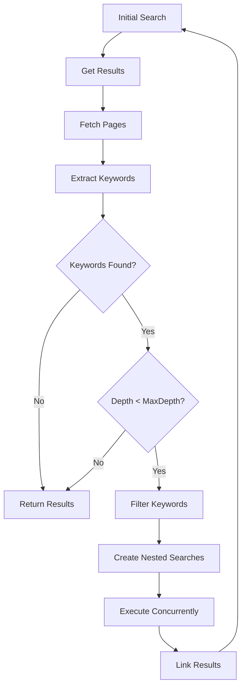

# Component: Nested Search

**Parent:** [Golang Search CLI](./00-overview.md)  
**Version:** 2.0.0  
**Updated:** 2026-03-09  

---

## Acceptance Criteria

| ID | Criterion | Priority | Validation Method |
|----|-----------|----------|-------------------|
| AC-01 | Nested search respects maxDepth configuration | MUST | Unit test |
| AC-02 | Recursion stops at configured depth (default: 3) | MUST | Integration test |
| AC-03 | Keywords extracted from page content correctly | MUST | Unit test with sample pages |
| AC-04 | Stop words excluded from keyword extraction | MUST | Unit test |
| AC-05 | User-defined exclude keywords filtered out | MUST | Unit test |
| AC-06 | Keyword minimum length enforced (default: 3 chars) | MUST | Unit test |
| AC-07 | Two-word phrases boosted in keyword scoring | SHOULD | Unit test |
| AC-08 | Top N keywords selected based on keywordThreshold config | MUST | Unit test |
| AC-09 | Nested searches linked to parent in database | MUST | Integration test |
| AC-10 | Concurrent page fetching respects configured limit | MUST | Integration test |
| AC-11 | Page fetch respects maxSize limit (default: 1MB) | MUST | Unit test |
| AC-12 | Page fetch timeout enforced (default: 10s) | MUST | Integration test |
| AC-13 | Nested search depth tracked in NestedSearch table | MUST | Integration test |
| AC-14 | Script and style tags removed from page content | MUST | Unit test |
| AC-15 | Error in child search doesn't halt sibling searches | MUST | Integration test |
| AC-16 | Memory usage ≤256MB for depth-3 search with 5 keywords/level | SHOULD | Load test |

---

## Summary

Recursive keyword extraction and automatic nested search execution based on page content analysis.

---

## Architecture



---

## Implementation

### Nested Search Service

```go
package nested

import (
    stdctx "context"
    "sync"
    
    "gsearch/pkg/appfault"
)

type NestedSearchService struct {
    searcher      search.Executor
    pageFetcher   *PageFetcher
    keywordExtractor *KeywordExtractor
    db            *database.DB
    config        *config.NestedConfig
}

func NewNestedSearchService(
    searcher search.Executor,
    pageFetcher *PageFetcher,
    db *database.DB,
    cfg *config.NestedConfig,
) *NestedSearchService {
    return &NestedSearchService{
        searcher:         searcher,
        pageFetcher:      pageFetcher,
        keywordExtractor: NewKeywordExtractor(cfg),
        db:               db,
        config:           cfg,
    }
}
```

### Recursive Search Execution

```go
func (s *NestedSearchService) ExecuteNested(
    context stdctx.Context,
    parentSearchId string,
    results []search.Result,
    currentDepth int,
) *appfault.AppError {
    if currentDepth >= s.config.MaxDepth {
        return nil
    }
    
    // Fetch page contents concurrently
    contents := s.pageFetcher.FetchAll(context, results)
    
    // Extract keywords from all pages
    keywords := s.extractAndMergeKeywords(contents)
    
    // Filter to top keywords
    topKeywords := s.filterTopKeywords(keywords)
    
    if len(topKeywords) == 0 {
        return nil
    }
    
    // Create and execute nested searches
    return s.executeNestedSearches(context, parentSearchId, topKeywords, currentDepth+1)
}

func (s *NestedSearchService) extractAndMergeKeywords(contents []PageContent) map[string]int {
    merged := make(map[string]int)
    
    for _, content := range contents {
        keywords := s.keywordExtractor.Extract(content.Text)
        for kw, score := range keywords {
            merged[kw] += score
        }
    }
    
    return merged
}

func (s *NestedSearchService) filterTopKeywords(keywords map[string]int) []string {
    type kwScore struct {
        keyword string
        score   int
    }
    
    var sorted []kwScore
    for kw, score := range keywords {
        sorted = append(sorted, kwScore{kw, score})
    }
    
    sort.Slice(sorted, func(i, j int) bool {
        return sorted[i].score > sorted[j].score
    })
    
    // Take top N keywords
    n := s.config.KeywordThreshold
    if n > len(sorted) {
        n = len(sorted)
    }
    
    result := make([]string, n)
    for i := 0; i < n; i++ {
        result[i] = sorted[i].keyword
    }
    
    return result
}
```

### Keyword Extractor

```go
type KeywordExtractor struct {
    minLength       int
    excludeKeywords map[string]bool
    stopWords       map[string]bool
}

func NewKeywordExtractor(cfg *config.NestedConfig) *KeywordExtractor {
    exclude := make(map[string]bool)
    for _, kw := range cfg.ExcludeKeywords {
        exclude[strings.ToLower(kw)] = true
    }
    
    return &KeywordExtractor{
        minLength:       cfg.MinKeywordLength,
        excludeKeywords: exclude,
        stopWords:       loadStopWords(),
    }
}

func (e *KeywordExtractor) Extract(text string) map[string]int {
    keywords := make(map[string]int)
    
    // Normalize and tokenize
    words := e.tokenize(text)
    
    // Count word frequencies
    for _, word := range words {
        if !e.isValidKeyword(word) {
            continue
        }
        keywords[word]++
    }
    
    // Extract noun phrases (simple approach)
    phrases := e.extractPhrases(words)
    for _, phrase := range phrases {
        keywords[phrase] += 2 // Boost phrases
    }
    
    return keywords
}

func (e *KeywordExtractor) tokenize(text string) []string {
    // Convert to lowercase and split
    text = strings.ToLower(text)
    
    // Remove punctuation except hyphens in words
    re := regexp.MustCompile(`[^\w\s-]`)
    text = re.ReplaceAllString(text, " ")
    
    return strings.Fields(text)
}

func (e *KeywordExtractor) isValidKeyword(word string) bool {
    if len(word) < e.minLength {
        return false
    }
    if e.stopWords[word] {
        return false
    }
    if e.excludeKeywords[word] {
        return false
    }
    // Skip pure numbers
    if _, err := strconv.Atoi(word); err == nil {
        return false
    }
    return true
}

func (e *KeywordExtractor) extractPhrases(words []string) []string {
    var phrases []string
    
    for i := 0; i < len(words)-1; i++ {
        if e.isValidKeyword(words[i]) && e.isValidKeyword(words[i+1]) {
            phrase := words[i] + " " + words[i+1]
            phrases = append(phrases, phrase)
        }
    }
    
    return phrases
}

func loadStopWords() map[string]bool {
    stopWords := []string{
        "the", "a", "an", "and", "or", "but", "in", "on", "at", "to",
        "for", "of", "with", "by", "from", "as", "is", "was", "are",
        "were", "been", "be", "have", "has", "had", "do", "does", "did",
        "will", "would", "could", "should", "may", "might", "must",
        "this", "that", "these", "those", "it", "its", "they", "them",
        "we", "us", "you", "your", "i", "me", "my", "he", "she", "his",
        "her", "what", "which", "who", "when", "where", "why", "how",
        "all", "each", "every", "both", "few", "more", "most", "other",
        "some", "such", "no", "not", "only", "own", "same", "so", "than",
        "too", "very", "just", "also", "now", "here", "there", "then",
    }
    
    m := make(map[string]bool)
    for _, w := range stopWords {
        m[w] = true
    }
    return m
}
```

### Page Fetcher

```go
type PageFetcher struct {
    client    *http.Client
    maxSize   int
    userAgent string
}

type PageContent struct {
    Url       string
    RawHtml   string
    Text      string
    Keywords  []string
    Error     *appfault.AppError `json:",omitempty"`
}

func (f *PageFetcher) FetchAll(context stdctx.Context, results []search.Result) []PageContent {
    var wg sync.WaitGroup
    contents := make([]PageContent, len(results))
    
    for i, result := range results {
        wg.Add(1)
        go func(idx int, url string) {
            defer wg.Done()
            contents[idx] = f.fetch(context, url)
        }(i, result.Url)
    }
    
    wg.Wait()
    return contents
}

func (f *PageFetcher) fetch(context stdctx.Context, url string) PageContent {
    req, err := http.NewRequestWithContext(context, httpmethod.Get.String(), url, nil)
    if err != nil {
        return PageContent{
            Url:   url,
            Error: appfault.Wrap(err, "create request"),
        }
    }
    
    req.Header.Set("User-Agent", f.userAgent)
    
    resp, err := f.client.Do(req)
    if err != nil {
        return PageContent{
            Url:   url,
            Error: appfault.Wrap(err, "fetch page"),
        }
    }
    defer resp.Body.Close()
    
    // Limit read size
    reader := io.LimitReader(resp.Body, int64(f.maxSize))
    body, err := io.ReadAll(reader)
    if err != nil {
        return PageContent{
            Url:   url,
            Error: appfault.Wrap(err, "read response body"),
        }
    }
    
    rawHtml := string(body)
    text := f.extractText(rawHtml)
    
    return PageContent{
        Url:     url,
        RawHtml: rawHtml,
        Text:    text,
    }
}

func (f *PageFetcher) extractText(html string) string {
    doc, err := goquery.NewDocumentFromReader(strings.NewReader(html))
    if err != nil {
        return ""
    }
    
    // Remove script and style elements
    doc.Find("script, style, noscript").Remove()
    
    // Get text content
    return strings.TrimSpace(doc.Text())
}
```

### Database Tracking

```go
func (s *NestedSearchService) executeNestedSearches(
    context stdctx.Context,
    parentId string,
    keywords []string,
    depth int,
) *appfault.AppError {
    var wg sync.WaitGroup
    errChan := make(chan *appfault.AppError, len(keywords))
    
    for _, keyword := range keywords {
        wg.Add(1)
        go func(kw string) {
            defer wg.Done()
            
            // Create child search
            childResult := s.db.CreateSearchRequest(kw, "auto", "html")
            if !childResult.IsSuccess {
                errChan <- childResult.Error
                return
            }
            childSearch := childResult.Value
            
            // Link to parent
            if linkErr := s.db.CreateNestedSearch(parentId, childSearch.Id, kw, depth); linkErr != nil {
                errChan <- linkErr
                return
            }
            
            // Execute search
            searchResult := s.searcher.Search(context, kw, search.SearchOptions{
                MaxResults: 5,
            })
            if !searchResult.IsSuccess {
                s.db.UpdateSearchStatus(childSearch.Id, models.StatusFailed, 0)
                return
            }
            
            // Save results
            s.db.SaveResults(childSearch.Id, searchResult.Value)
            s.db.UpdateSearchStatus(childSearch.Id, models.StatusCompleted, len(searchResult.Value))
            
            // Recurse if needed
            if depth < s.config.MaxDepth {
                s.ExecuteNested(context, childSearch.Id, searchResult.Value, depth)
            }
        }(keyword)
    }
    
    wg.Wait()
    close(errChan)
    
    // Collect errors
    var errs []*appfault.AppError
    for err := range errChan {
        errs = append(errs, err)
    }
    
    if len(errs) > 0 {
        return appfault.New("nested search encountered errors")
    }
    
    return nil
}
```

---

## Configuration

```json
{
  "nested": {
    "enabled": true,
    "maxDepth": 3,
    "keywordThreshold": 5,
    "minKeywordLength": 3,
    "excludeKeywords": ["the", "and", "or", "is", "a", "an"],
    "pageFetch": {
      "maxSize": 1048576,
      "timeout": 10000,
      "concurrent": 5
    }
  }
}
```

---

## Depth Visualization

```
Search: "machine learning"
├── Depth 1: Results (10)
│   ├── Page 1 → Keywords: ["neural network", "deep learning"]
│   └── Page 2 → Keywords: ["tensorflow", "pytorch"]
│
├── Nested: "neural network" (Depth 2)
│   ├── Depth 2: Results (5)
│   │   └── Keywords: ["backpropagation", "CNN"]
│   │
│   └── Nested: "backpropagation" (Depth 3)
│       └── Depth 3: Results (5) [Max depth reached]
│
└── Nested: "deep learning" (Depth 2)
    └── Depth 2: Results (5)
```

---

## Related Specs

- [Database Schema](./03-database-schema.md) — NestedSearch table
- [Caching System](./10-caching-system.md) — Avoid duplicate nested searches
