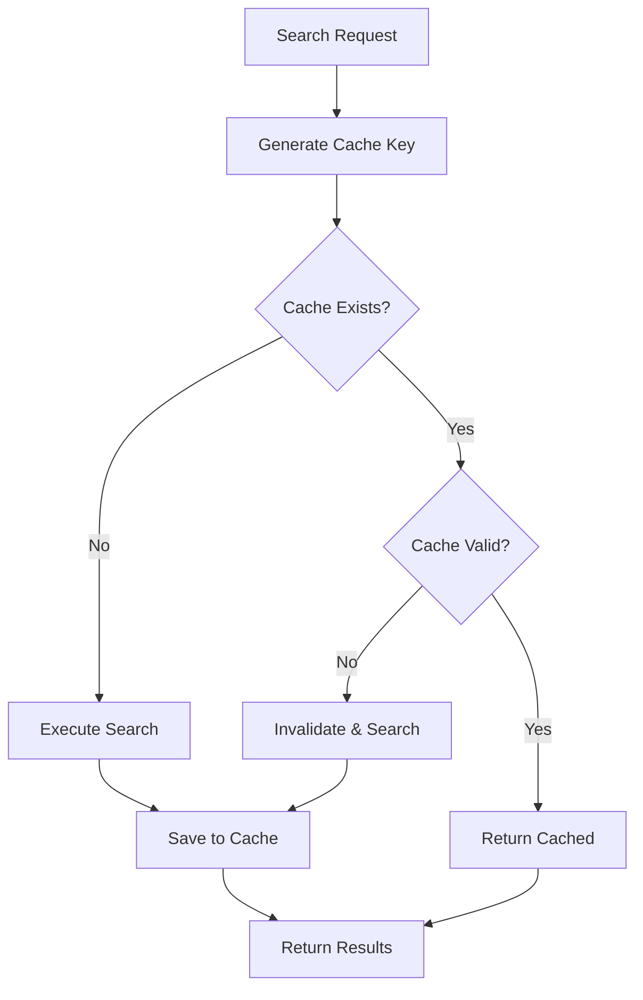

# Component: Caching System

**Parent:** [Golang Search CLI](./00-overview.md)  
**Version:** 2.0.0  
**Updated:** 2026-03-09  

---

## Acceptance Criteria

| ID | Criterion | Priority | Validation Method |
|----|-----------|----------|-------------------|
| AC-01 | Cache hit rate ≥80% for repeated identical queries | SHOULD | Metrics/load test |
| AC-02 | Cache key generation is deterministic (same input = same key) | MUST | Unit test |
| AC-03 | Keyword normalization ignores word order | MUST | Unit test |
| AC-04 | Keyword normalization is case-insensitive | MUST | Unit test |
| AC-05 | Cache entries expire after configured days (default: 5) | MUST | Integration test |
| AC-06 | Expired entries return ErrCacheExpired | MUST | Unit test |
| AC-07 | Invalid entries return ErrCacheInvalid | MUST | Unit test |
| AC-08 | Max entries limit enforced (default: 10000) | MUST | Integration test |
| AC-09 | Oldest entries deleted when limit exceeded | MUST | Integration test |
| AC-10 | Cache invalidation by keyword hash works | MUST | Unit test |
| AC-11 | Cache invalidation by keyword pattern works | MUST | Unit test |
| AC-12 | InvalidateAll clears entire cache | MUST | Unit test |
| AC-13 | Automatic cleanup job runs at configured interval | MUST | Integration test |
| AC-14 | Cleanup removes expired entries | MUST | Integration test |
| AC-15 | Cleanup removes invalid entries older than 24 hours | MUST | Integration test |
| AC-16 | CLI `cache stats` displays all statistics | MUST | CLI test |
| AC-17 | CLI `cache clear --all` clears entire cache | MUST | CLI test |
| AC-18 | CLI `cache clear --expired` removes only expired entries | MUST | CLI test |
| AC-19 | Cache lookup completes within 10ms | SHOULD | Performance test |
| AC-20 | SHA-256 hash truncated to 16 bytes for key | MUST | Unit test |

---

## Summary

Keyword-based caching with configurable TTL, automatic cleanup, and cache-first retrieval to minimize redundant searches.

---

## Architecture



---

## Implementation

### Cache Service

```go
package cache

import (
    "crypto/sha256"
    "encoding/hex"
    "strings"
    "time"
    
    "gsearch/pkg/appfault"
)

type CacheService struct {
    db         *database.DB
    expireDays int
    maxEntries int
    enabled    bool
}

func NewCacheService(db *database.DB, cfg *config.CacheConfig) *CacheService {
    return &CacheService{
        db:         db,
        expireDays: cfg.ExpireDays,
        maxEntries: cfg.MaxEntries,
        enabled:    cfg.Enabled,
    }
}
```

### Cache Key Generation

```go
func (c *CacheService) GenerateKey(keywords string, engine string) string {
    // Normalize keywords
    normalized := c.normalizeKeywords(keywords)
    
    // Create hash
    data := normalized + "|" + engine
    hash := sha256.Sum256([]byte(data))
    
    return hex.EncodeToString(hash[:16]) // Use first 16 bytes
}

func (c *CacheService) normalizeKeywords(keywords string) string {
    // Lowercase
    keywords = strings.ToLower(keywords)
    
    // Split and sort words
    words := strings.Fields(keywords)
    sort.Strings(words)
    
    // Rejoin
    return strings.Join(words, " ")
}
```

### Cache Lookup

```go
func (c *CacheService) Get(keywords, engine string) appfault.Result[*CacheResult] {
    if !c.enabled {
        return appfault.Fail[*CacheResult](
            appfault.New("cache disabled"),
        )
    }
    
    key := c.GenerateKey(keywords, engine)
    
    entryResult := c.db.GetCacheEntry(key)
    if !entryResult.IsSuccess {
        return appfault.Fail[*CacheResult](entryResult.Error)
    }
    entry := entryResult.Value
    
    // Check expiration
    if time.Now().After(entry.ExpiresAt) {
        c.Invalidate(key)
        return appfault.Fail[*CacheResult](
            appfault.New("cache entry expired"),
        )
    }
    
    // Check validity flag
    if !entry.IsValid {
        return appfault.Fail[*CacheResult](
            appfault.New("cache entry invalid"),
        )
    }
    
    // Get associated search results
    resultsResult := c.db.GetResultsForSearch(entry.SearchRequestId)
    if !resultsResult.IsSuccess {
        return appfault.Fail[*CacheResult](resultsResult.Error)
    }
    
    return appfault.Ok(&CacheResult{
        Entry:     entry,
        Results:   resultsResult.Value,
        FromCache: true,
    })
}

type CacheResult struct {
    Entry     *models.CacheEntry
    Results   []models.SearchResult
    FromCache bool
}
```

### Cache Storage

```go
func (c *CacheService) Set(keywords, engine string, searchId string) *appfault.AppError {
    if !c.enabled {
        return nil
    }
    
    key := c.GenerateKey(keywords, engine)
    now := time.Now()
    
    entry := &models.CacheEntry{
        KeywordHash:     key,
        Keywords:        keywords,
        Engine:          engine,
        SearchRequestId: searchId,
        CachedAt:        now,
        ExpiresAt:       now.AddDate(0, 0, c.expireDays),
        IsValid:         true,
    }
    
    // Check max entries limit
    if enforceErr := c.enforceLimit(); enforceErr != nil {
        return enforceErr
    }
    
    return c.db.UpsertCacheEntry(entry)
}

func (c *CacheService) enforceLimit() *appfault.AppError {
    countResult := c.db.CountCacheEntries()
    if !countResult.IsSuccess {
        return countResult.Error
    }
    
    if countResult.Value >= c.maxEntries {
        // Remove oldest entries
        toRemove := countResult.Value - c.maxEntries + 100
        return c.db.DeleteOldestCacheEntries(toRemove)
    }
    
    return nil
}
```

### Cache Invalidation

```go
func (c *CacheService) Invalidate(key string) *appfault.AppError {
    return c.db.UpdateCacheValidity(key, false)
}

func (c *CacheService) InvalidateByKeyword(keyword string) *appfault.AppError {
    // Find all cache entries containing this keyword
    entriesResult := c.db.FindCacheEntriesByKeyword(keyword)
    if !entriesResult.IsSuccess {
        return entriesResult.Error
    }
    
    for _, entry := range entriesResult.Value {
        c.db.UpdateCacheValidity(entry.KeywordHash, false)
    }
    
    return nil
}

func (c *CacheService) InvalidateAll() *appfault.AppError {
    return c.db.InvalidateAllCache()
}
```

### Automatic Cleanup

```go
type CacheCleanupJob struct {
    cache    *CacheService
    interval time.Duration
    stop     chan struct{}
}

func NewCacheCleanupJob(cache *CacheService, interval time.Duration) *CacheCleanupJob {
    return &CacheCleanupJob{
        cache:    cache,
        interval: interval,
        stop:     make(chan struct{}),
    }
}

func (j *CacheCleanupJob) Start() {
    go func() {
        ticker := time.NewTicker(j.interval)
        defer ticker.Stop()
        
        for {
            select {
            case <-ticker.C:
                j.cleanup()
            case <-j.stop:
                return
            }
        }
    }()
}

func (j *CacheCleanupJob) Stop() {
    close(j.stop)
}

func (j *CacheCleanupJob) cleanup() {
    // Delete expired entries
    err := j.cache.db.DeleteExpiredCacheEntries()
    if err != nil {
        log.Printf("cache cleanup error: %v", err)
    }
    
    // Delete invalid entries older than 1 day
    err = j.cache.db.DeleteInvalidCacheEntries(24 * time.Hour)
    if err != nil {
        log.Printf("cache cleanup error: %v", err)
    }
}
```

### Database Queries

```go
// database/cache_queries.go

func (db *DB) GetCacheEntry(keyHash string) appfault.Result[*models.CacheEntry] {
    var entry models.CacheEntry
    if err := db.Where("keyword_hash = ?", keyHash).First(&entry).Error; err != nil {
        return appfault.Fail[*models.CacheEntry](
            appfault.Wrap(err, "get cache entry"),
        )
    }
    return appfault.Ok(&entry)
}

func (db *DB) UpsertCacheEntry(entry *models.CacheEntry) *appfault.AppError {
    if err := db.Clauses(clause.OnConflict{
        Columns:   []clause.Column{{Name: "keyword_hash"}},
        UpdateAll: true,
    }).Create(entry).Error; err != nil {
        return appfault.Wrap(err, "upsert cache entry")
    }
    return nil
}

func (db *DB) CountCacheEntries() appfault.Result[int] {
    var count int64
    if err := db.Model(&models.CacheEntry{}).Count(&count).Error; err != nil {
        return appfault.Fail[int](
            appfault.Wrap(err, "count cache entries"),
        )
    }
    return appfault.Ok(int(count))
}

func (db *DB) DeleteOldestCacheEntries(limit int) *appfault.AppError {
    subquery := db.Model(&models.CacheEntry{}).
        Order("cached_at ASC").
        Limit(limit).
        Select("id")
    
    if err := db.Where("id IN (?)", subquery).Delete(&models.CacheEntry{}).Error; err != nil {
        return appfault.Wrap(err, "delete oldest cache entries")
    }
    return nil
}

func (db *DB) DeleteExpiredCacheEntries() *appfault.AppError {
    if err := db.Where("expires_at < ?", time.Now()).Delete(&models.CacheEntry{}).Error; err != nil {
        return appfault.Wrap(err, "delete expired cache entries")
    }
    return nil
}

func (db *DB) DeleteInvalidCacheEntries(olderThan time.Duration) *appfault.AppError {
    cutoff := time.Now().Add(-olderThan)
    if err := db.Where("is_valid = ? AND cached_at < ?", false, cutoff).
        Delete(&models.CacheEntry{}).Error; err != nil {
        return appfault.Wrap(err, "delete invalid cache entries")
    }
    return nil
}

func (db *DB) UpdateCacheValidity(keyHash string, valid bool) *appfault.AppError {
    if err := db.Model(&models.CacheEntry{}).
        Where("keyword_hash = ?", keyHash).
        Update("is_valid", valid).Error; err != nil {
        return appfault.Wrap(err, "update cache validity")
    }
    return nil
}

func (db *DB) FindCacheEntriesByKeyword(keyword string) CacheEntrySlice {
    var entries []models.CacheEntry
    pattern := "%" + keyword + "%"
    if err := db.Where("keywords LIKE ?", pattern).Find(&entries).Error; err != nil {
        return appfault.Fail[[]models.CacheEntry](
            appfault.Wrap(err, "find cache entries by keyword"),
        )
    }
    return appfault.Ok(entries)
}
```

---

## CLI Commands

```bash
# View cache stats
gsearch cache stats

# Output:
# Cache Statistics:
#   Total Entries: 1,234
#   Valid Entries: 1,100
#   Expired Entries: 134
#   Cache Size: 2.5 MB
#   Oldest Entry: 2026-01-20
#   Hit Rate: 78.5%

# Clear all cache
gsearch cache clear --all

# Clear expired only
gsearch cache clear --expired

# Clear older than 7 days
gsearch cache clear --older-than 7d

# Clear by keyword
gsearch cache clear --keyword "machine learning"
```

---

## Configuration

```json
{
  "cache": {
    "enabled": true,
    "expireDays": 5,
    "maxEntries": 10000,
    "autoCleanup": true,
    "cleanupInterval": "24h"
  }
}
```

---

## Cache Stats

```go
type CacheStats struct {
    TotalEntries   int
    ValidEntries   int
    ExpiredEntries int
    InvalidEntries int
    OldestEntry    time.Time
    NewestEntry    time.Time
    CacheHits      int64
    CacheMisses    int64
}

func (c *CacheService) GetStats() appfault.Result[*CacheStats] {
    stats := &CacheStats{}
    
    // Count entries
    c.db.Model(&models.CacheEntry{}).Count(&stats.TotalEntries)
    c.db.Model(&models.CacheEntry{}).Where("is_valid = ?", true).Count(&stats.ValidEntries)
    c.db.Model(&models.CacheEntry{}).Where("expires_at < ?", time.Now()).Count(&stats.ExpiredEntries)
    
    // Get date range
    c.db.Model(&models.CacheEntry{}).Select("MIN(cached_at)").Scan(&stats.OldestEntry)
    c.db.Model(&models.CacheEntry{}).Select("MAX(cached_at)").Scan(&stats.NewestEntry)
    
    return appfault.Ok(stats)
}
```

---

## Related Specs

- [Database Schema](./03-database-schema.md) — CacheEntry model
- [Configuration](./02-configuration.md) — Cache settings
- [CLI Framework](./01-cli-framework.md) — Cache commands
