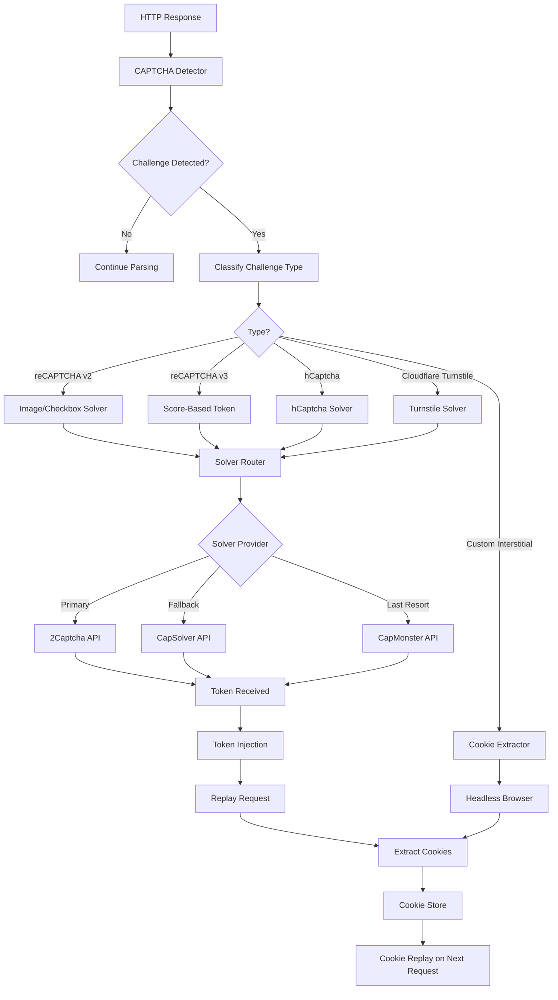
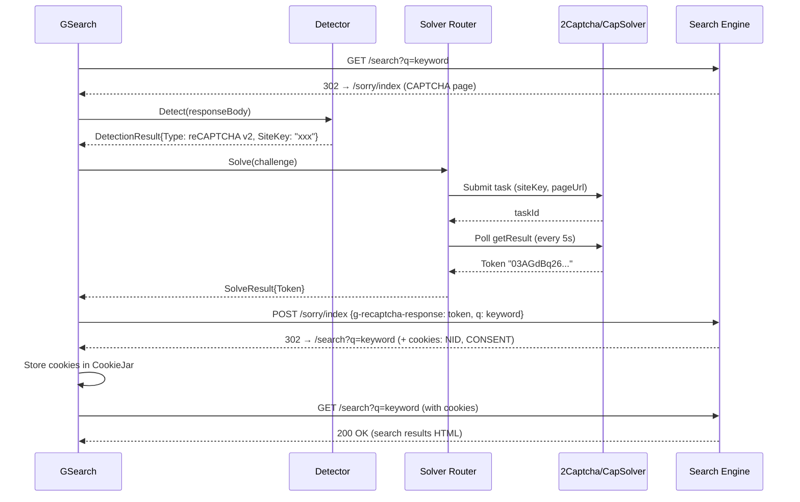

# Component: CAPTCHA Handling

**Parent:** [Golang Search CLI](./00-overview.md)  
**Version:** 2.0.0  
**Status:** Active  
**Updated:** 2026-03-09  

---

## Cross-References

- [HTML Parser](./04-html-parser.md) — CAPTCHA detection triggers during parsing
- [Method Switching](./08-method-switching.md) — Fallback on CAPTCHA block
- [Error Codes](./15-error-codes.md) — `5001 ErrBlockedCaptcha`, `5008 ErrBotDetection`
- [Proxy Rotation](../../27-ai-bridge-cli/01-backend/29-gsearch-url-extraction.md) — Proxy integration for evasion
- [Stealth Scraping](./64-stealth-scraping.md) — Browser fingerprint evasion (planned)
- [Proxy Acquisition](./65-proxy-acquisition.md) — Provider integration (planned)

---

## Summary

Comprehensive CAPTCHA detection, classification, and bypass system for GSearch CLI. The system detects CAPTCHA challenges served by Google, Bing, and DuckDuckGo during HTML scraping, classifies challenge types, and routes to the appropriate solver service. Solved tokens are injected back into the request flow to complete the search. A cookie replay system caches authenticated sessions to minimize re-solves.

---

## Architecture



---

## CAPTCHA Detection Taxonomy

### Detection Signals

| Signal | Method | Confidence | Engine |
|--------|--------|-----------|--------|
| HTTP 429 + CAPTCHA body | Status code + body scan | High | All |
| HTTP 503 + challenge JS | Status code + script tag | High | Cloudflare |
| `<form>` with `g-recaptcha` class | DOM selector | Definitive | Google |
| `<div id="recaptcha">` | DOM selector | Definitive | Google |
| `data-sitekey` attribute present | Attribute scan | Definitive | All |
| `<iframe src="*recaptcha*">` | URL pattern in iframe | Definitive | Google |
| `<iframe src="*hcaptcha*">` | URL pattern in iframe | Definitive | DuckDuckGo |
| `/sorry/index` in URL | Redirect URL pattern | Definitive | Google |
| `unusual traffic` in body text | Text search | High | Google |
| `blocked` + `automated` in body | Text search | Medium | Bing |
| Response body < 5KB + no results | Heuristic | Low | All |
| `cf-challenge` meta tag | DOM selector | Definitive | Cloudflare |
| `turnstile` in script src | Script URL pattern | Definitive | Cloudflare |

### Challenge Type Classification

```go
// pkg/captcha/detector.go

package captcha

import (
    "strings"

    "github.com/PuerkitoBio/goquery"
    "gsearch/pkg/apperror"
)

// ChallengeType represents the type of CAPTCHA challenge
type ChallengeType byte

const (
    ChallengeRecaptchaV2  ChallengeType = iota
    ChallengeRecaptchaV3
    ChallengeHCaptcha
    ChallengeTurnstile
    ChallengeInterstitial // Custom JS challenge (no third-party solver)
    ChallengeUnknown
)

func (ct ChallengeType) String() string {
    switch ct {
    case ChallengeRecaptchaV2:
        return "recaptcha_v2"
    case ChallengeRecaptchaV3:
        return "recaptcha_v3"
    case ChallengeHCaptcha:
        return "hcaptcha"
    case ChallengeTurnstile:
        return "turnstile"
    case ChallengeInterstitial:
        return "interstitial"
    case ChallengeUnknown:
        return "unknown"
    default:
        panic("unhandled ChallengeType")
    }
}

// DetectionResult contains CAPTCHA detection output
type DetectionResult struct {
    Detected      bool          `json:"detected"`
    Type          ChallengeType `json:"type"`
    SiteKey       string        `json:"siteKey,omitempty"`       // Required for solver APIs
    PageUrl       string        `json:"pageUrl"`                 // The URL that triggered the challenge
    ActionUrl     string        `json:"actionUrl,omitempty"`     // Form submission URL for token injection
    DataS         string        `json:"dataS,omitempty"`         // Google's data-s parameter (reCAPTCHA v2)
    Confidence    float64       `json:"confidence"`              // 0.0–1.0 detection confidence
    RawHtml       string        `json:"-"`                       // Original response body (not serialized)
    Engine        string        `json:"engine"`                  // Which search engine triggered this
}

// Detector identifies CAPTCHA challenges in HTTP responses
type Detector struct {
    // Configurable text patterns per engine
    textSignals map[string][]string
}

// NewDetector creates a CAPTCHA detector
func NewDetector() *Detector {
    return &Detector{
        textSignals: map[string][]string{
            "google":     {"unusual traffic", "automated queries", "not a robot"},
            "bing":       {"blocked", "automated", "unusual activity"},
            "duckduckgo": {"blocked", "rate limit", "try again"},
        },
    }
}

// Detect analyzes an HTTP response body for CAPTCHA challenges
func (d *Detector) Detect(body string, pageUrl string, engine string) DetectionResult {
    result := DetectionResult{
        PageUrl: pageUrl,
        Engine:  engine,
    }

    doc, parseErr := goquery.NewDocumentFromReader(strings.NewReader(body))
    if parseErr != nil {
        return result
    }

    // 1. Check for reCAPTCHA v2 (image/checkbox challenge)
    if siteKey := d.findRecaptchaV2(doc); siteKey != "" {
        result.Detected = true
        result.Type = ChallengeRecaptchaV2
        result.SiteKey = siteKey
        result.DataS = d.extractDataS(doc)
        result.ActionUrl = d.extractFormAction(doc)
        result.Confidence = 1.0

        return result
    }

    // 2. Check for reCAPTCHA v3 (invisible/score-based)
    if siteKey := d.findRecaptchaV3(doc); siteKey != "" {
        result.Detected = true
        result.Type = ChallengeRecaptchaV3
        result.SiteKey = siteKey
        result.Confidence = 1.0

        return result
    }

    // 3. Check for hCaptcha
    if siteKey := d.findHCaptcha(doc); siteKey != "" {
        result.Detected = true
        result.Type = ChallengeHCaptcha
        result.SiteKey = siteKey
        result.ActionUrl = d.extractFormAction(doc)
        result.Confidence = 1.0

        return result
    }

    // 4. Check for Cloudflare Turnstile
    if siteKey := d.findTurnstile(doc); siteKey != "" {
        result.Detected = true
        result.Type = ChallengeTurnstile
        result.SiteKey = siteKey
        result.Confidence = 1.0

        return result
    }

    // 5. Check for interstitial (custom JS challenge, e.g., Google /sorry/)
    if d.isInterstitial(body, pageUrl) {
        result.Detected = true
        result.Type = ChallengeInterstitial
        result.Confidence = 0.9

        return result
    }

    // 6. Text-based heuristic detection
    if d.hasTextSignals(body, engine) {
        result.Detected = true
        result.Type = ChallengeUnknown
        result.Confidence = 0.6

        return result
    }

    return result
}

// findRecaptchaV2 looks for reCAPTCHA v2 markers
func (d *Detector) findRecaptchaV2(doc *goquery.Document) string {
    // Check div.g-recaptcha data-sitekey
    siteKey, exists := doc.Find("div.g-recaptcha").Attr("data-sitekey")
    if exists && siteKey != "" {
        return siteKey
    }

    // Check iframe src containing /recaptcha/api2/
    doc.Find("iframe").Each(func(_ int, s *goquery.Selection) {
        src, _ := s.Attr("src")
        if strings.Contains(src, "/recaptcha/api2/anchor") {
            // Extract sitekey from iframe URL query param k=
            if idx := strings.Index(src, "k="); idx != -1 {
                end := strings.IndexAny(src[idx+2:], "&# ")
                if end == -1 {
                    siteKey = src[idx+2:]
                } else {
                    siteKey = src[idx+2 : idx+2+end]
                }
            }
        }
    })

    return siteKey
}

// findRecaptchaV3 looks for reCAPTCHA v3 markers (invisible)
func (d *Detector) findRecaptchaV3(doc *goquery.Document) string {
    var siteKey string
    doc.Find("script").Each(func(_ int, s *goquery.Selection) {
        src, _ := s.Attr("src")
        // reCAPTCHA v3 loads via recaptcha/api.js?render=SITEKEY
        if strings.Contains(src, "recaptcha") && strings.Contains(src, "render=") {
            if idx := strings.Index(src, "render="); idx != -1 {
                end := strings.IndexAny(src[idx+7:], "&# ")
                if end == -1 {
                    siteKey = src[idx+7:]
                } else {
                    siteKey = src[idx+7 : idx+7+end]
                }
            }
        }
    })

    return siteKey
}

// findHCaptcha looks for hCaptcha markers
func (d *Detector) findHCaptcha(doc *goquery.Document) string {
    siteKey, exists := doc.Find("div.h-captcha").Attr("data-sitekey")
    if exists && siteKey != "" {
        return siteKey
    }

    // Check iframe src containing hcaptcha.com
    doc.Find("iframe").Each(func(_ int, s *goquery.Selection) {
        src, _ := s.Attr("src")
        if strings.Contains(src, "hcaptcha.com") {
            if idx := strings.Index(src, "sitekey="); idx != -1 {
                end := strings.IndexAny(src[idx+8:], "&# ")
                if end == -1 {
                    siteKey = src[idx+8:]
                } else {
                    siteKey = src[idx+8 : idx+8+end]
                }
            }
        }
    })

    return siteKey
}

// findTurnstile looks for Cloudflare Turnstile markers
func (d *Detector) findTurnstile(doc *goquery.Document) string {
    siteKey, exists := doc.Find("div.cf-turnstile").Attr("data-sitekey")
    if exists {
        return siteKey
    }

    // Check for Turnstile script tag
    doc.Find("script").Each(func(_ int, s *goquery.Selection) {
        src, _ := s.Attr("src")
        if strings.Contains(src, "challenges.cloudflare.com/turnstile") {
            siteKey = "turnstile-detected" // Sitekey must be extracted from div
        }
    })

    return siteKey
}

// isInterstitial detects custom interstitial pages (e.g., Google /sorry/)
func (d *Detector) isInterstitial(body string, pageUrl string) bool {
    return strings.Contains(pageUrl, "/sorry/index") ||
        strings.Contains(pageUrl, "/sorry?") ||
        (strings.Contains(body, "captcha") && strings.Contains(body, "form"))
}

// hasTextSignals checks for engine-specific blocking text
func (d *Detector) hasTextSignals(body string, engine string) bool {
    lower := strings.ToLower(body)
    signals, ok := d.textSignals[engine]
    if !ok {
        return false
    }

    matchCount := 0
    for _, signal := range signals {
        if strings.Contains(lower, signal) {
            matchCount++
        }
    }

    // Require ≥2 signals for medium confidence
    return matchCount >= 2
}
```

---

## Solver Service Integration

### Provider Architecture

```go
// pkg/captcha/solver.go

package captcha

import (
    "context"
    "time"

    "gsearch/pkg/apperror"
)

// SolveResult contains the solver response
type SolveResult struct {
    Token      string        `json:"token"`       // The CAPTCHA response token
    SolveTime  time.Duration `json:"solveTime"`   // Time to solve
    Provider   string        `json:"provider"`    // Which provider solved it
    Cost       float64       `json:"cost"`        // Cost in USD for this solve
    TaskId     string        `json:"taskId"`      // Provider's task ID for reporting
}

// Solver defines the interface for CAPTCHA solving services
type Solver interface {
    // Solve submits a CAPTCHA challenge and returns the token
    Solve(context context.Context, challenge DetectionResult) apperror.Result[SolveResult]
    
    // GetBalance returns the current account balance in USD
    GetBalance(context context.Context) apperror.Result[float64]
    
    // ReportBad reports an incorrect solve (for refund/quality improvement)
    ReportBad(context context.Context, taskId string) *apperror.AppError
    
    // Name returns the provider name
    Name() string
    
    // SupportsType checks if this solver handles a given challenge type
    SupportsType(challengeType ChallengeType) bool
}
```

### Solver Router (Priority-Based Fallback)

```go
// pkg/captcha/router.go

package captcha

import (
    "context"
    "net/http"
    "sync"
    "time"

    "github.com/rs/zerolog/log"
    "gsearch/pkg/apperror"
)

// RouterConfig configures solver routing behavior
type RouterConfig struct {
    // Provider priority order (first = highest priority)
    ProviderOrder   []string      `mapstructure:"ProviderOrder"`
    
    // Maximum time to wait for any single solve attempt
    SolveTimeout    time.Duration `mapstructure:"SolveTimeout"`
    
    // Minimum account balance before disabling a provider (USD)
    MinBalance      float64       `mapstructure:"MinBalance"`
    
    // How often to re-check disabled provider balances
    BalanceCheckInterval time.Duration `mapstructure:"BalanceCheckInterval"`
    
    // Maximum cost per solve before skipping provider (USD)
    MaxCostPerSolve float64       `mapstructure:"MaxCostPerSolve"`
}

// DefaultRouterConfig returns production defaults
func DefaultRouterConfig() RouterConfig {
    return RouterConfig{
        ProviderOrder:        []string{"2captcha", "capsolver", "capmonster"},
        SolveTimeout:         120 * time.Second,
        MinBalance:           0.50,
        BalanceCheckInterval: 30 * time.Minute,
        MaxCostPerSolve:      0.01,
    }
}

// SolverRouter routes CAPTCHA challenges to the best available solver
type SolverRouter struct {
    config    RouterConfig
    solvers   map[string]Solver
    disabled  map[string]time.Time  // Provider → disabled-until timestamp
    mu        sync.RWMutex
    metrics   *SolverMetrics
}

// NewSolverRouter creates a router with registered solvers
func NewSolverRouter(config RouterConfig, solvers ...Solver) *SolverRouter {
    m := make(map[string]Solver)
    for _, s := range solvers {
        m[s.Name()] = s
    }

    return &SolverRouter{
        config:   config,
        solvers:  m,
        disabled: make(map[string]time.Time),
        metrics:  NewSolverMetrics(),
    }
}

// Solve routes a challenge to the best available provider
func (r *SolverRouter) Solve(context context.Context, challenge DetectionResult) apperror.Result[SolveResult] {
    solveContext, cancel := context.WithTimeout(context, r.config.SolveTimeout)
    defer cancel()

    var lastErr *apperror.AppError

    for _, name := range r.config.ProviderOrder {
        solver, ok := r.solvers[name]
        if !ok {
            continue
        }

        // Skip disabled providers
        if r.isDisabled(name) {
            log.Debug().Str("provider", name).Msg("Solver provider disabled, skipping")
            continue
        }

        // Skip if provider doesn't support this challenge type
        if !solver.SupportsType(challenge.Type) {
            continue
        }

        log.Info().
            Str("provider", name).
            Str("type", challenge.Type.String()).
            Str("siteKey", challenge.SiteKey).
            Msg("Attempting CAPTCHA solve")

        solveResult := solver.Solve(solveContext, challenge)
        if solveResult.IsSuccess() {
            solved := solveResult.Value()
            r.metrics.RecordSolve(name, challenge.Type, solved.SolveTime, solved.Cost, true)
            log.Info().
                Str("provider", name).
                Dur("solveTime", solved.SolveTime).
                Float64("cost", solved.Cost).
                Msg("CAPTCHA solved successfully")

            return apperror.Ok(solved)
        }

        lastErr = solveResult.Error()
        r.metrics.RecordSolve(name, challenge.Type, 0, 0, false)
        log.Warn().Err(lastErr).Str("provider", name).Msg("Solver failed, trying next")

        // Check if failure is due to low balance → disable provider
        balanceResult := solver.GetBalance(solveContext)
        if balanceResult.IsSuccess() && balanceResult.Value() < r.config.MinBalance {
            r.disable(name, r.config.BalanceCheckInterval)
            log.Warn().
                Str("provider", name).
                Float64("balance", balanceResult.Value()).
                Msg("Provider disabled due to low balance")
        }
    }

    if lastErr != nil {
        return apperror.Fail[SolveResult](
            apperror.Wrap(
                lastErr,
                5090,
                "all CAPTCHA solvers failed",
            ),
        )
    }

    return apperror.Fail[SolveResult](
        apperror.New(
            5091,
            "no solvers available for challenge type: "+challenge.Type.String(),
        ),
    )
}
```

### 2Captcha Provider

```go
// pkg/captcha/providers/twocaptcha.go

package providers

import (
    "context"
    "encoding/json"
    "fmt"
    "io"
    "net/http"
    "net/url"
    "time"

    "gsearch/pkg/apperror"
    "gsearch/pkg/captcha"
)

const twoCaptchaBaseUrl = "https://2captcha.com"

// TwoCaptcha implements the Solver interface for 2captcha.com
type TwoCaptcha struct {
    apiKey     string
    httpClient *http.Client
    pollDelay  time.Duration  // Delay between status polls (default: 5s)
}

// TwoCaptchaConfig configures the 2Captcha provider
type TwoCaptchaConfig struct {
    ApiKey    string        `mapstructure:"ApiKey"`     // Required: 2Captcha API key
    PollDelay time.Duration `mapstructure:"PollDelay"`  // Default: 5s
    Timeout   time.Duration `mapstructure:"Timeout"`    // Default: 120s
}

func NewTwoCaptcha(cfg TwoCaptchaConfig) *TwoCaptcha {
    if cfg.PollDelay == 0 {
        cfg.PollDelay = 5 * time.Second
    }

    return &TwoCaptcha{
        apiKey:     cfg.ApiKey,
        httpClient: &http.Client{Timeout: cfg.Timeout},
        pollDelay:  cfg.PollDelay,
    }
}

func (t *TwoCaptcha) Name() string { return "2captcha" }

func (t *TwoCaptcha) SupportsType(ct captcha.ChallengeType) bool {
    switch ct {
    case captcha.ChallengeRecaptchaV2, captcha.ChallengeRecaptchaV3,
        captcha.ChallengeHCaptcha, captcha.ChallengeTurnstile:
        return true
    default:
        return false
    }
}

// Solve submits a task and polls for the result
func (t *TwoCaptcha) Solve(context context.Context, challenge captcha.DetectionResult) apperror.Result[captcha.SolveResult] {
    start := time.Now()

    // Step 1: Submit task via in.php
    submitResult := t.submitTask(context, challenge)
    if submitResult.HasError() {
        return apperror.Fail[captcha.SolveResult](submitResult.Error())
    }

    taskId := submitResult.Value()

    // Step 2: Poll res.php until solved
    pollResult := t.pollResult(context, taskId)
    if pollResult.HasError() {
        return apperror.Fail[captcha.SolveResult](pollResult.Error())
    }

    return apperror.Ok(captcha.SolveResult{
        Token:     pollResult.Value(),
        SolveTime: time.Since(start),
        Provider:  "2captcha",
        Cost:      t.estimateCost(challenge.Type),
        TaskId:    taskId,
    })
}

// submitTask sends the CAPTCHA to 2Captcha's in.php endpoint
func (t *TwoCaptcha) submitTask(context context.Context, challenge captcha.DetectionResult) apperror.Result[string] {
    params := url.Values{
        "key":       {t.apiKey},
        "json":      {"1"},
        "pageurl":   {challenge.PageUrl},
    }

    switch challenge.Type {
    case captcha.ChallengeRecaptchaV2:
        params.Set("method", "userrecaptcha")
        params.Set("googlekey", challenge.SiteKey)
        if challenge.DataS != "" {
            params.Set("data-s", challenge.DataS)
        }
    case captcha.ChallengeRecaptchaV3:
        params.Set("method", "userrecaptcha")
        params.Set("googlekey", challenge.SiteKey)
        params.Set("version", "v3")
        params.Set("min_score", "0.9")
        params.Set("action", "search")
    case captcha.ChallengeHCaptcha:
        params.Set("method", "hcaptcha")
        params.Set("sitekey", challenge.SiteKey)
    case captcha.ChallengeTurnstile:
        params.Set("method", "turnstile")
        params.Set("sitekey", challenge.SiteKey)
    }

    req, _ := http.NewRequestWithContext(
        context,
        http.MethodPost,
        twoCaptchaBaseUrl+"/in.php",
        nil,
    )
    req.URL.RawQuery = params.Encode()

    resp, httpErr := t.httpClient.Do(req)
    if httpErr != nil {
        return apperror.Fail[string](
            apperror.Wrap(
                httpErr,
                5092,
                "2captcha submit request failed",
            ),
        )
    }
    defer resp.Body.Close()

    var result struct {
        Status  int    `json:"status"`
        Request string `json:"request"`
    }

    decErr := json.NewDecoder(resp.Body).Decode(&result)
    if decErr != nil {
        return apperror.Fail[string](
            apperror.Wrap(
                decErr,
                5093,
                "2captcha submit response decode failed",
            ),
        )
    }

    if result.Status != 1 {
        return apperror.Fail[string](
            apperror.New(
                5094,
                "2captcha submit rejected: "+result.Request,
            ),
        )
    }

    return apperror.Ok(result.Request) // result.Request is the task ID
}

// pollResult polls 2Captcha until the solve is ready
func (t *TwoCaptcha) pollResult(context context.Context, taskId string) apperror.Result[string] {
    params := url.Values{
        "key":    {t.apiKey},
        "action": {"get"},
        "id":     {taskId},
        "json":   {"1"},
    }

    for {
        select {
        case <-context.Done():
            return apperror.Fail[string](
                apperror.New(
                    5095,
                    "2captcha solve timeout: context cancelled",
                ),
            )
        case <-time.After(t.pollDelay):
        }

        req, _ := http.NewRequestWithContext(
            context,
            http.MethodGet,
            twoCaptchaBaseUrl+"/res.php?"+params.Encode(),
            nil,
        )

        resp, httpErr := t.httpClient.Do(req)
        if httpErr != nil {
            continue // Transient network error, retry
        }

        body, _ := io.ReadAll(resp.Body)
        resp.Body.Close()

        var result struct {
            Status  int    `json:"status"`
            Request string `json:"request"`
        }

        if json.Unmarshal(body, &result) != nil {
            continue
        }

        if result.Request == "CAPCHA_NOT_READY" {
            continue
        }

        if result.Status == 1 {
            return apperror.Ok(result.Request) // Token
        }

        return apperror.Fail[string](
            apperror.New(
                5096,
                "2captcha solve error: "+result.Request,
            ),
        )
    }
}

func (t *TwoCaptcha) GetBalance(context context.Context) apperror.Result[float64] {
    req, _ := http.NewRequestWithContext(
        context,
        http.MethodGet,
        fmt.Sprintf("%s/res.php?key=%s&action=getbalance&json=1", twoCaptchaBaseUrl, t.apiKey),
        nil,
    )

    resp, httpErr := t.httpClient.Do(req)
    if httpErr != nil {
        return apperror.Fail[float64](
            apperror.Wrap(
                httpErr,
                5097,
                "2captcha balance check failed",
            ),
        )
    }
    defer resp.Body.Close()

    var result struct {
        Request float64 `json:"request"`
    }

    json.NewDecoder(resp.Body).Decode(&result)

    return apperror.Ok(result.Request)
}

func (t *TwoCaptcha) ReportBad(context context.Context, taskId string) *apperror.AppError {
    req, _ := http.NewRequestWithContext(
        context,
        http.MethodGet,
        fmt.Sprintf("%s/res.php?key=%s&action=reportbad&id=%s&json=1", twoCaptchaBaseUrl, t.apiKey, taskId),
        nil,
    )

    _, httpErr := t.httpClient.Do(req)
    if httpErr != nil {
        return apperror.Wrap(
            httpErr,
            5098,
            "2captcha reportbad failed",
        )
    }

    return nil
}
```

### CapSolver Provider

```go
// pkg/captcha/providers/capsolver.go

package providers

import (
    "bytes"
    "context"
    "encoding/json"
    "net/http"
    "time"

    "gsearch/pkg/apperror"
    "gsearch/pkg/captcha"
)

const capSolverBaseUrl = "https://api.capsolver.com"

// CapSolver implements the Solver interface for capsolver.com
type CapSolver struct {
    apiKey     string
    httpClient *http.Client
    pollDelay  time.Duration
}

// CapSolverConfig configures the CapSolver provider
type CapSolverConfig struct {
    ApiKey    string        `mapstructure:"ApiKey"`
    PollDelay time.Duration `mapstructure:"PollDelay"`  // Default: 3s (CapSolver is typically faster)
    Timeout   time.Duration `mapstructure:"Timeout"`
}

func NewCapSolver(cfg CapSolverConfig) *CapSolver {
    if cfg.PollDelay == 0 {
        cfg.PollDelay = 3 * time.Second
    }

    return &CapSolver{
        apiKey:     cfg.ApiKey,
        httpClient: &http.Client{Timeout: cfg.Timeout},
        pollDelay:  cfg.PollDelay,
    }
}

func (c *CapSolver) Name() string { return "capsolver" }

func (c *CapSolver) SupportsType(ct captcha.ChallengeType) bool {
    switch ct {
    case captcha.ChallengeRecaptchaV2, captcha.ChallengeRecaptchaV3,
        captcha.ChallengeHCaptcha, captcha.ChallengeTurnstile:
        return true
    default:
        return false
    }
}

// Solve uses CapSolver's createTask/getTaskResult flow
func (c *CapSolver) Solve(context context.Context, challenge captcha.DetectionResult) apperror.Result[captcha.SolveResult] {
    start := time.Now()

    // Map challenge type to CapSolver task type
    taskType := c.mapTaskType(challenge.Type)

    // Step 1: createTask — typed payload structs per strong-typing mandate
    type CapSolverTask struct {
        Type       string  `json:"type"`
        WebsiteUrl string  `json:"websiteUrl"`
        WebsiteKey string  `json:"websiteKey"`
        PageAction string  `json:"pageAction,omitempty"`
        MinScore   float64 `json:"minScore,omitempty"`
    }
    type CapSolverCreateRequest struct {
        ClientKey string         `json:"clientKey"`
        Task      CapSolverTask  `json:"task"`
    }

    task := CapSolverTask{
        Type:       taskType,
        WebsiteUrl: challenge.PageUrl,
        WebsiteKey: challenge.SiteKey,
    }

    if challenge.Type == captcha.ChallengeRecaptchaV3 {
        task.PageAction = "search"
        task.MinScore = 0.9
    }

    createPayload := CapSolverCreateRequest{
        ClientKey: c.apiKey,
        Task:      task,
    }

    body, _ := json.Marshal(createPayload)
    req, _ := http.NewRequestWithContext(
        context,
        http.MethodPost,
        capSolverBaseUrl+"/createTask",
        bytes.NewReader(body),
    )
    req.Header.Set("Content-Type", "application/json")

    resp, httpErr := c.httpClient.Do(req)
    if httpErr != nil {
        return apperror.Fail[captcha.SolveResult](
            apperror.Wrap(
                httpErr,
                5100,
                "capsolver createTask failed",
            ),
        )
    }
    defer resp.Body.Close()

    var createResult struct {
        ErrorId          int    `json:"errorId"`
        ErrorDescription string `json:"errorDescription"`
        TaskId           string `json:"taskId"`
    }

    json.NewDecoder(resp.Body).Decode(&createResult)
    if createResult.ErrorId != 0 {
        return apperror.Fail[captcha.SolveResult](
            apperror.New(
                5101,
                "capsolver task rejected: "+createResult.ErrorDescription,
            ),
        )
    }

    // Step 2: poll getTaskResult
    pollResult := c.pollResult(context, createResult.TaskId)
    if pollResult.HasError() {
        return apperror.Fail[captcha.SolveResult](pollResult.Error())
    }

    return apperror.Ok(captcha.SolveResult{
        Token:     pollResult.Value(),
        SolveTime: time.Since(start),
        Provider:  "capsolver",
        Cost:      c.estimateCost(challenge.Type),
        TaskId:    createResult.TaskId,
    })
}

func (c *CapSolver) mapTaskType(ct captcha.ChallengeType) string {
    switch ct {
    case captcha.ChallengeRecaptchaV2:
        return "ReCaptchaV2TaskProxyLess"
    case captcha.ChallengeRecaptchaV3:
        return "ReCaptchaV3TaskProxyLess"
    case captcha.ChallengeHCaptcha:
        return "HCaptchaTaskProxyLess"
    case captcha.ChallengeTurnstile:
        return "AntiTurnstileTaskProxyLess"
    default:
        return "ReCaptchaV2TaskProxyLess"
    }
}
```

---

## Token Injection Flows

### reCAPTCHA v2 Token Injection

The solver returns a `g-recaptcha-response` token. This token must be submitted to the original page's form action URL.



```go
// pkg/captcha/injector.go

package captcha

import (
    "context"
    "net/http"
    "net/url"
    "strings"

    "gsearch/pkg/apperror"
)

// TokenInjector submits solved tokens back to the search engine
type TokenInjector struct {
    httpClient *http.Client
    cookieJar  http.CookieJar
}

// InjectRecaptchaV2 submits the token via POST to the form action URL
func (inj *TokenInjector) InjectRecaptchaV2(
    context context.Context,
    challenge DetectionResult,
    solveResult SolveResult,
) apperror.Result[*http.Response] {
    formData := url.Values{
        "g-recaptcha-response": {solveResult.Token},
    }

    // Google's /sorry/ page includes a 'q' param and 'continue' URL
    if challenge.Engine == "google" {
        // Parse the original CAPTCHA page URL for 'continue' parameter
        u, _ := url.Parse(challenge.PageUrl)
        if cont := u.Query().Get("continue"); cont != "" {
            formData.Set("continue", cont)
        }

        if q := u.Query().Get("q"); q != "" {
            formData.Set("q", q)
        }
    }

    actionUrl := challenge.ActionUrl
    if actionUrl == "" {
        actionUrl = challenge.PageUrl // Fallback: submit to same URL
    }

    req, _ := http.NewRequestWithContext(
        context,
        http.MethodPost,
        actionUrl,
        strings.NewReader(formData.Encode()),
    )
    req.Header.Set("Content-Type", "application/x-www-form-urlencoded")
    req.Header.Set("Referer", challenge.PageUrl)

    resp, httpErr := inj.httpClient.Do(req)
    if httpErr != nil {
        return apperror.Fail[*http.Response](
            apperror.Wrap(
                httpErr,
                5110,
                "reCAPTCHA v2 token injection failed",
            ),
        )
    }

    return apperror.Ok(resp)
}
```

### reCAPTCHA v3 Token Injection

reCAPTCHA v3 is invisible and score-based. The token is injected differently — it must be included as a hidden form field or sent via the `X-Recaptcha-Token` header depending on the site implementation.

```go
// InjectRecaptchaV3 injects the token as a request header or form field
func (inj *TokenInjector) InjectRecaptchaV3(
    context context.Context,
    challenge DetectionResult,
    solveResult SolveResult,
    originalRequest *http.Request,
) apperror.Result[*http.Response] {
    // Clone the original request and add the token
    req := originalRequest.Clone(context)
    
    // Strategy 1: Add as header (preferred for API-style endpoints)
    req.Header.Set("X-Recaptcha-Token", solveResult.Token)
    
    // Strategy 2: Append to query string (fallback)
    q := req.URL.Query()
    q.Set("g-recaptcha-response", solveResult.Token)
    req.URL.RawQuery = q.Encode()

    resp, httpErr := inj.httpClient.Do(req)
    if httpErr != nil {
        return apperror.Fail[*http.Response](
            apperror.Wrap(
                httpErr,
                5111,
                "reCAPTCHA v3 token injection failed",
            ),
        )
    }

    return apperror.Ok(resp)
}
```

---

## Cookie Replay Strategy

Solved CAPTCHA sessions produce authenticated cookies. Replaying these cookies on subsequent requests avoids re-solving.

### Cookie Store

```go
// pkg/captcha/cookies.go

package captcha

import (
    "net/http"
    "net/url"
    "sync"
    "time"

    "github.com/rs/zerolog/log"
)

// CookieEntry represents a cached cookie set with metadata
type CookieEntry struct {
    Cookies    []*http.Cookie `json:"cookies"`
    Domain     string         `json:"domain"`
    CapturedAt time.Time      `json:"capturedAt"`
    ExpiresAt  time.Time      `json:"expiresAt"`
    SolveCount int            `json:"solveCount"` // How many times this domain required solving
    ProxyUsed  string         `json:"proxyUsed"`  // Which proxy IP was used during solve
}

// CookieStore caches solved CAPTCHA session cookies per domain+proxy
type CookieStore struct {
    entries map[string]*CookieEntry // Key: "domain:proxyIp" or "domain:direct"
    mu      sync.RWMutex
    maxAge  time.Duration           // Default: 30 minutes
}

// NewCookieStore creates a cookie store
func NewCookieStore(maxAge time.Duration) *CookieStore {
    if maxAge == 0 {
        maxAge = 30 * time.Minute
    }

    return &CookieStore{
        entries: make(map[string]*CookieEntry),
        maxAge:  maxAge,
    }
}

// cacheKey builds a domain+proxy composite key
func cacheKey(domain, proxyIp string) string {
    if proxyIp == "" {
        proxyIp = "direct"
    }

    return domain + ":" + proxyIp
}

// Store saves cookies after a successful CAPTCHA solve
func (cs *CookieStore) Store(domain string, proxyIp string, cookies []*http.Cookie) {
    cs.mu.Lock()
    defer cs.mu.Unlock()

    key := cacheKey(domain, proxyIp)
    existing, ok := cs.entries[key]
    solveCount := 1
    if ok {
        solveCount = existing.SolveCount + 1
    }

    cs.entries[key] = &CookieEntry{
        Cookies:    cookies,
        Domain:     domain,
        CapturedAt: time.Now(),
        ExpiresAt:  time.Now().Add(cs.maxAge),
        SolveCount: solveCount,
        ProxyUsed:  proxyIp,
    }

    log.Debug().
        Str("domain", domain).
        Str("proxy", proxyIp).
        Int("cookieCount", len(cookies)).
        Int("totalSolves", solveCount).
        Msg("Stored CAPTCHA cookies")
}

// Get retrieves valid cookies for a domain+proxy combination
func (cs *CookieStore) Get(domain string, proxyIp string) ([]*http.Cookie, bool) {
    cs.mu.RLock()
    defer cs.mu.RUnlock()

    key := cacheKey(domain, proxyIp)
    entry, ok := cs.entries[key]
    if !ok || time.Now().After(entry.ExpiresAt) {
        return nil, false
    }

    return entry.Cookies, true
}

// ApplyToRequest attaches cached cookies to an outgoing HTTP request
func (cs *CookieStore) ApplyToRequest(req *http.Request, proxyIp string) bool {
    domain := req.URL.Hostname()
    cookies, ok := cs.Get(domain, proxyIp)
    if !ok {
        return false
    }

    for _, c := range cookies {
        req.AddCookie(c)
    }

    log.Debug().
        Str("domain", domain).
        Int("cookies", len(cookies)).
        Msg("Applied cached CAPTCHA cookies to request")

    return true
}

// Invalidate removes cookies for a domain (e.g., after a new CAPTCHA challenge)
func (cs *CookieStore) Invalidate(domain string, proxyIp string) {
    cs.mu.Lock()
    defer cs.mu.Unlock()

    key := cacheKey(domain, proxyIp)
    delete(cs.entries, key)
}

// Cleanup removes expired entries
func (cs *CookieStore) Cleanup() int {
    cs.mu.Lock()
    defer cs.mu.Unlock()

    removed := 0
    now := time.Now()
    for key, entry := range cs.entries {
        if now.After(entry.ExpiresAt) {
            delete(cs.entries, key)
            removed++
        }
    }

    return removed
}
```

### Integration with HTTP Pipeline

```go
// pkg/captcha/middleware.go

package captcha

import (
    "context"
    "io"
    "net/http"
    "net/url"
    "strings"

    "github.com/rs/zerolog/log"
    "gsearch/pkg/apperror"
)

// Middleware wraps the HTTP pipeline with CAPTCHA detection, solving, and cookie replay
type Middleware struct {
    detector    *Detector
    router      *SolverRouter
    injector    *TokenInjector
    cookieStore *CookieStore
    maxRetries  int  // Max CAPTCHA solves per request (default: 2)
}

// MiddlewareConfig configures the CAPTCHA middleware
type MiddlewareConfig struct {
    Enabled     bool          `mapstructure:"Enabled"`
    MaxRetries  int           `mapstructure:"MaxRetries"`   // Default: 2
    CookieMaxAge string      `mapstructure:"CookieMaxAge"` // Default: "30m"
}

// Process wraps an HTTP request with CAPTCHA handling
func (m *Middleware) Process(
    context context.Context,
    req *http.Request,
    engine string,
    proxyIp string,
    doRequest func(*http.Request) (*http.Response, error), // EXEMPTED: http.RoundTripper callback
) apperror.Result[*http.Response] {
    // Step 1: Apply cached cookies if available
    m.cookieStore.ApplyToRequest(req, proxyIp)

    // Step 2: Execute the request
    resp, requestErr := doRequest(req)
    if requestErr != nil {
        return apperror.Fail[*http.Response](
            apperror.Wrap(
                requestErr,
                5120,
                "HTTP request failed",
            ),
        )
    }

    // Step 3: Check for CAPTCHA in response
    for attempt := 0; attempt < m.maxRetries; attempt++ {
        bodyBytes, _ := io.ReadAll(resp.Body)
        resp.Body.Close()
        bodyStr := string(bodyBytes)

        detection := m.detector.Detect(bodyStr, req.URL.String(), engine)
        if !detection.Detected {
            // No CAPTCHA — return the response (re-wrap body)
            resp.Body = io.NopCloser(strings.NewReader(bodyStr))

            return apperror.Ok(resp)
        }

        log.Warn().
            Str("type", detection.Type.String()).
            Str("engine", engine).
            Int("attempt", attempt+1).
            Msg("CAPTCHA detected, solving")

        // Invalidate stale cookies
        m.cookieStore.Invalidate(req.URL.Hostname(), proxyIp)

        // Step 4: Handle interstitial (no solver needed — use headless browser)
        if detection.Type == ChallengeInterstitial {
            return apperror.Fail[*http.Response](
                apperror.New(
                    5121,
                    "interstitial challenge requires headless browser — escalate to stealth scraper",
                ),
            )
        }

        // Step 5: Solve
        solveResult := m.router.Solve(context, detection)
        if solveResult.HasError() {
            return apperror.Fail[*http.Response](
                apperror.Wrap(
                    solveResult.Error(),
                    5122,
                    "CAPTCHA solve failed",
                ),
            )
        }

        solved := solveResult.Value()

        // Step 6: Inject token
        var injResp *http.Response
        switch detection.Type {
        case ChallengeRecaptchaV2, ChallengeHCaptcha, ChallengeTurnstile:
            injResult := m.injector.InjectRecaptchaV2(context, detection, solved)
            if injResult.HasError() {
                return apperror.Fail[*http.Response](injResult.Error())
            }

            injResp = injResult.Value()
        case ChallengeRecaptchaV3:
            injResult := m.injector.InjectRecaptchaV3(context, detection, solved, req)
            if injResult.HasError() {
                return apperror.Fail[*http.Response](injResult.Error())
            }

            injResp = injResult.Value()
        }

        // Step 7: Extract and store cookies from response
        if injResp != nil {
            u, _ := url.Parse(req.URL.String())
            cookies := injResp.Cookies()
            if len(cookies) > 0 {
                m.cookieStore.Store(u.Hostname(), proxyIp, cookies)
            }

            resp = injResp
        }
    }

    return apperror.Fail[*http.Response](
        apperror.New(
            5123,
            "CAPTCHA solve exhausted max retries",
        ),
    )
}
```

---

## Cost Estimation

### Per-Solve Pricing (as of 2026-03)

| Challenge Type | 2Captcha | CapSolver | CapMonster |
|---------------|----------|-----------|------------|
| reCAPTCHA v2 | $2.99/1K ($0.00299) | $0.80/1K ($0.0008) | $0.60/1K ($0.0006) |
| reCAPTCHA v3 | $2.99/1K ($0.00299) | $1.40/1K ($0.0014) | $1.00/1K ($0.001) |
| hCaptcha | $2.99/1K ($0.00299) | $0.80/1K ($0.0008) | $0.60/1K ($0.0006) |
| Turnstile | $2.99/1K ($0.00299) | $0.80/1K ($0.0008) | N/A |

### Cost Tracking

```go
// pkg/captcha/metrics.go

package captcha

import (
    "sync"
    "time"
)

// SolverMetrics tracks cost and performance across providers
type SolverMetrics struct {
    mu     sync.RWMutex
    solves []SolveRecord
}

// SolveRecord logs a single solve attempt
type SolveRecord struct {
    Provider    string        `json:"provider"`
    Type        ChallengeType `json:"type"`
    SolveTime   time.Duration `json:"solveTime"`
    Cost        float64       `json:"cost"`
    Success     bool          `json:"success"`
    Timestamp   time.Time     `json:"timestamp"`
}

func NewSolverMetrics() *SolverMetrics {
    return &SolverMetrics{}
}

func (m *SolverMetrics) RecordSolve(provider string, ct ChallengeType, solveTime time.Duration, cost float64, success bool) {
    m.mu.Lock()
    defer m.mu.Unlock()
    m.solves = append(m.solves, SolveRecord{
        Provider:  provider,
        Type:      ct,
        SolveTime: solveTime,
        Cost:      cost,
        Success:   success,
        Timestamp: time.Now(),
    })
}

// TotalCost returns total spend across all providers
func (m *SolverMetrics) TotalCost() float64 {
    m.mu.RLock()
    defer m.mu.RUnlock()
    total := 0.0
    for _, s := range m.solves {
        if s.Success {
            total += s.Cost
        }
    }

    return total
}

// CostByProvider returns spend per provider
func (m *SolverMetrics) CostByProvider() map[string]float64 {
    m.mu.RLock()
    defer m.mu.RUnlock()
    costs := make(map[string]float64)
    for _, s := range m.solves {
        if s.Success {
            costs[s.Provider] += s.Cost
        }
    }

    return costs
}

// SuccessRate returns success rate per provider (0.0–1.0)
func (m *SolverMetrics) SuccessRate() map[string]float64 {
    m.mu.RLock()
    defer m.mu.RUnlock()
    totals := make(map[string]int)
    successes := make(map[string]int)
    for _, s := range m.solves {
        totals[s.Provider]++
        if s.Success {
            successes[s.Provider]++
        }
    }

    rates := make(map[string]float64)
    for p, t := range totals {
        rates[p] = float64(successes[p]) / float64(t)
    }

    return rates
}

// AvgSolveTime returns average solve time per provider
func (m *SolverMetrics) AvgSolveTime() map[string]time.Duration {
    m.mu.RLock()
    defer m.mu.RUnlock()
    totals := make(map[string]time.Duration)
    counts := make(map[string]int)
    for _, s := range m.solves {
        if s.Success {
            totals[s.Provider] += s.SolveTime
            counts[s.Provider]++
        }
    }

    avgs := make(map[string]time.Duration)
    for p, t := range totals {
        avgs[p] = t / time.Duration(counts[p])
    }

    return avgs
}
```

### Monthly Cost Projections

| Scenario | Solves/Day | Provider | Monthly Cost |
|----------|-----------|----------|-------------|
| Light (personal) | 10 | CapSolver | ~$0.24 |
| Moderate (agency) | 100 | CapSolver | ~$2.40 |
| Heavy (enterprise) | 1,000 | CapSolver | ~$24.00 |
| Light (personal) | 10 | 2Captcha | ~$0.90 |
| Moderate (agency) | 100 | 2Captcha | ~$8.97 |
| Heavy (enterprise) | 1,000 | 2Captcha | ~$89.70 |

---

## Error Codes

| Code | Constant | Description | Retryable |
|------|----------|-------------|-----------|
| 5090 | `ErrCaptchaAllSolversFailed` | All solver providers failed | No |
| 5091 | `ErrCaptchaNoSolverAvailable` | No solver supports challenge type | No |
| 5092 | `ErrCaptcha2CSubmitFailed` | 2Captcha task submission HTTP error | Yes |
| 5093 | `ErrCaptcha2CDecodeError` | 2Captcha response decode error | Yes |
| 5094 | `ErrCaptcha2CRejected` | 2Captcha rejected the task | No |
| 5095 | `ErrCaptcha2CTimeout` | 2Captcha solve timed out | Yes |
| 5096 | `ErrCaptcha2CSolveError` | 2Captcha returned a solve error | No |
| 5097 | `ErrCaptcha2CBalanceCheck` | 2Captcha balance check failed | Yes |
| 5098 | `ErrCaptcha2CReportFailed` | 2Captcha bad report failed | Yes |
| 5100 | `ErrCaptchaCSCreateFailed` | CapSolver createTask failed | Yes |
| 5101 | `ErrCaptchaCSRejected` | CapSolver rejected the task | No |
| 5110 | `ErrCaptchaInjectV2Failed` | reCAPTCHA v2 token injection failed | Yes |
| 5111 | `ErrCaptchaInjectV3Failed` | reCAPTCHA v3 token injection failed | Yes |
| 5120 | `ErrCaptchaHttpFailed` | Underlying HTTP request failed | Yes |
| 5121 | `ErrCaptchaInterstitial` | Interstitial requires headless browser | No |
| 5122 | `ErrCaptchaSolveFailed` | CAPTCHA solve attempt failed | Yes |
| 5123 | `ErrCaptchaMaxRetries` | CAPTCHA solve exhausted max retries | No |

---

## Configuration

```json
{
  "captcha": {
    "enabled": true,
    "maxRetries": 2,
    "cookieMaxAge": "30m",
    "router": {
      "providerOrder": ["capsolver", "2captcha"],
      "solveTimeout": "120s",
      "minBalance": 0.50,
      "balanceCheckInterval": "30m",
      "maxCostPerSolve": 0.01
    },
    "providers": {
      "2captcha": {
        "apiKey": "${TWOCAPTCHA_API_KEY}",
        "pollDelay": "5s",
        "timeout": "120s"
      },
      "capsolver": {
        "apiKey": "${CAPSOLVER_API_KEY}",
        "pollDelay": "3s",
        "timeout": "90s"
      }
    }
  }
}
```

---

## Acceptance Criteria

| ID | Criterion | Priority |
|----|-----------|----------|
| CH-01 | Detector identifies reCAPTCHA v2 by sitekey in `div.g-recaptcha` | MUST |
| CH-02 | Detector identifies reCAPTCHA v3 by `render=` param in script src | MUST |
| CH-03 | Detector identifies hCaptcha by `div.h-captcha` or iframe src | MUST |
| CH-04 | Detector identifies Cloudflare Turnstile by `cf-turnstile` class | SHOULD |
| CH-05 | Detector identifies Google `/sorry/` interstitial by URL pattern | MUST |
| CH-06 | Router falls back to next provider when primary fails | MUST |
| CH-07 | Router disables provider when balance < threshold | MUST |
| CH-08 | Solved reCAPTCHA v2 token is successfully injected via POST | MUST |
| CH-09 | Cookies from solved session are stored and replayed on next request | MUST |
| CH-10 | Cookie replay avoids re-solving for subsequent requests within TTL | MUST |
| CH-11 | Cost metrics are tracked per provider and per challenge type | SHOULD |
| CH-12 | `ReportBad` is called when solver token fails validation | SHOULD |
| CH-13 | Interstitial challenges escalate to stealth scraper, not solver | MUST |

---

*Created 2026-03-05 — CAPTCHA handling subsystem for GSearch CLI*
