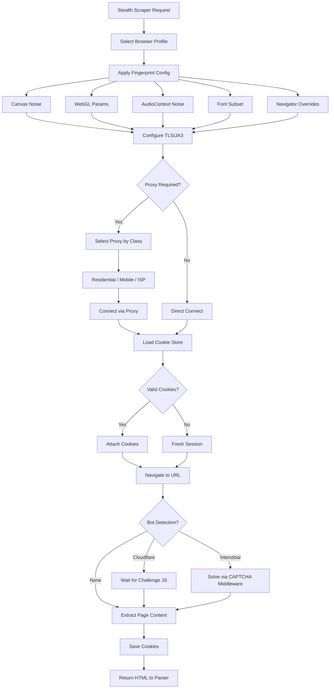

# Component: Stealth Scraping

**Parent:** [Golang Search CLI](./00-overview.md)  
**Version:** 2.0.0  
**Status:** Active  
**Updated:** 2026-03-09  

---

## Cross-References

- [CAPTCHA Handling](./63-captcha-handling.md) — Interstitial challenges escalate here
- [HTML Parser](./04-html-parser.md) — Stealth scraper produces parseable HTML
- [Method Switching](./08-method-switching.md) — Stealth scraping is last-resort method
- [Error Codes](./15-error-codes.md) — `5008 ErrBotDetection`
- [Proxy Acquisition](./65-proxy-acquisition.md) — Residential proxy classification (planned)
- [URL Extraction](../../27-ai-bridge-cli/01-backend/29-gsearch-url-extraction.md) — Proxy rotation integration

---

## Summary

Headless browser-based scraping subsystem using `go-rod` that evades bot detection through browser fingerprint randomization, TLS/JA3 fingerprint rotation, cookie persistence across sessions, and intelligent proxy classification. This is the **last-resort scraping method** — activated only when HTTP-based scraping fails due to CAPTCHA interstitials or aggressive bot detection that solver services cannot bypass.

---

## Architecture



---

## Browser Fingerprint Evasion

### Fingerprint Components

Modern bot detection systems (DataDome, PerimeterX, Cloudflare Bot Management, Akamai Bot Manager) collect a composite fingerprint from multiple browser APIs. Each component must be spoofed consistently to avoid detection.

| Component | Detection Method | Evasion Technique |
|-----------|-----------------|-------------------|
| Canvas | `toDataUrl()` hash | Per-session pixel noise injection |
| WebGL | Renderer/vendor strings + hash | GPU parameter spoofing |
| AudioContext | `OfflineAudioContext` output hash | Sample-level noise injection |
| Fonts | `measureText()` width enumeration | Subset restriction + metric noise |
| Navigator | `userAgent`, `platform`, `hardwareConcurrency`, `deviceMemory` | Consistent profile injection |
| Screen | `screen.width/height`, `availWidth/availHeight`, `colorDepth` | Resolution randomization within realistic ranges |
| WebRTC | `RTCPeerConnection` local IP leak | Disable or proxy WebRTC |
| Battery | `navigator.getBattery()` | Mock or disable API |
| Permissions | `navigator.permissions.query()` | Match expected browser behavior |

### Fingerprint Profile

```go
// pkg/stealth/profile.go

package stealth

import (
    "crypto/rand"
    "math/big"
    "time"
)

// FingerprintProfile represents a complete browser identity
type FingerprintProfile struct {
    ID          string    `json:"id"`
    CreatedAt   time.Time `json:"createdAt"`
    
    // Navigator
    UserAgent          string `json:"userAgent"`
    Platform           string `json:"platform"`
    HardwareConcurrency int   `json:"hardwareConcurrency"`
    DeviceMemory       int    `json:"deviceMemory"`        // GB: 2, 4, 8, 16
    MaxTouchPoints     int    `json:"maxTouchPoints"`
    Language           string `json:"language"`
    Languages          []string `json:"languages"`
    
    // Screen
    ScreenWidth    int `json:"screenWidth"`
    ScreenHeight   int `json:"screenHeight"`
    AvailWidth     int `json:"availWidth"`
    AvailHeight    int `json:"availHeight"`
    ColorDepth     int `json:"colorDepth"`     // 24 or 32
    PixelRatio     float64 `json:"pixelRatio"` // 1.0, 1.25, 1.5, 2.0
    
    // Canvas
    CanvasNoiseSeed int64 `json:"canvasNoiseSeed"`
    
    // WebGL
    WebGLVendor    string `json:"webglVendor"`
    WebGLRenderer  string `json:"webglRenderer"`
    
    // AudioContext
    AudioNoiseSeed int64 `json:"audioNoiseSeed"`
    
    // Fonts
    FontSubset []string `json:"fontSubset"`
    
    // TLS
    TLSProfile string `json:"tlsProfile"` // e.g., "chrome_120", "firefox_121"
    
    // Behavior
    ViewportJitter bool `json:"viewportJitter"` // Slight random viewport variation
}

// CommonResolutions defines realistic screen resolutions for desktop
var CommonResolutions = []struct{ W, H int }{
    {1920, 1080}, {2560, 1440}, {1366, 768}, {1536, 864},
    {1440, 900}, {1280, 720}, {3840, 2160}, {1600, 900},
    {1280, 1024}, {1680, 1050},
}

// CommonWebGLRenderers maps vendor→renderer pairs observed in real browsers
var CommonWebGLRenderers = []struct{ Vendor, Renderer string }{
    {"Google Inc. (NVIDIA)", "ANGLE (NVIDIA, NVIDIA GeForce RTX 3060 Direct3D11 vs_5_0 ps_5_0, D3D11)"},
    {"Google Inc. (NVIDIA)", "ANGLE (NVIDIA, NVIDIA GeForce RTX 4070 Direct3D11 vs_5_0 ps_5_0, D3D11)"},
    {"Google Inc. (Intel)", "ANGLE (Intel, Intel(R) UHD Graphics 630 Direct3D11 vs_5_0 ps_5_0, D3D11)"},
    {"Google Inc. (AMD)", "ANGLE (AMD, AMD Radeon RX 6700 XT Direct3D11 vs_5_0 ps_5_0, D3D11)"},
    {"Google Inc. (Intel)", "ANGLE (Intel, Intel(R) Iris(R) Xe Graphics Direct3D11 vs_5_0 ps_5_0, D3D11)"},
    {"Google Inc. (Apple)", "ANGLE (Apple, Apple M1 Pro, OpenGL 4.1)"},
    {"Google Inc. (Apple)", "ANGLE (Apple, Apple M2, OpenGL 4.1)"},
    {"Mozilla", "Mozilla"},  // Firefox generic
}

// CommonFonts defines the font superset from which subsets are drawn
var CommonFonts = []string{
    "Arial", "Verdana", "Helvetica", "Times New Roman", "Georgia",
    "Trebuchet MS", "Courier New", "Segoe UI", "Roboto", "Open Sans",
    "Tahoma", "Calibri", "Cambria", "Consolas", "Lucida Console",
    "Palatino Linotype", "Book Antiqua", "Impact", "Comic Sans MS",
    "Arial Black", "Lucida Sans Unicode", "Century Gothic",
}

// GenerateProfile creates a randomized but internally-consistent fingerprint
func GenerateProfile(browserType string) *FingerprintProfile {
    res := pickRandom(CommonResolutions)
    webgl := pickRandom(CommonWebGLRenderers)
    noiseSeed, _ := rand.Int(rand.Reader, big.NewInt(1<<32))
    audioSeed, _ := rand.Int(rand.Reader, big.NewInt(1<<32))
    
    // Select 14-18 fonts from the common set (real browsers have variable font counts)
    fontCount := 14 + randIntn(5)
    fonts := shuffleAndTake(CommonFonts, fontCount)
    
    profile := &FingerprintProfile{
        ID:        generateUUID(),
        CreatedAt: time.Now(),
        
        // Navigator — must match UserAgent
        Platform:            platformFromBrowser(browserType),
        HardwareConcurrency: pickFrom([]int{4, 8, 12, 16}),
        DeviceMemory:        pickFrom([]int{4, 8, 16}),
        MaxTouchPoints:      0, // Desktop
        Language:            "en-US",
        Languages:           []string{"en-US", "en"},
        
        // Screen
        ScreenWidth:  res.W,
        ScreenHeight: res.H,
        AvailWidth:   res.W,
        AvailHeight:  res.H - pickFrom([]int{40, 48, 56}), // Taskbar
        ColorDepth:   24,
        PixelRatio:   pickFrom([]float64{1.0, 1.25, 1.5, 2.0}),
        
        // Canvas & Audio
        CanvasNoiseSeed: noiseSeed.Int64(),
        AudioNoiseSeed:  audioSeed.Int64(),
        
        // WebGL
        WebGLVendor:   webgl.Vendor,
        WebGLRenderer: webgl.Renderer,
        
        // Fonts
        FontSubset: fonts,
        
        // TLS
        TLSProfile: tlsProfileFromBrowser(browserType),
        
        ViewportJitter: true,
    }
    
    // UserAgent is set last to ensure consistency with other fields
    profile.UserAgent = generateUserAgent(browserType, profile)
    
    return profile
}
```

### Canvas Fingerprint Evasion

Canvas fingerprinting works by rendering text/shapes to a `<canvas>` element, then hashing the pixel data via `toDataUrl()`. Each GPU/driver combination produces slightly different renders, creating a unique fingerprint.

**Evasion strategy:** Inject imperceptible noise (±1-2 in RGBA channels) to a small percentage of pixels, producing a different hash each session while remaining visually identical.

```go
// pkg/stealth/canvas.go

package stealth

// CanvasNoiseConfig controls canvas fingerprint noise injection
type CanvasNoiseConfig struct {
    // Enabled toggles canvas noise injection
    Enabled bool `mapstructure:"Enabled"`
    
    // NoiseLevel controls the magnitude of pixel perturbation (1-5)
    // 1 = minimal (±1 per channel), 5 = aggressive (±5 per channel)
    // Recommended: 2 for search engine scraping
    NoiseLevel int `mapstructure:"NoiseLevel"`
    
    // PixelPercentage is the % of pixels to modify (0.01-1.0)
    // Lower = less detectable, higher = more unique per session
    // Recommended: 0.05 (5% of pixels)
    PixelPercentage float64 `mapstructure:"PixelPercentage"`
    
    // Seed deterministic seed for reproducibility within a session
    // Set from FingerprintProfile.CanvasNoiseSeed
    Seed int64 `mapstructure:"Seed"`
}

// DefaultCanvasNoiseConfig returns production defaults
func DefaultCanvasNoiseConfig() CanvasNoiseConfig {
    return CanvasNoiseConfig{
        Enabled:         true,
        NoiseLevel:      2,
        PixelPercentage: 0.05,
    }
}
```

**JavaScript injection (via go-rod `Page.Evaluate`):**

```javascript
// Injected before any page scripts execute (via Page.EvalOnNewDocument)
(function() {
    const NOISE_LEVEL = {{.NoiseLevel}};
    const PIXEL_PCT = {{.PixelPercentage}};
    const SEED = {{.Seed}};
    
    // Seeded PRNG (mulberry32)
    function mulberry32(a) {
        return function() {
            a |= 0; a = a + 0x6D2B79F5 | 0;
            var t = Math.imul(a ^ a >>> 15, 1 | a);
            t = t + Math.imul(t ^ t >>> 7, 61 | t) ^ t;
            return ((t ^ t >>> 14) >>> 0) / 4294967296;
        }
    }
    
    const rng = mulberry32(SEED);
    
    // Override toDataUrl
    const origToDataUrl = HTMLCanvasElement.prototype.toDataUrl;
    HTMLCanvasElement.prototype.toDataUrl = function(type, quality) {
        const ctx = this.getContext('2d');
        if (ctx) {
            const imageData = ctx.getImageData(0, 0, this.width, this.height);
            const data = imageData.data;
            const pixelsToModify = Math.floor(data.length / 4 * PIXEL_PCT);
            
            for (let i = 0; i < pixelsToModify; i++) {
                const idx = Math.floor(rng() * (data.length / 4)) * 4;
                // Only modify RGB channels, not alpha
                for (let c = 0; c < 3; c++) {
                    const noise = Math.floor(rng() * (NOISE_LEVEL * 2 + 1)) - NOISE_LEVEL;
                    data[idx + c] = Math.max(0, Math.min(255, data[idx + c] + noise));
                }
            }
            
            ctx.putImageData(imageData, 0, 0);
        }
        return origToDataUrl.call(this, type, quality);
    };
    
    // Also override toBlob
    const origToBlob = HTMLCanvasElement.prototype.toBlob;
    HTMLCanvasElement.prototype.toBlob = function(callback, type, quality) {
        // Trigger noise via toDataUrl first
        this.toDataUrl(type, quality);
        return origToBlob.call(this, callback, type, quality);
    };
})();
```

### WebGL Fingerprint Evasion

WebGL fingerprinting extracts GPU renderer/vendor strings and rendering output hashes.

```javascript
// Injected via Page.EvalOnNewDocument
(function() {
    const VENDOR = "{{.WebGLVendor}}";
    const RENDERER = "{{.WebGLRenderer}}";
    
    // Override getParameter for RENDERER and VENDOR
    const getParameter = WebGLRenderingContext.prototype.getParameter;
    WebGLRenderingContext.prototype.getParameter = function(param) {
        if (param === 0x1F00) return VENDOR;    // gl.VENDOR
        if (param === 0x1F01) return RENDERER;  // gl.RENDERER
        return getParameter.call(this, param);
    };
    
    // Also override WebGL2
    if (typeof WebGL2RenderingContext !== 'undefined') {
        const getParam2 = WebGL2RenderingContext.prototype.getParameter;
        WebGL2RenderingContext.prototype.getParameter = function(param) {
            if (param === 0x1F00) return VENDOR;
            if (param === 0x1F01) return RENDERER;
            return getParam2.call(this, param);
        };
    }
    
    // Override WEBGL_debug_renderer_info extension
    const origGetExtension = WebGLRenderingContext.prototype.getExtension;
    WebGLRenderingContext.prototype.getExtension = function(name) {
        const ext = origGetExtension.call(this, name);
        if (name === 'WEBGL_debug_renderer_info' && ext) {
            const origGetParam = this.getParameter.bind(this);
            // UNMASKED_VENDOR_WEBGL = 0x9245, UNMASKED_RENDERER_WEBGL = 0x9246
            const proxy = new Proxy(ext, {
                get(target, prop) {
                    return target[prop];
                }
            });
            const ctx = this;
            const origCtxGetParam = ctx.getParameter;
            ctx.getParameter = function(p) {
                if (p === 0x9245) return VENDOR;
                if (p === 0x9246) return RENDERER;
                return origCtxGetParam.call(ctx, p);
            };
            return proxy;
        }
        return ext;
    };
})();
```

### AudioContext Fingerprint Evasion

`OfflineAudioContext` fingerprinting generates an audio signal and hashes the output buffer. Each system produces a slightly different waveform.

```javascript
// Injected via Page.EvalOnNewDocument
(function() {
    const NOISE_SEED = {{.AudioNoiseSeed}};
    
    function mulberry32(a) {
        return function() {
            a |= 0; a = a + 0x6D2B79F5 | 0;
            var t = Math.imul(a ^ a >>> 15, 1 | a);
            t = t + Math.imul(t ^ t >>> 7, 61 | t) ^ t;
            return ((t ^ t >>> 14) >>> 0) / 4294967296;
        }
    }
    
    const rng = mulberry32(NOISE_SEED);
    
    // Override getChannelData to add noise
    const origGetChannelData = AudioBuffer.prototype.getChannelData;
    AudioBuffer.prototype.getChannelData = function(channel) {
        const data = origGetChannelData.call(this, channel);
        // Add imperceptible noise (±0.0001) to first 100 samples
        for (let i = 0; i < Math.min(100, data.length); i++) {
            data[i] += (rng() - 0.5) * 0.0002;
        }
        return data;
    };
})();
```

### Font Enumeration Evasion

Font fingerprinting measures text width/height for known fonts using `measureText()` or side-channel element sizing. The available font set creates a unique fingerprint.

```javascript
// Injected via Page.EvalOnNewDocument
(function() {
    const ALLOWED_FONTS = {{.FontSubsetJSON}};
    const fontSet = new Set(ALLOWED_FONTS.map(f => f.toLowerCase()));
    
    // Override document.fonts.check to limit visible fonts
    if (document.fonts && document.fonts.check) {
        const origCheck = document.fonts.check.bind(document.fonts);
        document.fonts.check = function(font, text) {
            // Extract font family name from CSS font shorthand
            const match = font.match(/["']?([^"',]+)["']?\s*$/);
            if (match) {
                const family = match[1].trim().toLowerCase();
                if (!fontSet.has(family)) {
                    return false; // Pretend font is not available
                }
            }
            return origCheck(font, text);
        };
    }
})();
```

### Navigator Property Overrides

```javascript
// Injected via Page.EvalOnNewDocument
(function() {
    // Override navigator properties
    Object.defineProperty(navigator, 'hardwareConcurrency', { get: () => {{.HardwareConcurrency}} });
    Object.defineProperty(navigator, 'deviceMemory', { get: () => {{.DeviceMemory}} });
    Object.defineProperty(navigator, 'maxTouchPoints', { get: () => {{.MaxTouchPoints}} });
    Object.defineProperty(navigator, 'languages', { get: () => Object.freeze({{.LanguagesJSON}}) });
    Object.defineProperty(navigator, 'platform', { get: () => "{{.Platform}}" });
    
    // Override screen properties
    Object.defineProperty(screen, 'width', { get: () => {{.ScreenWidth}} });
    Object.defineProperty(screen, 'height', { get: () => {{.ScreenHeight}} });
    Object.defineProperty(screen, 'availWidth', { get: () => {{.AvailWidth}} });
    Object.defineProperty(screen, 'availHeight', { get: () => {{.AvailHeight}} });
    Object.defineProperty(screen, 'colorDepth', { get: () => {{.ColorDepth}} });
    Object.defineProperty(window, 'devicePixelRatio', { get: () => {{.PixelRatio}} });
    
    // Disable WebRTC local IP leak
    if (typeof RTCPeerConnection !== 'undefined') {
        const origRTC = RTCPeerConnection;
        window.RTCPeerConnection = function(config, constraints) {
            if (config && config.iceServers) {
                config.iceServers = []; // Prevent STUN/TURN from leaking real IP
            }
            return new origRTC(config, constraints);
        };
        window.RTCPeerConnection.prototype = origRTC.prototype;
    }
    
    // Remove webdriver flag
    Object.defineProperty(navigator, 'webdriver', { get: () => false });
    
    // Override Permissions API to match real browser
    const origQuery = navigator.permissions.query;
    navigator.permissions.query = function(desc) {
        if (desc.name === 'notifications') {
            return Promise.resolve({ state: 'prompt', onchange: null });
        }
        return origQuery.call(this, desc);
    };
    
    // Chrome-specific: add chrome.runtime stub
    if (!window.chrome) window.chrome = {};
    if (!window.chrome.runtime) window.chrome.runtime = { connect: function(){}, sendMessage: function(){} };
    
    // Remove headless indicators
    delete navigator.__proto__.webdriver;
    
    // Override plugins to look like real Chrome
    Object.defineProperty(navigator, 'plugins', {
        get: () => {
            const plugins = [
                { name: 'Chrome PDF Plugin', filename: 'internal-pdf-viewer', description: 'Portable Document Format' },
                { name: 'Chrome PDF Viewer', filename: 'mhjfbmdgcfjbbpaeojofohoefgiehjai', description: '' },
                { name: 'Native Client', filename: 'internal-nacl-plugin', description: '' },
            ];
            plugins.length = 3;
            return plugins;
        }
    });
})();
```

---

## TLS/JA3 Fingerprint Rotation

### Problem

TLS fingerprinting (JA3/JA3S/JA4) hashes the TLS ClientHello message — cipher suites, extensions, elliptic curves, and their order. Go's `crypto/tls` produces a distinct JA3 hash different from real browsers, making headless Go HTTP clients trivially detectable.

### Solution: utls (uTLS)

Use `github.com/refraction-networking/utls` to mimic real browser TLS fingerprints.

```go
// pkg/stealth/tls.go

package stealth

import (
    "crypto/tls"
    "net"
    "net/http"

    utls "github.com/refraction-networking/utls"
    "gsearch/pkg/apperror"
)

// TLSProfileId maps human-readable profile names to utls ClientHelloIDs
var TLSProfileId = map[string]utls.ClientHelloID{
    "chrome_120":  utls.HelloChrome_120,
    "chrome_124":  utls.HelloChrome_124,
    "firefox_121": utls.HelloFirefox_121,
    "firefox_123": utls.HelloFirefox_123,
    "safari_17":   utls.HelloSafari_17_0,
    "edge_120":    utls.HelloEdge_120,
    "random":      utls.HelloRandomized,
}

// TLSConfig configures TLS fingerprint behavior
type TLSConfig struct {
    // Profile specifies which browser TLS fingerprint to mimic
    // Options: chrome_120, chrome_124, firefox_121, firefox_123, safari_17, edge_120, random
    Profile string `mapstructure:"Profile"`
    
    // RotatePerRequest generates a new fingerprint per request (only with "random")
    RotatePerRequest bool `mapstructure:"RotatePerRequest"`
    
    // VerifyCerts whether to verify TLS certificates (disable for debugging only)
    VerifyCerts bool `mapstructure:"VerifyCerts"`
}

// DefaultTLSConfig returns production defaults
func DefaultTLSConfig() TLSConfig {
    return TLSConfig{
        Profile:          "chrome_120",
        RotatePerRequest: false,
        VerifyCerts:      true,
    }
}

// NewUTLSTransport creates an http.Transport with browser-mimicking TLS fingerprint
func NewUTLSTransport(config TLSConfig, proxyUrl string) (*http.Transport, *apperror.AppError) {
    helloId, ok := TLSProfileId[config.Profile]
    if !ok {
        return nil, apperror.New(5200, "unknown TLS profile: "+config.Profile)
    }
    
    transport := &http.Transport{
        DialTLSContext: func(context stdctx.Context, network, addr string) (net.Conn, error) { // EXEMPTED: tls.Dialer signature
            // Resolve the actual TLS profile (may be randomized per-request)
            clientHello := helloId
            if config.RotatePerRequest && config.Profile == "random" {
                clientHello = utls.HelloRandomized
            }
            
            // Dial TCP
            conn, err := net.DialContext(context, network, addr)
            if err != nil {
                return nil, err
            }
            
            // Wrap with uTLS
            host, _, _ := net.SplitHostPort(addr)
            tlsConn := utls.UClient(conn, &utls.Config{
                ServerName:         host,
                InsecureSkipVerify: !config.VerifyCerts,
            }, clientHello)
            
            if err := tlsConn.HandshakeContext(context); err != nil {
                conn.Close()
                return nil, err
            }
            
            return tlsConn, nil
        },
    }
    
    // Configure proxy if provided
    if proxyUrl != "" {
        proxyParsed, err := url.Parse(proxyUrl)
        if err != nil {
            return nil, apperror.Wrap(err, 5201, "invalid proxy URL for TLS transport")
        }
        transport.Proxy = http.ProxyUrl(proxyParsed)
    }
    
    return transport, nil
}
```

### JA3 Hash Verification

```go
// pkg/stealth/ja3_verify.go

package stealth

// JA3Reference contains known JA3 hashes for validation
var JA3Reference = map[string]string{
    "chrome_120":  "cd08e31494f9531f560d64c695473da9",
    "chrome_124":  "a]3e2b0f5c8d1a4e9b7f6c2d8e3a1b5d",
    "firefox_121": "b32309a26951912be7dba376398abc3b",
    "safari_17":   "773906b0efdefa24a7f2b8eb6985bf37",
}

// VerifyJA3 checks if the current TLS config produces the expected JA3 hash
// This is a diagnostic tool — run during startup or test to confirm uTLS works
func VerifyJA3(profile string) (string, bool) {
    expected, ok := JA3Reference[profile]
    if !ok {
        return "", false
    }
    // In production, this would perform a TLS handshake to a JA3 echo service
    // (e.g., ja3er.com) and compare the returned hash
    return expected, true
}
```

---

## Cookie Persistence Across Sessions

Session cookies from successful stealth scraping sessions must persist across CLI invocations to avoid re-triggering bot detection on every run.

### Cookie Persistence Store

```go
// pkg/stealth/cookie_store.go

package stealth

import (
    "encoding/json"
    "net/http"
    "os"
    "path/filepath"
    "sync"
    "time"

    "github.com/rs/zerolog/log"
    "gsearch/pkg/apperror"
)

// PersistentCookie wraps http.Cookie with persistence metadata
type PersistentCookie struct {
    Name       string    `json:"name"`
    Value      string    `json:"value"`
    Domain     string    `json:"domain"`
    Path       string    `json:"path"`
    Expires    time.Time `json:"expires"`
    Secure     bool      `json:"secure"`
    HttpOnly   bool      `json:"httpOnly"`
    SameSite   string    `json:"sameSite"`
    CapturedAt time.Time `json:"capturedAt"`
    ProfileId  string    `json:"profileId"`   // Which fingerprint profile captured this
    ProxyIP    string    `json:"proxyIp"`      // Which proxy was used
}

// CookiePersistence manages cross-session cookie storage
type CookiePersistence struct {
    storagePath string                           // e.g., data/{app}/stealth/cookies/
    cookies     map[string][]PersistentCookie    // Key: domain
    mu          sync.RWMutex
    maxAge      time.Duration                    // Max cookie lifetime (default: 24h)
    encryptKey  []byte                           // AES-256 key for encrypting cookie file
}

// CookiePersistenceConfig configures cookie persistence
type CookiePersistenceConfig struct {
    StoragePath string        `mapstructure:"StoragePath"`  // Default: data/{app}/stealth/cookies/
    MaxAge      time.Duration `mapstructure:"MaxAge"`       // Default: 24h
    EncryptKey  string        `mapstructure:"EncryptKey"`   // AES-256 key (from config/env)
    AutoSave    bool          `mapstructure:"AutoSave"`     // Save after every cookie capture
}

// DefaultCookiePersistenceConfig returns defaults
func DefaultCookiePersistenceConfig() CookiePersistenceConfig {
    return CookiePersistenceConfig{
        MaxAge:   24 * time.Hour,
        AutoSave: true,
    }
}

// NewCookiePersistence creates a persistence store, loading existing cookies from disk
func NewCookiePersistence(config CookiePersistenceConfig) apperror.Result[*CookiePersistence] {
    cp := &CookiePersistence{
        storagePath: config.StoragePath,
        cookies:     make(map[string][]PersistentCookie),
        maxAge:      config.MaxAge,
    }
    
    if config.EncryptKey != "" {
        cp.encryptKey = []byte(config.EncryptKey)
    }
    
    // Load existing cookies from disk
    if err := cp.loadFromDisk(); err != nil {
        log.Warn().Err(err).Msg("Failed to load persisted cookies, starting fresh")
    }
    
    // Cleanup expired cookies on load
    cp.cleanupExpired()
    
    return apperror.Ok(cp)
}

// StoreCookies persists cookies from an HTTP response
func (cp *CookiePersistence) StoreCookies(domain string, cookies []*http.Cookie, profileId string, proxyIP string) {
    cp.mu.Lock()
    defer cp.mu.Unlock()
    
    var persistent []PersistentCookie
    for _, c := range cookies {
        pc := PersistentCookie{
            Name:       c.Name,
            Value:      c.Value,
            Domain:     c.Domain,
            Path:       c.Path,
            Expires:    c.Expires,
            Secure:     c.Secure,
            HttpOnly:   c.HttpOnly,
            SameSite:   sameSiteToString(c.SameSite),
            CapturedAt: time.Now(),
            ProfileId:  profileId,
            ProxyIP:    proxyIP,
        }
        
        // If cookie has no explicit expiry, set our maxAge
        if pc.Expires.IsZero() {
            pc.Expires = time.Now().Add(cp.maxAge)
        }
        
        persistent = append(persistent, pc)
    }
    
    // Merge with existing (overwrite by name+domain)
    existing := cp.cookies[domain]
    merged := mergeCookies(existing, persistent)
    cp.cookies[domain] = merged
    
    log.Debug().
        Str("domain", domain).
        Int("count", len(persistent)).
        Str("profileId", profileId).
        Msg("Persisted cookies")
}

// GetCookies retrieves valid cookies for a domain, optionally filtered by proxy
func (cp *CookiePersistence) GetCookies(domain string, proxyIP string) []*http.Cookie {
    cp.mu.RLock()
    defer cp.mu.RUnlock()
    
    persisted, ok := cp.cookies[domain]
    if !ok {
        return nil
    }
    
    now := time.Now()
    var result []*http.Cookie
    
    for _, pc := range persisted {
        // Skip expired
        if !pc.Expires.IsZero() && now.After(pc.Expires) {
            continue
        }
        // If proxyIP filter is set, only return cookies captured on same proxy
        if proxyIP != "" && pc.ProxyIP != "" && pc.ProxyIP != proxyIP {
            continue
        }
        
        result = append(result, &http.Cookie{
            Name:     pc.Name,
            Value:    pc.Value,
            Domain:   pc.Domain,
            Path:     pc.Path,
            Expires:  pc.Expires,
            Secure:   pc.Secure,
            HttpOnly: pc.HttpOnly,
        })
    }
    
    return result
}

// SaveToDisk writes the cookie store to an encrypted JSON file
func (cp *CookiePersistence) SaveToDisk() *apperror.AppError {
    cp.mu.RLock()
    data, err := json.MarshalIndent(cp.cookies, "", "  ")
    cp.mu.RUnlock()
    
    if err != nil {
        return apperror.Wrap(err, 5210, "failed to marshal cookie store")
    }
    
    // Encrypt if key is set
    if len(cp.encryptKey) > 0 {
        encrypted, encErr := encryptAES256(data, cp.encryptKey)
        if encErr != nil {
            return apperror.Wrap(encErr, 5211, "failed to encrypt cookie store")
        }
        data = encrypted
    }
    
    dir := filepath.Dir(cp.storagePath)
    if mkErr := pathutil.MkdirAll(dir, 0700); mkErr != nil {
        return apperror.Wrap(mkErr, 5212, "failed to create cookie storage directory")
    }
    
    filePath := filepath.Join(cp.storagePath, "cookies.json")
    if writeErr := pathutil.WriteFile(filePath, data, 0600); writeErr != nil {
        return apperror.Wrap(writeErr, 5213, "failed to write cookie file")
    }
    
    return nil
}

// loadFromDisk reads the cookie store from disk
func (cp *CookiePersistence) loadFromDisk() *apperror.AppError {
    filePath := filepath.Join(cp.storagePath, "cookies.json")
    data, err := pathutil.ReadFile(filePath)
    if err != nil {
        return err
    }
    
    // Decrypt if key is set
    if len(cp.encryptKey) > 0 {
        decrypted, decErr := decryptAES256(data, cp.encryptKey)
        if decErr != nil {
            return decErr
        }
        data = decrypted
    }
    
    return json.Unmarshal(data, &cp.cookies)
}

// cleanupExpired removes expired cookies
func (cp *CookiePersistence) cleanupExpired() {
    cp.mu.Lock()
    defer cp.mu.Unlock()
    
    now := time.Now()
    for domain, cookies := range cp.cookies {
        var valid []PersistentCookie
        for _, c := range cookies {
            if c.Expires.IsZero() || now.Before(c.Expires) {
                valid = append(valid, c)
            }
        }
        if len(valid) == 0 {
            delete(cp.cookies, domain)
        } else {
            cp.cookies[domain] = valid
        }
    }
}
```

---

## Residential Proxy Classification

### Proxy Types

| Type | Description | Detection Risk | Cost | Best For |
|------|-------------|---------------|------|----------|
| **Datacenter** | Cloud/VPS IPs (AWS, GCP, Azure, OVH) | **High** — easily flagged by ASN | $0.50–2/GB | Non-search targets, high-volume commodity scraping |
| **Residential** | Real ISP IPs from home devices | **Low** — indistinguishable from real users | $5–15/GB | Google/Bing search scraping, CAPTCHA-sensitive targets |
| **ISP (Static Residential)** | ISP IPs assigned to datacenter servers | **Medium** — real ISP ASN but datacenter behavior | $3–8/GB | Long-lived sessions, authority scraping |
| **Mobile** | 3G/4G/5G carrier IPs | **Very Low** — highest trust, shared NAT IPs | $15–30/GB | Hardest targets, Google Maps, rate-limited APIs |

### Proxy Classifier

```go
// pkg/stealth/proxy_classifier.go

package stealth

import (
    "net"
    "strings"
)

// ProxyType classifies a proxy's network origin
type ProxyType string

const (
    ProxyDatacenter   ProxyType = "datacenter"
    ProxyResidential  ProxyType = "residential"
    ProxyISP          ProxyType = "isp"
    ProxyMobile       ProxyType = "mobile"
    ProxyUnknown      ProxyType = "unknown"
)

// ProxyInfo contains proxy metadata for routing decisions
type ProxyInfo struct {
    Address    string    `json:"address"`
    Type       ProxyType `json:"type"`
    Country    string    `json:"country"`      // ISO 3166-1 alpha-2
    City       string    `json:"city,omitempty"`
    ISP        string    `json:"isp,omitempty"`
    ASN        int       `json:"asn,omitempty"`
    Latency    int       `json:"latencyMs"`     // Last measured latency
    FailCount  int       `json:"failCount"`     // Consecutive failures
    LastUsed   int64     `json:"lastUsed"`      // Unix timestamp
    Banned     bool      `json:"banned"`        // Permanently banned from target
    SessionId  string    `json:"sessionId,omitempty"` // For sticky sessions
}

// ProxyClassifier determines the type of a proxy based on ASN data
type ProxyClassifier struct {
    datacenterASNs map[int]string  // ASN → provider name
}

// KnownDatacenterASNs contains ASNs for major cloud providers
var KnownDatacenterASNs = map[int]string{
    16509:  "Amazon/AWS",
    14618:  "Amazon/AWS",
    15169:  "Google Cloud",
    396982: "Google Cloud",
    8075:   "Microsoft/Azure",
    13335:  "Cloudflare",
    20940:  "Akamai",
    14061:  "DigitalOcean",
    63949:  "Linode/Akamai",
    24940:  "Hetzner",
    16276:  "OVH",
    45102:  "Alibaba Cloud",
    37963:  "Alibaba Cloud",
    4134:   "China Telecom (cloud)",
    132203: "Tencent Cloud",
    9009:   "M247 (datacenter)",
    31898:  "Oracle Cloud",
    19871:  "Network Solutions (datacenter)",
}

// NewProxyClassifier creates a classifier with known datacenter ASNs
func NewProxyClassifier() *ProxyClassifier {
    return &ProxyClassifier{
        datacenterASNs: KnownDatacenterASNs,
    }
}

// Classify determines the proxy type given ASN and ISP metadata
func (pc *ProxyClassifier) Classify(asn int, isp string, ipType string) ProxyType {
    // Check if ASN belongs to known datacenter provider
    if _, isDatacenter := pc.datacenterASNs[asn]; isDatacenter {
        return ProxyDatacenter
    }
    
    // Check ISP name for datacenter indicators
    lowerISP := strings.ToLower(isp)
    dcKeywords := []string{"hosting", "cloud", "server", "datacenter", "data center", "vps", "colocation"}
    for _, kw := range dcKeywords {
        if strings.Contains(lowerISP, kw) {
            return ProxyDatacenter
        }
    }
    
    // Check if explicitly tagged by provider
    switch strings.ToLower(ipType) {
    case "residential":
        return ProxyResidential
    case "mobile":
        return ProxyMobile
    case "isp":
        return ProxyISP
    case "datacenter":
        return ProxyDatacenter
    }
    
    // Check for mobile carrier keywords
    mobileKeywords := []string{"mobile", "wireless", "cellular", "4g", "5g", "lte", "t-mobile", "verizon wireless", "at&t mobility"}
    for _, kw := range mobileKeywords {
        if strings.Contains(lowerISP, kw) {
            return ProxyMobile
        }
    }
    
    // Default: if ISP looks like a real telecom/cable company → residential
    residentialKeywords := []string{"telecom", "broadband", "cable", "fiber", "comcast", "spectrum", "cox", "bt ", "vodafone", "orange", "telefonica"}
    for _, kw := range residentialKeywords {
        if strings.Contains(lowerISP, kw) {
            return ProxyResidential
        }
    }
    
    return ProxyUnknown
}
```

### Target-Based Proxy Routing

```go
// pkg/stealth/proxy_router.go

package stealth

// ProxyRoutingRule defines which proxy type to use for a given target
type ProxyRoutingRule struct {
    TargetDomain  string    `json:"targetDomain"`  // e.g., "google.com", "bing.com"
    PreferredType ProxyType `json:"preferredType"`
    FallbackType  ProxyType `json:"fallbackType"`
    StickySession bool     `json:"stickySession"`  // Reuse same IP for consecutive requests
    SessionTTL    string   `json:"sessionTtl"`     // e.g., "10m" — how long to keep sticky session
}

// DefaultRoutingRules returns recommended proxy types per target
func DefaultRoutingRules() []ProxyRoutingRule {
    return []ProxyRoutingRule{
        {
            TargetDomain:  "google.com",
            PreferredType: ProxyResidential,
            FallbackType:  ProxyMobile,
            StickySession: true,
            SessionTTL:    "10m",
        },
        {
            TargetDomain:  "bing.com",
            PreferredType: ProxyResidential,
            FallbackType:  ProxyISP,
            StickySession: false,
        },
        {
            TargetDomain:  "duckduckgo.com",
            PreferredType: ProxyISP,
            FallbackType:  ProxyDatacenter,
            StickySession: false,
        },
        {
            TargetDomain:  "ahrefs.com",
            PreferredType: ProxyResidential,
            FallbackType:  ProxyResidential,
            StickySession: true,
            SessionTTL:    "5m",
        },
    }
}
```

---

## Stealth Scraper Integration

### go-rod Browser Launcher

```go
// pkg/stealth/scraper.go

package stealth

import (
    "context"
    "time"

    "github.com/go-rod/rod"
    "github.com/go-rod/rod/lib/launcher"
    "github.com/go-rod/rod/lib/proto"
    "github.com/rs/zerolog/log"
    "gsearch/pkg/apperror"
)

// ScraperConfig configures the stealth scraper
type ScraperConfig struct {
    // Headless mode (true for production, false for debugging)
    Headless bool `mapstructure:"Headless"`
    
    // Browser binary path (empty = auto-download Chromium)
    BrowserPath string `mapstructure:"BrowserPath"`
    
    // Page load timeout
    NavigationTimeout time.Duration `mapstructure:"NavigationTimeout"`
    
    // Whether to block images/CSS for faster loading
    BlockMedia bool `mapstructure:"BlockMedia"`
    
    // Max concurrent browser pages
    MaxPages int `mapstructure:"MaxPages"`
    
    // Fingerprint configuration
    Fingerprint CanvasNoiseConfig `mapstructure:"Fingerprint"`
    
    // TLS configuration  
    TLS TLSConfig `mapstructure:"TLS"`
    
    // Cookie persistence
    Cookies CookiePersistenceConfig `mapstructure:"Cookies"`
}

// DefaultScraperConfig returns production defaults
func DefaultScraperConfig() ScraperConfig {
    return ScraperConfig{
        Headless:          true,
        NavigationTimeout: 30 * time.Second,
        BlockMedia:        true,
        MaxPages:          3,
        Fingerprint:       DefaultCanvasNoiseConfig(),
        TLS:               DefaultTLSConfig(),
        Cookies:           DefaultCookiePersistenceConfig(),
    }
}

// StealthScraper manages headless browser scraping with fingerprint evasion
type StealthScraper struct {
    config      ScraperConfig
    browser     *rod.Browser
    profile     *FingerprintProfile
    cookies     *CookiePersistence
    classifier  *ProxyClassifier
}

// NewStealthScraper creates and launches a stealth browser instance
func NewStealthScraper(config ScraperConfig) apperror.Result[*StealthScraper] {
    // Generate a fingerprint profile for this session
    profile := GenerateProfile("chrome_120")
    
    // Initialize cookie persistence
    cookieStore, cookieErr := NewCookiePersistence(config.Cookies)
    if cookieErr != nil {
        return apperror.Fail[*StealthScraper](cookieErr)
    }
    
    // Launch browser
    l := launcher.New().
        Headless(config.Headless).
        Set("disable-blink-features", "AutomationControlled").
        Set("user-agent", profile.UserAgent)
    
    if config.BrowserPath != "" {
        l = l.Bin(config.BrowserPath)
    }
    
    controlUrl, launchErr := l.Launch()
    if launchErr != nil {
        return apperror.Fail[*StealthScraper](
            apperror.Wrap(launchErr, 5220, "failed to launch stealth browser"))
    }
    
    browser := rod.New().ControlUrl(controlUrl)
    if connErr := browser.Connect(); connErr != nil {
        return apperror.Fail[*StealthScraper](
            apperror.Wrap(connErr, 5221, "failed to connect to browser"))
    }
    
    return apperror.Ok(&StealthScraper{
        config:     config,
        browser:    browser,
        profile:    profile,
        cookies:    cookieStore.Value,
        classifier: NewProxyClassifier(),
    })
}

// Scrape navigates to a URL with full fingerprint evasion and returns HTML
func (ss *StealthScraper) Scrape(context stdctx.Context, targetUrl string, engine string) apperror.Result[string] {
    page, err := ss.browser.Page(proto.TargetCreateTarget{URL: "about:blank"})
    if err != nil {
        return apperror.Fail[string](apperror.Wrap(err, 5222, "failed to create browser page"))
    }
    defer page.Close()
    
    // Inject all fingerprint evasion scripts BEFORE navigation
    ss.injectEvasionScripts(page)
    
    // Apply persisted cookies for this domain
    ss.applyCookies(page, targetUrl)
    
    // Set viewport to match profile
    page.SetViewport(&proto.EmulationSetDeviceMetricsOverride{
        Width:             ss.profile.ScreenWidth,
        Height:            ss.profile.ScreenHeight,
        DeviceScaleFactor: ss.profile.PixelRatio,
        Mobile:            false,
    })
    
    // Navigate with timeout
    navigateErr := rod.Try(func() {
        page.Timeout(ss.config.NavigationTimeout).MustNavigate(targetUrl).MustWaitStable()
    })
    if navigateErr != nil {
        return apperror.Fail[string](apperror.Wrap(navigateErr, 5223, "navigation failed: "+targetUrl))
    }
    
    // Simulate human-like delay (200-800ms random)
    humanDelay(200, 800)
    
    // Extract page HTML
    html, htmlErr := page.HTML()
    if htmlErr != nil {
        return apperror.Fail[string](apperror.Wrap(htmlErr, 5224, "failed to extract HTML"))
    }
    
    // Capture and persist cookies from this session
    ss.captureCookies(page, targetUrl)
    
    log.Info().
        Str("url", targetUrl).
        Str("profileId", ss.profile.ID).
        Int("htmlLen", len(html)).
        Msg("Stealth scrape completed")
    
    return apperror.Ok(html)
}

// Close shuts down the browser and saves cookies
func (ss *StealthScraper) Close() *apperror.AppError {
    if ss.cookies != nil {
        if err := ss.cookies.SaveToDisk(); err != nil {
            log.Warn().Err(err).Msg("Failed to save cookies on close")
        }
    }
    if ss.browser != nil {
        ss.browser.Close()
    }
    return nil
}
```

---

## Anti-Detection Checklist

Detection vectors and their mitigations:

| # | Detection Vector | Status | Mitigation |
|---|-----------------|--------|------------|
| 1 | `navigator.webdriver === true` | ✅ | Override to `false` via `EvalOnNewDocument` |
| 2 | Chrome DevTools protocol detection | ✅ | `--disable-blink-features=AutomationControlled` |
| 3 | Missing `chrome.runtime` object | ✅ | Inject stub object |
| 4 | Empty `navigator.plugins` | ✅ | Inject 3 standard Chrome plugins |
| 5 | Canvas fingerprint consistency | ✅ | Seeded pixel noise injection |
| 6 | WebGL renderer/vendor string | ✅ | Spoofed from real GPU database |
| 7 | AudioContext fingerprint | ✅ | Sample-level noise injection |
| 8 | Font enumeration set | ✅ | Restricted to realistic 14-18 font subset |
| 9 | TLS/JA3 fingerprint | ✅ | uTLS with browser-matched ClientHello |
| 10 | WebRTC local IP leak | ✅ | Disabled STUN/TURN in RTCPeerConnection |
| 11 | Screen resolution anomaly | ✅ | Randomized from common resolution set |
| 12 | `Permissions.query()` behavior | ✅ | Overridden to match real Chrome |
| 13 | Missing headless-specific APIs | ✅ | Cleaned via `delete navigator.__proto__.webdriver` |
| 14 | Consistent hardware metrics | ✅ | Randomized `hardwareConcurrency`, `deviceMemory` |
| 15 | Cookie freshness / absence | ✅ | Cross-session cookie persistence |
| 16 | Behavioral (mouse/scroll) | ⚠️ | Not implemented — future enhancement |
| 17 | HTTP/2 fingerprint (SETTINGS frame order) | ⚠️ | Partially handled by uTLS |

---

## Error Codes

| Code | Constant | Description | Retryable |
|------|----------|-------------|-----------|
| 5200 | `ErrStealthTLSProfileUnknown` | Unknown TLS profile name | No |
| 5201 | `ErrStealthProxyUrlInvalid` | Invalid proxy URL for TLS transport | No |
| 5210 | `ErrStealthCookieMarshal` | Failed to marshal cookie store | No |
| 5211 | `ErrStealthCookieEncrypt` | Failed to encrypt cookie store | No |
| 5212 | `ErrStealthCookieDirCreate` | Failed to create cookie storage directory | No |
| 5213 | `ErrStealthCookieWrite` | Failed to write cookie file | No |
| 5220 | `ErrStealthBrowserLaunch` | Failed to launch headless browser | No |
| 5221 | `ErrStealthBrowserConnect` | Failed to connect to browser process | No |
| 5222 | `ErrStealthPageCreate` | Failed to create browser page | Yes |
| 5223 | `ErrStealthNavigationFailed` | Page navigation timed out or failed | Yes |
| 5224 | `ErrStealthHtmlExtract` | Failed to extract HTML from page | Yes |

---

## Configuration

```json
{
  "stealth": {
    "headless": true,
    "browserPath": "",
    "navigationTimeout": "30s",
    "blockMedia": true,
    "maxPages": 3,
    "fingerprint": {
      "enabled": true,
      "noiseLevel": 2,
      "pixelPercentage": 0.05
    },
    "tls": {
      "profile": "chrome_120",
      "rotatePerRequest": false,
      "verifyCerts": true
    },
    "cookies": {
      "storagePath": "data/gsearch/stealth/cookies/",
      "maxAge": "24h",
      "encryptKey": "${STEALTH_COOKIE_ENCRYPT_KEY}",
      "autoSave": true
    },
    "proxyRouting": [
      { "targetDomain": "google.com", "preferredType": "residential", "fallbackType": "mobile", "stickySession": true, "sessionTtl": "10m" },
      { "targetDomain": "bing.com", "preferredType": "residential", "fallbackType": "isp", "stickySession": false },
      { "targetDomain": "duckduckgo.com", "preferredType": "isp", "fallbackType": "datacenter", "stickySession": false }
    ]
  }
}
```

---

## Acceptance Criteria

| ID | Criterion | Priority |
|----|-----------|----------|
| SS-01 | `navigator.webdriver` returns `false` in stealth browser | MUST |
| SS-02 | Canvas `toDataUrl()` hash differs between sessions with different seeds | MUST |
| SS-03 | WebGL vendor/renderer strings match the configured profile | MUST |
| SS-04 | AudioContext fingerprint hash differs between sessions | MUST |
| SS-05 | Font enumeration returns only the configured subset | SHOULD |
| SS-06 | TLS JA3 hash matches the target browser profile (verified via ja3er.com) | MUST |
| SS-07 | Cookies persist across CLI invocations for the same domain | MUST |
| SS-08 | Cookie file is AES-256 encrypted when encryption key is configured | MUST |
| SS-09 | Proxy classifier correctly identifies datacenter ASNs (AWS, GCP, Azure) | MUST |
| SS-10 | Google scraping defaults to residential proxy type | MUST |
| SS-11 | Scraper blocks images/CSS when `blockMedia` is true | SHOULD |
| SS-12 | Browser closes and cookies save on `Close()` | MUST |
| SS-13 | Page navigation respects `navigationTimeout` config | MUST |
| SS-14 | Interstitial challenges are escalated to CAPTCHA middleware | MUST |

---

*Created 2026-03-05 — Stealth scraping subsystem for GSearch CLI*
