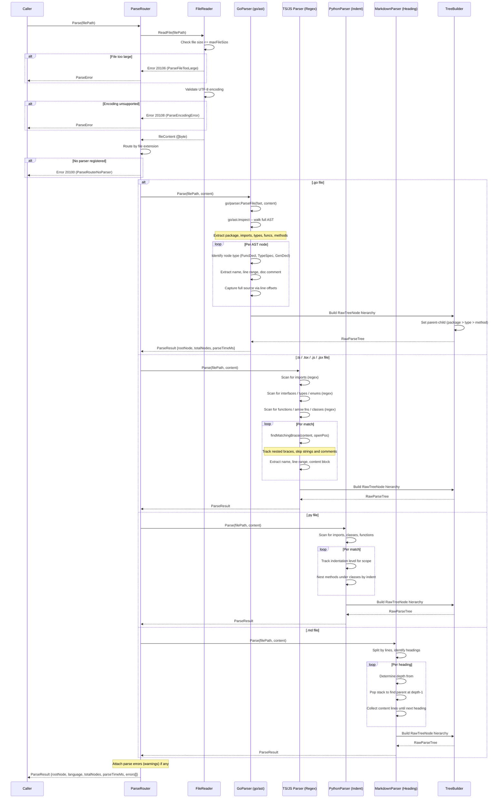

# Non-Vector RAG: Code Parser

**Version:** 1.1.0  
**Status:** Draft  
**Last Updated:** 2026-03-22  

---

## Overview

The Code Parser module is responsible for analyzing source code files and producing a **Raw Parse Tree** — a structural hierarchy of code elements (packages, files, functions, structs, interfaces, etc.) without semantic metadata. The raw tree is then passed to the LLM Enrichment Pipeline for metadata generation.

---

## Sequence Diagram



---

## Parser Interface

```go
// CodeParser defines the interface all language-specific parsers must implement
type CodeParser interface {
    // Parse analyzes a source file and returns a raw parse tree
    Parse(ctx context.Context, input ParseInput) (*ParseResult, error)
    
    // SupportedExtensions returns file extensions this parser handles
    SupportedExtensions() []string
    
    // Language returns the language identifier
    Language() string
}

type ParseInput struct {
    FilePath    string
    Content     []byte
    MaxDepth    int    // Maximum nesting depth to parse (0 = unlimited)
}

type ParseResult struct {
    RootNode    *RawTreeNode
    Language    string
    FilePath    string
    TotalNodes  int
    ParseTimeMs int64
    Errors      []ParseError
}

type RawTreeNode struct {
    Name        string         // Identifier name (function name, struct name, etc.)
    NodeType    string         // 'package', 'file', 'function', 'method', 'struct', etc.
    Content     string         // Raw source code content of this node
    LineStart   int
    LineEnd     int
    Children    []*RawTreeNode
}

type ParseError struct {
    Line    int
    Column  int
    Message string
    Level   string  // "warning" or "error"
}
```

---

## Language Parsers

### Go Parser (Primary, AST-Based)

Go has the best parsing support since AI Bridge is written in Go. Uses the native `go/parser` and `go/ast` packages.

**Extraction Hierarchy:**

```
Package
├── Import Block
├── Constant Block
│   └── Individual Constants
├── Variable Block
│   └── Individual Variables
├── Type Declaration
│   ├── Struct
│   │   ├── Fields
│   │   └── Methods (via receiver)
│   ├── Interface
│   │   └── Method Signatures
│   └── Type Alias
├── Function
│   ├── Parameters
│   ├── Return Types
│   └── Body (summarized, not full AST)
└── Init Functions
```

**Go Parser Strategy:**

```go
type GoParser struct {
    fset *token.FileSet
}

func (p *GoParser) Parse(ctx context.Context, input ParseInput) (*ParseResult, error) {
    // 1. Parse with go/parser
    // 2. Walk AST with go/ast.Inspect
    // 3. Extract: package, imports, types, functions, methods, constants, variables
    // 4. Build RawTreeNode hierarchy
    // 5. Attach source content for each node (using line ranges)
}
```

| Node Type | AST Node | Content Captured |
|-----------|----------|-----------------|
| package | `*ast.File` | Package name + doc comment |
| import | `*ast.ImportSpec` | Import path |
| function | `*ast.FuncDecl` (no receiver) | Full function source |
| method | `*ast.FuncDecl` (with receiver) | Full method source, linked to receiver type |
| struct | `*ast.TypeSpec` → `*ast.StructType` | Struct definition + field comments |
| interface | `*ast.TypeSpec` → `*ast.InterfaceType` | Interface methods |
| constant | `*ast.GenDecl` (token.CONST) | Constant name, type, value |
| variable | `*ast.GenDecl` (token.VAR) | Variable name, type |

### TypeScript / JavaScript Parser (Regex + Heuristic)

Since there is no native TS/JS AST parser in Go, use regex-based extraction with brace-matching for scope detection.

**Extraction Targets:**

| Pattern | Regex / Strategy |
|---------|-----------------|
| Imports | `^import\s+.*from\s+['"]` |
| Interfaces | `^(export\s+)?interface\s+(\w+)` + brace matching |
| Types | `^(export\s+)?type\s+(\w+)` |
| Functions | `^(export\s+)?(async\s+)?function\s+(\w+)` |
| Arrow Functions | `^(export\s+)?(const\|let)\s+(\w+)\s*=\s*(async\s+)?\(` |
| Classes | `^(export\s+)?class\s+(\w+)` + method extraction |
| React Components | `^(export\s+)?(default\s+)?function\s+(\w+)\s*\(.*props` |
| Enums | `^(export\s+)?enum\s+(\w+)` |

**Brace Matching Algorithm:**

```go
func findMatchingBrace(content string, openPos int) int {
    // Track nested braces { }, accounting for:
    // - String literals (single, double, template)
    // - Comments (// and /* */)
    // - Regex literals
    // Returns position of matching closing brace
}
```

### Python Parser (Indentation-Based)

Python parsing uses indentation level tracking since Python scope is whitespace-defined.

**Extraction Targets:**

| Pattern | Strategy |
|---------|----------|
| Imports | `^(import\|from\s+\S+\s+import)` |
| Classes | `^class\s+(\w+)` + indentation-based scope |
| Functions | `^def\s+(\w+)` + indentation-based scope |
| Methods | `def` inside class scope |
| Decorators | `^@(\w+)` attached to next class/function |
| Module docstring | Triple-quoted string at file top |

### PHP Parser (Regex + Brace Matching)

| Pattern | Strategy |
|---------|----------|
| Namespaces | `^namespace\s+(.+);` |
| Classes | `^(abstract\s+)?class\s+(\w+)` |
| Interfaces | `^interface\s+(\w+)` |
| Traits | `^trait\s+(\w+)` |
| Functions | `^(public\|private\|protected\|static\s+)*function\s+(\w+)` |
| Constants | `^(const\|define\()` |

### Markdown Parser (Heading Hierarchy)

Markdown parsing is straightforward — the heading structure (`#`, `##`, `###`) naturally forms a tree.

**Strategy:**

```go
func (p *MarkdownParser) Parse(ctx context.Context, input ParseInput) (*ParseResult, error) {
    // 1. Split content by lines
    // 2. Identify heading lines (^#{1,6}\s+)
    // 3. Build tree based on heading level
    //    # = depth 0, ## = depth 1, ### = depth 2, etc.
    // 4. Content between headings = node content
    // 5. Code blocks (``` ```) = child nodes of type "code-block"
}
```

### YAML / JSON Parser

| Format | Strategy |
|--------|----------|
| YAML | Parse with `gopkg.in/yaml.v3` → walk `yaml.Node` tree |
| JSON | Parse with `encoding/json` → walk `map[string]interface{}` recursively |

---

## Parse Router

The Parse Router selects the appropriate parser based on file extension:

```go
type ParseRouter struct {
    parsers map[string]CodeParser  // extension → parser
}

func NewParseRouter() *ParseRouter {
    r := &ParseRouter{parsers: make(map[string]CodeParser)}
    
    goParse := &GoParser{}
    for _, ext := range goParse.SupportedExtensions() {
        r.parsers[ext] = goParse
    }
    
    tsParse := &TypeScriptParser{}
    for _, ext := range tsParse.SupportedExtensions() {
        r.parsers[ext] = tsParse
    }
    
    // ... register all parsers
    return r
}

func (r *ParseRouter) Route(filePath string) (CodeParser, error) {
    ext := filepath.Ext(filePath)
    parser, exists := r.parsers[ext]
    if !exists {
        return nil, fmt.Errorf("no parser for extension: %s", ext)
    }
    return parser, nil
}
```

**Extension Mapping:**

| Extension(s) | Parser |
|--------------|--------|
| `.go` | GoParser |
| `.ts`, `.tsx` | TypeScriptParser |
| `.js`, `.jsx` | JavaScriptParser (shared with TS) |
| `.py` | PythonParser |
| `.php` | PHPParser |
| `.md`, `.markdown` | MarkdownParser |
| `.yaml`, `.yml` | YAMLParser |
| `.json` | JSONParser |
| `.html`, `.htm` | HTMLParser (heading/section extraction) |
| `.css`, `.scss` | CSSParser (selector hierarchy) |

---

## Error Handling

| Code | Error | Description |
|------|-------|-------------|
| 20100 | ParseRouterNoParser | No parser registered for file extension |
| 20101 | ParseFileReadError | Failed to read source file |
| 20102 | ParseASTError | AST parsing failed (Go-specific) |
| 20103 | ParseRegexError | Regex-based extraction failed |
| 20104 | ParseBraceMatchError | Unmatched braces in source file |
| 20105 | ParseDepthExceeded | Maximum parse depth exceeded |
| 20106 | ParseFileTooLarge | File exceeds maximum size limit |
| 20107 | ParseTimeout | Parsing timed out for a single file |
| 20108 | ParseEncodingError | File encoding not supported (non-UTF8) |

---

## Performance Targets

| Metric | Target |
|--------|--------|
| Go file parsing (1000 LOC) | < 10ms |
| TS/JS file parsing (1000 LOC) | < 20ms |
| Markdown file parsing (500 lines) | < 5ms |
| Batch parsing (100 files) | < 500ms |
| Memory per file | < 10MB |

---

## Cross-References

| Reference | Location |
|-----------|----------|
| Architecture | `./01-architecture.md` |
| Document Parser | `./04-document-parser.md` |
| Tree Index Schema | `./02-tree-index-schema.md` |
| Golang Standards | `../02-coding-guidelines/03-golang/00-overview.md` |

---

*Code parser specification created 2026-03-22.*
