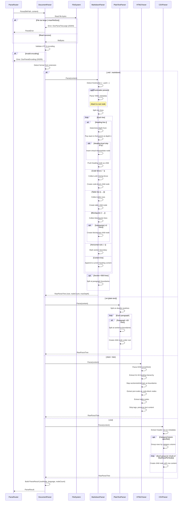

# Non-Vector RAG: Document Parser

**Version:** 1.1.0  
**Status:** Draft  
**Last Updated:** 2026-03-22  

---

## Overview

The Document Parser handles non-code files — Markdown documents, plain text, HTML pages, and structured data files (YAML, JSON, CSV). Unlike the Code Parser which uses AST analysis, the Document Parser relies on heading hierarchies, section boundaries, and structural markers to build the raw parse tree.

---

## Parser Interface

The Document Parser implements the same `CodeParser` interface as the Code Parser (see `03-code-parser.md`), ensuring uniform handling in the Parse Router.

---

## Markdown Parser (Primary)

Markdown is the most important document format for this project since all specifications are written in Markdown.

### Heading Hierarchy Strategy

```
# Title                    → Depth 0 (root)
## Section A               → Depth 1
### Subsection A.1         → Depth 2
#### Detail A.1.1          → Depth 3
### Subsection A.2         → Depth 2
## Section B               → Depth 1
```

### Node Extraction Rules

| Element | Node Type | Handling |
|---------|-----------|----------|
| `# Heading` | `heading` | Creates tree node at appropriate depth |
| Paragraph text | (content of parent heading) | Attached as content to nearest heading node |
| ` ``` code block ``` ` | `code-block` | Child node under nearest heading |
| `\| table \|` | `table` | Child node under nearest heading |
| `- list item` | (content of parent heading) | Folded into heading content |
| `> blockquote` | `blockquote` | Child node if substantial (>3 lines) |
| `---` (horizontal rule) | (section boundary) | Treated as section separator, not a node |
| `[link](url)` | (content of parent heading) | Preserved in content, not separate node |
| Frontmatter (`---\nyaml\n---`) | `frontmatter` | Parsed as metadata, attached to root node |

### Implementation

```go
type MarkdownParser struct {
    MinBlockSize int  // Minimum content size to create a node (default: 20 chars)
}

func (p *MarkdownParser) Parse(ctx context.Context, input ParseInput) (*ParseResult, error) {
    lines := strings.Split(string(input.Content), "\n")
    root := &RawTreeNode{
        Name:     extractTitle(lines),
        NodeType: "document",
        Children: []*RawTreeNode{},
    }
    
    // Stack-based heading hierarchy builder
    // For each heading line:
    //   1. Determine depth from # count
    //   2. Pop stack until finding parent at depth-1
    //   3. Push new heading node as child of parent
    //   4. Collect content lines until next heading
    
    return &ParseResult{RootNode: root}, nil
}
```

### Edge Cases

| Scenario | Handling |
|----------|----------|
| No headings in file | Entire file = single root node |
| Heading level skip (# → ###) | Insert virtual intermediate node |
| Multiple H1 headings | First H1 = root, subsequent H1s = depth 0 siblings |
| Empty sections (heading with no content) | Create node with empty content |
| Very long sections (>500 lines) | Split into sub-nodes at paragraph boundaries |

---

## Sequence Diagram



---

## Plain Text Parser

For `.txt` and other unstructured text files.

### Strategy

1. **Paragraph-based splitting**: Split on double newlines (`\n\n`)
2. **Each paragraph** becomes a child node of the file root
3. **Large paragraphs** (>20 lines) are further split at sentence boundaries

```go
type PlainTextParser struct {
    ParagraphSeparator string  // Default: "\n\n"
    MaxParagraphLines  int     // Default: 20
}
```

---

## HTML Parser

For `.html` and `.htm` files.

### Strategy

1. Parse HTML DOM using `golang.org/x/net/html`
2. Extract heading elements (`<h1>` through `<h6>`) to build hierarchy
3. Extract `<section>`, `<article>`, `<main>`, `<aside>` as structural boundaries
4. Strip HTML tags from content, preserve text

| HTML Element | Tree Mapping |
|-------------|--------------|
| `<h1>` - `<h6>` | Heading nodes (same as Markdown `#` levels) |
| `<section>` | Section boundary |
| `<article>` | Article node |
| `<pre><code>` | Code block node |
| `<table>` | Table node |
| `<ul>`, `<ol>` | List content (folded into parent) |

---

## CSV Parser

For `.csv` files used as data tables.

### Strategy

1. First row = column headers → node metadata
2. Group rows by a configurable "category column" if specified
3. Each group = child node with rows as content

```go
type CSVParser struct {
    CategoryColumn string  // Column name to group by (optional)
    MaxRowsPerNode int     // Max rows per tree node (default: 50)
}
```

---

## Error Handling

| Code | Error | Description |
|------|-------|-------------|
| 20200 | DocParseReadError | Failed to read document file |
| 20201 | DocParseHeadingError | Invalid heading structure |
| 20202 | DocParseHTMLError | HTML DOM parsing failed |
| 20203 | DocParseCSVError | CSV format error |
| 20204 | DocParseTooLarge | Document exceeds size limit |
| 20205 | DocParseEncoding | Unsupported encoding |
| 20206 | DocParseFrontmatter | Invalid YAML frontmatter |

---

## Performance Targets

| Metric | Target |
|--------|--------|
| Markdown parsing (1000 lines) | < 5ms |
| HTML parsing (complex page) | < 15ms |
| Plain text parsing (10K lines) | < 10ms |
| CSV parsing (1000 rows) | < 10ms |

---

## Cross-References

| Reference | Location |
|-----------|----------|
| Architecture | `./01-architecture.md` |
| Code Parser | `./03-code-parser.md` |
| Tree Index Schema | `./02-tree-index-schema.md` |

---

*Document parser specification created 2026-03-22.*
