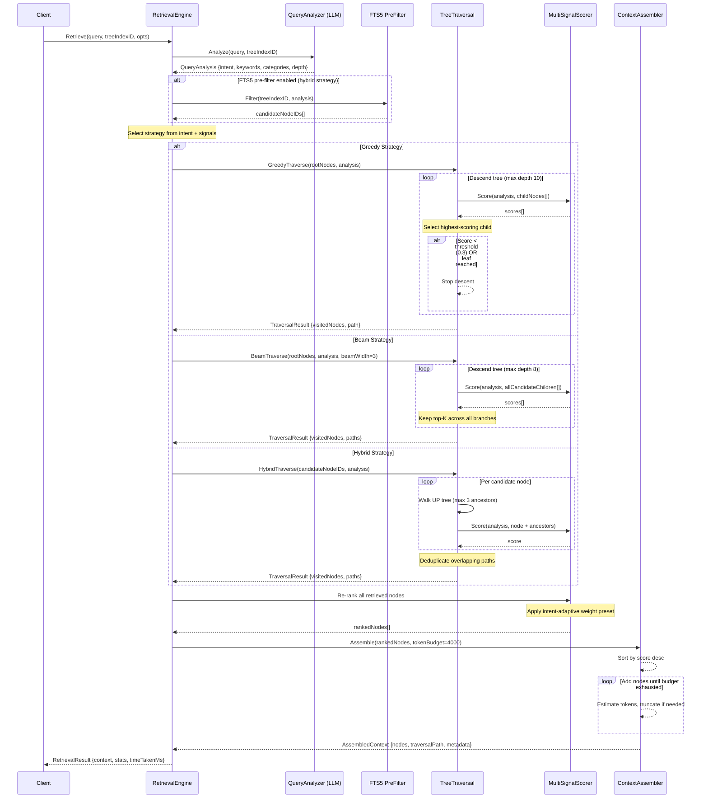

# Non-Vector RAG: Tree Retrieval Engine

**Version:** 2.1.0  
**Status:** Draft  
**Last Updated:** 2026-03-22  

---

## Overview

The Tree Retrieval Engine handles the query-time logic: analyzing user queries, traversing the tree index, scoring and ranking nodes, and assembling context for the main LLM. This is the "reasoning-based retrieval" core — an LLM navigates the tree structure to locate relevant content, replacing vector similarity search entirely.

---

## Retrieval Pipeline

```
User Query
    │
    ▼
┌──────────────────┐
│  Query Analyzer   │  ← Small LLM decomposes query into search signals
│  (intent, keywords│
│   categories)     │
└────────┬─────────┘
         │
         ▼
┌──────────────────┐
│  Pre-Filter       │  ← SQLite FTS5 narrows candidate nodes (optional)
│  (FTS5 keyword    │
│   matching)       │
└────────┬─────────┘
         │
         ▼
┌──────────────────┐
│  Tree Traversal   │  ← LLM-guided descent through tree hierarchy
│  (greedy / beam / │
│   exhaustive)     │
└────────┬─────────┘
         │
         ▼
┌──────────────────┐
│  Re-Ranking       │  ← Score and rank retrieved nodes
│  (multi-signal    │
│   scoring)        │
└────────┬─────────┘
         │
         ▼
┌──────────────────┐
│  Context Assembly │  ← Build context window within token budget
│  (dedup, order,   │
│   truncate)       │
└──────────────────┘
```

### Sequence Diagram



---

## Query Analysis

### Query Analyzer Interface

```go
type QueryAnalyzer interface {
    Analyze(ctx context.Context, query string, treeIndexID string) (*QueryAnalysis, error)
}

type QueryAnalysis struct {
    OriginalQuery   string
    Intent          QueryIntent
    Keywords        []string
    Categories      []string
    Subcategories   []string
    MaxResults      int
    DepthPreference DepthPreference
    Confidence      float64  // 0.0-1.0 confidence in analysis
}

type QueryIntent string
const (
    IntentFind    QueryIntent = "find"     // Locate specific code/section
    IntentExplain QueryIntent = "explain"  // Understand how something works
    IntentModify  QueryIntent = "modify"   // Change existing code
    IntentDebug   QueryIntent = "debug"    // Fix an issue
    IntentCreate  QueryIntent = "create"   // Build something new
)

type DepthPreference string
const (
    DepthShallow DepthPreference = "shallow"  // High-level overview
    DepthDeep    DepthPreference = "deep"      // Implementation detail
    DepthAuto    DepthPreference = "auto"      // Let traversal decide
)
```

### Query Analysis Prompt

```yaml
system: |
  You analyze user queries to extract search parameters for a 
  tree-structured code/document index.

prompt: |
  Query: "{userQuery}"
  
  Available categories: {categoryList}
  Available top-level nodes: {rootNodeTitles}
  
  Extract search parameters. Respond ONLY with JSON:
  {
    "intent": "find|explain|modify|debug|create",
    "keywords": ["term1", "term2", ...],
    "categories": ["cat1", "cat2"],
    "subcategories": ["subcat1"],
    "depthPreference": "shallow|deep|auto",
    "maxResults": 5
  }
```

---

## Pre-Filter Stage

Before tree traversal, optionally use SQLite FTS5 to narrow the candidate set:

```go
type PreFilter struct {
    db          *gorm.DB
    minScore    float64  // Minimum FTS5 rank score to include
    maxResults  int      // Maximum pre-filter results (default: 100)
}

func (pf *PreFilter) Filter(ctx context.Context, treeIndexID string, analysis *QueryAnalysis) ([]string, error) {
    // 1. Build FTS5 query from keywords
    //    e.g., "authentication jwt validate" → 'authentication OR jwt OR validate'
    // 2. Execute FTS5 search on TreeNodeFTS
    // 3. Filter by category if categories specified
    // 4. Return node IDs sorted by FTS5 rank
}
```

**FTS5 Query Construction:**

| Query Type | FTS5 Syntax | Example |
|------------|-------------|---------|
| Any keyword | `term1 OR term2` | `authentication OR jwt` |
| All keywords | `term1 AND term2` | `authentication AND jwt` |
| Phrase match | `"term1 term2"` | `"jwt validation"` |
| Prefix match | `term*` | `auth*` |
| Column-specific | `column:term` | `Category:authentication` |

---

## Tree Traversal Strategies

### Strategy 1: Greedy Traversal (Default)

Best for focused queries where the answer is likely in one branch.

```go
type GreedyTraversal struct {
    analyzer    QueryAnalyzer
    scorer      NodeScorer
    maxDepth    int     // Default: 10
    threshold   float64 // Stop when score drops below this (default: 0.3)
}

func (g *GreedyTraversal) Traverse(ctx context.Context, params TraversalParams) (*TraversalResult, error) {
    // 1. Load root nodes for the tree index
    // 2. Score each root node against query
    // 3. Select highest-scoring root
    // 4. Load children of selected node
    // 5. Score children, select highest
    // 6. Repeat until:
    //    a. Leaf node reached (no children)
    //    b. Score drops below threshold
    //    c. Max depth reached
    // 7. Collect all visited nodes with scores
}
```

**Worked Example:**

```
Query: "How does JWT token validation work?"
Analysis: intent=explain, keywords=[jwt, token, validation], categories=[authentication]

Root nodes:
  ├─ [0.9] authentication (category match + keyword "jwt")    ← SELECT
  ├─ [0.2] database
  ├─ [0.1] ui-component
  └─ [0.0] testing

authentication children:
  ├─ [0.95] jwt-validation (keyword match + subcategory)      ← SELECT
  ├─ [0.4] oauth-provider
  ├─ [0.3] session-management
  └─ [0.1] password-hashing

jwt-validation children:
  ├─ [0.9] ValidateToken function                              ← COLLECT
  ├─ [0.7] TokenClaims struct                                  ← COLLECT
  ├─ [0.5] JWT middleware                                      ← COLLECT
  └─ [0.2] Token constants

Result: 3 nodes collected, traversal path: authentication → jwt-validation → {3 leaves}
```

### Strategy 2: Beam Traversal (Higher Recall)

Explores multiple branches simultaneously. Best for broad queries.

```go
type BeamTraversal struct {
    beamWidth   int     // Number of candidates to keep at each level (default: 3)
    maxDepth    int     // Default: 8
    maxResults  int     // Maximum nodes to return (default: 10)
}

func (b *BeamTraversal) Traverse(ctx context.Context, params TraversalParams) (*TraversalResult, error) {
    // 1. Load and score root nodes
    // 2. Keep top-K (beam width) roots
    // 3. For each kept root, load and score children
    // 4. Merge all children, keep top-K across all branches
    // 5. Repeat until leaf nodes or max depth
    // 6. Return all collected leaf nodes, ranked
}
```

### Strategy 3: Hybrid Traversal (FTS5 + Tree Walk)

Combines FTS5 pre-filtering with upward tree walks for maximum precision.

```go
type HybridTraversal struct {
    preFilter   *PreFilter
    maxAncestorDepth int  // How far up to walk for context (default: 3)
}

func (h *HybridTraversal) Traverse(ctx context.Context, params TraversalParams) (*TraversalResult, error) {
    // 1. FTS5 search → candidate node IDs
    // 2. For each candidate, walk UP the tree to collect ancestor context
    // 3. Score each candidate with its ancestor path
    // 4. Deduplicate overlapping paths
    // 5. Return top results with full ancestor context
}
```

### Strategy Selection

The retrieval engine automatically selects the best strategy:

| Signal | Strategy | Rationale |
|--------|----------|-----------|
| Single category match, high confidence | Greedy | Focused query, one branch |
| Multiple categories, broad keywords | Beam | Need to explore multiple areas |
| Very specific term (function name, error code) | Hybrid (FTS5 first) | Exact match is fastest |
| Intent = "explain" | Beam (wider) | Need comprehensive context |
| Intent = "debug" | Hybrid | Error messages are keyword-rich |
| Intent = "find" | Greedy | Usually looking for specific thing |

---

## Node Scoring

### Multi-Signal Scorer

```go
type NodeScorer interface {
    Score(query *QueryAnalysis, node *TreeNode) NodeScore
}

type MultiSignalScorer struct {
    WeightPresets map[QueryIntent]ScoreWeights
}

type ScoreWeights struct {
    KeywordOverlap    float64
    CategoryMatch     float64
    SubcategoryMatch  float64
    TitleRelevance    float64
    ImportanceWeight  float64
    DepthPenalty      float64
}
```

### Intent-Adaptive Weight Presets

Static weights cannot serve all query types. The scorer MUST select a weight preset based on `QueryIntent`:

| Signal | `find` | `explain` | `modify` | `debug` | `create` |
|--------|--------|-----------|----------|---------|----------|
| `KeywordOverlap` | 0.40 | 0.25 | 0.30 | 0.35 | 0.20 |
| `CategoryMatch` | 0.10 | 0.20 | 0.15 | 0.10 | 0.25 |
| `SubcategoryMatch` | 0.10 | 0.10 | 0.10 | 0.10 | 0.10 |
| `TitleRelevance` | 0.15 | 0.15 | 0.15 | 0.10 | 0.15 |
| `ImportanceWeight` | 0.15 | 0.20 | 0.20 | 0.15 | 0.20 |
| `DepthPenalty` | 0.10 | 0.10 | 0.10 | 0.20 | 0.10 |
| **Total** | **1.00** | **1.00** | **1.00** | **1.00** | **1.00** |

**Rationale per intent:**

| Intent | Design Goal |
|--------|-------------|
| `find` | Maximize keyword precision — user knows what they're looking for |
| `explain` | Broad coverage, high importance — surface architecturally significant nodes |
| `modify` | Balance keywords and importance — find the right code AND its context |
| `debug` | Heavy keyword matching with strong depth penalty — surface implementation-level nodes near error sites |
| `create` | Category-driven — user describes *what* to build, not specific terms |

**Implementation:**

```go
var DefaultWeightPresets = map[QueryIntent]ScoreWeights{
    IntentFind: {
        KeywordOverlap: 0.40, CategoryMatch: 0.10, SubcategoryMatch: 0.10,
        TitleRelevance: 0.15, ImportanceWeight: 0.15, DepthPenalty: 0.10,
    },
    IntentExplain: {
        KeywordOverlap: 0.25, CategoryMatch: 0.20, SubcategoryMatch: 0.10,
        TitleRelevance: 0.15, ImportanceWeight: 0.20, DepthPenalty: 0.10,
    },
    IntentModify: {
        KeywordOverlap: 0.30, CategoryMatch: 0.15, SubcategoryMatch: 0.10,
        TitleRelevance: 0.15, ImportanceWeight: 0.20, DepthPenalty: 0.10,
    },
    IntentDebug: {
        KeywordOverlap: 0.35, CategoryMatch: 0.10, SubcategoryMatch: 0.10,
        TitleRelevance: 0.10, ImportanceWeight: 0.15, DepthPenalty: 0.20,
    },
    IntentCreate: {
        KeywordOverlap: 0.20, CategoryMatch: 0.25, SubcategoryMatch: 0.10,
        TitleRelevance: 0.15, ImportanceWeight: 0.20, DepthPenalty: 0.10,
    },
}
```

Weight presets are configurable via `config.seed.json` under `retrieval.weightPresets`. Custom intents can register additional presets at runtime.

---

### Scoring Functions

**Keyword Overlap (Jaccard Similarity):**

```go
func keywordOverlap(queryKeywords, nodeKeywords []string) float64 {
    // Jaccard = |intersection| / |union|
    // Weighted by keyword Weight from TreeNodeKeyword
}
```

**Category Match:**

```go
func categoryMatch(queryCategories []string, nodeCategory string) float64 {
    // Exact match: 1.0
    // Related category (from predefined mapping): 0.5
    // No match: 0.0
}
```

**Title Relevance (Optional LLM-based):**

For high-importance decisions (e.g., root node selection), optionally use LLM to judge title relevance:

```yaml
prompt: |
  Query: "{query}"
  Node title: "{nodeTitle}"
  Node description: "{nodeDescription}"
  
  Rate relevance 0.0-1.0. Respond with just the number.
```

This is used sparingly (only at top levels of traversal) to avoid excessive LLM calls during retrieval.

### Combined Scoring Formula

```go
func (s *MultiSignalScorer) Score(query *QueryAnalysis, node *TreeNode) float64 {
    weights := s.WeightPresets[query.Intent]
    
    score := 0.0
    score += weights.KeywordOverlap    * keywordOverlap(query.Keywords, node.Keywords)
    score += weights.CategoryMatch     * categoryMatch(query.Categories, node.Category)
    score += weights.SubcategoryMatch  * subcategoryMatch(query.Subcategories, node.Subcategory)
    score += weights.TitleRelevance    * titleRelevance(query, node)
    score += weights.ImportanceWeight  * node.ImportanceScore
    score += weights.DepthPenalty      * (1.0 - float64(node.Depth) / float64(maxDepth))
    
    return math.Max(0.0, math.Min(1.0, score))
}
```

---

## Context Assembly

### Token Budget Management

```go
type ContextAssembler struct {
    MaxTokens       int    // Maximum context window tokens (default: 4000)
    ReserveTokens   int    // Reserve for system prompt + user query (default: 1000)
    AvailableTokens int    // MaxTokens - ReserveTokens
}

func (ca *ContextAssembler) Assemble(results *TraversalResult) (*AssembledContext, error) {
    // 1. Sort retrieved nodes by score (descending)
    // 2. For each node, estimate token count
    // 3. Add nodes until token budget exhausted
    // 4. If node too large, truncate content (keep first N tokens)
    // 5. Add traversal path as preamble
    // 6. Format as structured context block
}
```

### Context Format

The assembled context is formatted for the main LLM:

```
=== RETRIEVED CONTEXT (Tree-Structured Retrieval) ===

Traversal Path: authentication → jwt-validation → ValidateToken
Strategy: greedy | Nodes Retrieved: 3 | Retrieval Time: 45ms

--- Node 1 [Score: 0.95] ---
File: internal/auth/jwt.go (lines 45-89)
Type: function | Category: authentication/jwt-validation

func ValidateToken(tokenString string) (*Claims, error) {
    // ... full content ...
}

--- Node 2 [Score: 0.82] ---
File: internal/auth/claims.go (lines 12-28)
Type: struct | Category: authentication/jwt-validation

type Claims struct {
    // ... full content ...
}

=== END CONTEXT ===
```

---

## Retrieval Result

```go
type RetrievalResult struct {
    Nodes          []RetrievedNode
    TraversalPath  []PathStep
    Strategy       string
    TotalCandidates int      // Nodes considered
    TotalRetrieved  int      // Nodes returned
    TotalTokens     int      // Estimated token count
    TimeTakenMs     int64
    FTS5Used        bool     // Whether FTS5 pre-filter was used
    LLMCallsMade    int      // LLM calls during retrieval (scoring)
}

type PathStep struct {
    NodeID    string
    Title     string
    Category  string
    Score     float64
    Depth     int
}

type RetrievedNode struct {
    NodeID         string
    Title          string
    Description    string
    Content        string
    FilePath       string
    LineRange      [2]int
    Score          float64
    Depth          int
    AncestorPath   string   // "root > parent > child"
    TokenCount     int
}
```

---

## Error Handling

| Code | Error | Description |
|------|-------|-------------|
| 20500 | RetrievalQueryAnalysisFailed | LLM query analysis returned invalid result |
| 20501 | RetrievalTreeEmpty | Tree index has no nodes |
| 20502 | RetrievalTraversalTimeout | Traversal exceeded time limit |
| 20503 | RetrievalNoResults | No nodes scored above threshold |
| 20504 | RetrievalTokenBudgetExceeded | Cannot fit any nodes in token budget |
| 20505 | RetrievalFTS5Error | FTS5 query execution failed |
| 20506 | RetrievalScoringError | Node scoring computation failed |
| 20507 | RetrievalContextAssemblyError | Context formatting failed |

---

## Performance Targets

| Metric | Target |
|--------|--------|
| Query analysis (LLM) | < 500ms |
| FTS5 pre-filter (1000 nodes) | < 5ms |
| Greedy traversal (depth 5) | < 200ms (excluding LLM calls) |
| Beam traversal (width 3, depth 5) | < 500ms |
| Full retrieval pipeline (end-to-end) | < 2 seconds |
| Context assembly | < 10ms |

---

## Cross-References

| Reference | Location |
|-----------|----------|
| Architecture | `./01-architecture.md` |
| Tree Index Schema | `./02-tree-index-schema.md` |
| Tree Indexing Engine | `./05-tree-indexing-engine.md` |
| API Interface | `./07-api-interface.md` |
| Configuration (Weight Presets) | `./09-configuration.md` |
| Retrieval Router | `./12-retrieval-router.md` |
| Performance Benchmarks | `./11-performance-benchmarks.md` |

---

*Tree retrieval engine specification created 2026-03-22.*
