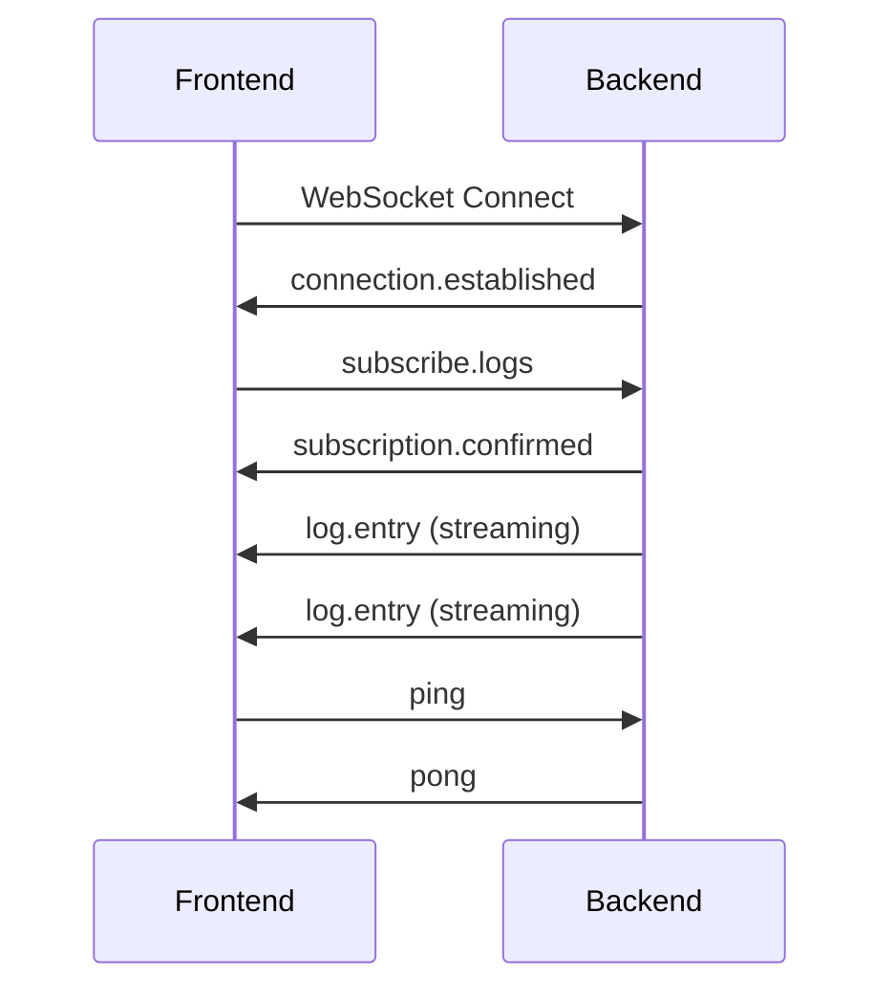

# WebSocket Protocol Specification


**Last Updated:** 2026-03-20  

> **Version:** 1.0.0  
> **Parent:** [00-overview.md](./00-overview.md)

---

## Summary

Standard WebSocket protocol for real-time communication between Go backend and React frontend.

---

## Connection

### Endpoint

```
ws://{host}:{port}/ws
```

### Connection Flow



---

## Message Format

All messages use JSON with a standard envelope:

```typescript
interface WSMessage {
  type: string;           // Message type
  id?: string;            // Optional message ID for request/response
  payload: any;           // Message-specific payload
  timestamp: string;      // ISO 8601 timestamp
}
```

---

## Message Types

### From Frontend to Backend

| Type | Description | Payload |
|------|-------------|---------|
| `subscribe.logs` | Subscribe to log stream | `{ levels: string[] }` |
| `unsubscribe.logs` | Stop log stream | `{}` |
| `subscribe.status` | Subscribe to status updates | `{}` |
| `command.execute` | Execute CLI command | `{ command: string, args: string[] }` |
| `settings.get` | Request current settings | `{}` |
| `settings.update` | Update settings | `{ category: string, values: object }` |
| `ping` | Keep-alive ping | `{}` |

### From Backend to Frontend

| Type | Description | Payload |
|------|-------------|---------|
| `connection.established` | Connection confirmed | `{ version: string, serverTime: string }` |
| `subscription.confirmed` | Subscription active | `{ subscription: string }` |
| `log.entry` | Log message | See Log Entry format |
| `status.update` | Status change | `{ status: string, details: object }` |
| `command.result` | Command output | `{ success: boolean, output: string, error?: object }` |
| `settings.current` | Current settings | `{ settings: object }` |
| `settings.updated` | Settings saved | `{ success: boolean }` |
| `error` | Error occurred | See Error format |
| `pong` | Keep-alive response | `{}` |

---

## Log Entry Format

```typescript
interface LogEntry {
  id: string;              // Unique log ID
  level: 'DEBUG' | 'INFO' | 'WARN' | 'ERROR';
  message: string;
  timestamp: string;       // ISO 8601
  source: string;          // Module/function name
  file?: string;           // Source file
  line?: number;           // Line number
  metadata?: Record<string, any>;
}
```

### Example

```json
{
  "type": "log.entry",
  "payload": {
    "id": "log-001",
    "level": "INFO",
    "message": "Search completed successfully",
    "timestamp": "2026-02-01T12:34:56.789Z",
    "source": "SearchService.Execute",
    "file": "internal/search/service.go",
    "line": 145,
    "metadata": {
      "keywords": "machine learning",
      "resultCount": 25
    }
  },
  "timestamp": "2026-02-01T12:34:56.789Z"
}
```

---

## Error Format

```typescript
interface WSError {
  code: number;            // Error code from CLI error range
  message: string;         // Human-readable message
  details?: string;        // Additional details
  stack?: string[];        // Stack trace (if available)
  recoverable: boolean;    // Can retry?
}
```

### Example

```json
{
  "type": "error",
  "payload": {
    "code": 7050,
    "message": "WebSocket connection failed",
    "details": "Backend not responding on port 8080",
    "recoverable": true
  },
  "timestamp": "2026-02-01T12:34:56.789Z"
}
```

---

## Go Backend Implementation

```go
package api

import (
    "encoding/json"
    "time"
    
    "github.com/gorilla/websocket"
)

// WSMessage uses generics for typed payloads
type WSMessage[T any] struct {
    Type      string
    Id        string `json:",omitempty"`
    Payload   T
    Timestamp string
}

type LogEntry struct {
    Id        string
    Level     string
    Message   string
    Timestamp string
    Source    string
    File      string       `json:",omitempty"`
    Line      int          `json:",omitempty"`
    Metadata  *LogMetadata `json:",omitempty"`
}

// LogMetadata holds structured metadata for log entries
type LogMetadata struct {
    Component string `json:"component,omitempty"`
    TraceId   string `json:"traceId,omitempty"`
    SpanId    string `json:"spanId,omitempty"`
}

func (h *WSHandler) SendLog(conn *websocket.Conn, entry LogEntry) error {
    msg := WSMessage{
        Type:      "log.entry",
        Payload:   entry,
        Timestamp: time.Now().UTC().Format(time.RFC3339Nano),
    }
    return conn.WriteJson(msg)
}
```

---

## React Frontend Hook

```typescript
// hooks/useWebSocket.ts
import { useEffect, useRef, useState, useCallback } from 'react';
import { useConnectionStore } from '@/stores/connectionStore';

interface UseWebSocketOptions {
  url: string;
  onMessage?: (msg: WSMessage) => void;
  onError?: (error: Event) => void;
  reconnectInterval?: number;
}

export function useWebSocket(options: UseWebSocketOptions) {
  const wsRef = useRef<WebSocket | null>(null);
  const [isConnected, setIsConnected] = useState(false);
  const { setStatus } = useConnectionStore();

  const connect = useCallback(() => {
    const ws = new WebSocket(options.url);
    
    ws.onopen = () => {
      setIsConnected(true);
      setStatus('connected');
    };
    
    ws.onmessage = (event) => {
      const msg = JSON.parse(event.data) as WSMessage;
      options.onMessage?.(msg);
    };
    
    ws.onerror = (error) => {
      options.onError?.(error);
      setStatus('error');
    };
    
    ws.onclose = () => {
      setIsConnected(false);
      setStatus('disconnected');
      // Auto-reconnect
      setTimeout(connect, options.reconnectInterval ?? 3000);
    };
    
    wsRef.current = ws;
  }, [options]);

  const send = useCallback(<T,>(type: string, payload: T) => {
    if (wsRef.current?.readyState === WebSocket.OPEN) {
      wsRef.current.send(JSON.stringify({
        type,
        payload,
        timestamp: new Date().toISOString()
      }));
    }
  }, []);

  useEffect(() => {
    connect();
    return () => wsRef.current?.close();
  }, [connect]);

  return { isConnected, send };
}
```

---

## Keep-Alive

- Frontend sends `ping` every 30 seconds
- Backend responds with `pong`
- If no `pong` received in 10 seconds, reconnect

---

*Standard WebSocket protocol for all CLI frontends.*
