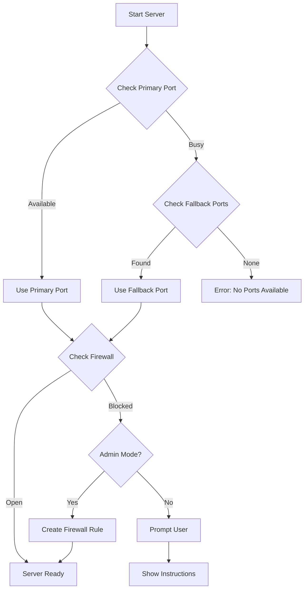

# Port & Firewall Management Specification


**Last Updated:** 2026-03-20  

> **Version:** 1.0.0  
> **Parent:** [00-overview.md](./00-overview.md)

---

## Summary

Network configuration with port selection, fallback strategies, and firewall management from Go backend.

---

## Features

| Feature | Description |
|---------|-------------|
| Port Selection | Configurable HTTP/WS port |
| Port Fallback | Auto-fallback if port busy |
| Firewall Check | Detect firewall blocking |
| Firewall Enable | Request firewall rule (Admin) |
| Status Display | Show connection status in UI |

---

## Port Fallback Strategy



---

## Configuration

### Port Settings in config.seed.json

```json
{
  "network": {
    "displayName": "Network",
    "settings": {
      "primaryPort": {
        "type": "number",
        "label": "Primary Port",
        "default": 8080,
        "min": 1024,
        "max": 65535
      },
      "fallbackPorts": {
        "type": "array",
        "label": "Fallback Ports",
        "default": [8081, 8082, 8083, 8084, 8085]
      },
      "autoFirewall": {
        "type": "boolean",
        "label": "Auto-configure Firewall",
        "default": true,
        "description": "Attempt to create firewall rules automatically (requires admin)"
      }
    }
  }
}
```

---

## Go Backend Implementation

```go
// internal/network/port.go
package network

import (
    "fmt"
    "net"
    "os/exec"
    "runtime"
)

type PortManager struct {
    primaryPort   int
    fallbackPorts []int
    usedPort      int
}

func NewPortManager(primary int, fallbacks []int) *PortManager {
    return &PortManager{
        primaryPort:   primary,
        fallbackPorts: fallbacks,
    }
}

// FindAvailablePort finds first available port
func (pm *PortManager) FindAvailablePort() apperror.Result[int] {
    // Try primary first
    if pm.isPortAvailable(pm.primaryPort) {
        pm.usedPort = pm.primaryPort
        return apperror.Succeed(pm.primaryPort)
    }
    
    // Try fallbacks
    for _, port := range pm.fallbackPorts {
        if pm.isPortAvailable(port) {
            pm.usedPort = port
            return apperror.Succeed(port)
        }
    }
    
    return apperror.Fail[int](
        apperror.New(
            ErrPortUnavailable,
            "no available ports found",
        ),
    )
}

func (pm *PortManager) isPortAvailable(port int) bool {
    ln, err := net.Listen("tcp", fmt.Sprintf(":%d", port))
    if err != nil {
        return false
    }
    ln.Close()
    return true
}

// CheckFirewall checks if port is blocked by firewall
func (pm *PortManager) CheckFirewall(port int) apperror.Result[bool] {
    if runtime.GOOS != "windows" {
        return apperror.Succeed(true) // Assume open on non-Windows
    }
    
    cmd := exec.Command("netsh", "advfirewall", "firewall", "show", "rule", 
        fmt.Sprintf("name=CLI-Port-%d", port))
    err := cmd.Run()
    
    return apperror.Succeed(err == nil)
}

// EnableFirewall creates firewall rule (requires admin)
func (pm *PortManager) EnableFirewall(port int, appName string) error {
    if runtime.GOOS != "windows" {
        return nil
    }
    
    ruleName := fmt.Sprintf("%s-Port-%d", appName, port)
    
    cmd := exec.Command("netsh", "advfirewall", "firewall", "add", "rule",
        fmt.Sprintf("name=%s", ruleName),
        "dir=in",
        "action=allow",
        fmt.Sprintf("localport=%d", port),
        "protocol=tcp")
    
    return cmd.Run()
}
```

---

## Network Status API

### Endpoint: GET /api/network/status

```json
{
  "port": 8080,
  "wsPort": 8080,
  "status": "ready",
  "firewall": {
    "checked": true,
    "open": true,
    "ruleExists": true
  },
  "fallbackUsed": false,
  "originalPort": 8080
}
```

### Error Response

```json
{
  "port": 0,
  "status": "error",
  "error": {
    "code": 7058,
    "message": "No available ports",
    "details": "Ports 8080-8085 are all in use"
  }
}
```

---

## React Connection Status Component

```typescript
// components/common/ConnectionStatus.tsx
import { useQuery } from '@tanstack/react-query';
import { Badge } from '@/components/ui/badge';
import { Tooltip, TooltipContent, TooltipTrigger } from '@/components/ui/tooltip';
import { Wifi, WifiOff, AlertTriangle } from 'lucide-react';

interface NetworkStatus {
  port: number;
  wsPort: number;
  status: 'ready' | 'error' | 'firewall_blocked';
  firewall: {
    checked: boolean;
    open: boolean;
    ruleExists: boolean;
  };
  fallbackUsed: boolean;
  originalPort: number;
}

export function ConnectionStatus() {
  const { data: network } = useQuery<NetworkStatus>({
    queryKey: ['network-status'],
    queryFn: async () => {
      const res = await fetch('/api/network/status');
      return res.json();
    },
    refetchInterval: 30000
  });

  if (!network) return null;

  const getStatusColor = () => {
    switch (network.status) {
      case 'ready': return 'bg-green-500';
      case 'firewall_blocked': return 'bg-yellow-500';
      default: return 'bg-red-500';
    }
  };

  const getIcon = () => {
    switch (network.status) {
      case 'ready': return <Wifi className="w-4 h-4" />;
      case 'firewall_blocked': return <AlertTriangle className="w-4 h-4" />;
      default: return <WifiOff className="w-4 h-4" />;
    }
  };

  return (
    <Tooltip>
      <TooltipTrigger asChild>
        <Badge 
          variant="outline" 
          className={`flex items-center gap-1 ${getStatusColor()}`}
        >
          {getIcon()}
          Port {network.port}
        </Badge>
      </TooltipTrigger>
      <TooltipContent>
        <div className="text-sm">
          <p>HTTP/WS Port: {network.port}</p>
          {network.fallbackUsed && (
            <p className="text-yellow-500">
              Using fallback (original: {network.originalPort})
            </p>
          )}
          <p>Firewall: {network.firewall.open ? '✅ Open' : '⚠️ Blocked'}</p>
        </div>
      </TooltipContent>
    </Tooltip>
  );
}
```

---

## Firewall Instructions Modal

When firewall is blocked and auto-configure fails:

```typescript
// components/common/FirewallInstructions.tsx
export function FirewallInstructions({ port, appName }: { port: number; appName: string }) {
  const command = `netsh advfirewall firewall add rule name="${appName}-Port-${port}" dir=in action=allow localport=${port} protocol=tcp`;

  return (
    <Dialog open>
      <DialogContent>
        <DialogHeader>
          <DialogTitle>⚠️ Firewall Configuration Required</DialogTitle>
        </DialogHeader>
        
        <div className="space-y-4">
          <p>
            The application cannot listen on port {port} because it's blocked by Windows Firewall.
          </p>
          
          <p className="font-medium">To fix this, run the following command as Administrator:</p>
          
          <pre className="bg-muted p-4 rounded text-sm font-mono overflow-x-auto">
            {command}
          </pre>
          
          <Button 
            onClick={() => navigator.clipboard.writeText(command)}
            variant="outline"
          >
            Copy Command
          </Button>
          
          <p className="text-sm text-muted-foreground">
            After running the command, restart the application.
          </p>
        </div>
      </DialogContent>
    </Dialog>
  );
}
```

---

## Integration with PowerShell Runner

The PowerShell integration (`02-spec/11-powershell-integration/`) includes firewall setup:

```powershell
# In run.ps1
if ($OpenFirewall) {
    $config = Get-Content "powershell.json" | ConvertFrom-Json
    foreach ($port in $config.ports) {
        $ruleName = "$($config.projectName)-Port-$port"
        netsh advfirewall firewall add rule `
            name="$ruleName" `
            dir=in action=allow `
            localport=$port protocol=tcp
    }
}
```

---

*Standard port management for all CLI frontends.*
