# Coding Guidelines

> **Version:** See `package.json`
> **Status:** Specification-only repository (with companion Health Dashboard UI)
> **Last updated:** 2026-04-20

A canonical, version-controlled set of **coding guidelines, error-code registries, and architectural specifications** that drive multiple downstream projects (CLIs, WordPress plugins, Go services, React frontends). Everything in `spec/` is the source of truth — implementation lives in separate repositories.

This repo also ships a small **Health Dashboard** (React + Vite + TypeScript) that browses the spec tree, surfaces consistency reports, and visualizes health-score metrics.

---

## Table of Contents

- [What's Inside](#-whats-inside)
- [Architecture](#️-architecture)
- [Critical Constraint](#-critical-constraint)
- [Getting Started](#-getting-started)
- [Install Scripts](#-install-scripts)
- [Release & CI/CD](#-release--cicd)
- [Repository Layout](#-repository-layout)
- [Conventions (TL;DR)](#-conventions-tldr)
- [Workflow](#-workflow)
- [Related](#-related)
- [Author](#-author)
- [License](#-license)

---

## ✨ What's Inside

- **`spec/`** — The full specification tree. Numeric-prefixed, lowercase-kebab-case folders covering coding standards, error codes, AI-bridge architecture, license manager, time-log system, dashboards, and more.
- **`.lovable/memories/`** — Institutional memory: conventions, constraints, training packages, and per-feature decision logs that AI agents and contributors load before making changes.
- **`src/`** — Health Dashboard UI (React 18 + Vite 5 + Tailwind v3 + shadcn) for browsing specs and metrics.
- **`scripts/`** — Data-pipeline scripts that generate the dashboard manifest from the spec tree.

---

## 🗺️ Architecture

```mermaid
graph TD
    ROOT["Spec Tree Architecture"]

    ROOT --> FOUNDATION["Foundation and Standards"]
    ROOT --> CORE["Core Systems"]
    ROOT --> AI["AI and Integration"]
    ROOT --> APPS["Applications"]
    ROOT --> QA["Quality Assurance"]
    ROOT --> DASHBOARD["Health Dashboard"]

    FOUNDATION --> F1["00 Overview and Index"]
    FOUNDATION --> F2["02 Spec Management"]
    FOUNDATION --> F3["03 Coding Guidelines"]
    FOUNDATION --> F4["04 Database Conventions"]
    FOUNDATION --> F5["07 Error Code Registry"]
    FOUNDATION --> F6["09 Code Block System"]

    CORE --> C1["08 Spec Authoring Guide"]
    CORE --> C2["17 Consolidated Guidelines"]
    CORE --> C3["18 Error Resolution"]
    CORE --> C4["19 License Manager"]
    CORE --> C5["20 Shared CLI Frontend"]

    AI --> A1["11 AI Bridge CLI"]
    AI --> A2["33 Non-Vector RAG"]
    AI --> A3["22 AI Bridge Adapter"]

    APPS --> AP1["34 Time Log CLI - Rust"]
    APPS --> AP2["35 Time Log UI - React"]
    APPS --> AP3["36 Combined Acceptance"]
    APPS --> AP4["WP Plugins"]

    QA --> Q1["Consistency Reports - 99"]
    QA --> Q2["Changelogs - 98"]
    QA --> Q3["Acceptance Criteria - 97"]
    QA --> Q4["Validation Reports"]
    QA --> Q5["Drift Detection Scripts"]

    DASHBOARD --> D1["src - React + Vite + TS"]
    DASHBOARD --> D2["Spec Browser and Viewer"]
    DASHBOARD --> D3["Metrics Manifest Pipeline"]

    A1 --> A2
    AP1 --> AP2
    AP2 --> AP3
    C5 --> AP2
    F5 --> C3
```



---

## 🚨 Critical Constraint

> **This is a SPECIFICATION-ONLY repository.**
>
> | ❌ Do NOT | ✅ Do |
> |---|---|
> | Implement application code (Go/PHP/Rust/Python) here | Write specs, error codes, consistency reports |
> | Suggest "implement X" as a next step | Suggest spec improvements, audits, cross-reference fixes |
> | Edit anything in `.release/` | Bump at least the **minor** version on every code change |

The only runtime code allowed in this repo is the **Health Dashboard** under `src/`.

---

## 🚀 Getting Started

```bash
# Install dependencies
bun install        # or: npm install

# Run the dashboard locally
bun run dev        # http://localhost:8080

# Build for production
bun run build

# Lint & test
bun run lint
bun run test
```

---

## 📥 Install Scripts

Clone the spec tree into any project without cloning the full repo.

### Bash (Linux / macOS / WSL)

```bash
# One-liner (latest from main)
curl -fsSL https://raw.githubusercontent.com/alimtvnetwork/coding-guidelines-v14/main/install.sh | bash

# Or clone locally and run with options
bash install.sh                              # defaults: spec + scripts + memories
bash install.sh --version v3.15.0            # specific release tag
bash install.sh --folders spec               # only the spec tree
bash install.sh --dest ~/my-project          # custom destination
bash install.sh --dry-run                    # preview without writing
bash install.sh --list-versions              # show available tags
```

### PowerShell (Windows)

```powershell
# One-liner (latest from main)
irm https://raw.githubusercontent.com/alimtvnetwork/coding-guidelines-v14/main/install.ps1 | iex

# Or clone locally and run with options
.\install.ps1                                          # defaults
.\install.ps1 -Version v3.15.0 -Folders spec           # specific tag, subset
.\install.ps1 -DryRun                                  # preview only
.\install.ps1 -ListVersions                            # show available tags
.\install.ps1 -Dest C:\Projects\my-app -Force          # custom dest, overwrite
```

### Flags Reference

| Flag (Bash) | Flag (PowerShell) | Default | Description |
|---|---|---|---|
| `--repo` | `-Repo` | `alimtvnetwork/coding-guidelines-v14` | Source GitHub repo |
| `--branch` | `-Branch` | `main` | Branch to download from |
| `--version` | `-Version` | _(latest)_ | Specific release tag |
| `--folders` | `-Folders` | `spec,scripts,.lovable/memories` | Comma-separated folder list |
| `--dest` | `-Dest` | `.` (cwd) | Destination directory |
| `--dry-run` | `-DryRun` | off | Preview without writing files |
| `--list-versions` | `-ListVersions` | off | List available release tags |
| | `-Force` | off | Overwrite without prompting |

---

## 🔄 Release & CI/CD

### CI Pipeline (`.github/workflows/ci.yml`)

Runs on every push and PR to `main`:
1. **Lint** — `bun run lint`
2. **Test** — `bun run test`
3. **Build** — `bun run build` (Health Dashboard)
4. Uploads the `dist/` build as a GitHub Actions artifact

### Release Pipeline (`.github/workflows/release.yml`)

Triggered when a version tag (`v*`) is pushed:
1. Builds the Health Dashboard
2. Runs `release.sh` to stage spec + dashboard + install scripts
3. Creates ZIP and TAR.GZ archives with SHA-256 checksums
4. Publishes as a GitHub Release with auto-generated release notes

### Local Release

```bash
# Bash — version from package.json
bash release.sh

# Bash — explicit version
RELEASE_VERSION=3.16.0 bash release.sh

# PowerShell
.\release.ps1
```

**Output** (`release-artifacts/`):

| File | Contents |
|---|---|
| `coding-guidelines-vX.Y.Z.zip` | Full release: spec + scripts + dashboard + docs |
| `coding-guidelines-vX.Y.Z.tar.gz` | Same as above, tar.gz format |
| `dashboard-vX.Y.Z.zip` | Dashboard build only (`dist/`) |
| `checksums.txt` | SHA-256 hashes for all archives |

---

## 📁 Repository Layout

```
.
├── spec/                   # Canonical specifications (the product)
│   ├── 00-overview.md
│   ├── 03-coding-guidelines/
│   ├── 07-error-code-registry/
│   ├── 09-code-block-system/
│   └── …                   # ~40 numbered modules
├── .lovable/
│   ├── memories/           # Institutional memory & training packages
│   └── memory/index.md     # Quick-reference index
├── .github/workflows/
│   ├── ci.yml              # Lint → Test → Build on push/PR
│   └── release.yml         # Tag-triggered release pipeline
├── src/                    # Health Dashboard (React + Vite + TS)
│   ├── components/dashboard/
│   ├── pages/
│   └── utils/
├── scripts/                # Manifest generation
├── install.sh              # Bash installer
├── install.ps1             # PowerShell installer
├── release.sh              # Bash release builder
├── release.ps1             # PowerShell release builder
├── CONTRIBUTING.md         # Contribution guidelines
├── package.json
└── README.md               # ← you are here
```

---

## 📜 Conventions (TL;DR)

- **Files & folders:** lowercase-kebab-case with numeric prefixes (`01-name-of-file.md`).
- **Identifiers:** PascalCase, abbreviations as words (`Url`, `Id`, never `URL`/`ID`).
- **Booleans:** strictly positive (`isDefined`, never `isNotNil`).
- **Errors:** `Err` prefix, `*apperror.AppError` only — never swallow.
- **Functions:** ≤ 3 parameters, ≤ 15 lines of logic, single return value.
- **Filesystem:** no raw `os.Stat`/`file_exists` — use `pathutil` / `PathHelper`.
- **Types:** `any` and `unknown` are banned.

Full rules live under `spec/03-coding-guidelines/` and `.lovable/memories/constraints/`.

---

## 🤝 Workflow

1. **Plan before execute** — produce a reliability risk report before any non-trivial change.
2. **Update `98-changelog.md` and `99-consistency-report.md`** in the affected module.
3. **Maintain `spec/00-overview.md`** when modules are added, renamed, or renumbered.
4. **Bump the version** in `package.json` (minor for features, patch for fixes).

See [`CONTRIBUTING.md`](./CONTRIBUTING.md) for the full workflow, changelog rules, and version-bump policy.

---

## 🔗 Related

- Previous iteration: [coding-guidelines-v15](https://github.com/alimtvnetwork/coding-guidelines-v15)
- Issue tracker: GitHub Issues on this repository.

---

## 👤 Author

### [Md. Alim Ul Karim](https://www.google.com/search?q=alim+ul+karim)

| Dimension | Details |
|---|---|
| **Role** | Chief Software Engineer & CEO of [Riseup Asia LLC](https://riseup-asia.com/) |
| **Experience** | 20+ years across .NET, JavaScript, TypeScript, Go, PHP, Rust, Python |
| **Engineering philosophy** | Systems thinker — treats code quality as infrastructure, not discipline |
| **This project** | A production-grade specification system with 285+ files, self-validating architecture, cross-language consistency, and an AI optimization layer |
| **Recognition** | Crossover top 1% engineering talent |
| **GitHub** | [@alimtvnetwork](https://github.com/alimtvnetwork) |
| **LinkedIn** | [Md. Alim Ul Karim](https://www.linkedin.com/in/alaboratory/) |

> _"This is not just a style guide — it's a specification infrastructure. Every rule exists because its absence caused a real production incident or a wasted code review cycle."_

---

## 📄 License

Internal — see repository owner for usage terms.

[↑ Back to Table of Contents](#table-of-contents)

— Maintained by **[Md. Alim Ul Karim](https://github.com/alimtvnetwork)**
