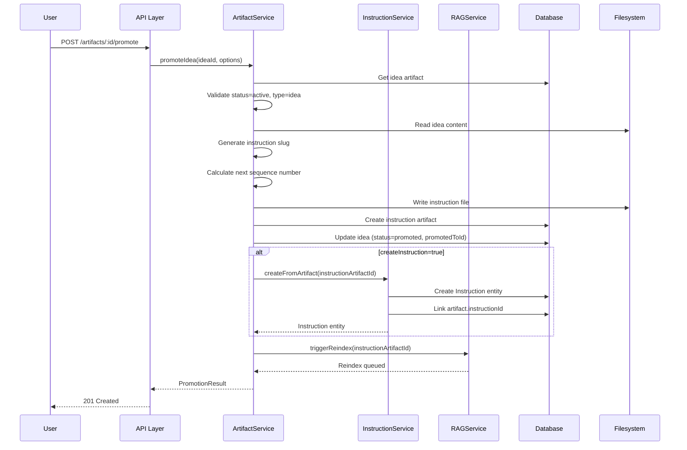

# Instruction System

**Version:** 1.0.0  
**Status:** Draft  
**Updated:** 2026-03-09  

---

## Overview

The Instruction System manages the complete lifecycle of voice-captured and text-based instructions, transforming them into structured tasks through AI-powered long-chain reasoning. Instructions can be created directly or **promoted from ideas** via the RAG artifact system. Instructions are stored as artifacts, broken down into executable tasks, and tracked through completion.

### Instruction Sources

| Source | Description | Flow |
|--------|-------------|------|
| Voice Input | Audio transcription → proofreading → planning | Direct creation |
| Text Input | Manual text entry → planning | Direct creation |
| Idea Promotion | Idea artifact → promotion → instruction artifact + entity | From RAG system |

---

## 11.1 Instruction Lifecycle

```
┌─────────────────────────────────────────────────────────────────────────────────┐
│                         INSTRUCTION LIFECYCLE                                   │
├─────────────────────────────────────────────────────────────────────────────────┤
│                                                                                 │
│  ┌──────────┐                                                                   │
│  │   IDEA   │──────────────────────────┐                                        │
│  │ ARTIFACT │                          │ (promote)                              │
│  └──────────┘                          ▼                                        │
│                                  ┌──────────┐                                   │
│  ┌──────────┐    ┌──────────┐   │ PROMOTED │    ┌──────────┐    ┌──────────┐   │
│  │  VOICE   │───▶│TRANSCRIBE│──▶│    TO    │───▶│ PROOFREAD│───▶│   PLAN   │   │
│  │  INPUT   │    │          │   │INSTRUCTION│   │          │    │          │   │
│  └──────────┘    └──────────┘   └──────────┘    └──────────┘    └──────────┘   │
│                                        ▲               │               │        │
│  ┌──────────┐                          │               ▼               ▼        │
│  │  TEXT    │──────────────────────────┘         ┌──────────┐    ┌──────────┐   │
│  │  INPUT   │                                    │ USER     │    │  TASK    │   │
│  └──────────┘                                    │ APPROVAL │───▶│ BREAKDOWN│   │
│                                                  └──────────┘    └──────────┘   │
│                                                                        │        │
│                                                                        ▼        │
│  ┌──────────┐    ┌──────────┐    ┌──────────┐    ┌──────────┐    ┌──────────┐   │
│  │ COMPLETE │◀───│ EXECUTE  │◀───│  READY   │◀───│  REVIEW  │◀───│ REINDEX  │   │
│  │          │    │          │    │          │    │  TASKS   │    │ ARTIFACT │   │
│  └──────────┘    └──────────┘    └──────────┘    └──────────┘    └──────────┘   │
│                                                                                 │
└─────────────────────────────────────────────────────────────────────────────────┘
```

---

## 11.2 Instruction Scopes

Instructions can target different scopes within a project:

| Scope | Target | Storage Path | Example |
|-------|--------|--------------|---------|
| `global` | Entire project | `instructions/global/` | "Add logging to all services" |
| `backend` | Backend specs only | `instructions/backend/` | "Add rate limiting to API" |
| `frontend` | Frontend specs only | `instructions/frontend/` | "Add dark mode toggle" |
| `file` | Specific file | `instructions/file-scoped/` | "Add error codes to this file" |

---

## 11.3 Database Schema

### Instruction Table

```sql
CREATE TABLE Instruction (
    Id TEXT PRIMARY KEY,
    ProjectId TEXT NOT NULL,
    CreatedById TEXT NOT NULL,
    
    -- Core content
    RawTranscription TEXT,           -- Original voice transcription
    ProofreadText TEXT NOT NULL,     -- AI-corrected text
    InstructionText TEXT NOT NULL,   -- Final instruction after user edit
    
    -- Targeting
    Scope TEXT NOT NULL CHECK (Scope IN ('global', 'backend', 'frontend', 'file')),
    TargetFilePath TEXT,             -- For file-scoped instructions
    
    -- Status tracking
    Status TEXT NOT NULL CHECK (Status IN (
        'transcribed', 'proofreading', 'proofread', 
        'planning', 'planned', 'reviewing',
        'ready', 'executing', 'completed', 'failed', 'cancelled'
    )),
    
    -- Execution mode
    ExecutionMode TEXT NOT NULL CHECK (ExecutionMode IN ('automatic', 'approval')),
    ApprovedAt TEXT,                 -- Timestamp when user approved
    ApprovedById TEXT,               -- User who approved
    
    -- Per-Category Model Selection
    ThinkingModelId TEXT,            -- Model used for planning/reasoning
    WritingModelId TEXT,             -- Model used for content generation
    VoiceModelId TEXT,               -- Model used for transcription
    CodingModelId TEXT,              -- Model used for code generation
    
    -- AI metadata
    PlanningTokensUsed INTEGER,
    PlanningDurationMs INTEGER,
    
    -- Artifacts
    PlanMarkdown TEXT,               -- Human-readable plan
    PlanJson TEXT,                   -- Machine-parseable plan
    
    -- Timestamps
    CreatedAt TEXT NOT NULL,
    UpdatedAt TEXT NOT NULL,
    CompletedAt TEXT,
    
    FOREIGN KEY (ProjectId) REFERENCES Project(Id) ON DELETE CASCADE,
    FOREIGN KEY (CreatedById) REFERENCES User(Id) ON DELETE SET NULL,
    FOREIGN KEY (ApprovedById) REFERENCES User(Id) ON DELETE SET NULL,
    FOREIGN KEY (ThinkingModelId) REFERENCES ModelRegistry(Id) ON DELETE SET NULL,
    FOREIGN KEY (WritingModelId) REFERENCES ModelRegistry(Id) ON DELETE SET NULL,
    FOREIGN KEY (VoiceModelId) REFERENCES ModelRegistry(Id) ON DELETE SET NULL,
    FOREIGN KEY (CodingModelId) REFERENCES ModelRegistry(Id) ON DELETE SET NULL
);

CREATE INDEX IdxInstructionProjectId ON Instruction(ProjectId);
CREATE INDEX IdxInstructionStatus ON Instruction(Status);
CREATE INDEX IdxInstructionScope ON Instruction(Scope);
CREATE INDEX IdxInstructionCreatedAt ON Instruction(CreatedAt DESC);
```

### InstructionTask Table

```sql
CREATE TABLE InstructionTask (
    Id TEXT PRIMARY KEY,
    InstructionId TEXT NOT NULL,
    ParentTaskId TEXT,               -- For nested subtasks
    
    -- Task content
    Title TEXT NOT NULL,             -- Brief task title
    Description TEXT,                -- Detailed description
    TaskType TEXT NOT NULL CHECK (TaskType IN (
        'create', 'update', 'delete', 'refactor', 'review', 'verify'
    )),
    
    -- Model category required for this task
    ModelCategory TEXT CHECK (ModelCategory IN ('thinking', 'writing', 'voice', 'coding')),
    
    -- Targeting
    TargetFilePath TEXT,             -- File to modify
    TargetSection TEXT,              -- Section within file (optional)
    
    -- Dependencies for parallel/chain execution
    DependsOn TEXT,                  -- JSON array of task IDs this task depends on
    
    -- Ordering (fallback when no dependencies)
    SortOrder INTEGER NOT NULL DEFAULT 0,
    
    -- Status
    Status TEXT NOT NULL CHECK (Status IN (
        'pending', 'blocked', 'ready', 'in_progress', 'completed', 'failed', 'skipped'
    )),
    
    -- Execution results
    ResultMarkdown TEXT,             -- What was done
    ResultJson TEXT,                 -- Structured result
    ErrorMessage TEXT,               -- If failed
    ExecutionDurationMs INTEGER,     -- How long task took
    ModelUsed TEXT,                  -- Which model was used
    
    -- Timestamps
    CreatedAt TEXT NOT NULL,
    UpdatedAt TEXT NOT NULL,
    StartedAt TEXT,
    CompletedAt TEXT,
    
    FOREIGN KEY (InstructionId) REFERENCES Instruction(Id) ON DELETE CASCADE,
    FOREIGN KEY (ParentTaskId) REFERENCES InstructionTask(Id) ON DELETE CASCADE
);

CREATE INDEX IdxInstructionTaskInstructionId ON InstructionTask(InstructionId);
CREATE INDEX IdxInstructionTaskParentTaskId ON InstructionTask(ParentTaskId);
CREATE INDEX IdxInstructionTaskStatus ON InstructionTask(Status);
CREATE INDEX IdxInstructionTaskSortOrder ON InstructionTask(SortOrder);
```

---

## 11.4 Instruction Processing Pipeline

### Stage 1: Transcription

```go
type TranscriptionResult struct {
    RawText      string  
    Confidence   float64 
    DurationMs   int     
    LanguageCode string  
}

func (s *InstructionService) CreateFromVoice(
    context stdctx.Context,
    projectId string,
    audioBlob []byte,
) apperror.Result[*Instruction] {
    // 1. Transcribe audio
    transcription, err := s.voiceService.Transcribe(context, audioBlob)
    if err != nil {
        return apperror.FailWrap[*Instruction](
            err,
            "voice transcription failed",
        )
    }
    
    // 2. Create instruction record
    instruction := &Instruction{
        Id:               uuid.New().String(),
        ProjectId:        projectId,
        CreatedById:      ctxutil.GetUserId(context),
        RawTranscription: transcription.RawText,
        Scope:            "global", // Default, can be changed
        Status:           "transcribed",
        ExecutionMode:    s.getProjectExecutionMode(projectId),
        CreatedAt:        time.Now(),
        UpdatedAt:        time.Now(),
    }
    
    // 3. Save to database
    if err := s.repo.CreateInstruction(context, instruction); err != nil {
        return apperror.FailWrap[*Instruction](
            err,
            "failed to create instruction record",
        )
    }
    
    // 4. Start proofreading async
    go s.startProofreading(context, instruction.Id)
    
    return apperror.Ok(instruction)
}
```

### Stage 2: Proofreading

```go
const proofreadPrompt = `You are a technical proofreader. 
Correct any transcription errors in the following text while preserving the original intent.
Fix grammar, spelling, and clarify technical terms.
Return ONLY the corrected text, no explanations.

Original: %s`

func (s *InstructionService) startProofreading(context stdctx.Context, instructionId string) {
    instruction, _ := s.repo.GetInstruction(context, instructionId)
    
    // Update status
    s.repo.UpdateInstructionStatus(context, instructionId, "proofreading")
    
    // Call reasoning model
    prompt := fmt.Sprintf(proofreadPrompt, instruction.RawTranscription)
    result, err := s.aiService.Generate(context, prompt, nil)
    
    if err != nil {
        s.repo.UpdateInstructionError(context, instructionId, err.Error())
        return
    }
    
    // Update instruction
    s.repo.UpdateInstructionProofread(context, instructionId, result.Text)
    
    // If automatic mode, continue to planning
    if instruction.ExecutionMode == "automatic" {
        s.startPlanning(context, instructionId)
    }
}
```

### Stage 3: Planning (Long-Chain Reasoning)

```go
const planningSystemPrompt = `You are a technical planning assistant.
Given an instruction, create a detailed task breakdown.

Output Format (JSON):
{
  "summary": "Brief summary of what will be done",
  "tasks": [
    {
      "title": "Task title",
      "description": "What this task does",
      "type": "create|update|delete|refactor|review|verify",
      "targetFile": "path/to/file.md or null",
      "subtasks": [
        { "title": "Subtask", "description": "...", "type": "..." }
      ]
    }
  ],
  "estimatedFiles": ["file1.md", "file2.md"],
  "risks": ["potential risk 1"],
  "prerequisites": ["what needs to be true first"]
}`

const planningUserPrompt = `Project: %s
Scope: %s
Target File: %s

Instruction:
%s

Create a task breakdown for this instruction.`

func (s *InstructionService) startPlanning(context stdctx.Context, instructionId string) {
    instruction, _ := s.repo.GetInstruction(context, instructionId)
    project, _ := s.projectRepo.GetProject(context, instruction.ProjectId)
    
    // Update status
    s.repo.UpdateInstructionStatus(context, instructionId, "planning")
    startTime := time.Now()
    
    // Build context
    userPrompt := fmt.Sprintf(planningUserPrompt,
        project.Name,
        instruction.Scope,
        instruction.TargetFilePath,
        instruction.InstructionText,
    )
    
    // Get model preference
    modelId := s.getReasoningModelId(instruction.ProjectId)
    
    // Call reasoning model with structured output
    result, err := s.aiService.GenerateStructured(context, GenerateRequest{
        SystemPrompt: planningSystemPrompt,
        UserPrompt:   userPrompt,
        ModelId:      modelId,
        OutputSchema: TaskBreakdownSchema,
    })
    
    if err != nil {
        s.repo.UpdateInstructionError(context, instructionId, err.Error())
        return
    }
    
    // Parse and save tasks
    var plan TaskBreakdown
    json.Unmarshal([]byte(result.Json), &plan)
    
    // Save plan to instruction
    s.repo.UpdateInstructionPlan(context, instructionId, UpdatePlanRequest{
        PlanMarkdown:        s.planToMarkdown(plan),
        PlanJson:            result.Json,
        PlanningTokensUsed:  result.TokensUsed,
        PlanningDurationMs:  int(time.Since(startTime).Milliseconds()),
        ReasoningModelId:    modelId,
    })
    
    // Create task records
    s.createTasksFromPlan(context, instructionId, plan.Tasks, nil)
    
    // Update status
    s.repo.UpdateInstructionStatus(context, instructionId, "planned")
}
```

---

## 11.5 Task Breakdown Schema

```typescript
interface TaskBreakdown {
  Summary: string;
  Tasks: Task[];
  EstimatedFiles: string[];
  Risks: string[];
  Prerequisites: string[];
}

interface Task {
  Id: string;                        // Unique task ID for dependency references
  Title: string;
  Description: string;
  Type: 'create' | 'update' | 'delete' | 'refactor' | 'review' | 'verify';
  ModelCategory: 'thinking' | 'writing' | 'voice' | 'coding';  // Which model to use
  TargetFile: string | null;
  TargetSection?: string;
  DependsOn?: string[];              // Array of task IDs this depends on
  Subtasks?: Task[];
}
```

### Example Task Breakdown

```json
{
  "Summary": "Add PDF export feature with custom templates",
  "Tasks": [
    {
      "Title": "Create PDF export service spec",
      "Description": "Define the service interface and methods for PDF generation",
      "Type": "create",
      "TargetFile": "spec/backend/45-pdf-export-service.md"
    },
    {
      "Title": "Add PDF template schema",
      "Description": "Define the structure for custom PDF templates",
      "Type": "create",
      "TargetFile": "spec/backend/46-pdf-templates.md"
    },
    {
      "Title": "Update API endpoints spec",
      "Description": "Add export endpoints to the API spec",
      "Type": "update",
      "TargetFile": "spec/backend/03-api-endpoints.md",
      "TargetSection": "Export Endpoints",
      "Subtasks": [
        {
          "Title": "Add POST /export/pdf endpoint",
          "Type": "update"
        },
        {
          "Title": "Add GET /export/templates endpoint",
          "Type": "update"
        }
      ]
    },
    {
      "Title": "Add frontend export UI spec",
      "Description": "Specify the export dialog and template selector",
      "Type": "create",
      "TargetFile": "spec/frontend/12-export-dialog.md"
    }
  ],
  "EstimatedFiles": [
    "spec/backend/45-pdf-export-service.md",
    "spec/backend/46-pdf-templates.md",
    "spec/backend/03-api-endpoints.md",
    "spec/frontend/12-export-dialog.md"
  ],
  "Risks": [
    "PDF generation library compatibility",
    "Large file memory consumption"
  ],
  "Prerequisites": [
    "File operations service must be implemented"
  ]
}
```

---

## 11.6 Parallel & Chain Task Execution

Tasks execute based on their dependency graph. Independent tasks run in parallel; dependent tasks chain sequentially.

### Execution Modes

```
┌─────────────────────────────────────────────────────────────────────────────┐
│                        TASK EXECUTION MODES                                  │
├─────────────────────────────────────────────────────────────────────────────┤
│                                                                              │
│  PARALLEL EXECUTION (DependsOn = null or [])                                 │
│  ─────────────────────────────────────────────                              │
│  Tasks with no dependencies execute concurrently using worker pool          │
│                                                                              │
│  ┌────────┐  ┌────────┐  ┌────────┐                                         │
│  │ Task A │  │ Task B │  │ Task C │   (all start simultaneously)            │
│  └────────┘  └────────┘  └────────┘                                         │
│                                                                              │
│  CHAIN EXECUTION (DependsOn = ["parent_id"])                                 │
│  ─────────────────────────────────────────────                              │
│  Tasks wait for all dependencies to complete before starting                │
│                                                                              │
│  ┌────────┐                                                                  │
│  │ Task A │                                                                  │
│  └────┬───┘                                                                  │
│       ▼                                                                      │
│  ┌────────┐                                                                  │
│  │ Task B │  (DependsOn: ["A"])                                              │
│  └────┬───┘                                                                  │
│       ▼                                                                      │
│  ┌────────┐                                                                  │
│  │ Task C │  (DependsOn: ["B"])                                              │
│  └────────┘                                                                  │
│                                                                              │
│  MIXED EXECUTION (Complex Dependencies)                                      │
│  ─────────────────────────────────────────                                  │
│                                                                              │
│  ┌────────┐  ┌────────┐                                                      │
│  │ Task A │  │ Task B │   (parallel - no deps)                               │
│  └────┬───┘  └────┬───┘                                                      │
│       │          │                                                           │
│       └────┬─────┘                                                           │
│            ▼                                                                 │
│       ┌────────┐                                                             │
│       │ Task C │   (DependsOn: ["A", "B"] - waits for both)                  │
│       └────┬───┘                                                             │
│            ▼                                                                 │
│       ┌────────┐  ┌────────┐                                                 │
│       │ Task D │  │ Task E │   (both depend only on C - parallel)            │
│       └────────┘  └────────┘                                                 │
│                                                                              │
└─────────────────────────────────────────────────────────────────────────────┘
```

### Task Executor Service

```go
// internal/services/task_executor.go
package services

import (
    stdctx "context"
    "sync"
)

type TaskExecutor struct {
    db              *sql.DB
    aiService       *AIService
    modelRegistry   *ModelRegistryService
    logManager      *LogStreamManager
    workerPool      chan struct{}          // Concurrency limiter
    maxParallelism  int
}

func NewTaskExecutor(db *sql.DB, aiService *AIService, modelRegistry *ModelRegistryService, maxParallelism int) *TaskExecutor {
    return &TaskExecutor{
        db:             db,
        aiService:      aiService,
        modelRegistry:  modelRegistry,
        workerPool:     make(chan struct{}, maxParallelism),
        maxParallelism: maxParallelism,
    }
}

// ExecuteInstruction runs all tasks respecting dependencies
func (e *TaskExecutor) ExecuteInstruction(context stdctx.Context, instructionId string) error {
    // Load all tasks
    tasks, err := e.loadTasks(context, instructionId)
    if err != nil {
        return err
    }
    
    // Build dependency graph
    graph := e.buildDependencyGraph(tasks)
    
    // Execute with topological ordering and parallelism
    return e.executeGraph(context, graph, instructionId)
}

type TaskNode struct {
    Task       *InstructionTask
    DependsOn  []string
    DependedBy []string
    Status     string
}

func (e *TaskExecutor) buildDependencyGraph(tasks []*InstructionTask) map[string]*TaskNode {
    graph := make(map[string]*TaskNode)
    
    for _, task := range tasks {
        var deps []string
        if task.DependsOn != "" {
            json.Unmarshal([]byte(task.DependsOn), &deps)
        }
        
        graph[task.Id] = &TaskNode{
            Task:      task,
            DependsOn: deps,
            Status:    "pending",
        }
    }
    
    // Build reverse dependencies (who depends on me)
    for id, node := range graph {
        for _, depId := range node.DependsOn {
            if depNode, exists := graph[depId]; exists {
                depNode.DependedBy = append(depNode.DependedBy, id)
            }
        }
    }
    
    return graph
}

func (e *TaskExecutor) executeGraph(context stdctx.Context, graph map[string]*TaskNode, instructionId string) error {
    var wg sync.WaitGroup
    var mu sync.Mutex
    errors := make(map[string]error)
    completed := make(map[string]bool)
    
    // Channel to signal task completion
    taskDone := make(chan string, len(graph))
    
    // Find and execute ready tasks
    executeReady := func() {
        mu.Lock()
        defer mu.Unlock()
        
        for id, node := range graph {
            if node.Status != "pending" {
                continue
            }
            
            // Check if all dependencies are completed
            ready := true
            for _, depId := range node.DependsOn {
                if !completed[depId] {
                    ready = false
                    break
                }
                // Check if dependency failed
                if _, failed := errors[depId]; failed {
                    node.Status = "skipped"
                    ready = false
                    break
                }
            }
            
            if ready {
                node.Status = "in_progress"
                wg.Add(1)
                go e.executeTask(context, node.Task, instructionId, &wg, taskDone, errors, &mu)
            }
        }
    }
    
    // Initial execution of tasks with no dependencies
    executeReady()
    
    // Process completions and trigger dependent tasks
    go func() {
        for taskId := range taskDone {
            mu.Lock()
            completed[taskId] = true
            mu.Unlock()
            executeReady()
        }
    }()
    
    // Wait for all tasks to complete
    wg.Wait()
    close(taskDone)
    
    // Return first error if any
    for _, err := range errors {
        return err
    }
    return nil
}

func (e *TaskExecutor) executeTask(
    context stdctx.Context,
    task *InstructionTask,
    instructionId string,
    wg *sync.WaitGroup,
    done chan<- string,
    errors map[string]error,
    mu *sync.Mutex,
) {
    defer wg.Done()
    
    // Acquire worker slot
    e.workerPool <- struct{}{}
    defer func() { <-e.workerPool }()
    
    startTime := time.Now()
    
    // Update status to in_progress
    e.updateTaskStatus(context, task.Id, "in_progress")
    
    // Resolve model for this task's category
    model, err := e.modelRegistry.ResolveModelByCategory(
        context,
        ModelCategory(task.ModelCategory),
        nil,   // No instruction-level override for individual tasks
        &task.ProjectId,
        task.CreatedById,
    )
    
    if err != nil {
        mu.Lock()
        errors[task.Id] = err
        mu.Unlock()
        e.updateTaskError(context, task.Id, err.Error())
        done <- task.Id
        return
    }
    
    // Execute task with appropriate model
    result, err := e.runTask(context, task, model)
    
    duration := time.Since(startTime).Milliseconds()
    
    if err != nil {
        mu.Lock()
        errors[task.Id] = err
        mu.Unlock()
        e.updateTaskError(context, task.Id, err.Error())
    } else {
        e.updateTaskCompleted(context, task.Id, result, int(duration), model.Id)
    }
    
    done <- task.Id
}

func (e *TaskExecutor) runTask(context stdctx.Context, task *InstructionTask, model *ModelInfo) apperror.Result[*TaskResult] {
    // Prepare prompt based on task type and target
    prompt := e.buildTaskPrompt(task)
    
    // Execute with the resolved model
    response, err := e.aiService.GenerateWithModel(context, GenerateRequest{
        ModelId:      model.Id,
        SystemPrompt: e.getSystemPromptForCategory(ModelCategory(task.ModelCategory)),
        UserPrompt:   prompt,
    })
    
    if err != nil {
        return apperror.FailWrap[*TaskResult](
            err,
            "task execution failed",
        )
    }
    
    return apperror.Ok(&TaskResult{
        Markdown:   response.Text,
        Json:       response.Json,
        TokensUsed: response.TokensUsed,
    })
}

type TaskResult struct {
    Markdown   string 
    Json       string `json:",omitempty"`
    TokensUsed int    
}
```

### Model Category Selection per Task Type

```go
// getDefaultCategoryForTaskType returns the default model category for a task type
func getDefaultCategoryForTaskType(taskType string) ModelCategory {
    switch taskType {
    case "create", "update":
        return ModelCategoryWriting  // Content generation
    case "refactor":
        return ModelCategoryCoding   // Code-focused
    case "review", "verify":
        return ModelCategoryThinking // Analysis/reasoning
    case "delete":
        return ModelCategoryWriting  // Simple task
    default:
        return ModelCategoryWriting
    }
}
```

---

## 11.7 Filesystem Storage

### Instruction Artifacts Directory Structure

```
{ProjectPath}/
└── instructions/
    ├── global/
    │   ├── 2026-01-27-add-logging.md
    │   └── 2026-01-27-add-logging.json
    ├── backend/
    │   └── 2026-01-26-rate-limiting.md
    ├── frontend/
    │   └── 2026-01-25-dark-mode.md
    └── file-scoped/
        └── 2026-01-24-error-codes.md
```

### Instruction Artifact Format (Markdown)

```markdown
# Instruction: Add PDF Export Feature

**ID:** inst_abc123  
**Created:** 2026-01-27T14:30:00Z  
**Status:** completed  
**Scope:** global  

---

## Original Transcription

"I want to add a new feature for exporting reports in PDF format with custom templates"

---

## Proofread Text

"Add a new feature for exporting reports in PDF format with custom templates."

---

## Task Breakdown

### Summary

Add PDF export feature with custom templates

### Tasks

1. **Create PDF export service spec** (create)
   - Target: `spec/backend/45-pdf-export-service.md`
   - Status: ✅ completed

2. **Add PDF template schema** (create)
   - Target: `spec/backend/46-pdf-templates.md`
   - Status: ✅ completed

3. **Update API endpoints spec** (update)
   - Target: `spec/backend/03-api-endpoints.md`
   - Section: Export Endpoints
   - Status: ✅ completed
   - Subtasks:
     - Add POST /export/pdf endpoint ✅
     - Add GET /export/templates endpoint ✅

4. **Add frontend export UI spec** (create)
   - Target: `spec/frontend/12-export-dialog.md`
   - Status: ✅ completed

---

## Execution Log

| Time | Event |
|------|-------|
| 14:30:00 | Instruction created |
| 14:30:02 | Proofreading completed |
| 14:30:05 | Planning completed (4 tasks) |
| 14:30:10 | User approved |
| 14:30:15 | Task 1 started |
| 14:31:02 | Task 1 completed |
| 14:31:05 | Task 2 started |
| ... | ... |
| 14:35:00 | All tasks completed |
```

---

## 11.7 API Endpoints

### Instruction Endpoints

| Method | Path | Description |
|--------|------|-------------|
| POST | `/api/v1/projects/{projectId}/instructions` | Create instruction (text) |
| POST | `/api/v1/projects/{projectId}/instructions/voice` | Create from voice |
| GET | `/api/v1/projects/{projectId}/instructions` | List instructions |
| GET | `/api/v1/projects/{projectId}/instructions/{id}` | Get instruction details |
| PATCH | `/api/v1/projects/{projectId}/instructions/{id}` | Update instruction |
| DELETE | `/api/v1/projects/{projectId}/instructions/{id}` | Delete instruction |
| POST | `/api/v1/projects/{projectId}/instructions/{id}/approve` | Approve for execution |
| POST | `/api/v1/projects/{projectId}/instructions/{id}/cancel` | Cancel instruction |
| POST | `/api/v1/projects/{projectId}/instructions/{id}/replan` | Regenerate plan |

### Task Endpoints

| Method | Path | Description |
|--------|------|-------------|
| GET | `/api/v1/instructions/{instructionId}/tasks` | List tasks |
| GET | `/api/v1/instructions/{instructionId}/tasks/{taskId}` | Get task details |
| PATCH | `/api/v1/instructions/{instructionId}/tasks/{taskId}` | Update task |
| POST | `/api/v1/instructions/{instructionId}/tasks/{taskId}/skip` | Skip task |
| POST | `/api/v1/instructions/{instructionId}/tasks/{taskId}/retry` | Retry failed task |

---

## 11.8 Request/Response Schemas

### Create Instruction (Text)

```typescript
interface CreateInstructionRequest {
  instructionText: string;
  scope: 'global' | 'backend' | 'frontend' | 'file';
  targetFilePath?: string;  // Required if scope is 'file'
  executionMode?: 'automatic' | 'approval';  // Override project default
}

interface CreateInstructionResponse {
  success: boolean;
  data: {
    id: string;
    status: InstructionStatus;
    createdAt: string;
  };
}
```

### Create from Voice

```typescript
// Request: multipart/form-data with audio file
// Field: audio (Blob)
// Field: scope (string)
// Field: targetFilePath (string, optional)

interface VoiceInstructionResponse {
  success: boolean;
  data: {
    id: string;
    rawTranscription: string;
    status: 'transcribed';
    createdAt: string;
  };
}
```

### Get Instruction Details

```typescript
interface InstructionDetails {
  id: string;
  projectId: string;
  createdBy: UserSummary;
  
  rawTranscription: string | null;
  proofreadText: string | null;
  instructionText: string;
  
  scope: InstructionScope;
  targetFilePath: string | null;
  
  status: InstructionStatus;
  executionMode: ExecutionMode;
  
  planMarkdown: string | null;
  tasks: TaskSummary[];
  
  progress: {
    totalTasks: number;
    completedTasks: number;
    failedTasks: number;
    percentComplete: number;
  };
  
  createdAt: string;
  updatedAt: string;
  completedAt: string | null;
}
```

---

## 11.9 Execution Modes

### Automatic Mode

```
Voice Input → Transcribe → Proofread → Plan → Execute → Complete
                                            ↓
                                    (No user intervention)
```

### Approval Mode

```
Voice Input → Transcribe → Proofread → Plan → WAIT FOR APPROVAL → Execute → Complete
                              ↓              ↓
                     User can edit     User reviews tasks
```

### Configurable at Multiple Levels

```go
func (s *InstructionService) getExecutionMode(projectId string) ExecutionMode {
    // 1. Check instruction-level override
    // 2. Check project settings
    projectSettings := s.projectRepo.GetSettings(projectId)
    if projectSettings.InstructionMode != "" {
        return projectSettings.InstructionMode
    }
    
    // 3. Check user default
    userSettings := s.userRepo.GetSettings(ctxutil.GetUserId(context))
    if userSettings.DefaultInstructionMode != "" {
        return userSettings.DefaultInstructionMode
    }
    
    // 4. System default
    return "approval"
}
```

---

## 11.10 Service Interface

```go
type InstructionService interface {
    // Creation
    CreateFromText(context stdctx.Context, req CreateInstructionRequest) apperror.Result[*Instruction]
    CreateFromVoice(context stdctx.Context, projectId string, audio []byte, scope string) apperror.Result[*Instruction]
    
    // Retrieval
    GetInstruction(context stdctx.Context, id string) apperror.Result[*InstructionDetails]
    ListInstructions(context stdctx.Context, projectId string, filter InstructionFilter) apperror.Result[[]InstructionSummary]
    
    // Lifecycle
    ApproveInstruction(context stdctx.Context, id string) *apperror.AppError
    CancelInstruction(context stdctx.Context, id string) *apperror.AppError
    ReplanInstruction(context stdctx.Context, id string) *apperror.AppError
    
    // Task management
    GetTasks(context stdctx.Context, instructionId string) apperror.Result[[]Task]
    SkipTask(context stdctx.Context, taskId string) *apperror.AppError
    RetryTask(context stdctx.Context, taskId string) *apperror.AppError
    
    // Execution
    ExecuteInstruction(context stdctx.Context, id string) *apperror.AppError
    ExecuteTask(context stdctx.Context, taskId string) apperror.Result[*TaskResult]
}
```

---

## 11.11 Error Codes

| Code | Constant | Description |
|------|----------|-------------|
| 11001 | `ErrInstructionNotFound` | Instruction ID does not exist |
| 11002 | `ErrInstructionInvalidScope` | Invalid scope value |
| 11003 | `ErrInstructionFileRequired` | File path required for file scope |
| 11004 | `ErrInstructionAlreadyApproved` | Cannot modify approved instruction |
| 11005 | `ErrInstructionNotPlanned` | Cannot approve before planning completes |
| 11006 | `ErrInstructionCancelled` | Instruction was cancelled |
| 11007 | `ErrTaskNotFound` | Task ID does not exist |
| 11008 | `ErrTaskAlreadyCompleted` | Cannot modify completed task |
| 11009 | `ErrTaskDependencyFailed` | Dependent task failed |
| 11010 | `ErrTranscriptionFailed` | Voice transcription failed |
| 11011 | `ErrProofreadingFailed` | AI proofreading failed |
| 11012 | `ErrPlanningFailed` | AI planning failed |
| 11013 | `ErrExecutionFailed` | Task execution failed |

---

## 11.12 Acceptance Criteria

### Instruction Creation

- [ ] Text instructions create instruction record
- [ ] Voice input transcribes and creates instruction
- [ ] Scope correctly assigns target
- [ ] File-scoped requires valid target path

### Proofreading

- [ ] AI corrects transcription errors
- [ ] Original transcription preserved
- [ ] User can edit before planning

### Planning

- [ ] AI generates structured task breakdown
- [ ] Tasks have clear types and targets
- [ ] Subtasks are properly nested
- [ ] Plan saved in Markdown and JSON formats

### Approval Flow

- [ ] Automatic mode skips approval
- [ ] Approval mode waits for user
- [ ] User can edit tasks before approval
- [ ] Approved timestamp recorded

### Execution

- [ ] Tasks execute in order
- [ ] Failed tasks record error message
- [ ] Skip/retry actions work correctly
- [ ] Progress percentage updates correctly

### Artifact Storage

- [ ] Instructions saved to filesystem
- [ ] Both Markdown and JSON formats
- [ ] Correct scope folder placement

---

## 11.13 Content Type Classification

When a user provides voice or text input, the system classifies it into one of five content types. Each type has its own processing pipeline and associated prompt presets.

### Content Type Definitions

| Content Type       | Slug               | Purpose                                    | Auto-Detect Keywords                          |
|--------------------|--------------------|--------------------------------------------|-----------------------------------------------|
| Idea               | `idea`             | Early-stage, unstructured concept          | "what if", "maybe we could", "brainstorm", "concept" |
| Feature            | `feature`          | Specific functionality requirement         | "user should", "as a user", "functionality", "when I click" |
| Task               | `task`             | Actionable work item                       | "todo", "need to", "implement", "fix", "add", "create" |
| Coding Guideline   | `codingGuideline`  | Technical standard or convention           | "always use", "never do", "standard", "convention", "must follow" |
| Instruction        | `instruction`      | Direct command for AI or system            | "generate", "create a", "build", "you should", "make sure" |

### Auto-Detection Logic

```go
type ContentTypeScore struct {
    ContentType string
    Score       float64
    Keywords    []string  // Matched keywords
}

func InferContentType(input string) (*ContentTypeScore, bool) {
    scores := make(map[string]float64)
    matches := make(map[string][]string)
    
    for contentType, keywords := range ContentTypeKeywords {
        for _, keyword := range keywords {
            if strings.Contains(strings.ToLower(input), keyword) {
                scores[contentType] += 1.0
                matches[contentType] = append(matches[contentType], keyword)
            }
        }
    }
    
    // Find highest score
    maxScore := 0.0
    maxType := ""
    for ct, score := range scores {
        if score > maxScore {
            maxScore = score
            maxType = ct
        }
    }
    
    // If scores are too close (ambiguous), return unknown
    if isAmbiguous(scores) {
        return nil, false
    }
    
    return &ContentTypeScore{
        ContentType: maxType,
        Score:       maxScore,
        Keywords:    matches[maxType],
    }, true
}
```

---

## 11.14 Prompt Presets for Instruction Processing

Prompt Presets are reusable prompt templates that control how the AI processes instructions. Unlike Project Presets (which define folder structures), Prompt Presets define the AI behavior for proofreading, enhancement, and instruction generation.

### Prompt Preset GORM Model

> **ORM Policy**: All database operations use GORM. Raw SQL is forbidden.

```go
// PromptPreset stores base prompt templates for instruction processing
type PromptPreset struct {
    Id             string         `gorm:"primaryKey;type:text"`
    Name           string         `gorm:"type:text;not null"`
    ContentType    string         `gorm:"type:text;not null;index:IdxPresetContentType"` // idea, feature, task, codingGuideline, instruction
    PromptText     string         `gorm:"type:text;not null"`
    Description    string         `gorm:"type:text"`
    SourceFilePath string         `gorm:"type:text"`                                        // If seeded from Prompts/ folder
    IsSystemPreset bool           `gorm:"default:false"`                                    // true = cannot delete
    IsDefault      bool           `gorm:"default:false;index:IdxPresetDefault"`           // true = default for content type
    CreatedAt      time.Time      `gorm:"not null"`
    UpdatedAt      time.Time      `gorm:"not null"`
    CreatedById    *string        `gorm:"type:text"`
    
    // Relationships
    CreatedBy      *User                 `gorm:"foreignKey:CreatedById;constraint:OnDelete:SET NULL"`
    Versions       []PromptPresetVersion `gorm:"foreignKey:PresetId;constraint:OnDelete:CASCADE"`
    Overrides      []UserPromptOverride  `gorm:"foreignKey:PresetId;constraint:OnDelete:CASCADE"`
}

// PromptPresetVersion tracks version history for preset modifications
type PromptPresetVersion struct {
    Id            string    `gorm:"primaryKey;type:text"`
    PresetId      string    `gorm:"type:text;not null;index:IdxVersionPreset"`
    VersionNumber int       `gorm:"not null"`
    PromptText    string    `gorm:"type:text;not null"`
    ChangeNote    string    `gorm:"type:text"`
    CreatedAt     time.Time `gorm:"not null"`
    CreatedById   *string   `gorm:"type:text"`
    
    // Relationships
    Preset    PromptPreset `gorm:"foreignKey:PresetId;constraint:OnDelete:CASCADE"`
    CreatedBy *User        `gorm:"foreignKey:CreatedById;constraint:OnDelete:SET NULL"`
}

// UserPromptOverride stores user-specific customizations on top of base presets
type UserPromptOverride struct {
    Id               string    `gorm:"primaryKey;type:text"`
    UserId           string    `gorm:"type:text;not null;index:IdxOverrideUser"`
    PresetId         string    `gorm:"type:text;not null"`
    ProjectId        *string   `gorm:"type:text;index:IdxOverrideProject"` // Null = global override
    OverrideMode     string    `gorm:"type:text;not null"`                   // append, replace
    CustomPromptText string    `gorm:"type:text;not null"`
    IsActive         bool      `gorm:"default:true"`
    CreatedAt        time.Time `gorm:"not null"`
    UpdatedAt        time.Time `gorm:"not null"`
    
    // Relationships
    User    User          `gorm:"foreignKey:UserId;constraint:OnDelete:CASCADE"`
    Preset  PromptPreset  `gorm:"foreignKey:PresetId;constraint:OnDelete:CASCADE"`
    Project *Project      `gorm:"foreignKey:ProjectId;constraint:OnDelete:CASCADE"`
}
```

### Database Initialization

```go
func InitPromptPresetTables(db *gorm.DB) error {
    return db.AutoMigrate(
        &PromptPreset{},
        &PromptPresetVersion{},
        &UserPromptOverride{},
    )
}
```

### Prompts Folder Structure

```
Prompts/
├── idea/
│   ├── base-idea-expander.md
│   └── creative-brainstorm.md
├── feature/
│   ├── base-feature-spec.md
│   └── user-story-focus.md
├── task/
│   └── base-task-breakdown.md
├── codingGuideline/
│   └── base-coding-standard.md
└── instruction/
    └── base-instruction-enhancer.md
```

### Prompt File Format

```markdown
---
name: Base Idea Expander
description: Expands raw ideas into structured concepts with goals and scope
isDefault: true
---

You are an AI assistant that helps expand raw, unstructured ideas into 
well-defined concepts. When given an idea, you should:

1. Clarify the core objective
2. Identify potential user benefits
3. List assumptions being made
4. Suggest scope boundaries
5. Highlight dependencies or prerequisites

Always maintain the original intent while adding structure.
```

### Prompt Assembly Pipeline

```go
type PromptLayer struct {
    Name    string
    Content string
    Source  string  // "system", "preset", "override", "custom"
}

func AssemblePrompt(context stdctx.Context, req InstructionRequest) (string, []PromptLayer) {
    layers := []PromptLayer{}
    
    // Layer 1: System context
    layers = append(layers, PromptLayer{
        Name:    "System Context",
        Content: GetSystemContext(req.Stage),
        Source:  "system",
    })
    
    // Layer 2: Stage-specific prompt (proofread/enhance/generate)
    layers = append(layers, PromptLayer{
        Name:    "Stage Prompt",
        Content: GetStagePrompt(req.Stage),
        Source:  "system",
    })
    
    // Layer 3: Base preset for content type
    preset := GetPresetForContentType(context, req.ContentType, req.PresetId)
    layers = append(layers, PromptLayer{
        Name:    preset.Name,
        Content: preset.PromptText,
        Source:  "preset",
    })
    
    // Layer 4: User override (if exists)
    override := GetUserOverride(context, req.UserId, preset.Id, req.ProjectId)
    if override != nil && override.IsActive {
        if override.OverrideMode == "replace" {
            // Replace preset content
            layers[len(layers)-1].Content = override.CustomPromptText
            layers[len(layers)-1].Source = "override"
        } else {
            // Append to preset
            layers = append(layers, PromptLayer{
                Name:    "User Override",
                Content: override.CustomPromptText,
                Source:  "override",
            })
        }
    }
    
    // Layer 5: Custom layer for this run
    if req.CustomPromptLayer != "" {
        layers = append(layers, PromptLayer{
            Name:    "Custom Layer",
            Content: req.CustomPromptLayer,
            Source:  "custom",
        })
    }
    
    // Combine all layers
    var combined strings.Builder
    for _, layer := range layers {
        combined.WriteString(layer.Content)
        combined.WriteString("\n\n")
    }
    
    return combined.String(), layers
}
```

---

## 11.15 Inconsistency Detection System

After spec/instruction output is produced, the system analyzes for issues and generates clarification questions.

### Inconsistency Report GORM Model

> **ORM Policy**: All database operations use GORM. Raw SQL is forbidden.

```go
// InconsistencyReport stores analysis results after instruction/spec generation
type InconsistencyReport struct {
    Id               string     `gorm:"primaryKey;type:text"`
    InstructionRunId string     `gorm:"type:text;not null;index:IdxReportRun"`
    TotalIssues      int        `gorm:"not null;default:0"`
    PhaseACritical   int        `gorm:"default:0"`
    PhaseBConflict   int        `gorm:"default:0"`
    PhaseCAmbiguous  int        `gorm:"default:0"`
    PhaseDOptional   int        `gorm:"default:0"`
    AnalysisOutput   string     `gorm:"type:text"` // Full JSON from LLM
    Status           string     `gorm:"type:text;not null;index:IdxReportStatus"` // pending, open, resolved, ignored
    CreatedAt        time.Time  `gorm:"not null"`
    ResolvedAt       *time.Time
    
    // Relationships
    Instruction Instruction          `gorm:"foreignKey:InstructionRunId;constraint:OnDelete:CASCADE"`
    Issues      []InconsistencyIssue `gorm:"foreignKey:ReportId;constraint:OnDelete:CASCADE"`
    Questions   []ClarificationQuestion `gorm:"foreignKey:ReportId;constraint:OnDelete:CASCADE"`
}

// InconsistencyIssue represents an individual issue detected in a report
type InconsistencyIssue struct {
    Id          string     `gorm:"primaryKey;type:text"`
    ReportId    string     `gorm:"type:text;not null;index:IdxIssueReport"`
    Phase       string     `gorm:"type:text;not null;index:IdxIssuePhase"` // A, B, C, D
    Category    string     `gorm:"type:text;not null"` // missing_data, conflict, ambiguity, enhancement
    Title       string     `gorm:"type:text;not null"`
    Description string     `gorm:"type:text;not null"`
    Location    string     `gorm:"type:text"` // File path or section reference
    Severity    string     `gorm:"type:text;not null"` // critical, high, medium, low
    Status      string     `gorm:"type:text;default:'open';index:IdxIssueStatus"` // open, resolved, ignored
    CreatedAt   time.Time  `gorm:"not null"`
    ResolvedAt  *time.Time
    
    // Relationships
    Report    InconsistencyReport     `gorm:"foreignKey:ReportId;constraint:OnDelete:CASCADE"`
    Questions []ClarificationQuestion `gorm:"foreignKey:IssueId;constraint:OnDelete:CASCADE"`
}
```

### Phase Definitions

| Phase | Name               | Priority | Description                                      |
|-------|--------------------|----------|--------------------------------------------------|
| A     | Critical Missing   | 1        | Required fields/sections that MUST be present    |
| B     | Conflicts          | 2        | Mutually exclusive or contradictory requirements |
| C     | Ambiguities        | 3        | Vague terms, undefined acronyms, unclear scope   |
| D     | Enhancements       | 4        | Optional improvements, nice-to-have suggestions  |

### Inconsistency Detection Prompt

```go
const InconsistencyDetectionPrompt = `Analyze the following generated content for issues.

CONTENT:
%s

Identify and categorize issues into phases:
- Phase A: Critical missing data (fields that MUST be present)
- Phase B: Conflicting decisions (mutually exclusive requirements)
- Phase C: Ambiguous terminology (undefined or vague terms)
- Phase D: Optional enhancements (nice-to-have improvements)

For each issue, provide:
1. A short title (max 60 chars)
2. A detailed description
3. Severity: critical, high, medium, low
4. Location in the content (section or line reference)
5. Category: missing_data, conflict, ambiguity, enhancement

Output as JSON:
{
  "issues": [
    {
      "phase": "A",
      "category": "missing_data",
      "title": "No user role defined",
      "description": "The feature spec does not specify which user roles can access this functionality.",
      "severity": "critical",
      "location": "Section 3: Access Control"
    }
  ]
}`
```

---

## 11.16 Clarification Question System

Questions are generated from detected issues to gather user input for spec refinement.

### Clarification Question GORM Model

> **ORM Policy**: All database operations use GORM. Raw SQL is forbidden.

```go
// ClarificationQuestion represents a question generated from a detected issue
type ClarificationQuestion struct {
    Id                string    `gorm:"primaryKey;type:text"`
    IssueId           string    `gorm:"type:text;not null;index:IdxQuestionIssue"`
    ReportId          string    `gorm:"type:text;not null"` // Denormalized for efficient queries
    Phase             string    `gorm:"type:text;not null"`
    QuestionText      string    `gorm:"type:text;not null"`
    WhyItMatters      string    `gorm:"type:text;not null"`
    RecommendedAnswer string    `gorm:"type:text"`
    AnswerType        string    `gorm:"type:text;not null"` // radio, checkbox, text, dropdown, multiSelect
    AnswerOptions     string    `gorm:"type:text"`          // JSON array of {value, label}
    IsRequired        bool      `gorm:"default:true"`
    DisplayOrder      int       `gorm:"not null"`
    CreatedAt         time.Time `gorm:"not null"`
    
    // Relationships
    Issue  InconsistencyIssue    `gorm:"foreignKey:IssueId;constraint:OnDelete:CASCADE"`
    Report InconsistencyReport   `gorm:"foreignKey:ReportId;constraint:OnDelete:CASCADE"`
    Answer *ClarificationAnswer  `gorm:"foreignKey:QuestionId;constraint:OnDelete:CASCADE"`
}

// ClarificationAnswer stores user responses to clarification questions
type ClarificationAnswer struct {
    Id          string    `gorm:"primaryKey;type:text"`
    QuestionId  string    `gorm:"type:text;not null;uniqueIndex:IdxAnswerQuestion"`
    UserId      string    `gorm:"type:text;not null;index:IdxAnswerUser"`
    AnswerValue string    `gorm:"type:text;not null"` // String or JSON for multi-select
    AnswerText  string    `gorm:"type:text"`          // Optional free-text elaboration
    WasSkipped  bool      `gorm:"default:false"`
    CreatedAt   time.Time `gorm:"not null"`
    
    // Relationships
    Question ClarificationQuestion `gorm:"foreignKey:QuestionId;constraint:OnDelete:CASCADE"`
    User     User                  `gorm:"foreignKey:UserId;constraint:OnDelete:SET NULL"`
}

// Database Initialization
func InitClarificationTables(db *gorm.DB) error {
    return db.AutoMigrate(
        &ClarificationQuestion{},
        &ClarificationAnswer{},
    )
}
```

### Question Generation Prompt

```go
const QuestionGenerationPrompt = `For each issue below, generate clarification questions.

ISSUES:
%s

For each issue, create 1-3 questions with:
1. questionText: Clear, specific question
2. whyItMatters: Why the answer is important
3. recommendedAnswer: Suggested answer (optional)
4. answerType: radio, checkbox, text, dropdown, multiSelect
5. answerOptions: Array of {value, label} pairs (if applicable)
6. isRequired: true/false

Output as JSON:
{
  "questions": [
    {
      "issueId": "issue-uuid",
      "questionText": "Which user roles should have access?",
      "whyItMatters": "Determines permission requirements",
      "recommendedAnswer": "editor",
      "answerType": "checkbox",
      "answerOptions": [
        {"value": "admin", "label": "Administrator"},
        {"value": "editor", "label": "Editor"},
        {"value": "viewer", "label": "Viewer"}
      ],
      "isRequired": true
    }
  ]
}`
```

### Answer Type Definitions

| Type         | Control           | Value Format                    | Use Case                          |
|--------------|-------------------|---------------------------------|-----------------------------------|
| `radio`      | Radio buttons     | Single string                   | Exclusive choice                  |
| `checkbox`   | Checkboxes        | JSON array of strings           | Multiple selection                |
| `text`       | Text input        | String                          | Free-form answer                  |
| `dropdown`   | Select dropdown   | Single string                   | Long list, single choice          |
| `multiSelect`| Multi-select chips| JSON array of strings           | Tag-style multiple selection      |

---

## 11.17 Regeneration System

After answers are provided, the system regenerates specs incorporating the clarifications.

### Regeneration Event GORM Model

> **ORM Policy**: All database operations use GORM. Raw SQL is forbidden.

```go
// RegenerationEvent tracks spec/instruction regeneration after answers are provided
type RegenerationEvent struct {
    Id                    string    `gorm:"primaryKey;type:text"`
    OriginalInstructionId string    `gorm:"type:text;not null;index:IdxRegenOriginal"`
    NewInstructionId      string    `gorm:"type:text;not null;index:IdxRegenNew"`
    ReportId              string    `gorm:"type:text;not null"`
    AnswerCount           int       `gorm:"not null"`
    TriggerType           string    `gorm:"type:text;not null"` // manual, automatic
    AdditionalContext     string    `gorm:"type:text"`
    CreatedAt             time.Time `gorm:"not null"`
    CreatedById           *string   `gorm:"type:text"`
    
    // Relationships
    OriginalInstruction Instruction         `gorm:"foreignKey:OriginalInstructionId;constraint:OnDelete:CASCADE"`
    NewInstruction      Instruction         `gorm:"foreignKey:NewInstructionId;constraint:OnDelete:CASCADE"`
    Report              InconsistencyReport `gorm:"foreignKey:ReportId;constraint:OnDelete:CASCADE"`
    CreatedBy           *User               `gorm:"foreignKey:CreatedById;constraint:OnDelete:SET NULL"`
}

// Database Initialization
func InitRegenerationTables(db *gorm.DB) error {
    return db.AutoMigrate(&RegenerationEvent{})
}
```

### Regeneration Process

```go
func (s *InstructionService) Regenerate(context stdctx.Context, req RegenerateRequest) apperror.Result[*Instruction] {
    // 1. Fetch original instruction and report
    original := s.repo.GetInstruction(context, req.OriginalInstructionId)
    report := s.repo.GetReport(context, req.ReportId)
    
    // 2. Fetch all answers
    answers := s.repo.GetAnswersForReport(context, req.ReportId)
    
    // 3. Check required answers are provided
    requiredQuestions := s.repo.GetRequiredQuestions(context, req.ReportId)
    if !allAnswered(requiredQuestions, answers) {
        return nil, ErrRequiredAnswersMissing
    }
    
    // 4. Build regeneration context
    regenCtx := BuildRegenerationContext(original, answers, req.AdditionalContext)
    
    // 5. Create new instruction with enhanced input
    newInstruction := &Instruction{
        Id:               uuid.New().String(),
        ProjectId:        original.ProjectId,
        RawTranscription: original.RawTranscription,
        InstructionText:  regenCtx.EnhancedInstruction,
        Scope:            original.Scope,
        Status:           "planning",
        ExecutionMode:    original.ExecutionMode,
        RegeneratedFrom:  original.Id,
    }
    s.repo.CreateInstruction(context, newInstruction)
    
    // 6. Record regeneration event
    event := &RegenerationEvent{
        Id:                    uuid.New().String(),
        OriginalInstructionId: original.Id,
        NewInstructionId:      newInstruction.Id,
        ReportId:              req.ReportId,
        AnswerCount:           len(answers),
        TriggerType:           req.TriggerType,
    }
    s.repo.CreateRegenerationEvent(context, event)
    
    // 7. Start planning with enhanced context
    go s.startPlanning(context, newInstruction.Id)
    
    return newInstruction, nil
}
```

---

## 11.18 Extended API Endpoints

### Prompt Preset Endpoints

| Method | Path | Description |
|--------|------|-------------|
| GET | `/api/v1/presets/prompts` | List prompt presets |
| GET | `/api/v1/presets/prompts/{id}` | Get preset details |
| POST | `/api/v1/presets/prompts` | Create user preset |
| PUT | `/api/v1/presets/prompts/{id}` | Update preset |
| DELETE | `/api/v1/presets/prompts/{id}` | Delete user preset |
| POST | `/api/v1/presets/prompts/{id}/override` | Create/update user override |
| GET | `/api/v1/presets/prompts/{id}/versions` | Get version history |

### Inconsistency & Question Endpoints

| Method | Path | Description |
|--------|------|-------------|
| GET | `/api/v1/instructions/{id}/inconsistencies` | Get inconsistency report |
| GET | `/api/v1/inconsistencies/{reportId}/questions` | List questions |
| POST | `/api/v1/questions/{id}/answer` | Submit answer |
| POST | `/api/v1/inconsistencies/{reportId}/answers` | Batch submit answers |
| POST | `/api/v1/inconsistencies/{reportId}/regenerate` | Trigger regeneration |
| GET | `/api/v1/instructions/{id}/regenerations` | Get regeneration history |

---

## 11.19 Extended Error Codes

| Code | Constant | Description |
|------|----------|-------------|
| 11020 | `ErrContentTypeInvalid` | Invalid content type specified |
| 11021 | `ErrContentTypeInferenceFail` | Could not infer content type |
| 11022 | `ErrPromptPresetNotFound` | Prompt preset not found |
| 11023 | `ErrPromptPresetImmutable` | Cannot modify system preset |
| 11024 | `ErrOverrideConflict` | Override already exists for scope |
| 11025 | `ErrReportNotFound` | Inconsistency report not found |
| 11026 | `ErrQuestionNotFound` | Question not found |
| 11027 | `ErrRequiredAnswerMissing` | Required question not answered |
| 11028 | `ErrRegenerationBlocked` | Cannot regenerate without answers |
| 11029 | `ErrPromptAssemblyFailed` | Failed to assemble final prompt |

---

## 11.20 Extended Acceptance Criteria

### Content Type Classification

- [ ] System auto-detects content type from input
- [ ] User can override detected content type
- [ ] Each content type has a default prompt preset
- [ ] Unknown content type prompts user selection

### Prompt Presets

- [ ] System presets seeded from Prompts/ folder on startup
- [ ] Users can create custom presets
- [ ] Preset modifications create version records
- [ ] User overrides apply in append or replace mode
- [ ] Project-scoped overrides take precedence
- [ ] Prompt assembly combines all layers correctly

### Inconsistency Detection

- [ ] Every completed instruction triggers analysis
- [ ] Issues categorized into phases A-D
- [ ] Severity levels assigned correctly
- [ ] Report saved with issue breakdown

### Clarification Questions

- [ ] Questions generated from detected issues
- [ ] Correct answer type controls rendered
- [ ] Required questions enforced before regeneration
- [ ] Answers persisted on submit
- [ ] Batch answer submission works

### Regeneration

- [ ] Answers incorporated into regeneration context
- [ ] New instruction linked to original
- [ ] Regeneration chain is traversable
- [ ] Multiple regenerations create history

---

## 11.21 RAG Integration & Idea Promotion

### Idea to Instruction Promotion Flow

When an idea artifact is promoted to an instruction, the system creates both:
1. A new **instruction artifact** (file in `instructions/` folder)
2. A linked **Instruction entity** (database record for task management)



### SourceIdeaId Linking

The `sourceIdeaId` field creates a traceable lineage from ideas to instructions:

```go
// Artifact model extension for RAG
type Artifact struct {
    // ... existing fields ...
    
    // RAG Promotion Links
    SourceIdeaId  *string `gorm:"type:text;index"`  // Points to original idea
    PromotedToId  *string `gorm:"type:text;index"`  // Points to promoted instruction
    InstructionId *string `gorm:"type:text;index"` // Links to Instruction entity
}

// Instruction model extension for RAG
type Instruction struct {
    // ... existing fields ...
    
    // RAG Integration
    SourceArtifactId *string `gorm:"type:text;index"` // Links to instruction artifact
    InputType        string  `gorm:"type:text;not null"`     // 'voice', 'text', 'promoted'
}
```

### Promotion Service Implementation

```go
type PromoteIdeaRequest struct {
    IdeaId            string  
    Title             *string // Override idea title
    AdditionalContent *string // Append to content
    CreateInstruction bool    // Create linked Instruction entity
}

type PromotionResult struct {
    SourceIdea          *Artifact    
    PromotedInstruction *Artifact    
    Instruction         *Instruction `json:",omitempty"`
}

func (s *ArtifactService) PromoteIdea(
    context stdctx.Context,
    req PromoteIdeaRequest,
) apperror.Result[*PromotionResult] {
    // 1. Fetch and validate idea
    idea, err := s.repo.GetArtifact(context, req.IdeaId)
    if err != nil {
        return apperror.Fail[*PromotionResult](ErrArtifactNotFound)
    }
    if idea.ArtifactType != ArtifactTypeIdea {
        return apperror.Fail[*PromotionResult](ErrInvalidArtifactType)
    }
    if idea.Status == ArtifactStatusPromoted {
        return apperror.Fail[*PromotionResult](ErrAlreadyPromoted)
    }
    
    // 2. Read idea content from filesystem
    ideaPath := s.pathManager.ResolvePath(idea.RelativePath)
    content, err := s.pathManager.SafeRead(ideaPath)
    if err != nil {
        return apperror.Fail[*PromotionResult](ErrFileRead)
    }
    
    // 3. Prepare instruction content
    title := idea.Title
    if req.Title != nil {
        title = *req.Title
    }
    
    finalContent := string(content)
    if req.AdditionalContent != nil {
        finalContent += "\n\n" + *req.AdditionalContent
    }
    
    // 4. Generate instruction artifact
    nextSeq := s.getNextSequenceNumber(context, idea.ProjectId, ArtifactTypeInstruction)
    slug := s.generateSlug(title)
    relativePath := fmt.Sprintf("instructions/%02d-instruction-%s.md", nextSeq, slug)
    
    instructionArtifact := &Artifact{
        Id:             uuid.New().String(),
        ProjectId:      idea.ProjectId,
        ArtifactType:   ArtifactTypeInstruction,
        Status:         ArtifactStatusActive,
        SequenceNumber: nextSeq,
        Slug:           slug,
        Title:          title,
        RelativePath:   relativePath,
        ContentHash:    s.hashContent(finalContent),
        WordCount:      s.countWords(finalContent),
        SourceIdeaId:   &idea.Id,
        CreatedAt:      time.Now(),
        UpdatedAt:      time.Now(),
    }
    
    // 5. Write instruction file
    absPath := s.pathManager.ResolvePath(relativePath)
    if err := s.pathManager.SafeWrite(absPath, []byte(finalContent)); err != nil {
        return apperror.Fail[*PromotionResult](ErrFileWrite)
    }
    
    // 6. Create instruction artifact in DB
    if err := s.repo.CreateArtifact(context, instructionArtifact); err != nil {
        return apperror.Fail[*PromotionResult](err)
    }
    
    // 7. Update idea status
    idea.Status = ArtifactStatusPromoted
    idea.PromotedToId = &instructionArtifact.Id
    idea.UpdatedAt = time.Now()
    if err := s.repo.UpdateArtifact(context, idea); err != nil {
        return apperror.Fail[*PromotionResult](err)
    }
    
    result := &PromotionResult{
        SourceIdea:          idea,
        PromotedInstruction: instructionArtifact,
    }
    
    // 8. Optionally create Instruction entity
    if req.CreateInstruction {
        instruction, err := s.instructionService.CreateFromArtifact(context, CreateFromArtifactRequest{
            ArtifactId: instructionArtifact.Id,
            InputType:  InputTypePromoted,
        })
        if err != nil {
            // Log but don't fail - artifact was created successfully
            s.logger.Error("Failed to create instruction entity", "error", err)
        } else {
            instructionArtifact.InstructionId = &instruction.Id
            s.repo.UpdateArtifact(context, instructionArtifact)
            result.Instruction = instruction
        }
    }
    
    // 9. Trigger async re-indexing
    go s.ragService.TriggerReindex(context, instructionArtifact.Id)
    
    return apperror.Ok(result)
}
```

### Automatic Re-indexing After Promotion

When an idea is promoted, the new instruction artifact must be indexed for RAG retrieval:

```go
type ReindexTrigger string

const (
    ReindexTriggerCreate   ReindexTrigger = "create"
    ReindexTriggerUpdate   ReindexTrigger = "update"
    ReindexTriggerPromote  ReindexTrigger = "promote"
    ReindexTriggerManual   ReindexTrigger = "manual"
)

type ReindexRequest struct {
    ArtifactId string         
    Trigger    ReindexTrigger 
    Force      bool           
}

func (s *RAGService) TriggerReindex(context stdctx.Context, artifactId string) error {
    artifact, err := s.artifactRepo.GetArtifact(context, artifactId)
    if err != nil {
        return err
    }
    
    // 1. Read current content
    content, err := s.pathManager.SafeRead(
        s.pathManager.ResolvePath(artifact.RelativePath),
    )
    if err != nil {
        return err
    }
    
    // 2. Check if content changed (skip if hash matches and not forced)
    newHash := s.hashContent(string(content))
    if artifact.ContentHash == newHash && artifact.LastIndexedAt != nil {
        s.logger.Debug("Skipping reindex - content unchanged", "artifactId", artifactId)
        return nil
    }
    
    // 3. Delete existing chunks for this artifact
    if err := s.chunkRepo.DeleteByArtifactId(context, artifactId); err != nil {
        return err
    }
    
    // 4. Split content into chunks
    chunks := s.chunker.Split(string(content), artifact.Id)
    
    // 5. Generate embeddings for each chunk
    for i, chunk := range chunks {
        embedding, err := s.embeddingService.Generate(context, chunk.Content)
        if err != nil {
            s.logger.Error("Embedding generation failed", "chunkId", chunk.Id, "error", err)
            continue
        }
        
        chunk.Embedding = &Embedding{
            ChunkId:      chunk.Id,
            ModelName:    s.embeddingService.ModelName(),
            ModelVersion: s.embeddingService.ModelVersion(),
        }
        chunk.Embedding.SetVector(embedding)
        chunks[i] = chunk
    }
    
    // 6. Batch insert chunks with embeddings
    if err := s.chunkRepo.BatchCreate(context, chunks); err != nil {
        return err
    }
    
    // 7. Update artifact metadata
    now := time.Now()
    artifact.ContentHash = newHash
    artifact.ChunkCount = len(chunks)
    artifact.LastIndexedAt = &now
    artifact.IndexVersion++
    artifact.UpdatedAt = now
    
    return s.artifactRepo.UpdateArtifact(context, artifact)
}
```

### Promotion Event Tracking

```go
type PromotionEvent struct {
    TimestampModel
    SourceIdeaId         string `gorm:"type:text;not null;index"`
    PromotedArtifactId   string `gorm:"type:text;not null;index"`
    InstructionId        *string `gorm:"type:text;index"`
    TriggeredById        string `gorm:"type:text;not null"`
    ReindexCompletedAt   *time.Time `gorm:"type:text"`
    ChunksCreated        int    `gorm:"default:0"`
    
    // Relations
    SourceIdea       Artifact     `gorm:"foreignKey:SourceIdeaId"`
    PromotedArtifact Artifact     `gorm:"foreignKey:PromotedArtifactId"`
    Instruction      *Instruction `gorm:"foreignKey:InstructionId"`
    TriggeredBy      User         `gorm:"foreignKey:TriggeredById"`
}

func (PromotionEvent) TableName() string { return "PromotionEvent" }
```

---

## 11.22 RAG Context in Instruction Planning

When planning tasks for an instruction, the system retrieves relevant context from the RAG system:

```go
func (s *InstructionService) startPlanningWithRag(context stdctx.Context, instructionId string) {
    instruction, _ := s.repo.GetInstruction(context, instructionId)
    project, _ := s.projectRepo.GetProject(context, instruction.ProjectId)
    
    // 1. Retrieve RAG context for the instruction text
    ragContext, err := s.ragService.Retrieve(context, RetrieveRequest{
        ProjectId:      instruction.ProjectId,
        Query:          instruction.InstructionText,
        TopK:           10,
        IncludePinned:  true,
        IncludeRecent:  3,
    })
    if err != nil {
        s.logger.Warn("RAG retrieval failed, proceeding without context", "error", err)
        ragContext = nil
    }
    
    // 2. Build enhanced context
    contextBlock := ""
    if ragContext != nil && len(ragContext.Results) > 0 {
        contextBlock = s.formatRagContext(ragContext)
    }
    
    // 3. Enhanced planning prompt with RAG context
    userPrompt := fmt.Sprintf(planningUserPromptWithRag,
        project.Name,
        instruction.Scope,
        instruction.TargetFilePath,
        contextBlock,  // Injected RAG context
        instruction.InstructionText,
    )
    
    // ... continue with planning as before
}

const planningUserPromptWithRag = `Project: %s
Scope: %s
Target File: %s

## Relevant Context (from existing specs)

%s

---

## Instruction

%s

Create a task breakdown for this instruction, taking into account the relevant context above.`
```

---

## 11.23 Acceptance Criteria

### Core Instruction Lifecycle (99% Required)

| ID | Criterion | Priority | Validation Method |
|----|-----------|----------|-------------------|
| IS-001 | Voice input transcribes to text with ≥90% accuracy | Critical | Unit test with sample audio |
| IS-002 | Text input creates instruction record in database | Critical | Integration test |
| IS-003 | Proofreading stage corrects transcription errors | Critical | AI output validation |
| IS-004 | Planning stage generates task breakdown JSON | Critical | Schema validation |
| IS-005 | Task breakdown contains valid file paths | Critical | Path validation |
| IS-006 | Instruction status transitions follow valid state machine | Critical | State machine test |
| IS-007 | ExecutionMode respects project configuration | High | Config lookup test |
| IS-008 | Model selection follows 4-tier hierarchy (instruction → project → user → system) | High | Priority resolution test |
| IS-009 | Approval workflow blocks execution until approved | High | Manual approval test |
| IS-010 | Instruction cancellation stops all pending tasks | High | Cancellation test |

### Task Execution (99% Required)

| ID | Criterion | Priority | Validation Method |
|----|-----------|----------|-------------------|
| TE-001 | Tasks with no dependencies execute in parallel | Critical | Concurrency test |
| TE-002 | Tasks with DependsOn field execute sequentially | Critical | Dependency graph test |
| TE-003 | Task status updates propagate to parent instruction | Critical | Status sync test |
| TE-004 | Failed task marks instruction as `failed` | Critical | Error handling test |
| TE-005 | Task timeout (configurable) triggers failure | High | Timeout test |
| TE-006 | Worker pool respects `task.maxParallelism` limit | High | Concurrency limit test |
| TE-007 | Context passes between dependent tasks | High | Context propagation test |
| TE-008 | Subtasks complete before parent task completes | High | Nested task test |
| TE-009 | TaskType correctly routes to appropriate model category | High | Model routing test |
| TE-010 | ResultMarkdown and ResultJson populated on completion | Medium | Output capture test |

### Pipeline Processing (99% Required)

| ID | Criterion | Priority | Validation Method |
|----|-----------|----------|-------------------|
| PP-001 | Voice → Transcribe → Proofread → Plan → Execute pipeline completes | Critical | E2E pipeline test |
| PP-002 | Pipeline handles partial failures gracefully | Critical | Failure injection test |
| PP-003 | PlanMarkdown is human-readable format | High | Format validation |
| PP-004 | PlanJson validates against TaskBreakdown schema | High | JSON schema validation |
| PP-005 | PlanningTokensUsed and PlanningDurationMs recorded | Medium | Metrics capture test |
| PP-006 | Long instructions segment properly (>4096 tokens) | High | Segmentation test |
| PP-007 | Pipeline resumes from last successful stage on retry | Medium | Retry test |

### Artifact & File Operations (99% Required)

| ID | Criterion | Priority | Validation Method |
|----|-----------|----------|-------------------|
| AF-001 | Instruction artifacts saved to `instructions/` folder | Critical | File creation test |
| AF-002 | Artifact filename follows `{nn}-instruction-{slug}.md` pattern | Critical | Regex validation |
| AF-003 | File changes tracked in FileChange table | Critical | Audit trail test |
| AF-004 | TargetFilePath validated before task execution | Critical | Path validation |
| AF-005 | Created files have valid Markdown structure | High | Markdown lint test |
| AF-006 | Updated files preserve unmodified sections | High | Diff test |
| AF-007 | Deleted files follow soft-delete workflow | Medium | Trash test |

### RAG Integration (99% Required)

| ID | Criterion | Priority | Validation Method |
|----|-----------|----------|-------------------|
| RAG-001 | Ideas can be promoted to instructions via API | Critical | API test |
| RAG-002 | Promotion creates instruction artifact file | Critical | File creation test |
| RAG-003 | Promotion updates idea status to `promoted` | Critical | Status update test |
| RAG-004 | Promotion sets bidirectional links (sourceIdeaId ↔ promotedToId) | Critical | Link verification |
| RAG-005 | Promotion triggers automatic re-indexing | High | Index refresh test |
| RAG-006 | Re-indexing generates chunks from markdown | High | Chunking test |
| RAG-007 | Re-indexing generates embeddings per chunk | High | Embedding test |
| RAG-008 | Planning retrieves relevant RAG context | High | Context injection test |
| RAG-009 | Top-K pinned artifacts included in context | Medium | Pinned artifact test |
| RAG-010 | Planning proceeds even if RAG retrieval fails | Medium | Fallback test |

### Error Handling (99% Required)

| ID | Criterion | Priority | Validation Method |
|----|-----------|----------|-------------------|
| EH-001 | Invalid audio format returns `ErrInvalidAudio` (6101) | Critical | Error code test |
| EH-002 | Transcription failure returns `ErrTranscriptionFailed` (6102) | Critical | Error code test |
| EH-003 | Planning timeout returns `ErrPlanningTimeout` (6103) | Critical | Error code test |
| EH-004 | Task execution failure returns `ErrTaskFailed` (6104) | Critical | Error code test |
| EH-005 | All errors include instructionId for correlation | High | Error context test |
| EH-006 | Partial completion allows individual task retry | Medium | Retry test |

---

## Related Specs

- [Database Schema](../../07-database-design/01-schema.md)
- [AI Integration](./01-ai-integration.md)
- [Voice Input](../05-voice-input/00-overview.md)
- [Instruction History](./04-instruction-history.md)
- [Instruction Builder UI](./09-instruction-builder-ui.md)
- [RAG System](../09-knowledge-memory/01-rag-system.md)
- [Path Manager](../02-file-management/02-path-manager.md)
