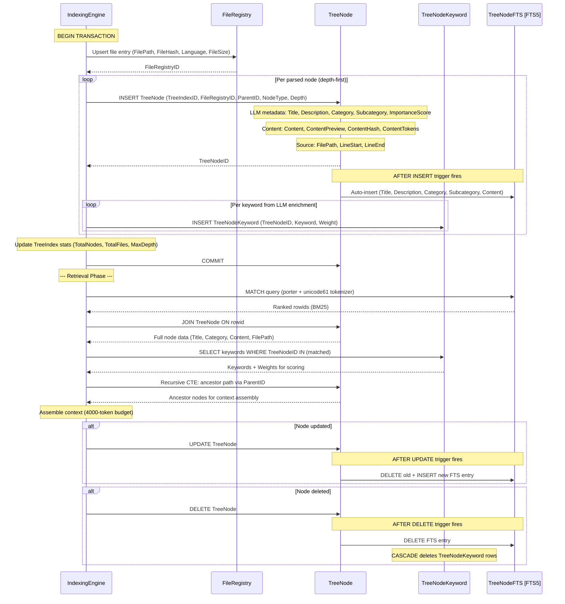
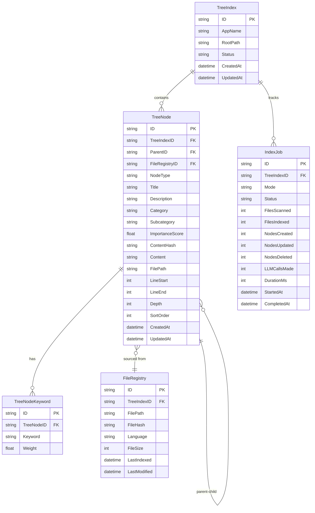

# Non-Vector RAG: Tree Index Schema

**Version:** 1.1.0  
**Status:** Draft  
**Last Updated:** 2026-03-22  

---

## Overview

This document defines the SQLite database schema for storing tree-structured indexes. The schema follows the Split DB architecture and uses PascalCase naming conventions per project database standards.

---

## Sequence Diagram



---

## Entity Relationship



---

## Table Definitions

### TreeIndex

Root table representing a single tree index for a codebase or document collection.

```sql
CREATE TABLE TreeIndex (
    ID            TEXT PRIMARY KEY DEFAULT (lower(hex(randomblob(16)))),
    AppName       TEXT NOT NULL,
    RootPath      TEXT NOT NULL,
    Status        TEXT NOT NULL DEFAULT 'pending',  -- pending, indexing, ready, error
    TotalNodes    INTEGER NOT NULL DEFAULT 0,
    TotalFiles    INTEGER NOT NULL DEFAULT 0,
    MaxDepth      INTEGER NOT NULL DEFAULT 0,
    CreatedAt     DATETIME NOT NULL DEFAULT CURRENT_TIMESTAMP,
    UpdatedAt     DATETIME NOT NULL DEFAULT CURRENT_TIMESTAMP
);

CREATE INDEX IdxTreeIndexAppName ON TreeIndex(AppName);
CREATE INDEX IdxTreeIndexStatus ON TreeIndex(Status);
```

### TreeNode

Core table storing each node in the hierarchical tree. Every node has metadata generated by the LLM enrichment pipeline.

```sql
CREATE TABLE TreeNode (
    ID              TEXT PRIMARY KEY DEFAULT (lower(hex(randomblob(16)))),
    TreeIndexID     TEXT NOT NULL REFERENCES TreeIndex(ID) ON DELETE CASCADE,
    ParentID        TEXT REFERENCES TreeNode(ID) ON DELETE CASCADE,
    FileRegistryID  TEXT NOT NULL REFERENCES FileRegistry(ID) ON DELETE CASCADE,
    
    -- Structural metadata
    NodeType        TEXT NOT NULL,  -- 'package', 'file', 'function', 'method', 'struct',
                                    -- 'interface', 'class', 'section', 'block', 'constant',
                                    -- 'variable', 'import', 'heading', 'paragraph'
    Depth           INTEGER NOT NULL DEFAULT 0,
    SortOrder       INTEGER NOT NULL DEFAULT 0,
    
    -- LLM-generated metadata
    Title           TEXT NOT NULL,
    Description     TEXT NOT NULL DEFAULT '',
    Category        TEXT NOT NULL DEFAULT 'uncategorized',
    Subcategory     TEXT NOT NULL DEFAULT '',
    ImportanceScore REAL NOT NULL DEFAULT 0.5,
    
    -- Content
    Content         TEXT NOT NULL DEFAULT '',       -- Full text content of this node
    ContentPreview  TEXT NOT NULL DEFAULT '',       -- First 200 chars for quick display
    ContentHash     TEXT NOT NULL DEFAULT '',       -- SHA-256 of Content for change detection
    ContentTokens   INTEGER NOT NULL DEFAULT 0,    -- Estimated token count
    
    -- Source location
    FilePath        TEXT NOT NULL,
    LineStart       INTEGER NOT NULL DEFAULT 0,
    LineEnd         INTEGER NOT NULL DEFAULT 0,
    
    -- Timestamps
    CreatedAt       DATETIME NOT NULL DEFAULT CURRENT_TIMESTAMP,
    UpdatedAt       DATETIME NOT NULL DEFAULT CURRENT_TIMESTAMP
);

-- Primary lookup indexes
CREATE INDEX IdxTreeNodeTreeIndex ON TreeNode(TreeIndexID);
CREATE INDEX IdxTreeNodeParent ON TreeNode(ParentID);
CREATE INDEX IdxTreeNodeFile ON TreeNode(FileRegistryID);

-- Metadata search indexes
CREATE INDEX IdxTreeNodeCategory ON TreeNode(TreeIndexID, Category);
CREATE INDEX IdxTreeNodeSubcategory ON TreeNode(TreeIndexID, Subcategory);
CREATE INDEX IdxTreeNodeType ON TreeNode(TreeIndexID, NodeType);
CREATE INDEX IdxTreeNodeDepth ON TreeNode(TreeIndexID, Depth);
CREATE INDEX IdxTreeNodeImportance ON TreeNode(TreeIndexID, ImportanceScore DESC);

-- Content hash for change detection
CREATE INDEX IdxTreeNodeContentHash ON TreeNode(ContentHash);
```

### TreeNodeKeyword

Normalized keyword table for efficient keyword-based matching during retrieval.

```sql
CREATE TABLE TreeNodeKeyword (
    ID          TEXT PRIMARY KEY DEFAULT (lower(hex(randomblob(16)))),
    TreeNodeID  TEXT NOT NULL REFERENCES TreeNode(ID) ON DELETE CASCADE,
    Keyword     TEXT NOT NULL,
    Weight      REAL NOT NULL DEFAULT 1.0,  -- Keyword importance weight (0.0-1.0)
    
    UNIQUE(TreeNodeID, Keyword)
);

CREATE INDEX IdxTreeNodeKeywordNode ON TreeNodeKeyword(TreeNodeID);
CREATE INDEX IdxTreeNodeKeywordWord ON TreeNodeKeyword(Keyword);
```

### TreeNodeKeyword FTS5 Virtual Table

Full-text search index for fast keyword matching across all nodes.

```sql
CREATE VIRTUAL TABLE TreeNodeFTS USING fts5(
    Title,
    Description,
    Keywords,       -- Space-separated keywords from TreeNodeKeyword
    Category,
    Subcategory,
    Content,
    content=TreeNode,
    content_rowid=rowid,
    tokenize='porter unicode61'
);

-- Triggers to keep FTS in sync
CREATE TRIGGER TreeNodeFTSInsert AFTER INSERT ON TreeNode BEGIN
    INSERT INTO TreeNodeFTS(rowid, Title, Description, Keywords, Category, Subcategory, Content)
    VALUES (new.rowid, new.Title, new.Description, '', new.Category, new.Subcategory, new.Content);
END;

CREATE TRIGGER TreeNodeFTSDelete AFTER DELETE ON TreeNode BEGIN
    INSERT INTO TreeNodeFTS(TreeNodeFTS, rowid, Title, Description, Keywords, Category, Subcategory, Content)
    VALUES ('delete', old.rowid, old.Title, old.Description, '', old.Category, old.Subcategory, old.Content);
END;

CREATE TRIGGER TreeNodeFTSUpdate AFTER UPDATE ON TreeNode BEGIN
    INSERT INTO TreeNodeFTS(TreeNodeFTS, rowid, Title, Description, Keywords, Category, Subcategory, Content)
    VALUES ('delete', old.rowid, old.Title, old.Description, '', old.Category, old.Subcategory, old.Content);
    INSERT INTO TreeNodeFTS(rowid, Title, Description, Keywords, Category, Subcategory, Content)
    VALUES (new.rowid, new.Title, new.Description, '', new.Category, new.Subcategory, new.Content);
END;
```

### FileRegistry

Tracks indexed files for change detection and incremental updates.

```sql
CREATE TABLE FileRegistry (
    ID            TEXT PRIMARY KEY DEFAULT (lower(hex(randomblob(16)))),
    TreeIndexID   TEXT NOT NULL REFERENCES TreeIndex(ID) ON DELETE CASCADE,
    FilePath      TEXT NOT NULL,
    FileHash      TEXT NOT NULL,        -- SHA-256 of file content
    Language      TEXT NOT NULL DEFAULT 'unknown',
    FileSize      INTEGER NOT NULL DEFAULT 0,
    NodeCount     INTEGER NOT NULL DEFAULT 0,  -- How many TreeNodes from this file
    LastIndexed   DATETIME NOT NULL DEFAULT CURRENT_TIMESTAMP,
    LastModified  DATETIME NOT NULL,
    
    UNIQUE(TreeIndexID, FilePath)
);

CREATE INDEX IdxFileRegistryTreeIndex ON FileRegistry(TreeIndexID);
CREATE INDEX IdxFileRegistryHash ON FileRegistry(FileHash);
```

### IndexJob

Tracks indexing jobs for monitoring and debugging.

```sql
CREATE TABLE IndexJob (
    ID              TEXT PRIMARY KEY DEFAULT (lower(hex(randomblob(16)))),
    TreeIndexID     TEXT NOT NULL REFERENCES TreeIndex(ID) ON DELETE CASCADE,
    Mode            TEXT NOT NULL DEFAULT 'full',  -- 'full', 'incremental', 'metadata-only'
    Status          TEXT NOT NULL DEFAULT 'pending', -- 'pending', 'running', 'completed', 'failed'
    FilesScanned    INTEGER NOT NULL DEFAULT 0,
    FilesIndexed    INTEGER NOT NULL DEFAULT 0,
    FilesSkipped    INTEGER NOT NULL DEFAULT 0,
    NodesCreated    INTEGER NOT NULL DEFAULT 0,
    NodesUpdated    INTEGER NOT NULL DEFAULT 0,
    NodesDeleted    INTEGER NOT NULL DEFAULT 0,
    LLMCallsMade    INTEGER NOT NULL DEFAULT 0,
    LLMTokensUsed   INTEGER NOT NULL DEFAULT 0,
    ErrorMessage    TEXT DEFAULT NULL,
    DurationMs      INTEGER NOT NULL DEFAULT 0,
    StartedAt       DATETIME NOT NULL DEFAULT CURRENT_TIMESTAMP,
    CompletedAt     DATETIME DEFAULT NULL
);

CREATE INDEX IdxIndexJobTreeIndex ON IndexJob(TreeIndexID);
CREATE INDEX IdxIndexJobStatus ON IndexJob(Status);
```

---

## GORM Models

```go
type TreeIndex struct {
    BaseModel
    AppName    string `gorm:"column:AppName;not null;index:IdxTreeIndexAppName" json:"AppName"`
    RootPath   string `gorm:"column:RootPath;not null" json:"RootPath"`
    Status     string `gorm:"column:Status;not null;default:pending;index:IdxTreeIndexStatus" json:"Status"`
    TotalNodes int    `gorm:"column:TotalNodes;not null;default:0" json:"TotalNodes"`
    TotalFiles int    `gorm:"column:TotalFiles;not null;default:0" json:"TotalFiles"`
    MaxDepth   int    `gorm:"column:MaxDepth;not null;default:0" json:"MaxDepth"`
    TimestampModel
}

type TreeNode struct {
    BaseModel
    TreeIndexID    string  `gorm:"column:TreeIndexID;not null;index:IdxTreeNodeTreeIndex" json:"TreeIndexID"`
    ParentID       *string `gorm:"column:ParentID;index:IdxTreeNodeParent" json:"ParentID"`
    FileRegistryID string  `gorm:"column:FileRegistryID;not null;index:IdxTreeNodeFile" json:"FileRegistryID"`
    
    // Structural
    NodeType       string  `gorm:"column:NodeType;not null" json:"NodeType"`
    Depth          int     `gorm:"column:Depth;not null;default:0" json:"Depth"`
    SortOrder      int     `gorm:"column:SortOrder;not null;default:0" json:"SortOrder"`
    
    // LLM-generated metadata
    Title          string  `gorm:"column:Title;not null" json:"Title"`
    Description    string  `gorm:"column:Description;not null;default:''" json:"Description"`
    Category       string  `gorm:"column:Category;not null;default:uncategorized" json:"Category"`
    Subcategory    string  `gorm:"column:Subcategory;not null;default:''" json:"Subcategory"`
    ImportanceScore float64 `gorm:"column:ImportanceScore;not null;default:0.5" json:"ImportanceScore"`
    
    // Content
    Content        string  `gorm:"column:Content;not null;default:''" json:"Content"`
    ContentPreview string  `gorm:"column:ContentPreview;not null;default:''" json:"ContentPreview"`
    ContentHash    string  `gorm:"column:ContentHash;not null;default:''" json:"ContentHash"`
    ContentTokens  int     `gorm:"column:ContentTokens;not null;default:0" json:"ContentTokens"`
    
    // Source
    FilePath       string  `gorm:"column:FilePath;not null" json:"FilePath"`
    LineStart      int     `gorm:"column:LineStart;not null;default:0" json:"LineStart"`
    LineEnd        int     `gorm:"column:LineEnd;not null;default:0" json:"LineEnd"`
    
    TimestampModel
    
    // Relations
    TreeIndex      TreeIndex        `gorm:"foreignKey:TreeIndexID" json:"-"`
    Parent         *TreeNode        `gorm:"foreignKey:ParentID" json:"-"`
    Children       []TreeNode       `gorm:"foreignKey:ParentID" json:"Children,omitempty"`
    Keywords       []TreeNodeKeyword `gorm:"foreignKey:TreeNodeID" json:"Keywords,omitempty"`
    FileRegistry   FileRegistry     `gorm:"foreignKey:FileRegistryID" json:"-"`
}

type TreeNodeKeyword struct {
    BaseModel
    TreeNodeID string  `gorm:"column:TreeNodeID;not null;uniqueIndex:IdxTreeNodeKeywordUnique" json:"TreeNodeID"`
    Keyword    string  `gorm:"column:Keyword;not null;uniqueIndex:IdxTreeNodeKeywordUnique;index:IdxTreeNodeKeywordWord" json:"Keyword"`
    Weight     float64 `gorm:"column:Weight;not null;default:1.0" json:"Weight"`
    
    TreeNode   TreeNode `gorm:"foreignKey:TreeNodeID" json:"-"`
}

type FileRegistry struct {
    BaseModel
    TreeIndexID  string    `gorm:"column:TreeIndexID;not null;uniqueIndex:IdxFileRegistryUnique" json:"TreeIndexID"`
    FilePath     string    `gorm:"column:FilePath;not null;uniqueIndex:IdxFileRegistryUnique" json:"FilePath"`
    FileHash     string    `gorm:"column:FileHash;not null;index:IdxFileRegistryHash" json:"FileHash"`
    Language     string    `gorm:"column:Language;not null;default:unknown" json:"Language"`
    FileSize     int64     `gorm:"column:FileSize;not null;default:0" json:"FileSize"`
    NodeCount    int       `gorm:"column:NodeCount;not null;default:0" json:"NodeCount"`
    LastIndexed  time.Time `gorm:"column:LastIndexed;not null" json:"LastIndexed"`
    LastModified time.Time `gorm:"column:LastModified;not null" json:"LastModified"`
    
    TreeIndex    TreeIndex `gorm:"foreignKey:TreeIndexID" json:"-"`
}

type IndexJob struct {
    BaseModel
    TreeIndexID   string     `gorm:"column:TreeIndexID;not null;index:IdxIndexJobTreeIndex" json:"TreeIndexID"`
    Mode          string     `gorm:"column:Mode;not null;default:full" json:"Mode"`
    Status        string     `gorm:"column:Status;not null;default:pending;index:IdxIndexJobStatus" json:"Status"`
    FilesScanned  int        `gorm:"column:FilesScanned;not null;default:0" json:"FilesScanned"`
    FilesIndexed  int        `gorm:"column:FilesIndexed;not null;default:0" json:"FilesIndexed"`
    FilesSkipped  int        `gorm:"column:FilesSkipped;not null;default:0" json:"FilesSkipped"`
    NodesCreated  int        `gorm:"column:NodesCreated;not null;default:0" json:"NodesCreated"`
    NodesUpdated  int        `gorm:"column:NodesUpdated;not null;default:0" json:"NodesUpdated"`
    NodesDeleted  int        `gorm:"column:NodesDeleted;not null;default:0" json:"NodesDeleted"`
    LLMCallsMade  int        `gorm:"column:LLMCallsMade;not null;default:0" json:"LLMCallsMade"`
    LLMTokensUsed int        `gorm:"column:LLMTokensUsed;not null;default:0" json:"LLMTokensUsed"`
    ErrorMessage  *string    `gorm:"column:ErrorMessage" json:"ErrorMessage"`
    DurationMs    int64      `gorm:"column:DurationMs;not null;default:0" json:"DurationMs"`
    StartedAt     time.Time  `gorm:"column:StartedAt;not null" json:"StartedAt"`
    CompletedAt   *time.Time `gorm:"column:CompletedAt" json:"CompletedAt"`
    
    TreeIndex     TreeIndex  `gorm:"foreignKey:TreeIndexID" json:"-"`
}
```

---

## Query Patterns

### Find all root nodes for an index

```sql
SELECT * FROM TreeNode 
WHERE TreeIndexID = ? AND ParentID IS NULL 
ORDER BY SortOrder;
```

### Find children of a node

```sql
SELECT * FROM TreeNode 
WHERE ParentID = ? 
ORDER BY SortOrder;
```

### Full-text search across nodes

```sql
SELECT tn.*, TreeNodeFTS.rank 
FROM TreeNodeFTS 
JOIN TreeNode tn ON TreeNodeFTS.rowid = tn.rowid
WHERE TreeNodeFTS MATCH ? 
  AND tn.TreeIndexID = ?
ORDER BY TreeNodeFTS.rank
LIMIT 20;
```

### Find nodes by category

```sql
SELECT * FROM TreeNode 
WHERE TreeIndexID = ? AND Category = ? 
ORDER BY ImportanceScore DESC;
```

### Ancestor path for a node (recursive CTE)

```sql
WITH RECURSIVE ancestors AS (
    SELECT ID, ParentID, Title, Depth, 0 AS Level
    FROM TreeNode WHERE ID = ?
    
    UNION ALL
    
    SELECT tn.ID, tn.ParentID, tn.Title, tn.Depth, a.Level + 1
    FROM TreeNode tn
    JOIN ancestors a ON tn.ID = a.ParentID
)
SELECT * FROM ancestors ORDER BY Level DESC;
```

---

## Cross-References

| Reference | Location |
|-----------|----------|
| Architecture | `./01-architecture.md` |
| Split DB Architecture | `../06-split-db-architecture/00-overview.md` |
| Database Standards | `.lovable/memories/architecture/database-standards` |
| Golang Standards | `../02-coding-guidelines/03-golang/00-overview.md` |

---

*Schema specification created 2026-03-22.*
