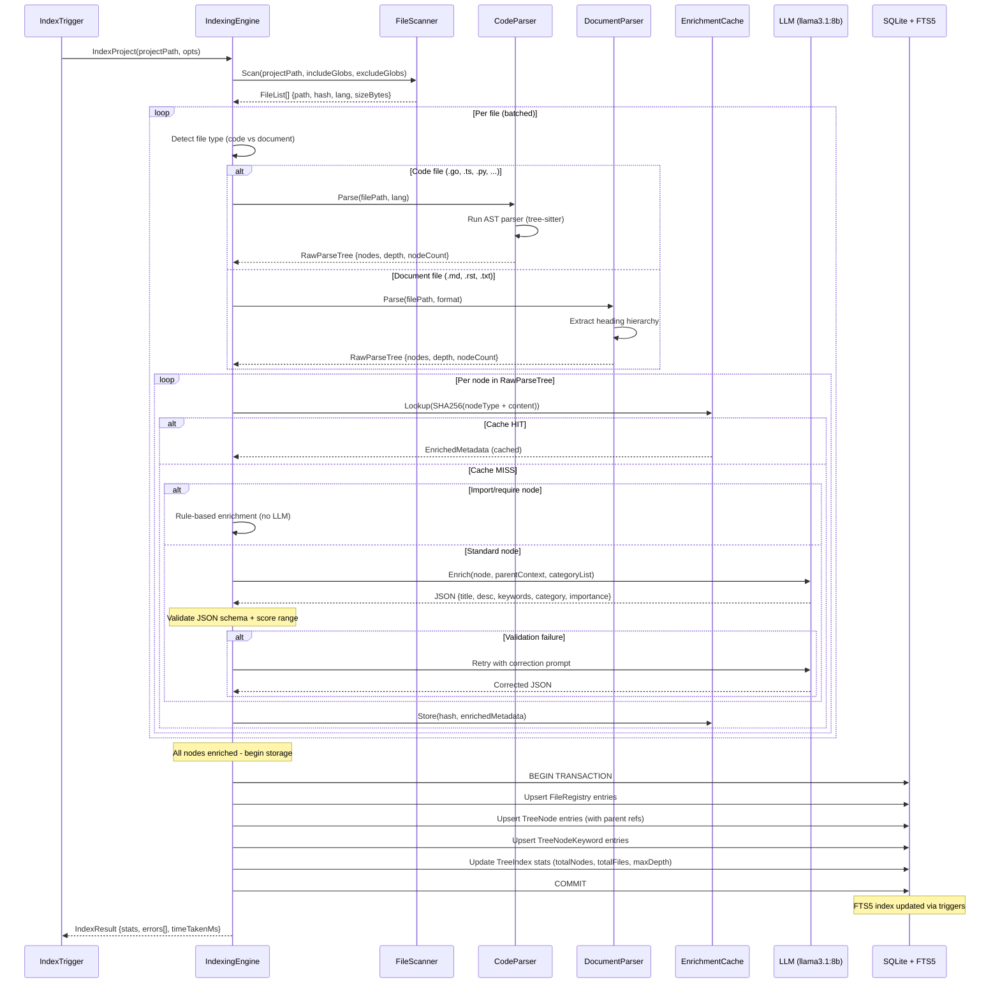

# Non-Vector RAG: Tree Indexing Engine

**Version:** 1.1.0  
**Status:** Draft  
**Last Updated:** 2026-03-22  

---

## Overview

The Tree Indexing Engine is responsible for transforming Raw Parse Trees (produced by Code/Document Parsers) into **Enriched Tree Nodes** with LLM-generated metadata. This is the core differentiator of the non-vector approach: instead of computing vector embeddings, we use a small/fast LLM to generate human-readable metadata (title, description, keywords, category, subcategory, importance) for each tree node.

---

## Sequence Diagram



---

## Enrichment Pipeline

```
Raw Parse Tree              LLM Enrichment              Enriched Tree
┌──────────────┐           ┌──────────────┐           ┌──────────────┐
│ RawTreeNode  │           │              │           │  TreeNode    │
│ ├─ Name      │    ──▶    │  Small LLM   │    ──▶    │ ├─ Title     │
│ ├─ NodeType  │           │  (llama3.1)  │           │ ├─ Desc      │
│ ├─ Content   │           │              │           │ ├─ Keywords  │
│ ├─ LineStart │           │  Batched     │           │ ├─ Category  │
│ ├─ LineEnd   │           │  Processing  │           │ ├─ Subcat    │
│ └─ Children  │           │              │           │ ├─ Importance│
│              │           └──────────────┘           │ └─ Children  │
└──────────────┘                                      └──────────────┘
```

---

## LLM Enrichment

### Model Selection

| Requirement | Choice | Rationale |
|-------------|--------|-----------|
| Speed | `llama3.1:8b` or equivalent | Fast inference, <500ms per call |
| Capability | Summarization + classification | No need for complex reasoning |
| Cost | Local via Ollama | Zero API cost |
| Fallback | `gemma2:2b` | Ultra-fast for simple nodes |

### Enrichment Prompt

```yaml
system: |
  You are a code/document analyzer. Given a code or document node, 
  generate structured metadata for indexing and retrieval.
  
  Rules:
  - Title: 3-8 words, descriptive, human-readable
  - Description: 1-2 sentences explaining purpose/function
  - Keywords: 3-10 relevant terms for search matching
  - Category: broad classification (see allowed categories)
  - Subcategory: specific classification within category
  - Importance: 0.0-1.0 where 1.0 = critical system component

prompt_template: |
  Analyze this {nodeType} node and generate metadata.

  File: {filePath}
  Name: {nodeName}
  Parent: {parentTitle} ({parentCategory})
  Content:
  ```
  {contentPreview}
  ```

  Allowed Categories:
  {categoryList}

  Respond ONLY with valid JSON:
  {
    "title": "string",
    "description": "string",
    "keywords": ["string"],
    "category": "string",
    "subcategory": "string",
    "importance": 0.0
  }
```

### Category Taxonomy

The category system uses a two-level hierarchy. Categories are predefined; subcategories are LLM-generated but constrained.

**Predefined Categories:**

| Category | Description | Example Subcategories |
|----------|-------------|----------------------|
| `authentication` | Auth, identity, sessions | jwt, oauth, rbac, session-management |
| `database` | Storage, queries, migrations | schema, migration, query, connection |
| `api` | REST/gRPC endpoints, routing | endpoint, middleware, validation |
| `business-logic` | Core domain logic | calculation, workflow, rule-engine |
| `configuration` | Config, settings, env | env-vars, feature-flags, defaults |
| `error-handling` | Errors, recovery, logging | error-codes, retry, fallback |
| `ui-component` | Frontend components | form, layout, navigation, modal |
| `utility` | Helpers, shared functions | string-utils, date-utils, crypto |
| `testing` | Tests, mocks, fixtures | unit-test, integration-test, fixture |
| `documentation` | Specs, guides, READMEs | spec, guide, api-doc, changelog |
| `infrastructure` | DevOps, CI/CD, build | docker, ci-pipeline, monitoring |
| `data-model` | Types, interfaces, schemas | entity, dto, enum, constant |
| `integration` | Third-party service calls | webhook, sdk, external-api |
| `performance` | Optimization, caching | cache, profiling, lazy-loading |
| `security` | Encryption, sanitization | encryption, xss-prevention, rate-limit |
| `uncategorized` | Fallback | (LLM assigns if nothing fits) |

### Importance Scoring Guidelines

Provided to the LLM as part of the system prompt:

| Score Range | Meaning | Examples |
|-------------|---------|----------|
| 0.9 - 1.0 | Critical infrastructure | Main entry point, core interfaces, auth middleware |
| 0.7 - 0.8 | Important business logic | Domain services, key handlers |
| 0.5 - 0.6 | Standard components | Regular functions, typical CRUD |
| 0.3 - 0.4 | Supporting utilities | Helper functions, formatters |
| 0.1 - 0.2 | Low importance | Constants, type aliases, imports |

---

## Batching Strategy

### Node Batching

Nodes are processed in batches to maximize LLM throughput:

```go
type BatchConfig struct {
    BatchSize       int           // Nodes per LLM call (default: 10)
    MaxConcurrent   int           // Parallel LLM calls (default: 4)
    TimeoutPerBatch time.Duration // Timeout per batch (default: 30s)
    RetryAttempts   int           // Retry failed batches (default: 2)
}
```

**Multi-node batch prompt:**

```
Analyze these {count} nodes and generate metadata for each.

Node 1:
- Type: {nodeType}
- Name: {name}
- File: {filePath}
- Content Preview: {preview}

Node 2:
- Type: {nodeType}
- Name: {name}
...

Respond with a JSON array of {count} metadata objects.
```

### Enrichment Priority

Not all nodes need the same level of enrichment. Priority determines processing order and model quality:

| Node Type | Priority | Model |
|-----------|----------|-------|
| function, method | High | llama3.1:8b |
| struct, interface, class | High | llama3.1:8b |
| package, file (root) | Medium | llama3.1:8b |
| heading (markdown) | Medium | llama3.1:8b or gemma2:2b |
| constant, variable | Low | gemma2:2b (fast) |
| import | Minimal | Rule-based (no LLM needed) |

### Import Node Shortcut

Import/require statements do not need LLM enrichment — metadata can be generated deterministically:

```go
func enrichImportNode(node *RawTreeNode) *EnrichedMetadata {
    return &EnrichedMetadata{
        Title:       fmt.Sprintf("Import: %s", node.Name),
        Description: fmt.Sprintf("Imports %s dependency", node.Name),
        Keywords:    []string{"import", "dependency", node.Name},
        Category:    "integration",
        Subcategory: "import",
        Importance:  0.1,
    }
}
```

---

## Caching

### Content-Hash Cache

Enrichment results are cached by content hash to avoid re-processing unchanged nodes:

```go
type EnrichmentCache struct {
    // Key: SHA-256(nodeType + content)
    // Value: EnrichedMetadata JSON
    cache map[string]*EnrichedMetadata
    
    // Persistence: stored in SQLite alongside TreeNode data
    // TTL: No expiry (invalidated only when content changes)
}
```

### Cache Hit Rates

Expected cache hit rates for incremental re-indexing:

| Scenario | Expected Hit Rate |
|----------|-------------------|
| No changes | 100% |
| Single file edit | 95-99% |
| New feature branch | 80-90% |
| Major refactor | 20-40% |
| Initial index | 0% |

---

## Storage Pipeline

After enrichment, nodes are persisted to SQLite:

```go
type StoragePipeline struct {
    db          *gorm.DB
    batchSize   int  // SQLite write batch size (default: 100)
}

func (s *StoragePipeline) Store(ctx context.Context, treeIndex *TreeIndex, nodes []*EnrichedTreeNode) error {
    // 1. Begin transaction
    // 2. Upsert FileRegistry entries
    // 3. Upsert TreeNode entries (with parent references)
    // 4. Upsert TreeNodeKeyword entries
    // 5. Update TreeIndex statistics (TotalNodes, TotalFiles, MaxDepth)
    // 6. Commit transaction
    // 7. Update FTS5 index (handled by triggers)
}
```

---

## Error Handling

| Code | Error | Description |
|------|-------|-------------|
| 20300 | EnrichmentLLMUnavailable | LLM model not available or Ollama not running |
| 20301 | EnrichmentLLMTimeout | LLM call exceeded timeout |
| 20302 | EnrichmentInvalidJSON | LLM returned invalid JSON response |
| 20303 | EnrichmentBatchFailed | Entire batch failed after retries |
| 20304 | EnrichmentCategoryUnknown | LLM assigned unknown category |
| 20305 | EnrichmentScoreOutOfRange | Importance score not in 0.0-1.0 range |
| 20306 | EnrichmentCacheError | Cache read/write failure |

---

## Observability

| Metric | Type | Description |
|--------|------|-------------|
| `tree_indexing_nodes_total` | Counter | Total nodes processed |
| `tree_indexing_llm_calls_total` | Counter | Total LLM enrichment calls |
| `tree_indexing_llm_latency_ms` | Histogram | LLM call latency distribution |
| `tree_indexing_cache_hits` | Counter | Enrichment cache hits |
| `tree_indexing_cache_misses` | Counter | Enrichment cache misses |
| `tree_indexing_batch_size` | Gauge | Current batch size |
| `tree_indexing_errors_total` | Counter | Enrichment errors by type |

---

## Cross-References

| Reference | Location |
|-----------|----------|
| Architecture | `./01-architecture.md` |
| Tree Index Schema | `./02-tree-index-schema.md` |
| Code Parser | `./03-code-parser.md` |
| Document Parser | `./04-document-parser.md` |
| Retrieval Engine | `./06-tree-retrieval-engine.md` |
| AI Bridge Model Management | `../22-ai-bridge-cli/01-backend/07-model-management.md` |

---

*Tree indexing engine specification created 2026-03-22.*
