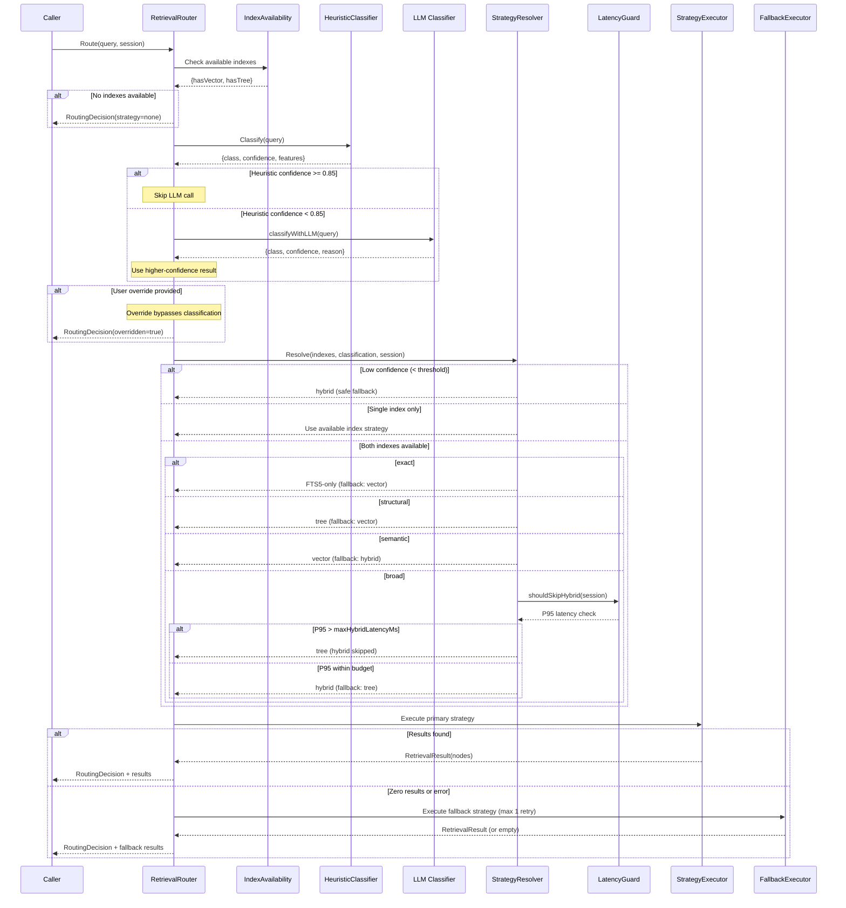

# Non-Vector RAG: Retrieval Router

**Version:** 1.1.0  
**Status:** Draft  
**Last Updated:** 2026-03-22  

---

## Overview

The Retrieval Router is the decision layer that selects the optimal retrieval strategy (vector, tree, hybrid, or FTS5-only) for each incoming query. It evaluates index availability, query characteristics, confidence signals, and user overrides to route queries to the strategy most likely to produce high-quality context. This spec extracts and expands the routing logic previously outlined in `10-ai-bridge-integration.md`.

---

## Router Architecture

```
                         ┌─────────────────────────┐
                         │       User Query         │
                         └────────────┬────────────┘
                                      │
                                      ▼
                         ┌─────────────────────────┐
                         │    Index Availability    │
                         │       Check              │
                         │  ┌───────┐ ┌───────┐    │
                         │  │Vector?│ │ Tree? │    │
                         │  └───┬───┘ └───┬───┘    │
                         └──────┼─────────┼────────┘
                                │         │
                                ▼         ▼
                         ┌─────────────────────────┐
                         │   Query Classifier       │
                         │  (LLM-based analysis)    │
                         │                          │
                         │  Outputs:                │
                         │  - QueryClass            │
                         │  - Confidence             │
                         │  - Feature signals        │
                         └────────────┬────────────┘
                                      │
                                      ▼
                         ┌─────────────────────────┐
                         │   Strategy Resolver      │
                         │                          │
                         │  Inputs:                 │
                         │  - Available indexes     │
                         │  - QueryClass            │
                         │  - Confidence             │
                         │  - User override          │
                         │  - Session history        │
                         └────────────┬────────────┘
                                      │
                    ┌─────────┬───────┼───────┬──────────┐
                    ▼         ▼       ▼       ▼          ▼
              ┌──────────┐ ┌──────┐ ┌──────┐ ┌──────┐ ┌──────┐
              │  Vector  │ │ Tree │ │Hybrid│ │FTS5  │ │ None │
              │  Only    │ │ Only │ │      │ │ Only │ │      │
              └──────────┘ └──────┘ └──────┘ └──────┘ └──────┘
```

### Sequence Diagram



---

## Router Interface

```go
type RetrievalRouter interface {
    Route(ctx context.Context, query string, session *SessionContext) (*RoutingDecision, error)
}

type RoutingDecision struct {
    Strategy        RetrievalStrategy
    QueryClass      QueryClass
    Confidence      float64          // 0.0-1.0 confidence in strategy selection
    Reason          string           // Human-readable explanation for logging/debugging
    FallbackStrategy RetrievalStrategy // Used if primary strategy fails
    Overridden      bool             // True if user explicitly chose strategy
}

type RetrievalStrategy string
const (
    StrategyVectorOnly  RetrievalStrategy = "vector"
    StrategyTreeOnly    RetrievalStrategy = "tree"
    StrategyHybrid      RetrievalStrategy = "hybrid"
    StrategyFTS5Only    RetrievalStrategy = "fts5"
    StrategyNone        RetrievalStrategy = "none"
)
```

---

## Query Classification

The router uses a lightweight LLM call (or heuristic fallback) to classify queries before routing.

### Query Classes

```go
type QueryClass string
const (
    QueryStructural QueryClass = "structural"  // Navigational, code-structure questions
    QuerySemantic   QueryClass = "semantic"    // Conceptual similarity, pattern matching
    QueryBroad      QueryClass = "broad"       // Multi-faceted, cross-cutting concerns
    QueryExact      QueryClass = "exact"       // Known identifier, error code, function name
)
```

### Classification Signals

| Signal | Detection Method | Maps To |
|--------|-----------------|---------|
| References specific identifiers (function names, types, error codes) | Regex: PascalCase, camelCase, SCREAMING_SNAKE, error codes | `exact` |
| Asks about structure, relationships, call chains | Keywords: "where is", "what calls", "show me the", "which file" | `structural` |
| Asks about patterns, concepts, similar code | Keywords: "similar to", "like", "pattern", "examples of" | `semantic` |
| Asks "how does X work", cross-cutting concerns | Keywords: "how does", "explain", "data flow", "architecture" | `broad` |

### Classifier Implementation

```go
type QueryClassifier struct {
    llmClient   LLMClient       // Small model for classification
    heuristics  *HeuristicClassifier // Regex/keyword fallback
    confidence  float64         // Minimum LLM confidence to trust (default: 0.7)
}

func (qc *QueryClassifier) Classify(ctx context.Context, query string) (*ClassificationResult, error) {
    // 1. Run heuristic classifier first (fast, no LLM call)
    hResult := qc.heuristics.Classify(query)
    
    // 2. If heuristic confidence >= 0.85, use directly (skip LLM)
    if hResult.Confidence >= 0.85 {
        return hResult, nil
    }
    
    // 3. Otherwise, use LLM classifier
    llmResult, err := qc.classifyWithLLM(ctx, query)
    if err != nil {
        // Fallback to heuristic on LLM failure
        return hResult, nil
    }
    
    // 4. Return higher-confidence result
    if llmResult.Confidence > hResult.Confidence {
        return llmResult, nil
    }
    return hResult, nil
}

type ClassificationResult struct {
    Class       QueryClass
    Confidence  float64
    Features    ClassificationFeatures
    Method      string  // "heuristic" or "llm"
}

type ClassificationFeatures struct {
    HasIdentifiers     bool     // Contains specific code identifiers
    HasStructuralVerbs bool     // "where", "which", "show"
    HasSemanticVerbs   bool     // "similar", "like", "pattern"
    HasBroadVerbs      bool     // "how", "explain", "architecture"
    IdentifierList     []string // Extracted identifiers
    KeywordCount       int      // Distinct non-stopword terms
}
```

### LLM Classification Prompt

```yaml
system: |
  You classify code-related queries into exactly one category.
  Respond ONLY with JSON.

prompt: |
  Query: "{query}"
  
  Classify into one of:
  - "exact": Query references a specific identifier, error code, or known name
  - "structural": Query asks about code structure, relationships, or location
  - "semantic": Query asks for similar patterns, concepts, or examples
  - "broad": Query asks how something works or about cross-cutting concerns
  
  Respond:
  {
    "class": "exact|structural|semantic|broad",
    "confidence": 0.0-1.0,
    "reason": "brief explanation"
  }
```

---

## Heuristic Classifier

The heuristic classifier provides fast, deterministic classification without LLM calls.

```go
type HeuristicClassifier struct {
    identifierPatterns []*regexp.Regexp
    structuralVerbs    []string
    semanticVerbs      []string
    broadVerbs         []string
}

func (hc *HeuristicClassifier) Classify(query string) *ClassificationResult {
    features := hc.extractFeatures(query)
    
    // Priority 1: Exact identifiers detected
    if features.HasIdentifiers && features.KeywordCount <= 3 {
        return &ClassificationResult{
            Class:      QueryExact,
            Confidence: 0.90,
            Features:   features,
            Method:     "heuristic",
        }
    }
    
    // Priority 2: Structural verbs dominate
    if features.HasStructuralVerbs && !features.HasSemanticVerbs {
        return &ClassificationResult{
            Class:      QueryStructural,
            Confidence: 0.80,
            Features:   features,
            Method:     "heuristic",
        }
    }
    
    // Priority 3: Semantic verbs dominate
    if features.HasSemanticVerbs && !features.HasStructuralVerbs {
        return &ClassificationResult{
            Class:      QuerySemantic,
            Confidence: 0.80,
            Features:   features,
            Method:     "heuristic",
        }
    }
    
    // Priority 4: Broad verbs or mixed signals
    return &ClassificationResult{
        Class:      QueryBroad,
        Confidence: 0.60,
        Features:   features,
        Method:     "heuristic",
    }
}
```

### Identifier Detection Patterns

```go
var identifierPatterns = []*regexp.Regexp{
    regexp.MustCompile(`\b[A-Z][a-zA-Z0-9]+\b`),           // PascalCase: ValidateToken, UserService
    regexp.MustCompile(`\b[a-z]+[A-Z][a-zA-Z0-9]*\b`),     // camelCase: validateToken, getUserByID
    regexp.MustCompile(`\b[A-Z][A-Z0-9_]+\b`),              // SCREAMING_SNAKE: MAX_RETRIES, HTTP_TIMEOUT
    regexp.MustCompile(`\b\d{5}\b`),                         // Error codes: 20501, 20503
    regexp.MustCompile(`\b[a-z]+_[a-z_]+\b`),               // snake_case: validate_token, get_user
    regexp.MustCompile(`\b(func|type|struct|interface)\s+`), // Go declarations
}
```

---

## Strategy Resolution

### Resolution Matrix

The resolver combines index availability and query class into a strategy decision.

| Query Class | Vector Only | Tree Only | Both Available |
|-------------|------------|-----------|----------------|
| `exact` | Vector | FTS5-only | FTS5-only |
| `structural` | Vector | Tree | Tree |
| `semantic` | Vector | Hybrid (FTS5 + tree) | Vector |
| `broad` | Vector | Beam traversal | Hybrid |

### Resolver Implementation

```go
type StrategyResolver struct {
    config          RouterConfig
    sessionHistory  *SessionHistory
}

type RouterConfig struct {
    DefaultStrategy         RetrievalStrategy // Fallback when classification confidence is low
    ConfidenceThreshold     float64           // Minimum confidence to use classified strategy (default: 0.6)
    EnableHybridMerge       bool              // Allow hybrid strategy (default: true)
    MaxHybridLatencyMs      int64             // Skip hybrid if previous hybrid exceeded this (default: 3000)
    UserOverrideEnabled     bool              // Allow user strategy override (default: true)
}

func (sr *StrategyResolver) Resolve(
    indexes IndexAvailability,
    classification *ClassificationResult,
    userOverride *RetrievalStrategy,
    session *SessionContext,
) *RoutingDecision {
    // 1. User override takes priority
    if userOverride != nil && sr.config.UserOverrideEnabled {
        return &RoutingDecision{
            Strategy:   *userOverride,
            QueryClass: classification.Class,
            Confidence: 1.0,
            Reason:     "user-specified override",
            Overridden: true,
        }
    }
    
    // 2. Check index availability
    if !indexes.HasVector && !indexes.HasTree {
        return &RoutingDecision{
            Strategy:   StrategyNone,
            QueryClass: classification.Class,
            Confidence: 1.0,
            Reason:     "no indexes available",
        }
    }
    
    // 3. Single-index scenarios (no choice to make)
    if indexes.HasVector && !indexes.HasTree {
        return &RoutingDecision{
            Strategy:         StrategyVectorOnly,
            QueryClass:       classification.Class,
            Confidence:       classification.Confidence,
            Reason:           "only vector index available",
            FallbackStrategy: StrategyNone,
        }
    }
    if indexes.HasTree && !indexes.HasVector {
        return sr.resolveTreeOnly(classification)
    }
    
    // 4. Both indexes available — use classification
    return sr.resolveBothAvailable(classification, session)
}
```

### Tree-Only Resolution

```go
func (sr *StrategyResolver) resolveTreeOnly(classification *ClassificationResult) *RoutingDecision {
    switch classification.Class {
    case QueryExact:
        return &RoutingDecision{
            Strategy:         StrategyFTS5Only,
            QueryClass:       QueryExact,
            Confidence:       classification.Confidence,
            Reason:           "exact identifier query — FTS5 direct lookup",
            FallbackStrategy: StrategyTreeOnly,
        }
    case QueryStructural:
        return &RoutingDecision{
            Strategy:         StrategyTreeOnly,
            QueryClass:       QueryStructural,
            Confidence:       classification.Confidence,
            Reason:           "structural query — tree traversal optimal",
            FallbackStrategy: StrategyFTS5Only,
        }
    case QuerySemantic:
        return &RoutingDecision{
            Strategy:         StrategyHybrid,
            QueryClass:       QuerySemantic,
            Confidence:       classification.Confidence * 0.9, // Slightly lower confidence without vector
            Reason:           "semantic query without vector index — hybrid FTS5+tree fallback",
            FallbackStrategy: StrategyTreeOnly,
        }
    default: // QueryBroad
        return &RoutingDecision{
            Strategy:         StrategyTreeOnly,
            QueryClass:       QueryBroad,
            Confidence:       classification.Confidence,
            Reason:           "broad query — beam traversal for coverage",
            FallbackStrategy: StrategyFTS5Only,
        }
    }
}
```

### Both-Available Resolution

```go
func (sr *StrategyResolver) resolveBothAvailable(
    classification *ClassificationResult,
    session *SessionContext,
) *RoutingDecision {
    // Low-confidence classification → default to hybrid for safety
    if classification.Confidence < sr.config.ConfidenceThreshold {
        return &RoutingDecision{
            Strategy:         StrategyHybrid,
            QueryClass:       classification.Class,
            Confidence:       classification.Confidence,
            Reason:           fmt.Sprintf("low classification confidence (%.2f) — hybrid fallback", classification.Confidence),
            FallbackStrategy: StrategyVectorOnly,
        }
    }
    
    switch classification.Class {
    case QueryExact:
        return &RoutingDecision{
            Strategy:         StrategyFTS5Only,
            QueryClass:       QueryExact,
            Confidence:       classification.Confidence,
            Reason:           "exact identifier — FTS5 direct lookup fastest",
            FallbackStrategy: StrategyVectorOnly,
        }
    case QueryStructural:
        return &RoutingDecision{
            Strategy:         StrategyTreeOnly,
            QueryClass:       QueryStructural,
            Confidence:       classification.Confidence,
            Reason:           "structural query — tree preserves code relationships",
            FallbackStrategy: StrategyVectorOnly,
        }
    case QuerySemantic:
        return &RoutingDecision{
            Strategy:         StrategyVectorOnly,
            QueryClass:       QuerySemantic,
            Confidence:       classification.Confidence,
            Reason:           "semantic query — vector similarity optimal",
            FallbackStrategy: StrategyHybrid,
        }
    default: // QueryBroad
        if sr.shouldSkipHybrid(session) {
            return &RoutingDecision{
                Strategy:         StrategyTreeOnly,
                QueryClass:       QueryBroad,
                Confidence:       classification.Confidence * 0.85,
                Reason:           "broad query — hybrid skipped due to previous latency",
                FallbackStrategy: StrategyVectorOnly,
            }
        }
        return &RoutingDecision{
            Strategy:         StrategyHybrid,
            QueryClass:       QueryBroad,
            Confidence:       classification.Confidence,
            Reason:           "broad query — hybrid merges both strategies for coverage",
            FallbackStrategy: StrategyTreeOnly,
        }
    }
}
```

---

## Fallback Behavior

When the primary strategy fails or returns zero results, the router retries with the fallback strategy.

```go
type FallbackExecutor struct {
    router      RetrievalRouter
    maxRetries  int  // Default: 1 (primary + one fallback)
}

func (fe *FallbackExecutor) Execute(
    ctx context.Context,
    decision *RoutingDecision,
    query string,
    session *SessionContext,
) (*RetrievalResult, error) {
    // 1. Execute primary strategy
    result, err := fe.executeStrategy(ctx, decision.Strategy, query, session)
    if err == nil && len(result.Nodes) > 0 {
        return result, nil
    }
    
    // 2. Primary failed or empty — try fallback
    if decision.FallbackStrategy != "" && decision.FallbackStrategy != StrategyNone {
        result, err = fe.executeStrategy(ctx, decision.FallbackStrategy, query, session)
        if err == nil && len(result.Nodes) > 0 {
            result.UsedFallback = true
            result.OriginalStrategy = string(decision.Strategy)
            return result, nil
        }
    }
    
    // 3. Both failed — return empty (not error, per AC-RET-06)
    return &RetrievalResult{
        Nodes:          []RetrievedNode{},
        Strategy:       string(decision.Strategy),
        UsedFallback:   true,
        OriginalStrategy: string(decision.Strategy),
    }, nil
}
```

---

## Adaptive Latency Guard

The router tracks per-strategy latency within a session to avoid repeatedly choosing slow strategies.

```go
type SessionHistory struct {
    strategyLatencies map[RetrievalStrategy][]int64 // Recent latency samples (ms)
    maxSamples        int                           // Rolling window size (default: 10)
}

func (sh *SessionHistory) RecordLatency(strategy RetrievalStrategy, latencyMs int64) {
    samples := sh.strategyLatencies[strategy]
    if len(samples) >= sh.maxSamples {
        samples = samples[1:]
    }
    sh.strategyLatencies[strategy] = append(samples, latencyMs)
}

func (sh *SessionHistory) P95Latency(strategy RetrievalStrategy) int64 {
    samples := sh.strategyLatencies[strategy]
    if len(samples) < 3 {
        return 0 // Not enough data
    }
    sorted := make([]int64, len(samples))
    copy(sorted, samples)
    sort.Slice(sorted, func(i, j int) bool { return sorted[i] < sorted[j] })
    idx := int(float64(len(sorted)) * 0.95)
    return sorted[idx]
}

func (sr *StrategyResolver) shouldSkipHybrid(session *SessionContext) bool {
    if session == nil || session.History == nil {
        return false
    }
    p95 := session.History.P95Latency(StrategyHybrid)
    return p95 > sr.config.MaxHybridLatencyMs
}
```

---

## Index Availability

```go
type IndexAvailability struct {
    HasVector       bool
    HasTree         bool
    VectorNodeCount int
    TreeNodeCount   int
    TreeLastIndexed time.Time
    VectorLastIndexed time.Time
}

func CheckIndexAvailability(ctx context.Context, appName string, db *gorm.DB) (*IndexAvailability, error) {
    // 1. Check vector index: query chromem-go collection existence
    // 2. Check tree index: SELECT COUNT(*) FROM TreeNodes WHERE TreeIndexID = ?
    // 3. Return availability struct with counts and timestamps
}
```

---

## Configuration

Router configuration lives in `config.seed.json` under `retrieval.router`:

```yaml
retrieval:
  router:
    defaultStrategy: "hybrid"
    confidenceThreshold: 0.6
    enableHybridMerge: true
    maxHybridLatencyMs: 3000
    userOverrideEnabled: true
    heuristicConfidenceBypass: 0.85
    llmClassifierModel: "llama3.1:8b"
```

| Parameter | Type | Default | Description |
|-----------|------|---------|-------------|
| `defaultStrategy` | string | `"hybrid"` | Fallback when classification confidence is below threshold |
| `confidenceThreshold` | float64 | `0.6` | Minimum classification confidence to trust strategy selection |
| `enableHybridMerge` | bool | `true` | Allow hybrid strategy that merges vector + tree results |
| `maxHybridLatencyMs` | int64 | `3000` | Skip hybrid if session P95 latency exceeds this |
| `userOverrideEnabled` | bool | `true` | Allow users to force a specific strategy via CLI flag |
| `heuristicConfidenceBypass` | float64 | `0.85` | Skip LLM classifier when heuristic confidence exceeds this |
| `llmClassifierModel` | string | `"llama3.1:8b"` | Model used for LLM-based query classification |

---

## Error Handling

| Code | Error | Description |
|------|-------|-------------|
| 20850 | RouterClassificationFailed | Both LLM and heuristic classifiers returned invalid result |
| 20851 | RouterNoIndexAvailable | Neither vector nor tree index exists for the app |
| 20852 | RouterFallbackExhausted | Primary and fallback strategies both returned zero results |
| 20853 | RouterInvalidOverride | User-specified strategy not available (index missing) |
| 20854 | RouterLatencyGuardTriggered | Hybrid skipped due to session latency exceeding threshold (informational) |

---

## Worked Examples

### Example 1: Exact Identifier Query

```
Query: "Where is ValidateToken defined?"
Heuristic: detects PascalCase "ValidateToken" → QueryExact (confidence: 0.90)
LLM: skipped (heuristic confidence ≥ 0.85)
Indexes: both available
Decision: FTS5-only (fastest for known identifiers)
Fallback: vector
```

### Example 2: Semantic Pattern Query

```
Query: "Show me code similar to the retry logic in the HTTP client"
Heuristic: detects "similar to" → QuerySemantic (confidence: 0.80)
LLM: confirms QuerySemantic (confidence: 0.88)
Indexes: both available
Decision: vector-only (similarity search optimal)
Fallback: hybrid
```

### Example 3: Broad Architecture Query

```
Query: "How does authentication flow from the API gateway to the database?"
Heuristic: detects "how does" → QueryBroad (confidence: 0.60)
LLM: confirms QueryBroad (confidence: 0.92)
Indexes: both available, hybrid P95 = 1200ms (under 3000ms limit)
Decision: hybrid (merges tree structure + vector similarity)
Fallback: tree-only
```

### Example 4: Degraded Mode (Tree Only)

```
Query: "What functions handle payment processing?"
Heuristic: detects "what functions" → QueryStructural (confidence: 0.80)
Indexes: tree only (vector not indexed)
Decision: tree-only (structural traversal)
Fallback: FTS5-only
```

### Example 5: Low Confidence Fallback

```
Query: "things related to users"
Heuristic: no strong signals → QueryBroad (confidence: 0.45)
LLM: QuerySemantic (confidence: 0.52)
Indexes: both available
Decision: hybrid (confidence 0.52 < threshold 0.6 → safe fallback)
Fallback: vector-only
```

---

## Cross-References

| Reference | Location |
|-----------|----------|
| Overview | `./00-overview.md` |
| AI Bridge Integration | `./10-ai-bridge-integration.md` |
| Tree Retrieval Engine | `./06-tree-retrieval-engine.md` |
| Configuration | `./09-configuration.md` |
| Error Codes | `./08-error-codes.md` |
| Vector DB Integration | `../22-ai-bridge-cli/01-backend/51-vector-database-integration.md` |
| Session-Scoped RAG | `../22-ai-bridge-cli/01-backend/36-session-scoped-rag-memory.md` |

---

*Retrieval Router specification created 2026-03-22.*
